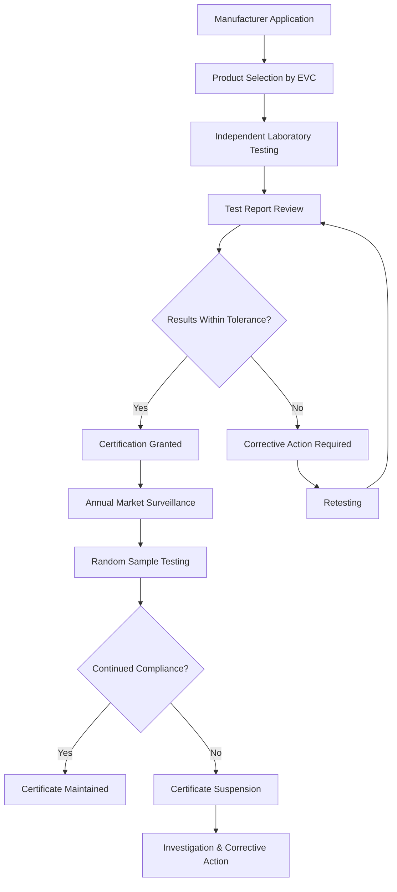

# Eurovent Certifications for HVAC Equipment

Eurovent Certifications (EVC) provides independent third-party certification for HVAC equipment performance across European markets. The program verifies manufacturer claims through accredited laboratory testing, ensuring equipment meets declared ratings for capacity, efficiency, and sound power levels. This certification framework establishes trust between manufacturers, specifiers, and end users by validating performance data against standardized test methods.

## Certification Programs and Scope

Eurovent operates multiple product-specific certification programs covering major HVAC equipment categories:

### Certified Product Categories

| Product Category | Key Parameters Certified | Test Standards |
|-----------------|-------------------------|----------------|
| Air Handling Units (AHU) | Thermal performance, air leakage, sound power | EN 1886, EN 13053 |
| Fan Coil Units | Cooling/heating capacity, sound power, water flow | EN 1397, EN 14518 |
| Chillers | Cooling capacity, EER, ESEER, sound power | EN 14511, EN 14825 |
| Heat Pumps | Heating/cooling capacity, COP, SCOP | EN 14511, EN 14825 |
| Cooling Towers | Thermal performance, water consumption | CTI STD-201 |
| Air Filters | Filtration efficiency, pressure drop | ISO 16890 |
| Close Control Units | Cooling capacity, efficiency, humidity control | EN 14511 |

## Performance Verification Methodology

### Thermal Performance Testing

Eurovent certification validates equipment thermal performance through controlled laboratory testing. For air-to-air heat exchangers, effectiveness is verified using:

$$
\varepsilon = \frac{T_{supply} - T_{outdoor}}{T_{return} - T_{outdoor}}
$$

where effectiveness (ε) represents the ratio of actual heat transfer to theoretical maximum. Certified performance must fall within ±5% of declared values across the operating envelope.

For liquid-coupled systems, capacity verification follows:

$$
Q = \dot{m} \cdot c_p \cdot \Delta T
$$

Testing confirms heat transfer rate (Q) by measuring mass flow rate ($\dot{m}$), specific heat capacity ($c_p$), and temperature differential (ΔT) on both air and water sides, with energy balance verification required within 3%.

### Seasonal Efficiency Metrics

Eurovent certification includes seasonal performance ratings that account for part-load operation and climate variability. The European Seasonal Energy Efficiency Ratio (ESEER) for chillers calculates weighted average efficiency:

$$
ESEER = 0.03 \cdot EER_{100\%} + 0.33 \cdot EER_{75\%} + 0.41 \cdot EER_{50\%} + 0.23 \cdot EER_{25\%}
$$

This weighting reflects typical European commercial building load profiles, with most operation occurring at part-load conditions. The Seasonal Coefficient of Performance (SCOP) for heat pumps applies similar methodology for heating applications.

## Air Handling Unit Certification

### Thermal Bridging and Air Leakage

AHU certification verifies construction quality through thermal transmittance and air leakage testing per EN 1886. Thermal bridging factor (Kb) quantifies heat loss through structural elements:

$$
K_b = \frac{U_{measured} - U_{panel}}{U_{panel}}
$$

Certified units achieve classification levels:

- **T2 Class**: Kb ≤ 0.75 (75% increase maximum)
- **T1 Class**: Kb ≤ 0.40 (40% increase maximum)

Air leakage classification verifies cabinet integrity at test pressures of 400 Pa:

| Leakage Class | Maximum Leakage (L/s·m²) | Application |
|---------------|-------------------------|-------------|
| L1 | ≤ 0.15 | High-performance applications |
| L2 | ≤ 0.44 | Standard commercial |
| L3 | ≤ 1.32 | Light commercial |

### Acoustic Performance

Sound power level certification measures AHU noise generation in octave bands from 63 Hz to 8000 Hz. The overall A-weighted sound power level (LwA) is calculated from:

$$
L_{wA} = 10 \cdot \log_{10}\left(\sum_{i} 10^{(L_{wi} + A_i)/10}\right)
$$

where Lwi represents sound power in each octave band and Ai is the A-weighting correction factor. Certified values must match declared ratings within ±3 dB.

## Chiller and Heat Pump Certification

### Capacity and Efficiency Verification

Chiller certification validates cooling capacity and efficiency at full and part-load conditions. Testing occurs at Eurovent standard rating conditions:

**Standard Rating Conditions (Air-Cooled):**
- Evaporator: 12°C entering / 7°C leaving chilled water
- Condenser: 35°C ambient air temperature
- Fouling factor: 0.000018 m²·K/W

Energy Efficiency Ratio verification:

$$
EER = \frac{Q_{cooling}}{W_{input}} = \frac{\dot{m}_w \cdot c_p \cdot (T_{in} - T_{out})}{P_{compressor} + P_{fans} + P_{pumps}}
$$

Certified EER values account for all auxiliary power consumption, providing realistic system efficiency metrics.

## Certification Process Flow

## Market Surveillance and Compliance

Eurovent maintains certification integrity through ongoing market surveillance. Random product samples undergo testing at 12-month intervals minimum. Statistical analysis compares surveillance results against original certification data using control limits:

- Warning limit: ±5% from declared value
- Action limit: ±7% from declared value

Exceeding action limits triggers certificate suspension pending investigation and corrective action.

## Comparison with ASHRAE Standards

| Aspect | Eurovent Certification | ASHRAE Standards |
|--------|------------------------|------------------|
| Seasonal Efficiency | ESEER, SCOP (European climate) | IEER, IPLV (North American climate) |
| AHU Leakage | EN 1886 classes (400 Pa test) | ASHRAE 111 (varies by application) |
| Sound Testing | EN ISO 3741 (reverberant room) | AHRI 370 (semi-reverberant) |
| Filter Testing | ISO 16890 (ePM ratings) | ASHRAE 52.2 (MERV ratings) |
| Verification | Third-party mandatory | Often self-certified |

## Benefits for Specifiers and Contractors

Eurovent certification provides quantifiable advantages:

1. **Performance Assurance**: Independent verification eliminates manufacturer optimism in published ratings
2. **Simplified Specification**: Reference Eurovent-certified products reduces specification writing complexity
3. **Risk Mitigation**: Certified equipment meets contractual performance guarantees
4. **Energy Modeling Accuracy**: Verified efficiency data improves building energy simulation precision
5. **Warranty Support**: Certification documentation supports equipment warranty claims

## Integration with Building Regulations

European building energy performance regulations increasingly reference Eurovent-certified data:

- **EPBD Compliance**: Energy Performance of Buildings Directive calculations require verified equipment efficiency
- **Ecodesign Requirements**: Minimum efficiency standards reference Eurovent test methodologies
- **National Building Codes**: Many European countries mandate certified equipment for public buildings

Specifiers should verify local jurisdiction requirements for certification documentation in submittal packages.

## Certification Mark Usage

Products meeting Eurovent certification requirements display the official certification mark on equipment nameplates and technical documentation. The mark includes:

- Eurovent logo
- Certification program identifier
- Certificate number
- Valid date range

This marking provides field verification capability and ensures installed equipment matches specified performance characteristics.
