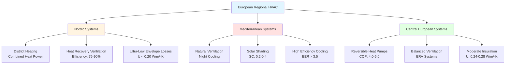

## Regional Climate Zones and HVAC Strategies

European HVAC practices reflect distinct climate zones requiring fundamentally different engineering approaches. Regional practices have evolved over decades to optimize energy efficiency, occupant comfort, and system reliability under specific environmental conditions.

### Nordic Region: Heating-Dominated Design

**Climate Characteristics:**
- Design outdoor temperatures: -20°C to -40°C
- Heating season: 240-280 days annually
- Solar availability: 6-8 hours (winter), 18-20 hours (summer)

**District Heating Dominance:**

The Nordic region demonstrates the highest district heating penetration globally, with network efficiency dependent on supply temperature optimization:

$$
\eta_{network} = \frac{Q_{delivered}}{Q_{generated}} = \frac{\dot{m} \cdot c_p \cdot (T_{supply} - T_{return})}{Q_{boiler} + W_{pump}}
$$

Where:
- $\eta_{network}$ = network thermal efficiency (dimensionless)
- $\dot{m}$ = mass flow rate (kg/s)
- $c_p$ = specific heat capacity of water (4.186 kJ/kg·K)
- $T_{supply}$ = supply temperature (°C)
- $T_{return}$ = return temperature (°C)

Modern fourth-generation district heating operates at 50-70°C supply temperature, reducing distribution losses by 30-50% compared to traditional 90-120°C systems.

**Building Envelope Standards:**

Nordic countries mandate U-values significantly lower than other European regions:

| Building Component | Nordic (W/m²·K) | Central EU (W/m²·K) | Mediterranean (W/m²·K) |
|-------------------|-----------------|---------------------|------------------------|
| External Walls | 0.15-0.20 | 0.24-0.28 | 0.35-0.45 |
| Roof | 0.09-0.13 | 0.18-0.20 | 0.30-0.38 |
| Windows (U_w) | 0.80-1.00 | 1.10-1.40 | 1.60-2.00 |
| Ground Floor | 0.12-0.15 | 0.25-0.30 | 0.40-0.50 |

Heat loss through the building envelope follows:

$$
Q_{loss} = U \cdot A \cdot \Delta T = U \cdot A \cdot (T_{indoor} - T_{outdoor})
$$

For a 150 m² external wall area with Nordic U-value of 0.17 W/m²·K and design temperature difference of 42 K (-22°C outdoor, 20°C indoor):

$$
Q_{loss} = 0.17 \times 150 \times 42 = 1,071 \text{ W}
$$

### Mediterranean Region: Cooling-Focused Systems

**Climate Parameters:**
- Summer design: 32-38°C dry bulb, 18-24°C wet bulb
- Cooling degree days: 800-1,500 annually
- High solar radiation: 5-7 kWh/m²·day (summer)

**Natural Ventilation Integration:**

Mediterranean practice emphasizes passive cooling through stack effect ventilation:

$$
\Delta P_{stack} = \rho_{outdoor} \cdot g \cdot h \cdot \left(\frac{T_{indoor} - T_{outdoor}}{T_{indoor}}\right)
$$

Where:
- $\Delta P_{stack}$ = stack pressure difference (Pa)
- $\rho_{outdoor}$ = outdoor air density (kg/m³)
- $g$ = gravitational acceleration (9.81 m/s²)
- $h$ = vertical height between inlet and outlet (m)

For h = 8 m, $T_{indoor}$ = 298 K (25°C), $T_{outdoor}$ = 308 K (35°C):

$$
\Delta P_{stack} = 1.14 \times 9.81 \times 8 \times \left(\frac{25 - 35}{298}\right) = -3.0 \text{ Pa}
$$

Negative pressure drives reverse flow; mechanical assistance required during peak heat conditions.

**Shading Coefficient Optimization:**

Mediterranean buildings prioritize external shading to reduce cooling loads:

$$
Q_{solar} = A_{window} \cdot SHGC \cdot I_{solar} \cdot SC_{external}
$$

Where:
- $SHGC$ = solar heat gain coefficient (dimensionless)
- $I_{solar}$ = incident solar radiation (W/m²)
- $SC_{external}$ = external shading coefficient (0.2-0.4 for external blinds)

### Central European Balanced Systems

Central European climates require both heating and cooling capability, driving heat pump adoption and reversible system design.

**Heat Pump Coefficient of Performance:**

Central European practice targets seasonal COP values:

$$
COP_{heating} = \frac{Q_{heating}}{W_{input}} = \frac{T_{condenser}}{T_{condenser} - T_{evaporator}} \times \eta_{Carnot}
$$

For ground-source heat pump with $T_{evaporator}$ = 278 K (5°C), $T_{condenser}$ = 318 K (45°C), $\eta_{Carnot}$ = 0.55:

$$
COP_{heating} = \frac{318}{318 - 278} \times 0.55 = 4.37
$$

## Regional HVAC System Comparison

## Ventilation Rate Standards

European ventilation standards vary by region based on infiltration rates and climate:

| Region | Minimum Ventilation (L/s·person) | Air Changes (1/h) | Standard Reference |
|--------|----------------------------------|-------------------|-------------------|
| Nordic | 7-10 | 0.3-0.5 | National Building Codes |
| Central EU | 8-10 | 0.4-0.6 | EN 16798-1 |
| Mediterranean | 10-15 | 0.5-0.8 | Local Regulations |
| UK/Ireland | 8-10 | 0.5-1.0 | Building Regulations Part F |

Higher Mediterranean rates compensate for natural ventilation uncertainty and higher metabolic cooling loads.

## Energy Performance Certification Alignment

Regional practices align with EPBD (Energy Performance of Buildings Directive) but implement different calculation methodologies:

**Primary Energy Factor Variations:**

$$
PE_{total} = \sum (E_{delivered,i} \times f_{PE,i}) - (E_{exported} \times f_{PE,export})
$$

Where primary energy factors ($f_{PE}$) vary significantly:
- District heating: 0.4-1.0 (Nordic) vs. 1.0-1.3 (Central EU)
- Electricity: 1.8-2.5 (coal-heavy grids) vs. 1.5-1.8 (renewable-heavy grids)

Regional variations in calculation methodology create 15-30% differences in certified performance for identical buildings.

## Humidity Control Approaches

**Nordic: Moisture Management**

Cold climate construction prioritizes vapor barriers and controlled mechanical ventilation to prevent condensation within building assemblies.

**Mediterranean: Dehumidification for Comfort**

High outdoor humidity during shoulder seasons requires dedicated dehumidification, often using desiccant systems integrated with heat recovery.

**Central European: Adaptive Strategies**

Enthalpy recovery systems balance sensible and latent loads across seasons, maintaining 30-60% RH year-round.

## System Selection Decision Matrix

| Parameter | Nordic Choice | Mediterranean Choice | Central EU Choice |
|-----------|---------------|---------------------|------------------|
| Primary Heat Source | District/Biomass | Heat Pump/Gas | Heat Pump/Gas |
| Cooling System | Minimal/Free Cooling | High-Efficiency DX | Reversible HP |
| Ventilation | HRV (75-90%) | Natural + Mechanical | ERV (65-80%) |
| Control Strategy | Weather Compensation | Occupancy-Based | Adaptive Algorithms |

Regional European HVAC practices demonstrate that optimal system design requires matching equipment characteristics to climate-specific load profiles, local energy infrastructure, and established construction practices. The physics-based approaches developed in each region offer valuable lessons for similar climate zones globally.

---

*Related Topics: [Energy Performance of Buildings Directive](../energy-performance-buildings-directive/), [F-Gas Regulation](../f-gas-regulation/), [International Efficiency Metrics](../../international-efficiency-metrics/)*
