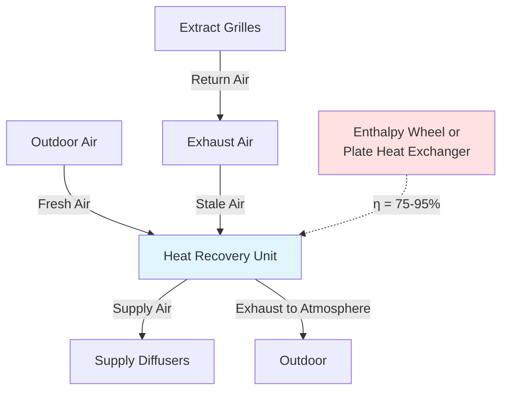

## Overview

Central Europe leads global HVAC innovation through rigorous energy efficiency standards and precision engineering. The region encompasses Germany, Austria, Switzerland, Netherlands, and Belgium, where building regulations mandate superior thermal performance and mechanical system efficiency. These nations pioneered passive house methodology and established benchmark standards that influence international practice.

## Climate Characteristics and Design Parameters

Central European climate combines continental and temperate maritime influences, creating specific HVAC design requirements:

| Climate Parameter | Value Range | Design Impact |
|------------------|-------------|---------------|
| Heating Degree Days (18°C) | 2800-3600 HDD | High heating load dominance |
| Winter Design Temperature | -12°C to -16°C | Substantial heat pump capacity requirements |
| Summer Design Temperature | 28°C to 32°C | Moderate cooling loads |
| Annual Precipitation | 600-1200 mm | Moisture management critical |
| Relative Humidity (Winter) | 75-85% | Condensation risk in thermal bridges |

The heating-dominated climate drives system design toward thermal envelope optimization and heat recovery.

## Passivhaus Standard

The Passivhaus (Passive House) standard originated in Germany and represents the most rigorous voluntary building energy standard globally. Core requirements establish maximum annual heating energy demand:

$$
Q_h \leq 15 \text{ kWh/(m}^2\text{·a)}
$$

Where $Q_h$ is the annual heating energy demand per treated floor area. The standard also limits primary energy demand:

$$
E_{primary} \leq 120 \text{ kWh/(m}^2\text{·a)}
$$

This encompasses heating, cooling, domestic hot water, lighting, and auxiliary systems.

### Airtightness Requirements

Passivhaus mandates stringent airtightness measured by blower door testing at 50 Pa pressure differential:

$$
n_{50} \leq 0.6 \text{ h}^{-1}
$$

The air change rate at 50 Pa must not exceed 0.6 building volumes per hour. This requirement minimizes infiltration losses and enables effective mechanical ventilation with heat recovery.

### Thermal Bridge Management

The standard requires thermal bridge-free construction where the linear thermal transmittance coefficient satisfies:

$$
\Psi \leq 0.01 \text{ W/(m·K)}
$$

This eliminates condensation risk and reduces localized heat loss that compromises overall envelope performance.

## Minergie Standard (Switzerland)

Minergie represents Switzerland's national building standard with multiple certification levels. The base Minergie standard limits weighted energy demand:

$$
E_{weighted} = E_{heating} + E_{cooling} + E_{DHW} + E_{auxiliary} \leq \text{Limit Value}
$$

Limit values depend on building category and construction year, typically ranging from 35-90 kWh/(m²·a) for residential buildings.

### Minergie-P Requirements

Minergie-P (comparable to Passivhaus) requires:
- Maximum heating demand: 15 kWh/(m²·a)
- Airtightness: n₅₀ ≤ 0.6 h⁻¹
- Mandatory mechanical ventilation with heat recovery
- Minimum heat recovery efficiency: 75%

## Mechanical Ventilation with Heat Recovery

Central European practice mandates balanced mechanical ventilation with heat recovery (MVHR) for most new construction and major renovations. System design follows specific principles:

### Heat Recovery Efficiency Calculation

Temperature efficiency of the heat recovery system:

$$
\eta_t = \frac{T_{supply} - T_{outdoor}}{T_{exhaust} - T_{outdoor}} \times 100\%
$$

Where:
- $T_{supply}$ = supply air temperature after heat recovery (°C)
- $T_{outdoor}$ = outdoor air temperature (°C)
- $T_{exhaust}$ = exhaust air temperature from building (°C)

German regulations (EnEV, now GEG) require minimum 80% temperature efficiency for ventilation systems in low-energy buildings.

### Pressure Drop Considerations

System-specific fan power (SFP) limits ensure energy-efficient fan operation:

$$
SFP = \frac{P_{fan}}{\dot{V}} \leq 2.0 \text{ kW/(m}^3\text{/s)}
$$

Where $P_{fan}$ is total fan power (kW) and $\dot{V}$ is volumetric flow rate (m³/s). Passivhaus limits SFP to 0.45 kW/(m³/s) for highly efficient systems.

## District Heating Integration

District heating serves substantial portions of urban Central Europe, particularly in Austria (27% of heating demand) and Germany (14%). Fourth-generation low-temperature district heating enables:

- Supply temperatures: 50-70°C (compared to traditional 80-120°C)
- Return temperatures: 25-35°C
- Integration with renewable heat sources
- Reduced distribution losses

The return temperature directly impacts system efficiency:

$$
\eta_{network} = 1 - \frac{Q_{loss}}{\dot{m} \cdot c_p \cdot (T_{supply} - T_{return})}
$$

Lower return temperatures increase usable temperature differential and improve overall network efficiency.

## Heat Pump Technology

Central Europe leads heat pump adoption with over 1 million units installed annually. Air-source and ground-source heat pumps achieve seasonal performance factors (SPF) exceeding 4.0 in well-designed systems.

### Coefficient of Performance Requirements

The seasonal coefficient of performance for space heating:

$$
SCOP = \frac{Q_{heating,season}}{\sum W_{electrical,season}}
$$

German regulation requires minimum SCOP of 3.5 for air-source heat pumps receiving installation incentives. Ground-source systems typically achieve SCOP 4.5-5.0.

### Bivalent Operation

Many systems employ bivalent configuration combining heat pumps with supplemental heating:

| Bivalent Mode | Description | Application |
|---------------|-------------|-------------|
| Alternative | Heat pump operates to bivalent point, then backup takes over | Cost-optimized systems |
| Parallel | Heat pump and backup operate simultaneously below bivalent point | Peak load management |
| Partial Parallel | Heat pump operates continuously, backup supplements when needed | Most energy-efficient |

## Dutch Building Decree (Bouwbesluit)

Netherlands requires energy performance coefficient (EPC) calculation for new buildings:

$$
EPC = \frac{E_{primary}}{A_{floor} \cdot f_{shape}}
$$

Where $f_{shape}$ is a form factor accounting for building geometry. Maximum EPC values decreased to 0.4 for residential buildings (2021), driving near-zero energy construction.

## Belgian EPB Regulations

Belgian regional energy performance regulations mandate U-value limits and primary energy consumption ceilings:

| Building Element | Maximum U-value (W/m²·K) |
|------------------|--------------------------|
| Roof | 0.24 |
| External Wall | 0.24 |
| Floor | 0.24 |
| Windows | 1.50 |

These requirements necessitate high-efficiency HVAC systems to meet overall energy budgets.

## Comparison with ASHRAE Standards

Central European standards exceed ASHRAE 90.1 minimum requirements:

| Parameter | ASHRAE 90.1-2019 | Passivhaus | Minergie-P |
|-----------|------------------|------------|------------|
| Airtightness | Not specified | 0.6 ACH₅₀ | 0.6 ACH₅₀ |
| Ventilation Heat Recovery | 50% (Climate Zones 5-8) | 75% minimum | 75% minimum |
| Heating Energy Limit | Performance path | 15 kWh/(m²·a) | 15 kWh/(m²·a) |
| Primary Energy Limit | Performance path | 120 kWh/(m²·a) | Variable |

The prescriptive nature of European standards contrasts with ASHRAE's performance-based approach.

## Technical Implementation Considerations

Central European HVAC practice emphasizes:

1. **Envelope-first approach**: Superior insulation and airtightness reduce mechanical system sizing requirements
2. **Balanced ventilation**: Mandatory heat recovery ventilation with continuous operation
3. **Hydronic distribution**: Water-based heating systems dominate over forced-air
4. **Low-temperature heating**: Floor and wall radiant systems operating at 35-45°C supply temperature
5. **Decentralized DHW**: Point-of-use or apartment-level domestic hot water to minimize distribution losses

These principles achieve superior energy performance while maintaining thermal comfort and indoor air quality per DIN 1946 and EN 15251 standards.

## Components

- German Passivhaus Standard
- German Minergie Switzerland
- Austrian Energy Efficiency Approach
- Dutch Building Decree Bouwbesluit
- Belgian Epb Regulations
