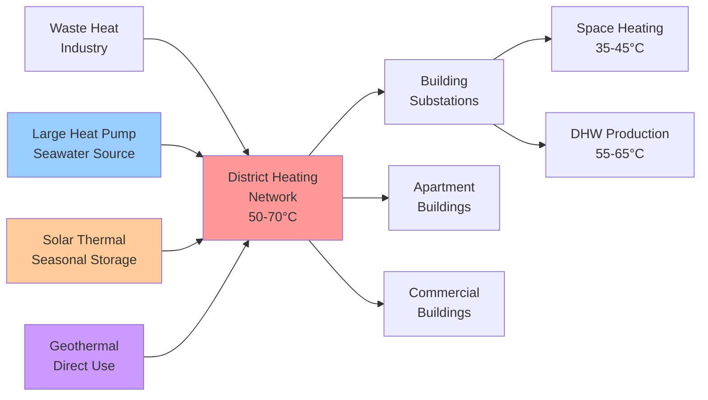

# Northern European HVAC Standards and Practices

Northern Europe encompasses the Nordic countries (Sweden, Norway, Denmark, Finland, Iceland) and Baltic states (Estonia, Latvia, Lithuania), regions characterized by extreme heating requirements, progressive energy policies, and world-leading building performance standards. HVAC design in these climates prioritizes heat retention, energy recovery, and renewable energy integration under severe winter conditions reaching -30°C to -40°C in continental areas while managing moderate cooling loads and addressing substantial variations in solar availability between summer and winter seasons.

## Climate Characteristics and Design Implications

Northern European climates impose unique HVAC design constraints driven by extreme seasonal variation and prolonged heating seasons.

### Heating Degree Day Analysis

Heating degree days (base 18°C) establish fundamental load requirements:

| Region | Annual HDD | Winter Design Temp | Heating Season Duration |
|--------|-----------|-------------------|------------------------|
| Southern Sweden | 3400-3800 | -16°C to -18°C | October - April (210 days) |
| Northern Sweden/Finland | 5500-8000 | -30°C to -40°C | September - May (270 days) |
| Oslo, Norway | 4000-4500 | -18°C to -20°C | October - April (210 days) |
| Copenhagen, Denmark | 3200-3600 | -12°C to -14°C | November - March (180 days) |
| Reykjavik, Iceland | 4200-4600 | -10°C to -12°C | Year-round potential (maritime) |
| Tallinn, Estonia | 4000-4500 | -22°C to -24°C | October - April (210 days) |
| Northern Finland/Norway | 8000-10000 | -35°C to -42°C | August - June (300 days) |

The extreme northern locations experience polar night conditions (24-hour darkness) for 2-3 months annually, eliminating solar heat gains during peak heating demand periods.

### Solar Radiation Variability

Solar irradiance exhibits dramatic seasonal variation affecting passive solar design and photovoltaic system integration:

$$
I_{daily} = I_{0} \cdot \sin\left(\frac{2\pi(n-80)}{365}\right) \cdot \tau_{atm}
$$

Where:
- $I_{daily}$ = daily solar radiation on horizontal surface (kWh/m²)
- $I_{0}$ = extraterrestrial radiation amplitude
- $n$ = day of year
- $\tau_{atm}$ = atmospheric transmittance

At 60°N latitude (Oslo, Stockholm, Helsinki), December daily radiation averages 0.2-0.5 kWh/m² compared to June values of 6-8 kWh/m², creating a 15-40× seasonal difference.

## Finnish Building Code (D3/D5)

Finland implements stringent thermal performance requirements through National Building Code sections D3 (Energy Efficiency) and D5 (HVAC Systems).

### E-Value Primary Energy Requirement

The Finnish E-value establishes maximum annual primary energy consumption:

$$
E_{total} = E_{heating} + E_{cooling} + E_{DHW} + E_{ventilation} + E_{lighting} - E_{renewable}
$$

Maximum E-values for residential buildings (effective 2018):

- Detached houses: 131 kWh/(m²·a)
- Apartment buildings: 97 kWh/(m²·a)
- Non-residential buildings: Variable by type (80-170 kWh/(m²·a))

The E-value calculation uses primary energy coefficients:
- District heat: 0.5
- Electricity: 1.2
- Oil/gas: 1.0
- Renewable on-site: 0.5

### Heat Loss Coefficient Requirements

Maximum building heat loss coefficient:

$$
H_{total} = \sum(U_i \cdot A_i) + \sum(\Psi_j \cdot l_j) + n_{infiltration} \cdot \rho \cdot c_p \cdot V
$$

Where:
- $U_i$ = thermal transmittance of element i (W/m²·K)
- $A_i$ = area of element i (m²)
- $\Psi_j$ = linear thermal transmittance of thermal bridge j (W/m·K)
- $l_j$ = length of thermal bridge j (m)
- $n_{infiltration}$ = infiltration rate (h⁻¹)

Maximum U-values (Finnish Building Code D3, 2018):

| Building Element | Maximum U-value (W/m²·K) |
|------------------|--------------------------|
| External walls | 0.17 |
| Roof | 0.09 |
| Floor slab | 0.16 |
| Windows/doors | 1.0 |
| Basement walls | 0.16 |

These values require wall insulation thickness of 300-400 mm and triple-glazed windows with argon filling and low-e coatings.

### Ventilation Heat Recovery Mandates

Finnish regulations require mechanical supply and exhaust ventilation with heat recovery for all new buildings. Minimum annual heat recovery efficiency:

$$
\eta_{annual} = \frac{\sum_{year}(T_{supply} - T_{outdoor})}{\sum_{year}(T_{exhaust} - T_{outdoor})} \geq 0.55
$$

Practical implementations achieve 70-85% efficiency using rotary heat exchangers or counterflow plate heat exchangers with frost protection.

## Swedish Building Regulations (BBR)

The Swedish National Board of Housing, Building and Planning (Boverket) establishes requirements through BBR (Boverkets Byggregler).

### Energy Performance Requirements

BBR specifies maximum specific energy use based on climate zone and building type:

**Climate Zone I (Southern Sweden, Stockholm):**
- Residential buildings: 70 kWh/(m²·a) primary energy
- Non-residential buildings: Variable by use (55-100 kWh/(m²·a))

**Climate Zone II (Central Sweden):**
- Residential buildings: 80 kWh/(m²·a)

**Climate Zone III (Northern Sweden):**
- Residential buildings: 90 kWh/(m²·a)

Electric heating systems require additional renewable energy provision or building envelope improvements to compensate for higher primary energy factors.

### Average Heat Loss Coefficient

BBR establishes maximum average heat transfer coefficient:

$$
U_{m,avg} = \frac{\sum(U_i \cdot A_i)}{\sum A_i} + \Delta U_{tb}
$$

Where $\Delta U_{tb}$ accounts for thermal bridge effects (typically 0.03-0.05 W/m²·K addition).

Maximum values range from 0.30-0.40 W/m²·K depending on climate zone and building geometry.

## Norwegian Passive House Standard (NS 3700/3701)

Norway developed comprehensive passive house standards NS 3700 (criteria) and NS 3701 (criteria for non-residential buildings).

### Heating Energy Demand Limits

Annual net heating energy demand:

$$
Q_{heating,net} = Q_{transmission} + Q_{infiltration} + Q_{ventilation} - Q_{internal} - Q_{solar} \leq 15 \text{ kWh/(m}^2\text{·a)}
$$

For buildings in cold climates (> 5000 HDD), the limit adjusts:

$$
Q_{heating,net,adjusted} = 15 + \left(\frac{HDD - 5000}{1000}\right) \times 2 \text{ kWh/(m}^2\text{·a)}
$$

This allows 21 kWh/(m²·a) for locations with 8000 HDD, acknowledging physical constraints of extreme climates.

### Primary Energy Requirement

Total primary energy including all building systems:

$$
E_{primary} \leq 120 \text{ kWh/(m}^2\text{·a)}
$$

Primary energy factors (Norway-specific):
- Electricity: 2.0 (reflecting Nordic grid characteristics)
- District heating: 1.0
- Renewable on-site: 0.5

### Airtightness Requirements

Blower door test at 50 Pa pressure differential:

$$
n_{50} \leq 0.6 \text{ h}^{-1}
$$

For non-residential buildings with mechanical ventilation:

$$
q_{50} \leq 1.5 \text{ m}^3\text{/(h·m}^2\text{)}
$$

Where $q_{50}$ is air leakage rate per envelope area.

Achieving these values in arctic conditions requires continuous air barrier systems, vapor-tight construction, and elimination of all penetrations through the thermal envelope.

## Danish Building Regulations (BR18)

Denmark implements progressive energy requirements through Building Regulations 2018 (BR18) with near-zero energy building standards.

### Energy Frame Calculation

Total primary energy demand limitation:

$$
E_{frame} = 30 + \frac{1000}{A_{heated}} \text{ kWh/(m}^2\text{·a)}
$$

For residential buildings with heated floor area $A_{heated}$ (m²). This formula allows higher specific energy consumption for smaller buildings while maintaining absolute energy efficiency.

Minimum requirements for building class 2020:
- Houses: 27 kWh/(m²·a) + 1650/A kWh/a
- Apartment buildings: 30 kWh/(m²·a)
- Offices: 41 kWh/(m²·a)

### Low-Energy Building Classes

Denmark defines progressive energy classes:

| Class | Description | Energy Requirement |
|-------|-------------|-------------------|
| BR18 | Building Regulations 2018 | 30 + 1000/A kWh/(m²·a) |
| Low-Energy Class 2015 | Voluntary | 52.5 + 1650/A kWh/(m²·a) |
| Building Class 2020 | Nearly zero-energy | 27 + 1650/A kWh/(m²·a) |

## District Heating Dominance

Northern Europe operates the world's most extensive district heating infrastructure, serving 60-65% of buildings in Sweden, 64% in Denmark, 50% in Finland, and 46% in Iceland.

### Fourth Generation District Heating

Modern Nordic district heating employs low-temperature systems:

**Supply and return temperatures:**
- Traditional (1st-3rd generation): 80-120°C supply, 40-60°C return
- Fourth generation: 50-70°C supply, 25-35°C return

Heat loss reduction from temperature reduction:

$$
Q_{loss} = U_{pipe} \cdot A_{pipe} \cdot (T_{avg,network} - T_{ground})
$$

Where average network temperature:

$$
T_{avg,network} = \frac{T_{supply} + T_{return}}{2}
$$

Reducing supply from 90°C to 60°C with return from 50°C to 30°C decreases average temperature from 70°C to 45°C, reducing losses by approximately 35-40% in 5°C ground conditions.

### Integration with Renewable Sources

Low-temperature operation enables integration of:
- Large-scale heat pumps utilizing wastewater, seawater, or groundwater (achieving COP 3.5-5.0)
- Industrial waste heat recovery
- Solar thermal collector fields (seasonal storage)
- Geothermal energy (Iceland: 90% of heating from geothermal)

### Building Substation Design

District heating substations employ indirect connection to prevent cross-contamination:

**Primary side (district network):**
- Supply temperature: 50-70°C
- Return temperature target: 25-35°C (critical for system efficiency)
- Flow control: Differential pressure control valve

**Secondary side (building systems):**
- Space heating: 35-45°C supply to radiant floors/low-temperature radiators
- Domestic hot water: Instantaneous heat exchanger producing 55-65°C

Heat transfer in plate heat exchanger:

$$
Q = U \cdot A \cdot \Delta T_{LMTD}
$$

Where log mean temperature difference:

$$
\Delta T_{LMTD} = \frac{(T_{1,in} - T_{2,out}) - (T_{1,out} - T_{2,in})}{\ln\left(\frac{T_{1,in} - T_{2,out}}{T_{1,out} - T_{2,in}}\right)}
$$

Achieving low return temperatures requires:
- Oversized heat exchangers (larger A)
- Low-temperature heating distribution
- Proper hydraulic balancing
- Thermostatic radiator valves with low-temperature capability

## Extreme Cold Climate Heat Pump Technology

Nordic countries lead development of heat pumps operating at extreme outdoor temperatures.

### Low-Temperature Performance

Modern cold-climate air-source heat pumps maintain capacity to -25°C outdoor temperature. Carnot efficiency establishes theoretical maximum:

$$
COP_{Carnot} = \frac{T_{condensing}}{T_{condensing} - T_{evaporating}}
$$

For heating to 35°C (308 K) from -25°C air (248 K):

$$
COP_{Carnot} = \frac{308}{308 - 248} = 5.13
$$

Practical systems achieve 50-65% of Carnot efficiency, yielding COP 2.5-3.3 at -25°C outdoor conditions with advanced vapor injection technology.

### Enhanced Vapor Injection Systems

Two-stage compression with economizer injection maintains capacity and efficiency at low temperatures:

**Compression process with vapor injection:**
1. Primary compression from evaporator pressure to intermediate pressure
2. Flash tank economizer provides vapor injection at intermediate pressure
3. Secondary compression from intermediate to condensing pressure

Capacity increase from vapor injection:

$$
\dot{Q}_{capacity,EVI} = \dot{Q}_{capacity,standard} \times (1 + 0.15 \text{ to } 0.30)
$$

This maintains 80-90% of rated capacity at -25°C compared to 40-60% for standard single-stage systems.

### Ground Source Heat Pumps in Cold Climates

Vertical borehole systems provide stable heat source:

**Borehole depth requirement:**

$$
L_{borehole} = \frac{Q_{heating,design}}{\dot{q}_{extraction} \times N_{boreholes}}
$$

Where:
- $Q_{heating,design}$ = design heating load (W)
- $\dot{q}_{extraction}$ = specific extraction rate (25-40 W/m in Nordic granite)
- $N_{boreholes}$ = number of boreholes

For 10 kW heating load with 30 W/m extraction:

$$
L_{borehole} = \frac{10,000}{30 \times 1} = 333 \text{ m (single borehole)}
$$

Typically implemented as 2-3 boreholes of 120-180 m depth to minimize land area and drilling costs.

Ground temperature at 100-150 m depth remains stable at +4°C to +8°C year-round in Nordic conditions, enabling SCOP values of 4.5-5.5 for properly designed systems.

## Advanced Ventilation Heat Recovery

Northern European practice employs sophisticated heat recovery to minimize ventilation losses in extreme climates.

### Rotary Heat Exchanger Performance

Rotary heat exchangers (enthalpy wheels) achieve highest efficiency:

**Effectiveness:**

$$
\varepsilon = \frac{T_{supply} - T_{outdoor}}{T_{exhaust} - T_{outdoor}}
$$

High-performance units achieve ε = 0.85-0.92 with moisture recovery capability.

**Frost protection requirement:**

At outdoor temperatures below -5°C, frost formation on heat exchanger surfaces requires active prevention:

1. **Pre-heating:** Electric or recirculated air pre-heater raises outdoor air to -5°C minimum
2. **Wheel speed reduction:** Decreases heat recovery efficiency to prevent frost (inefficient)
3. **Wheel recirculation:** Bypass portion of exhaust air back to exhaust side

Pre-heating energy consumption:

$$
Q_{preheat} = \dot{m} \cdot c_p \cdot (T_{target} - T_{outdoor})
$$

At -30°C with 0.1 kg/s airflow and +5°C target:

$$
Q_{preheat} = 0.1 \times 1005 \times (5 - (-30)) = 3.52 \text{ kW}
$$

This represents substantial parasitic load, driving specification of frost-resistant designs.

### Counter-Flow Plate Heat Exchangers

Plate heat exchangers avoid frost issues through:
- Exhaust air temperature maintenance above dewpoint
- Defrost cycles using bypass dampers
- Aluminum or plastic construction preventing ice adhesion

**Efficiency calculation:**

$$
\eta_{plate} = \frac{c_{min} \cdot (T_{supply,out} - T_{outdoor,in})}{c_{min} \cdot (T_{exhaust,in} - T_{outdoor,in})}
$$

Where $c_{min}$ is minimum heat capacity rate. High-performance units achieve η = 0.75-0.85.

### Specific Fan Power Optimization

Energy-efficient fan operation critical in continuously operating ventilation systems:

$$
SFP = \frac{P_{fan,supply} + P_{fan,exhaust}}{\dot{V}} \leq 1.5 \text{ kW/(m}^3\text{/s)}
$$

Nordic best practice targets SFP < 1.0 kW/(m³/s) using:
- EC motors with efficiency > 80%
- Optimized duct sizing (velocity 2-4 m/s)
- Low-pressure-drop filters and heat exchangers
- Demand-controlled ventilation (CO₂ sensors)

Annual fan energy for 100 L/s system at SFP 1.0 kW/(m³/s):

$$
E_{fan,annual} = \frac{1.0 \times 0.1 \times 8760}{1000} = 876 \text{ kWh/a}
$$

Reducing SFP from 2.0 to 1.0 kW/(m³/s) saves 876 kWh/a, significant in low-energy buildings.

## Moisture Management and Vapor Control

Extreme temperature differentials between indoor and outdoor conditions create substantial vapor pressure gradients requiring careful moisture management.

### Vapor Pressure Differential

Winter conditions with +21°C indoor (2500 Pa vapor pressure at 40% RH) and -30°C outdoor (38 Pa saturation pressure):

$$
\Delta P_{vapor} = P_{indoor} - P_{outdoor} = 2500 - 38 = 2462 \text{ Pa}
$$

This 65× pressure differential drives moisture migration through any permeable barrier.

### Condensation Risk in Building Envelope

Interstitial condensation occurs where temperature in envelope reaches dewpoint of migrating moisture:

**Glaser method analysis:**

$$
\theta_{dewpoint} = \frac{b \cdot \ln(P_{vapor}/a)}{1 - \ln(P_{vapor}/a)}
$$

Where a = 611 Pa, b = 17.27 (Magnus-Tetens coefficients).

For 2500 Pa vapor pressure: θ_dewpoint = 20.1°C

Any location in the envelope below 20.1°C experiences condensation if moisture reaches that point, requiring:
- Continuous vapor barrier on warm side (interior)
- Vapor permeability increasing outward
- Ventilated air gaps in critical assemblies

### Bathroom and Kitchen Exhaust Requirements

High moisture generation spaces require dedicated exhaust:

**Minimum exhaust rates (Finnish Building Code D2):**
- Bathroom: 15 L/s continuous or 35 L/s intermittent
- Kitchen: 10 L/s continuous + 20 L/s cooking boost
- Sauna: 15 L/s + 5 L/s per person capacity

Moisture removal capacity:

$$
\dot{m}_{moisture,removal} = \dot{V} \cdot \rho \cdot (x_{indoor} - x_{outdoor})
$$

Where x is absolute humidity (kg water/kg dry air).

## Icelandic Geothermal Integration

Iceland derives 90% of building heating from direct geothermal energy, creating unique HVAC design requirements.

### Geothermal District Heating

Geothermal water at 80-120°C distributed directly to buildings:

**Primary distribution:**
- Supply temperature: 80-85°C
- Return temperature: 40-50°C
- Unpressurized open-loop system (atmospheric pressure)

**Building connection:**
- Heat exchanger isolation (corrosion protection from geothermal minerals)
- Secondary loop: 70-75°C supply to radiators
- Domestic hot water: Direct connection with tempering valve (60°C delivery)

### Geothermal Heat Exchanger Sizing

Heat transfer with geothermal primary:

$$
UA = \frac{\dot{Q}}{\Delta T_{LMTD}} = \frac{\dot{m}_{primary} \cdot c_p \cdot (T_{in} - T_{out})}{\Delta T_{LMTD}}
$$

For 20 kW heating load with 85°C/45°C geothermal and 70°C/35°C secondary:

$$
\Delta T_{LMTD} = \frac{(85-70) - (45-35)}{\ln(15/10)} = 12.3 \text{ K}
$$

$$
UA = \frac{20,000}{12.3} = 1,626 \text{ W/K}
$$

Plate heat exchanger with U = 3000 W/(m²·K) requires A = 0.54 m² surface area.

## Baltic States Energy Efficiency Progression

Estonia, Latvia, and Lithuania transitioned from Soviet-era standards to EU Energy Performance of Buildings Directive requirements.

### Estonian Building Regulations

Energy performance requirements (effective 2019):

**Primary energy limits:**
- Residential: 150 kWh/(m²·a) maximum
- Non-residential: 100-180 kWh/(m²·a) depending on type

**Envelope U-values:**

| Element | Maximum U-value (W/m²·K) |
|---------|--------------------------|
| External walls | 0.18 |
| Roof | 0.12 |
| Floor on ground | 0.15 |
| Windows | 1.0 |

### Latvian Building Code (LBN)

LBN 002-19 establishes energy certification with heat loss coefficient limits:

$$
H_{spec} = \frac{H_{total}}{A_{floor}} \leq H_{max}
$$

Where H_max ranges from 0.35-0.60 W/(m²·K) depending on building compactness ratio (surface/volume).

### Lithuanian Energy Efficiency

STR 2.01.02:2016 technical regulation requires:

**Energy performance classes:**
- Class A++: ≤ 25 kWh/(m²·a)
- Class A+: ≤ 40 kWh/(m²·a)
- Class A: ≤ 90 kWh/(m²·a)

New buildings must achieve minimum Class A, driving heat pump and ventilation heat recovery adoption.

## Comparison with ASHRAE Standards

Northern European requirements significantly exceed ASHRAE 90.1 prescriptive minimums:

| Parameter | ASHRAE 90.1-2019 Climate Zone 7 | Finnish D3 2018 | Norwegian Passive House |
|-----------|--------------------------------------|---------------------|----------------------------|
| Wall U-value | 0.283 W/m²·K | 0.17 W/m²·K | 0.10-0.15 W/m²·K |
| Roof U-value | 0.168 W/m²·K | 0.09 W/m²·K | 0.08-0.10 W/m²·K |
| Window U-value | 2.27 W/m²·K | 1.0 W/m²·K | 0.6-0.8 W/m²·K |
| Airtightness | Not specified | Test required | 0.6 ACH₅₀ |
| Ventilation heat recovery | 50% enthalpy recovery | 55% annual minimum | 75-85% temperature |
| Primary energy limit | Performance path | 97-131 kWh/(m²·a) | 120 kWh/(m²·a) |

The 40-65% lower U-values and mandatory airtightness testing reflect extreme climate adaptation and energy security priorities.

## Technical Implementation Strategies

Northern European HVAC practice emphasizes:

1. **Super-insulated envelopes**: Wall thicknesses of 300-500 mm with continuous insulation layers eliminating thermal bridging

2. **Airtight construction**: Continuous air barrier systems with blower door testing verification at project completion

3. **Balanced ventilation with high-efficiency heat recovery**: Rotary or counterflow heat exchangers achieving 75-90% efficiency with frost protection

4. **Low-temperature hydronic heating**: Radiant floor systems operating at 30-40°C supply temperature enabling heat pump and district heating optimization

5. **Moisture-resistant construction**: Vapor barrier continuity and proper sequencing of materials by permeability to prevent interstitial condensation

6. **District heating dominance**: Connection to fourth-generation low-temperature networks where available, with renewable energy sources

7. **Heat pump technology**: Ground-source systems preferred for highest efficiency; cold-climate air-source units with vapor injection for retrofit applications

8. **Energy monitoring and control**: Building automation systems with continuous performance tracking and fault detection

These strategies achieve heating energy demand reductions of 75-85% compared to typical 1970s-1980s construction while maintaining superior indoor air quality and thermal comfort under Arctic and sub-Arctic conditions.

## Components

- Finnish Building Code D3 D5
- Swedish Building Regulations BBR
- Norwegian Passive House NS 3700
- Danish Building Regulations BR18
- Nordic District Heating Systems
- Cold Climate Heat Pump Technology
- Estonian Building Energy Code
- Latvian Building Standards LBN
- Lithuanian Energy Performance
