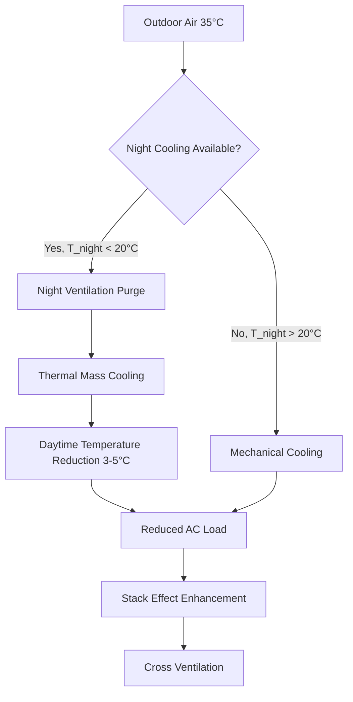

## Climate-Driven Design Philosophy

Southern European HVAC practices prioritize cooling loads over heating requirements, reflecting Mediterranean climate characteristics with hot, dry summers and mild, wet winters. Design outdoor temperatures range from 35-42°C in summer to 0-10°C in winter, creating cooling-dominant annual energy profiles fundamentally different from Northern European heating-focused approaches.

The regional emphasis on natural ventilation, thermal mass utilization, and solar shading directly responds to high solar radiation levels (1,500-2,000 kWh/m²/year) and extended cooling seasons lasting 5-7 months. Building envelope design prioritizes solar heat gain coefficient (SHGC) control over pure insulation thickness, balancing year-round energy performance.

## Cooling Load Characteristics

Summer cooling loads in Southern Europe exhibit distinct patterns driven by solar radiation and outdoor air temperature:

$$Q_{cooling} = Q_{sensible} + Q_{latent} = \dot{m}c_p(T_{indoor} - T_{supply}) + \dot{m}h_{fg}(\omega_{indoor} - \omega_{supply})$$

Where sensible cooling dominates due to low humidity in many regions (Greece, Spain interior), while coastal areas (Italian coast, southern France) experience higher latent loads from humid maritime air.

Peak cooling loads occur during afternoon hours (14:00-17:00) when solar gains and outdoor air temperature combine:

$$Q_{solar} = A \cdot SHGC \cdot I_{solar} \cdot CLF$$

Typical peak solar irradiance reaches 900-1,000 W/m² on south-facing glazing, requiring aggressive shading strategies and low SHGC glazing (0.25-0.35) compared to Northern European values (0.50-0.60).

## Regional Regulatory Frameworks

| Country | Primary Regulation | Focus Area | U-value Limits (W/m²·K) |
|---------|-------------------|------------|-------------------------|
| Spain | RITE (Reglamento de Instalaciones Térmicas) | Thermal installations | Walls: 0.50, Roof: 0.38 |
| Italy | DPR 412/93, D.Lgs 192/2005 | Heating/cooling systems | Walls: 0.36, Roof: 0.32 |
| Greece | KENAK Energy Performance | Building energy efficiency | Walls: 0.45, Roof: 0.40 |
| Portugal | SCE (Sistema de Certificação Energética) | Energy certification | Walls: 0.50, Roof: 0.40 |

Spain's RITE regulation mandates minimum seasonal energy efficiency ratio (SEER) values for cooling equipment ranging from 2.6-4.6 depending on capacity, significantly lower than ASHRAE 90.1 requirements (3.8-4.5 EER), reflecting older equipment stock and less stringent enforcement.

## Natural Ventilation Integration

Southern European design extensively employs natural ventilation to reduce mechanical cooling energy:

Night ventilation effectiveness depends on thermal mass and ventilation rate:

$$\Delta T_{mass} = \frac{Q_{night} \cdot t}{m \cdot c_p} = \frac{\dot{V} \cdot \rho \cdot c_p \cdot (T_{indoor} - T_{outdoor}) \cdot t}{m_{building} \cdot c_p}$$

Concrete construction common in the region provides thermal mass of 200-400 kJ/m²·K, enabling 3-5°C temperature reduction when combined with 5-10 ACH night ventilation rates.

## Solar Thermal Prevalence

Greece leads Europe in solar thermal collector installations with 300-400 m²/1,000 inhabitants, compared to 40-50 m²/1,000 in Northern Europe. The economic advantage stems from high solar radiation and favorable payback periods:

$$E_{solar} = A_{collector} \cdot \eta_{collector} \cdot I_{solar} \cdot f_{shading}$$

Typical flat-plate collector efficiency in Southern Europe reaches 0.65-0.75 at operating temperatures of 50-60°C for domestic hot water (DHW), generating 600-900 kWh/m²/year compared to 350-500 kWh/m²/year in Central Europe.

Solar fraction for DHW systems achieves 60-80% annually with properly sized storage (50-75 L/m² collector area), reducing conventional energy consumption and supporting EU renewable energy directives.

## Cooling Technology Preferences

Split-system air conditioners dominate residential and small commercial applications due to:
- Lower first cost (€800-1,500/3.5 kW capacity)
- Simplified installation in existing buildings
- Individual zone control matching occupancy patterns
- Heating capability for mild winter conditions

Variable refrigerant flow (VRF) systems penetrate larger commercial buildings, offering:
- Simultaneous heating and cooling between zones
- Part-load efficiency through modulating compressors
- Reduced ductwork in retrofit applications
- SEER values of 4.5-6.0 for heat recovery configurations

## Thermal Mass and Envelope Design

Traditional construction methods utilize high thermal mass materials (stone, concrete, terra cotta) that provide natural temperature buffering:

$$\phi = \sqrt{\frac{\rho \cdot c_p \cdot k}{\pi \cdot \tau}}$$

Where thermal effusivity (φ) determines heat penetration depth. Concrete with φ = 1,800 J/m²·K·√s limits diurnal temperature swing amplitude by 40-60% compared to lightweight construction (φ = 400-600 J/m²·K·√s).

External insulation finishing systems (EIFS) applied to existing masonry buildings provide U-values of 0.30-0.45 W/m²·K while preserving internal thermal mass, optimizing dynamic thermal performance unlike internal insulation that decouples thermal mass from conditioned space.

## Ventilation Standards and Indoor Air Quality

EN 15251 and national adaptations specify ventilation rates based on building category and occupancy:
- Category I (sensitive): 0.49 L/s/m² (0.96 cfm/ft²)
- Category II (normal): 0.42 L/s/m² (0.83 cfm/ft²)
- Category III (moderate): 0.29 L/s/m² (0.57 cfm/ft²)

These rates align with ASHRAE 62.1 ventilation rate procedure but typically apply to mechanically ventilated buildings only. Natural ventilation remains prevalent in residential construction, often without mechanical backup.

Demand-controlled ventilation (DCV) adoption lags Northern Europe due to:
- Lower heating penalties from over-ventilation
- Higher natural ventilation potential
- Reduced humidity control requirements in dry climates

## Energy Performance Certification

EU Energy Performance of Buildings Directive (EPBD) requires energy certificates displaying primary energy consumption in kWh/m²/year:
- Class A: < 30 kWh/m²/year
- Class B: 31-50 kWh/m²/year
- Class C: 51-70 kWh/m²/year
- Class D-G: Progressively higher consumption

Southern European building stock predominantly rates Class D-E (100-200 kWh/m²/year) due to:
- Older construction without insulation (pre-1980)
- Single-glazed windows
- Inefficient cooling equipment (EER 2.0-2.5)
- Limited building automation

Renovation programs targeting envelope improvements and equipment replacement achieve 40-60% energy reduction, moving buildings to Class B-C performance levels.

## Components

- Mediterranean Cooling Focus
- Spanish Rite Thermal Installations
- Italian Dpr 412 Heating Regulations
- Greek Solar Thermal Prevalence
- Portuguese Sce Energy Certification
