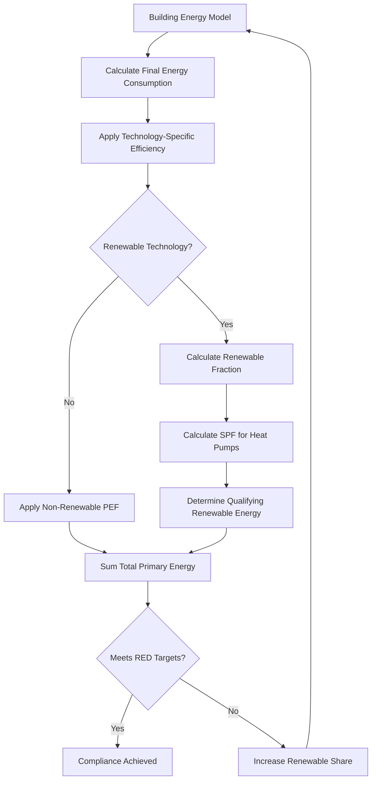

## Overview

The European Union Renewable Energy Directive (RED II, Directive 2018/2001/EU) establishes binding targets for renewable energy consumption across all sectors, with direct implications for HVAC system design, selection, and operation. The directive mandates that 32% of the EU's gross final energy consumption must come from renewable sources by 2030, with heating and cooling representing the largest energy-consuming sector at approximately 50% of total EU energy demand.

The directive recognizes specific renewable energy technologies applicable to HVAC systems and provides calculation methodologies for quantifying their contribution to overall renewable energy targets.

## Renewable Energy Technologies in HVAC

### Heat Pump Technology Recognition

The RED II directive explicitly recognizes aerothermal, geothermal, and hydrothermal energy captured by heat pumps as renewable energy, provided the heat pump meets minimum performance thresholds. The seasonal performance factor (SPF) must exceed:

$$\text{SPF}_{\min} = \frac{1}{1 - \frac{1}{\eta}}$$

where $\eta$ is the ratio between total gross electricity production and primary energy consumption for electricity production, typically valued at 0.455 for the EU electricity mix. This yields:

$$\text{SPF}_{\min} = \frac{1}{1 - \frac{1}{0.455}} = 1.833$$

Only heat pumps with SPF values exceeding this threshold qualify for renewable energy accounting under the directive.

**Performance calculation methodology:**

$$E_{\text{RES}} = Q_{\text{usable}} \times \left(1 - \frac{1}{\text{SPF}}\right)$$

where:
- $E_{\text{RES}}$ = renewable energy content (kWh)
- $Q_{\text{usable}}$ = total heat delivered by the heat pump (kWh)
- SPF = seasonal performance factor (dimensionless)

### Solar Thermal Systems

Solar thermal collectors contribute directly to renewable energy targets with 100% of delivered thermal energy counted as renewable. The annual renewable energy contribution is:

$$E_{\text{solar}} = A_c \times \eta_0 \times I_{\text{annual}} \times F_{\text{system}}$$

where:
- $A_c$ = collector aperture area (m²)
- $\eta_0$ = optical efficiency of collector (dimensionless)
- $I_{\text{annual}}$ = annual solar irradiation (kWh/m²·year)
- $F_{\text{system}}$ = system utilization factor accounting for thermal losses (0.5-0.7 typical)

## Compliance Strategies for HVAC Systems

### Building-Level Renewable Energy Integration

The directive requires member states to ensure new buildings and those undergoing major renovation incorporate minimum levels of renewable energy. HVAC designers must evaluate technology combinations to meet these requirements.

| Technology | Renewable Fraction | Typical Application | Capital Cost Factor |
|------------|-------------------|---------------------|---------------------|
| Air-source heat pump (ASHP) | 50-65% | Space heating/cooling | 1.0x |
| Ground-source heat pump (GSHP) | 65-75% | Space heating/cooling | 2.5-3.5x |
| Solar thermal (DHW) | 100% delivered | Domestic hot water | 1.5x |
| Biomass boiler | 100% | Space heating | 1.8x |
| Hybrid systems (HP + solar) | 70-85% | Combined loads | 2.0-2.5x |

*Cost factors relative to conventional gas boiler baseline*

### District Heating and Cooling Systems

The directive incentivizes renewable district heating and cooling networks. The renewable energy fraction for district systems is:

$$f_{\text{RES,district}} = \frac{\sum Q_{\text{RES,sources}}}{\sum Q_{\text{delivered}} + Q_{\text{network,losses}}}$$

Qualifying renewable sources include:
- Waste heat from renewable electricity generation
- Geothermal energy
- Solar thermal installations
- Heat from efficient biomass CHP plants
- Heat from high-efficiency heat pumps

## Calculation Methodology Framework

### Primary Energy Factor Application

The directive employs primary energy factors (PEF) to convert final energy consumption to primary energy equivalents:

$$E_{\text{primary}} = E_{\text{final}} \times \text{PEF}$$

Standard PEFs for EU member states:

| Energy Carrier | Non-Renewable PEF | Total PEF | Renewable Credit |
|----------------|-------------------|-----------|------------------|
| Natural gas | 1.1 | 1.1 | 0 |
| Electricity (EU mix) | 2.1 | 2.5 | Variable |
| District heating | 1.3 | 1.3 | Variable |
| Biomass | 0.2 | 1.0 | 1.0 |
| Solar thermal | 0 | 1.0 | 1.0 |

### Energy Performance Calculation Workflow

## Heat Pump System Design Optimization

To maximize renewable energy contribution under RED II, heat pump systems must achieve high seasonal performance. Key design factors:

**Supply temperature reduction:**

$$\text{COP} = \frac{T_{\text{cond}}}{T_{\text{cond}} - T_{\text{evap}} - \Delta T_{\text{losses}}}$$

Lowering condensing temperature ($T_{\text{cond}}$) through low-temperature distribution systems (35-45°C supply) increases COP by 15-30% compared to conventional 70-80°C systems.

**Buffer storage integration:**

Thermal storage volumes should satisfy:

$$V_{\text{buffer}} \geq \frac{\dot{Q}_{\text{HP,min}} \times t_{\text{cycle,min}}}{\rho c_p \Delta T_{\text{storage}}}$$

where:
- $\dot{Q}_{\text{HP,min}}$ = minimum heat pump thermal output (kW)
- $t_{\text{cycle,min}}$ = minimum cycle time (3600 s typical)
- $\rho c_p$ = volumetric heat capacity of water (4186 kJ/m³·K)
- $\Delta T_{\text{storage}}$ = storage temperature differential (10-15 K)

## Interaction with ASHRAE Standards

While RED II governs European markets, ASHRAE standards provide compatible calculation frameworks:

- **ASHRAE 90.1**: Energy efficiency requirements align with RED II performance thresholds
- **ASHRAE 169**: Climate zone classifications support accurate SPF calculations
- **ASHRAE 62.1**: Ventilation requirements affect heat recovery potential
- **ASHRAE Standard 205**: Equipment performance representation enables RED II compliance modeling

The directive's SPF threshold of 1.833 corresponds approximately to ASHRAE 90.1 heat pump efficiency requirements for European climate zones (zones 3-5).

## Implementation Challenges

### Measurement and Verification

Demonstrating compliance requires:

1. **Design-stage calculations** using EN 15316 series standards for HVAC system efficiency
2. **Commissioning verification** of installed equipment performance
3. **Operational monitoring** through building energy management systems (BEMS)
4. **Annual reporting** of renewable energy fraction

### Renewable Electricity Accounting

For electrically-driven heat pumps, the renewable fraction of grid electricity varies by:
- Time of use (correlation with renewable generation)
- Geographic location (regional grid mix)
- Direct renewable power purchase agreements (PPAs)

Member states may apply hourly or monthly renewable electricity factors for more accurate accounting.

## Future Directive Development

The proposed RED III (under review) contemplates:
- Increased renewable energy targets (42.5% by 2030)
- Enhanced district heating renewable requirements (minimum 49% by 2030)
- Mandatory renewable energy integration for data centers and industrial facilities
- Strengthened guarantee of origin systems for renewable heating and cooling

HVAC system designers in European markets must anticipate these evolving requirements when selecting long-lifecycle equipment.

## Compliance Verification Example

For a commercial building with annual heating load of 500,000 kWh served by an air-source heat pump with measured SPF of 3.5:

$$E_{\text{RES}} = 500{,}000 \times \left(1 - \frac{1}{3.5}\right) = 357{,}143 \text{ kWh}$$

$$E_{\text{electric}} = \frac{500{,}000}{3.5} = 142{,}857 \text{ kWh}$$

$$E_{\text{primary}} = 142{,}857 \times 2.5 = 357{,}143 \text{ kWh}$$

Renewable energy fraction: 71.4% of delivered heating energy qualifies as renewable under RED II.

## Conclusion

The EU Renewable Energy Directive fundamentally reshapes HVAC system selection and design in European markets. Heat pump technology, particularly when combined with low-temperature distribution systems, provides the most practical pathway to compliance for most building types. System designers must perform rigorous performance calculations early in the design process to ensure installed systems meet both directive requirements and building energy performance targets. The directive's calculation methodology, while complex, provides clear pathways for demonstrating compliance through proper equipment selection, system design, and performance verification.
