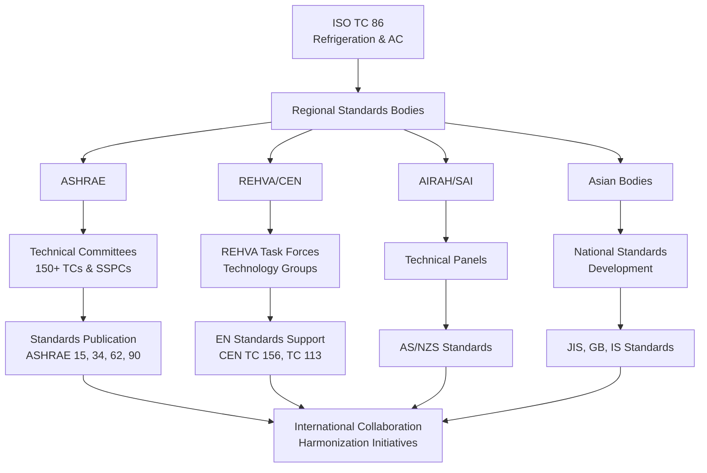
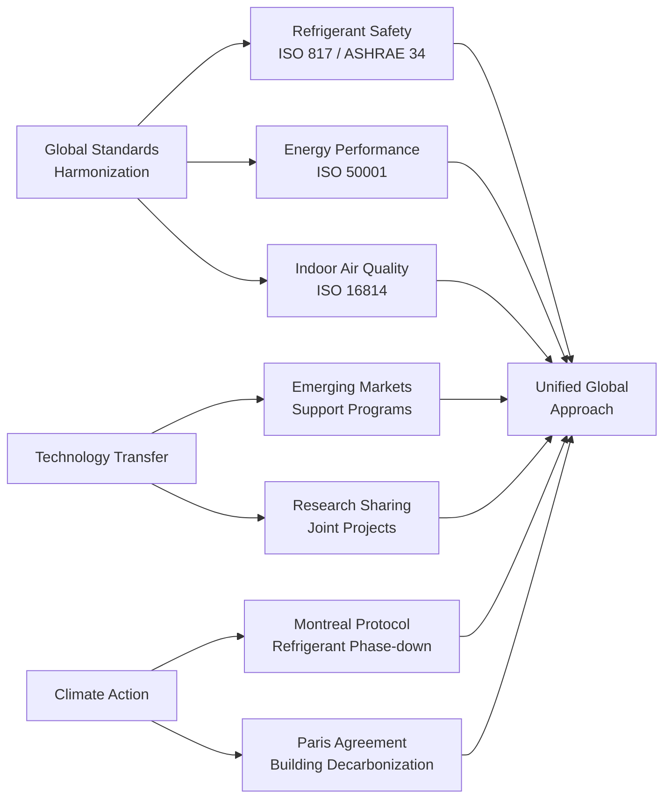

## Overview of Global HVAC Professional Organizations

Professional organizations form the backbone of HVAC industry advancement worldwide, driving standards development, knowledge dissemination, and technical innovation. These bodies serve distinct geographic regions while collaborating on international initiatives addressing climate change, energy efficiency, and indoor environmental quality. The major organizations include ASHRAE (Americas focus), REHVA (Europe), CIBSE (UK), AIRAH (Australia), and numerous regional entities spanning Asia, Africa, and the Middle East.

## Major International Organizations Comparison

| Organization | Region | Founded | Members | Primary Standards | Key Publications |
|-------------|---------|---------|---------|------------------|------------------|
| ASHRAE | Americas/Global | 1894 | 57,000+ | ASHRAE 90.1, 62.1, 55 | ASHRAE Handbook series (4 volumes) |
| REHVA | Europe | 1963 | 120,000+ (via associations) | EN standards support | REHVA Journal, guidebooks |
| CIBSE | UK/Global | 1976 | 20,000+ | CIBSE Guides A-M | CIBSE Knowledge Series |
| AIRAH | Australia/Pacific | 1920 | 10,000+ | AS/NZS standards | AIRAH Handbook |
| ISHRAE | India | 1981 | 20,000+ | NBC of India support | ISHRAE Journal |
| SHASE | Japan | 1917 | 5,000+ | JIS standards | SHASE Handbooks |

## Regional Professional Bodies

### Asia-Pacific Organizations

**ISHRAE (Indian Society of Heating, Refrigerating and Air Conditioning Engineers)** addresses subcontinental requirements including high ambient temperatures, humidity control, and energy-constrained design. The organization develops India-specific load calculation methods and promotes appropriate technology for tropical climates.

**SHASE (Society of Heating, Air-Conditioning and Sanitary Engineers of Japan)** focuses on earthquake-resistant design, high-efficiency technologies, and ultra-clean environments for semiconductor manufacturing. Japanese standards emphasize precision control and reliability.

**SAREK (Society of Air-Conditioning and Refrigerating Engineers of Korea)** advances Korean building standards with emphasis on ondol heating integration, district energy systems, and high-rise building pressurization.

### European National Bodies

REHVA federates 27 national HVAC associations representing over 120,000 professionals. Member associations include VDI (Germany), AICVF (France), AiCARR (Italy), and TVVL (Netherlands). These bodies harmonize European standards while maintaining national technical traditions.

### Middle East and Africa

**ASHRAE Middle East Chapter** and regional sections adapt North American standards to extreme desert conditions, emphasizing water conservation, high-temperature operation, and dust filtration requirements.

**SACAIR (South African Council of Air Conditioning, Heating and Refrigeration Engineers)** addresses African climate diversity, off-grid systems, and resource-constrained applications.

## Organizational Structure and Relationships

## Membership Benefits Comparison

| Benefit Type | ASHRAE | REHVA | CIBSE | AIRAH |
|-------------|--------|-------|-------|-------|
| Technical Publications | Full Handbook access | REHVA Journal | 13 Design Guides | Handbook + Journal |
| Standards | Member discount | Via national bodies | Member price | AS/NZS access |
| Conferences | Annual + specialty | 2-year CLIMA | Annual | Annual |
| Certifications | BEAP, BEMP, HBDP, OPMP | EQF framework | Low Carbon Consultant | AIRCOP certified |
| Local Chapters | 182 chapters globally | 27 national associations | 18 regional groups | 14 branches |
| Networking | Chapter meetings | National events | CPD programs | Technical evenings |
| Career Development | Learning Institute | REHVA courses | CPD recording | Training programs |

## Standards Development Processes

### ASHRAE Standards Development

ASHRAE employs a consensus-based process with public review. Project committees include balanced representation from producers, users, and general interest categories. Standards undergo continuous maintenance with addenda published between editions.

**Key ASHRAE Standards:**
- **Standard 90.1** - Energy Standard for Buildings (except low-rise residential)
- **Standard 62.1** - Ventilation for Acceptable Indoor Air Quality
- **Standard 55** - Thermal Environmental Conditions for Human Occupancy
- **Standard 15** - Safety Standard for Refrigeration Systems
- **Standard 34** - Designation and Safety Classification of Refrigerants

### European Standards Harmonization

REHVA supports CEN (European Committee for Standardization) technical committees developing EN standards. The EN series becomes mandatory across EU member states, replacing conflicting national standards.

**Critical EN Standards:**
- **EN 16798** series - Energy performance of buildings (replaces EN 15251)
- **EN 12170** - Heating systems terminology and symbols
- **EN 378** - Refrigerating systems and heat pumps safety requirements

### ISO International Standards

ISO Technical Committee 86 develops globally applicable refrigeration and air conditioning standards. Organizations collaborate on ISO standards through national standards bodies (ANSI for USA, BSI for UK, SAI for Australia).

## International Collaboration Initiatives

### Joint Research Programs

Organizations collaborate on fundamental research addressing:
- **Low-GWP refrigerant performance** - A2L flammability testing protocols
- **Pandemic ventilation strategies** - Airborne transmission control
- **Decarbonization pathways** - Electrification and heat pump deployment
- **Demand response** - Grid-interactive efficient buildings

### Knowledge Exchange Platforms

**CLIMA World Congress** (organized by REHVA every 3 years) brings together global HVAC professionals. ASHRAE Annual and Winter Conferences feature international participation. Regional events like ARBS (Australia), AHR Expo (USA), and MCE (Italy) facilitate technology dissemination.

**Digital Platforms:** Organizations increasingly offer webinars, online courses, and digital publications enabling worldwide knowledge access regardless of geographic location.

## Professional Development and Certification

Organizations offer structured career advancement:

**ASHRAE Certifications:**
- Building Energy Assessment Professional (BEAP)
- Building Energy Modeling Professional (BEMP)
- High-Performance Building Design Professional (HBDP)
- Operations and Performance Management Professional (OPMP)

**CIBSE Pathways:**
- Chartered Engineer (CEng) sponsorship
- Low Carbon Consultant certification
- LEED/BREEAM AP support

**AIRAH Credentials:**
- AIRCOP (certification program)
- Continuing Professional Development (CPD) tracking
- Advanced diploma pathways

## Emerging Regions and Capacity Building

Organizations actively support HVAC industry development in emerging markets through:

- **Training programs** adapted to local climate and economic conditions
- **Standards guidance** for nations developing building codes
- **Mentor programs** connecting experienced professionals with developing regions
- **Scholarship programs** enabling international education access
- **Technology transfer initiatives** promoting appropriate, sustainable solutions

Regional growth focuses on Southeast Asia, Sub-Saharan Africa, and Latin America where rapid urbanization demands scalable HVAC solutions balancing comfort, affordability, and environmental responsibility.

## Future Directions

Global organizations coordinate on:

- **Refrigerant transition** - Supporting A2L and natural refrigerant adoption
- **Grid integration** - Demand flexibility and thermal storage strategies
- **Indoor air quality** - Post-pandemic ventilation standards
- **Digitalization** - BIM integration and AI-enabled controls
- **Circular economy** - Equipment lifecycle management and refrigerant reclamation

Cross-organization working groups address these challenges through harmonized technical positions, reducing conflicting regional approaches that impede global technology deployment.

## Conclusion

Professional organizations provide essential infrastructure for HVAC industry advancement, translating research into practice through standards, education, and knowledge networks. While regional organizations address local requirements, increasing collaboration ensures coherent global responses to shared challenges of climate change, energy transition, and indoor environmental quality. Membership in relevant organizations accelerates professional development while contributing to industry-wide technical progress.
