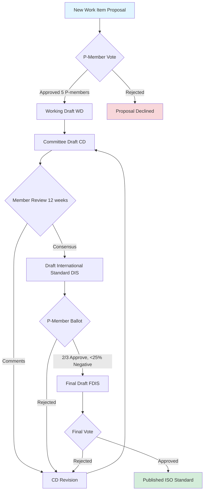
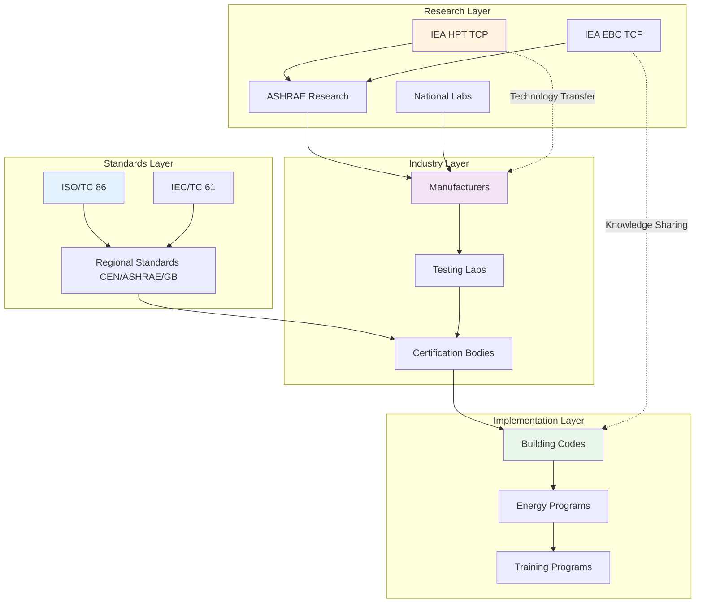

## Framework for International HVAC Cooperation

International collaboration in HVAC systems addresses climate change mitigation, energy security, and building decarbonization through coordinated research, standardized testing protocols, and technology transfer mechanisms. Global cooperation occurs through three primary channels: standards development organizations (SDOs) that harmonize technical requirements, multilateral research initiatives that advance technology readiness levels, and knowledge exchange platforms that disseminate best practices across regions with varying technical capacity.

The physics of heat transfer and thermodynamics remains universal, but implementation varies with climate zones, economic development levels, and energy infrastructure. International collaboration seeks to establish common measurement frameworks while accommodating regional adaptation requirements.

## ISO Standards Development Process

ISO Technical Committee 86 (ISO/TC 86) governs international standardization for refrigeration, air conditioning, and heat pumps. The committee structure includes:

- **SC 1**: Safety and environmental requirements
- **SC 2**: Safety and environmental requirements for stationary refrigeration systems
- **SC 3**: Test methods and rating standards
- **SC 6**: Factory-made air-conditioning and heat pump units
- **SC 8**: Liquid pumps and installation

### Standards Development Workflow

The process requires 3-5 years from initial proposal to publication, with consensus among participating national standards bodies. Key ISO standards affecting HVAC systems include:

| Standard | Scope | Application |
|----------|-------|-------------|
| ISO 5151 | Non-ducted air conditioners and heat pumps - Testing and rating for performance | Equipment capacity verification |
| ISO 13253 | Ducted air conditioners and air-to-air heat pumps - Testing and rating for performance | Central system ratings |
| ISO 15042 | Multiple split-systems - Testing and rating for performance | Multi-zone systems |
| ISO 13256 | Water-source heat pumps - Testing and rating for performance | Geothermal and water-loop systems |
| ISO 817 | Refrigerants - Designation and safety classification | Refrigerant safety groups |

### Harmonization with Regional Standards

ISO standards serve as reference documents that regional bodies adapt. The relationship creates technical equivalence while accommodating local requirements:

**ASHRAE/AHRI (North America)** adopts ISO safety classifications but maintains distinct performance rating conditions reflecting U.S. climate distribution and electricity pricing structures.

**CEN (Europe)** develops EN standards that often reference ISO testing methodologies while incorporating EU-specific metrics such as seasonal performance calculations and primary energy factors mandated by Ecodesign regulations.

**GB Standards (China)** increasingly align with ISO frameworks, particularly for equipment exported to international markets, though domestic appliance standards retain unique efficiency tiers.

This multi-layer structure enables equipment certification across markets without complete re-testing, reducing barriers to technology diffusion.

## International Research Initiatives

### IEA Heat Pump Programme

The International Energy Agency Heat Pump Centre coordinates research among 16 participating countries through focused annexes addressing specific technical challenges. Recent annexes include:

**Annex 58: High Temperature Heat Pumps** investigates refrigerants, cycle configurations, and applications for industrial process heating requiring supply temperatures 90-160°C. Collaborative testing across laboratories in Switzerland, Germany, Denmark, and Japan validates performance models for transcritical CO₂ cycles and high-temperature working fluids.

**Annex 59: Deep Renovation with Heat Pumps** documents retrofit integration strategies combining improved envelope insulation with heat pump heating in existing building stock. Case studies from Netherlands, Austria, and France quantify achieved energy reductions of 60-80% through optimized system sizing.

**Annex 60: Compact Heat Exchangers** advances microchannel and printed circuit heat exchanger technology to reduce refrigerant charge while improving heat transfer performance. Collaborative CFD modeling and experimental validation reduces development timelines.

### IEA EBC Programme

The Energy in Buildings and Communities Programme addresses HVAC integration with building systems:

**Annex 80: Resilient Cooling** examines passive and hybrid strategies reducing mechanical cooling dependence in climate change scenarios with increased cooling degree days. Research teams from Mediterranean and Southeast Asian regions share adaptive comfort protocols and natural ventilation effectiveness data.

**Annex 82: Energy Flexible Buildings** investigates HVAC systems providing grid services through demand response and thermal storage. Synchronized field tests in California, Denmark, and Australia measure load-shifting capability across diverse electricity markets.

### Global Collaboration Framework

## Technology Transfer Mechanisms

### Multilateral Development Bank Programs

The World Bank and Asian Development Bank finance HVAC technology adoption in developing economies through:

**Energy Efficiency Investment Programs** providing concessional financing for high-efficiency chiller replacement in commercial buildings, with measured energy savings validating economic models.

**Refrigerant Phase-out Projects** under the Montreal Protocol Multilateral Fund support conversion from HCFC refrigerants to low-GWP alternatives. Technology transfer includes equipment manufacturing partnerships and technician training programs.

### Bilateral Technical Cooperation

Government-to-government partnerships facilitate technology deployment:

**U.S.-India Partnership** supports deployment of super-efficient air conditioners through collaborative performance testing and manufacturing capability development. Field demonstrations in Ahmedabad and Delhi measure achieved seasonal energy efficiency ratios exceeding 5.0 W/W in tropical climate operation.

**Germany-China Cooperation** advances industrial heat pump technology for decarbonizing process heating in chemical and food industries. Joint research centers develop high-temperature vapor recompression systems recovering waste heat from drying operations.

## Knowledge Sharing Platforms

### Digital Collaboration Tools

**IEA District Energy Database** aggregates performance data from 500+ district heating networks across 25 countries. Anonymized operational data enables benchmarking heat loss rates, pumping energy, and peak load factors. Statistical analysis identifies efficiency improvement opportunities:

$\text{Network Efficiency} = \frac{Q_{\text{delivered}}}{Q_{\text{generated}} + W_{\text{auxiliary}}}$

Leading systems achieve 85-90% annual efficiency through low supply temperatures (50-70°C), superior pipe insulation (thermal conductivity <0.027 W/m·K), and variable speed pumping.

**ASHRAE Global Thermal Comfort Database II** contains 81,000+ comfort survey responses from buildings in 60 countries. Analysis reveals adaptive comfort opportunities in mixed-mode buildings where occupants exhibit higher tolerance for temperature variation when personal control exists, enabling 20-30% HVAC energy reduction.

### Professional Organization Collaboration

Joint conferences and technical publications accelerate knowledge diffusion:

**ASHRAE-REHVA Partnership** produces coordinated position documents on building ventilation for infection control, establishing consensus on outdoor air delivery rates, filtration efficiency, and upper-room UVGI effectiveness. Collaborative guidance influenced COVID-19 pandemic response across Europe and North America.

**ISHRAE-ASHRAE Technology Exchange** brings U.S. heat pump and energy recovery technology to Indian market conditions, with reciprocal sharing of evaporative cooling innovations developed for hot-dry climates.

## Case Studies in Successful Collaboration

### Case Study 1: Montreal Protocol Technology Transfer

The phase-out of CFC and HCFC refrigerants required coordinated technology development, policy implementation, and capacity building across 198 countries. Key mechanisms:

**Technology Cooperation**: Chemical manufacturers shared hydrofluorocarbon and hydrofluoroolefin synthesis processes with developing-economy producers through licensing agreements funded by the Multilateral Fund.

**Retrofit Protocols**: Collaborative research established drop-in and retrofit procedures for existing equipment, with testing programs validating performance and safety across diverse climate conditions.

**Training Programs**: Regional networks of training centers equipped with hands-on facilities taught proper refrigerant handling, leak detection, and recovery techniques to 500,000+ technicians globally.

**Results**: CFC consumption reduced 99.7% globally by 2010 compared to 1986 baseline, with negligible disruption to cooling access. Estimated ozone layer recovery by 2060-2070.

### Case Study 2: Gulf Cooperation Council Energy Efficiency Standards

GCC nations (Saudi Arabia, UAE, Qatar, Kuwait, Bahrain, Oman) adopted unified minimum energy performance standards (MEPS) for air conditioners despite varying national technical capacities:

**Collaborative Development**: Technical committees with representatives from each member state developed common test procedures based on ISO 5151 adapted for extreme ambient conditions (46-52°C design temperatures).

**Phased Implementation**: Standards introduced in three-year phases, allowing manufacturers time to redesign products and governments to establish testing infrastructure.

**Regional Testing**: Accredited laboratories in each country perform verification testing with interlaboratory comparison programs ensuring measurement consistency within ±3% for capacity and efficiency ratings.

**Market Transformation**: Minimum EER requirements increased from 2.4 W/W (2012) to 2.9 W/W (2020), with documented market shift toward inverter-driven variable capacity systems achieving SEER values 4.0-5.2 W/W.

**Energy Impact**: Estimated 15-20% reduction in cooling electricity consumption by 2025 compared to business-as-usual trajectory, deferring 8-12 GW generating capacity additions across GCC region.

### Case Study 3: European-Japanese Heat Pump Collaboration

Joint research between Fraunhofer Institute (Germany) and National Institute of Advanced Industrial Science and Technology (Japan) advanced CO₂ heat pump water heating technology:

**Technical Challenge**: Transcritical CO₂ cycles require gas cooler optimization to achieve competitive efficiency despite supercritical heat rejection process.

**Collaborative Approach**: Synchronized experimental and CFD modeling programs optimized internal heat exchanger configurations and expansion valve control strategies. Shared datasets enabled model validation across independent facilities.

**Technology Outcomes**: Developed control algorithms achieving COP 3.5-4.5 for domestic hot water heating (tap water 60°C) across ambient temperatures -10°C to 35°C. Commercial products now dominate Japanese heat pump water heater market (5+ million units installed) with growing European adoption.

**Standards Impact**: Research findings incorporated into ISO 13256-2 testing procedures for sanitary hot water heat pumps, establishing global benchmark for performance rating.

## Barriers and Future Directions

### Technical Barriers

**Differing Test Conditions**: Regional standards specify different operating points (e.g., ASHRAE 35°F/80°F cooling vs. ISO 35°C outdoor/27°C indoor), complicating performance comparisons and requiring multiple certification tests for equipment sold globally.

**Climate-Specific Optimization**: Equipment optimized for one climate may perform poorly in another. Heat pumps designed for European moderate climates (heating season -5°C to 10°C outdoor) show inadequate defrost performance in North American cold climates (-20°C to -5°C).

### Economic Barriers

**Technology Access Costs**: Licensing fees and intellectual property restrictions limit technology diffusion to cost-sensitive markets. Open-source design initiatives for small-scale air conditioning show promise but lack manufacturing scale.

**Testing Infrastructure**: Accredited testing laboratories with psychrometric chambers and refrigerant calorimeters require $2-5M capital investment, limiting verification capacity in developing economies.

### Future Collaborative Priorities

**Refrigerant Transition Coordination**: Kigali Amendment phase-down schedules require accelerated development and testing of next-generation refrigerants with GWP <10, necessitating shared research facilities and safety data.

**Building Integration**: Digital building platforms integrating HVAC controls with renewable generation and grid services require interoperability standards developed through multi-stakeholder collaboration.

**Resilient Design**: Climate adaptation strategies for extreme heat events and power grid instability demand shared research on passive survivability, thermal storage, and autonomous operation.

International HVAC collaboration reduces duplicative effort, accelerates technology deployment, and ensures equitable access to thermal comfort technologies essential for health, productivity, and economic development across diverse global contexts.
