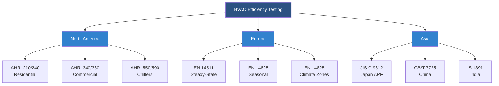

# International HVAC Efficiency Metrics

Global HVAC efficiency metrics provide standardized methods for comparing system performance across manufacturers, technologies, and geographic regions. These metrics translate complex thermodynamic performance into quantifiable values that guide equipment selection, regulatory compliance, and energy policy development.

## Fundamental Efficiency Concepts

HVAC efficiency metrics quantify the ratio of useful heating or cooling output to energy input. The fundamental relationship derives from the first law of thermodynamics applied to vapor compression cycles and heat transfer processes.

For cooling equipment, the basic efficiency relationship:

$$\text{Efficiency} = \frac{\text{Cooling Capacity (Btu/h or kW)}}{\text{Power Input (W or kW)}}$$

For heating equipment using vapor compression:

$$\text{Efficiency} = \frac{\text{Heating Capacity (Btu/h or kW)}}{\text{Power Input (W or kW)}}$$

These ratios exceed unity for heat pumps because they move heat rather than generate it through direct conversion of electrical energy.

## Primary Global Efficiency Metrics

### Coefficient of Performance (COP)

COP represents instantaneous efficiency at specific operating conditions. It applies universally across cooling and heating modes:

**Cooling COP:**

$$\text{COP}_c = \frac{Q_c}{W_{comp}}$$

Where:
- $Q_c$ = cooling capacity at specified conditions (kW)
- $W_{comp}$ = compressor power input (kW)

**Heating COP:**

$$\text{COP}_h = \frac{Q_h}{W_{comp}}$$

Where:
- $Q_h$ = heating capacity at specified conditions (kW)
- $W_{comp}$ = compressor power input (kW)

COP values depend critically on operating temperatures. The theoretical maximum COP for a Carnot cycle heat pump:

$$\text{COP}_{Carnot,h} = \frac{T_h}{T_h - T_c}$$

Where temperatures are absolute (Kelvin). Real equipment achieves 40-60% of Carnot efficiency due to irreversibilities in compression, expansion, and heat exchange processes.

### Energy Efficiency Ratio (EER)

EER measures steady-state cooling efficiency under standard test conditions. The North American standard uses ARI/AHRI test conditions:

- Indoor: 80°F (26.7°C) dry-bulb, 67°F (19.4°C) wet-bulb
- Outdoor: 95°F (35°C) dry-bulb

$$\text{EER} = \frac{\text{Cooling Capacity (Btu/h)}}{\text{Power Input (W)}}$$

ASHRAE Standard 90.1 specifies minimum EER values for commercial equipment based on capacity ranges and equipment types.

### Seasonal Energy Efficiency Ratio (SEER/SEER2)

SEER accounts for varying load conditions and part-load performance throughout a typical cooling season. SEER2 (effective 2023) uses updated test procedures reflecting more realistic installation conditions:

$$\text{SEER2} = \frac{\text{Total Seasonal Cooling (Btu)}}{\text{Total Seasonal Energy Input (Wh)}}$$

The calculation integrates performance across multiple temperature bins weighted by occurrence frequency in a representative climate. SEER2 testing includes static pressure requirements that better represent actual duct systems.

### Heating Seasonal Performance Factor (HSPF/HSPF2)

HSPF measures seasonal heating efficiency for heat pumps operating in heating mode:

$$\text{HSPF2} = \frac{\text{Total Seasonal Heating Output (Btu)}}{\text{Total Seasonal Energy Input (Wh)}}$$

HSPF2 (effective 2023) incorporates multiple temperature bins from 62°F to -5°F outdoor ambient, accounting for defrost cycles and auxiliary heat operation.

## Regional Efficiency Standards Comparison

| Region | Cooling Metric | Heating Metric | Test Standard | Typical Range |
|--------|---------------|---------------|---------------|---------------|
| North America | EER, SEER2 | COP, HSPF2 | AHRI 210/240, AHRI 340/360 | SEER2: 14-28 |
| Europe | EER, SEER | COP, SCOP | EN 14511, EN 14825 | SEER: 5-8.5 |
| Japan | APF (Annual Performance Factor) | APF | JIS C 9612 | APF: 4-7 |
| China | EER, APF | COP | GB/T 7725 | Grade 1: ≥3.6 |
| Australia | EER, AEER | COP, ACOP | AS/NZS 3823 | 6-8 stars |
| India | ISEER (Indian SEER) | COP | IS 1391 | ISEER: 3.5-5.2 |

## European Seasonal Efficiency (SCOP)

The Seasonal Coefficient of Performance (SCOP) provides European seasonal heating efficiency assessment:

$$\text{SCOP} = \frac{Q_h}{\sum(E_{design} + E_{backup})}$$

EN 14825 defines three climate zones (average, colder, warmer) with distinct temperature bins for SCOP calculation. This approach recognizes that heat pump performance varies significantly with climate.

## Japanese Annual Performance Factor (APF)

Japan's APF integrates both heating and cooling performance across a full year:

$$\text{APF} = \frac{Q_{cooling} + Q_{heating}}{E_{cooling} + E_{heating}}$$

APF testing uses JIS C 9612 standards with Japan-specific climate weighting based on Tokyo conditions. This metric better represents equipment used year-round in moderate climates.

## Efficiency Metric Conversion Relationships

Direct conversion between regional metrics proves complex due to differing test conditions, but approximate relationships exist:

**SEER to European SEER (approximate):**

$$\text{SEER}_{EU} \approx \frac{\text{SEER}_{US}}{3.41}$$

The factor 3.41 converts Btu/Wh to dimensionless ratio (W/W).

**EER to COP:**

$$\text{COP} \approx \frac{\text{EER}}{3.41}$$

These conversions provide rough equivalence but do not account for different test conditions.

## Performance Testing Standards

## Integrated Part Load Value (IPLV)

Commercial chiller efficiency uses IPLV to account for part-load operation. AHRI Standard 550/590 defines IPLV weighting:

$$\text{IPLV} = 0.01A + 0.42B + 0.45C + 0.12D$$

Where:
- A = EER at 100% load
- B = EER at 75% load
- C = EER at 50% load
- D = EER at 25% load

The weighting factors reflect typical chiller operating profiles in commercial buildings. Part-load operation often exceeds full-load efficiency due to reduced lift and improved heat transfer at lower condensing temperatures.

## Temperature-Dependent Performance

All efficiency metrics depend on operating temperatures. The Carnot relationship demonstrates theoretical limits:

For air-source heat pumps at varying outdoor temperatures:

| Outdoor Temp (°F) | Theoretical COP | Typical Real COP | Efficiency % |
|-------------------|-----------------|------------------|--------------|
| 47°F (8.3°C) | 12.8 | 4.2 | 33% |
| 35°F (1.7°C) | 10.3 | 3.4 | 33% |
| 17°F (-8.3°C) | 7.8 | 2.4 | 31% |
| 5°F (-15°C) | 6.6 | 1.9 | 29% |

Real equipment efficiency degrades faster than Carnot predictions at low temperatures due to increased irreversibilities, defrost cycles, and refrigerant property limitations.

## Minimum Efficiency Standards by Region

Regulatory minimum efficiency requirements drive equipment design and market availability:

**North America (2023 Standards):**
- Residential split AC: SEER2 ≥ 14.0 (South), 13.4 (North)
- Residential heat pump: HSPF2 ≥ 7.5
- Commercial packaged AC (≥65 kBtu/h): EER ≥ 11.0

**European Union (Ecodesign):**
- Residential AC: SEER ≥ 5.1, SCOP ≥ 3.4
- Commercial AC: SEER ≥ 4.6, SCOP ≥ 3.2

**Japan (Top Runner Program):**
- Room AC: APF ≥ 5.8 (target value varies by capacity)

## Power Factor and Total Efficiency

Apparent efficiency metrics using electrical power input may not capture reactive power consumption. True system efficiency incorporates power factor:

$$\text{Power Factor} = \frac{\text{Real Power (W)}}{\text{Apparent Power (VA)}}$$

Equipment with poor power factor (< 0.9) increases utility distribution losses even if COP appears acceptable. Variable-speed drives and inverter systems maintain better power factors across operating ranges.

## Application Considerations

Selecting equipment based on efficiency metrics requires matching the metric to application conditions:

1. **Steady-state metrics (EER, COP)**: Use for constant-load applications like process cooling or data centers
2. **Seasonal metrics (SEER2, HSPF2, SCOP)**: Use for comfort conditioning with variable loads
3. **Part-load metrics (IPLV, NPLV)**: Critical for oversized equipment or systems with significant load variation
4. **Climate-specific metrics**: Match test climate to installation location for accurate performance prediction

ASHRAE Standard 90.1 and local energy codes specify minimum efficiency requirements based on equipment type, capacity, and climate zone. High-performance buildings often exceed code minimums by 20-40% to reduce operational costs and environmental impact.

Understanding global efficiency metrics enables informed equipment selection, accurate energy modeling, and effective comparison of competing technologies across international markets.
