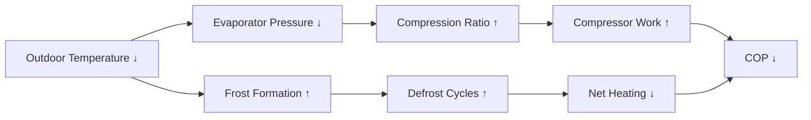
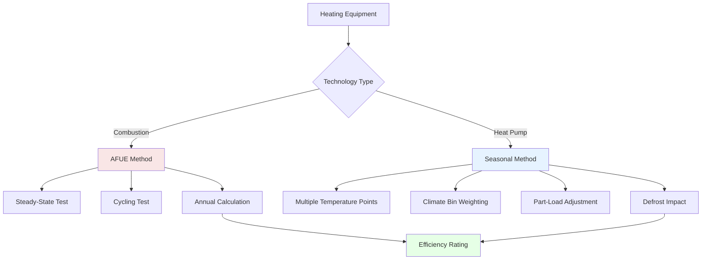

# Global Heating Efficiency Standards & Metrics

International heating efficiency standards provide frameworks for comparing equipment performance across diverse climate zones and regulatory environments. Understanding these metrics requires examination of the fundamental thermodynamic principles that govern heat transfer and conversion efficiency.

## Fundamental Efficiency Definitions

Heating efficiency quantifies the ratio of useful heat output to energy input. For combustion equipment, this relationship is:

$$\eta_{heating} = \frac{Q_{useful}}{Q_{input}} = \frac{Q_{input} - Q_{losses}}{Q_{input}}$$

Where $Q_{useful}$ represents heat delivered to the conditioned space, $Q_{input}$ is the fuel energy content, and $Q_{losses}$ includes stack losses, jacket losses, and incomplete combustion losses.

For heat pumps operating on the vapor compression cycle, efficiency is expressed as the coefficient of performance:

$$COP_{heating} = \frac{Q_{heating}}{W_{compressor}} = \frac{h_{condenser,out} - h_{condenser,in}}{h_{compressor,out} - h_{compressor,in}}$$

This ratio exceeds unity because heat pumps move thermal energy rather than generate it through fuel combustion.

## Major International Efficiency Metrics

### AFUE (Annual Fuel Utilization Efficiency)

Used primarily in North America, AFUE measures combustion heating equipment efficiency over a complete heating season. The metric accounts for:

- Steady-state combustion efficiency
- Cycling losses during on-off operation
- Pilot light energy consumption (if applicable)
- Jacket and distribution losses

AFUE is calculated as:

$$AFUE = \frac{\text{Annual Heat Output (Btu)}}{\text{Annual Fuel Input (Btu)}} \times 100\%$$

**Current minimum standards:**
- United States: 80% AFUE for non-condensing furnaces, 90% for condensing
- Canada: 95% AFUE for residential gas furnaces (as of 2023)

**Example Calculation:**
A natural gas furnace consumes 100,000 Btu/hr input with 92% AFUE delivers:

$$Q_{output} = 100,000 \times 0.92 = 92,000 \text{ Btu/hr useful heat}$$

Over a 2,000-hour heating season at 50% average firing rate:
- Total fuel input: $100,000 \times 2,000 \times 0.5 = 100$ MMBtu
- Useful heat delivered: $100 \times 0.92 = 92$ MMBtu
- Fuel cost at $1.20/therm: $100 \times 10 \times 1.20 = $1,200$

### SCOP (Seasonal Coefficient of Performance)

The European standard SCOP evaluates heat pump performance across four climate zones (warmer to colder) at multiple operating points. This metric captures:

- Part-load performance characteristics
- Temperature-dependent efficiency variation
- Defrost cycle energy consumption
- Standby and off-mode power draw

$$SCOP = \frac{\sum Q_{heating,bin}}{\sum W_{electrical,bin}}$$

Where summation occurs over temperature bins representative of seasonal conditions.

### HSPF (Heating Seasonal Performance Factor)

The North American heat pump metric HSPF, expressed in Btu/Wh, evaluates performance at specific outdoor temperatures (47°F, 35°F, 17°F) weighted by climate region:

$$HSPF = \frac{\text{Total Heating Output (Btu)}}{\text{Total Electrical Input (Wh)}}$$

**Conversion between metrics:**

$$SCOP \approx \frac{HSPF}{3.412}$$

**Current minimum standards:**
- United States: HSPF 8.8 (effective 2023)
- Europe: SCOP 3.8-4.2 depending on climate zone

## International Comparison Table

| Metric | Region | Equipment Type | Test Conditions | Minimum Standard |
|--------|--------|----------------|-----------------|------------------|
| AFUE | North America | Gas/Oil Furnaces | DOE Test Procedure | 80-95% |
| SCOP | Europe | Heat Pumps | EN 14825, 4 climates | 3.8-4.2 |
| HSPF | North America | Heat Pumps | AHRI 210/240 | 8.8 Btu/Wh |
| APF | Japan | Heat Pumps | JIS C 9612 | 6.0+ |
| COP | China | Heat Pumps | GB/T 7725 | 2.3-3.6 |
| EER | Australia | Heat Pumps | AS/NZS 3823 | Varies by capacity |

## Temperature-Dependent Performance

Heat pump efficiency decreases significantly as outdoor temperature drops due to reduced refrigerant pressure differential and increased defrost requirements:

**Typical COP variation for air-source heat pump:**

| Outdoor Temp (°F) | Outdoor Temp (°C) | COP | Heating Capacity (%) |
|-------------------|-------------------|-----|----------------------|
| 47 | 8.3 | 4.2 | 100 |
| 35 | 1.7 | 3.5 | 90 |
| 17 | -8.3 | 2.4 | 70 |
| 5 | -15 | 1.8 | 50 |

This performance curve demonstrates why seasonal metrics (SCOP, HSPF) provide more realistic efficiency assessment than single-point COP ratings.

## Carnot Efficiency and Practical Limits

The theoretical maximum heating COP is bounded by Carnot cycle efficiency:

$$COP_{Carnot,heating} = \frac{T_{condenser}}{T_{condenser} - T_{evaporator}}$$

Where temperatures are absolute (Kelvin or Rankine).

**Example:** Heat pump with 120°F (322 K) supply temperature and 35°F (275 K) outdoor temperature:

$$COP_{Carnot} = \frac{322}{322 - 275} = 6.85$$

Real equipment achieves 50-60% of Carnot efficiency due to:
- Compressor inefficiency (mechanical and thermodynamic losses)
- Heat exchanger temperature differences
- Refrigerant pressure drops
- Defrost cycles and auxiliary heating

**Practical COP:** $6.85 \times 0.55 = 3.77$

## Calculation Methodology Differences

## Economic Impact Analysis

Efficiency improvements translate directly to operating cost reduction. For a 60,000 Btu/hr heating load operating 2,000 hours annually:

**Gas Furnace Comparison:**
- 80% AFUE: $\frac{60,000 \times 2,000}{80,000} = 1,500$ therms at $1.20/therm = $1,800
- 95% AFUE: $\frac{60,000 \times 2,000}{95,000} = 1,263$ therms = $1,516
- **Annual savings:** $284

**Heat Pump Comparison (at $0.12/kWh):**
- HSPF 8.8: $\frac{60,000 \times 2,000}{8.8} = 13,636$ kWh = $1,636
- HSPF 10: $\frac{60,000 \times 2,000}{10} = 12,000$ kWh = $1,440
- **Annual savings:** $196

## Regional Climate Considerations

Optimal efficiency metrics vary by climate zone heating degree-days (HDD):

| Climate Zone | HDD (Base 65°F) | Recommended Technology | Target Efficiency |
|--------------|-----------------|------------------------|-------------------|
| Zone 1-2 (Hot) | < 2,000 | Minimal heating | HSPF > 8.5 |
| Zone 3-4 (Moderate) | 2,000-5,500 | Heat pump or furnace | SCOP 4.0, AFUE 92% |
| Zone 5-6 (Cold) | 5,500-9,000 | High-efficiency furnace | AFUE 95%+ |
| Zone 7-8 (Very Cold) | > 9,000 | Condensing boiler | AFUE 95-98% |

## Testing Standard Harmonization

International efforts toward test procedure harmonization include:

- ISO 13253 for ducted air-conditioners and heat pumps
- IEC 60335-2-40 for heat pump safety and performance
- AHRI participation in European standardization committees

Differences persist due to:
- Voltage/frequency variations (50 Hz vs 60 Hz)
- Climate diversity requiring region-specific test points
- National regulatory sovereignty

## Conclusion

Global heating efficiency standards reflect fundamental thermodynamic constraints while accommodating regional climate variations and regulatory philosophies. AFUE provides straightforward combustion efficiency assessment, while SCOP and HSPF capture the complex temperature-dependent performance of heat pumps. Understanding these metrics enables proper equipment selection, accurate energy modeling, and meaningful international performance comparison.

Engineers must convert between standards when specifying imported equipment or designing systems for multiple international markets. The underlying physics remains constant: efficiency represents the ratio of useful heat output to energy input, constrained by Carnot limits and degraded by real-world irreversibilities.
