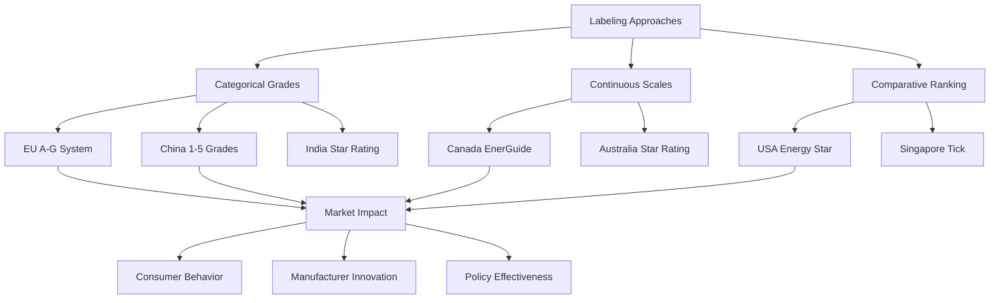

Energy labeling programs provide standardized consumer information about HVAC equipment performance, enabling informed purchasing decisions and driving market transformation toward higher-efficiency products. These mandatory and voluntary schemes vary significantly across jurisdictions in methodology, presentation format, and regulatory enforcement.

## Labeling Program Fundamentals

Energy labels translate technical performance metrics into consumer-accessible formats. The effectiveness of any labeling program depends on several physical and psychological factors:

**Information transmission efficiency:**

$$\eta_{label} = \frac{E_{decision}}{E_{total}}$$

where $E_{decision}$ represents energy impact from informed consumer choices and $E_{total}$ represents total energy consumption in the labeled equipment category.

Effective labels must balance technical accuracy with visual clarity, typically employing color-coded scales, comparative bars, or letter grades to communicate relative performance.

## Major International Labeling Schemes

### European Union Energy Label

The EU Energy Label (Regulation 2017/1369) employs an A-G scale with color gradation from green (efficient) to red (inefficient). The framework underwent revision in 2021 to eliminate A+, A++, and A+++ categories that had saturated the market.

**Key features:**
- Rescaled to maintain differentiation as technology improves
- QR codes linking to product databases (EPREL)
- Standardized pictograms for capacity, noise, and operational modes
- Mandatory for air conditioners, heat pumps, ventilation units, and local space heaters

The label displays annual energy consumption calculated using standardized test conditions per EN 14825 for air conditioners:

$$E_{annual} = E_{heating} + E_{cooling} + E_{standby}$$

where heating and cooling energy depend on climate zone-specific bin hours and equipment performance at each temperature.

### Chinese Energy Label

China's energy efficiency label system (GB 21455 for room air conditioners, GB 19577 for multi-split systems) uses a five-tier scale with Grade 1 representing highest efficiency. The China Standard Certification Center administers the program.

**Calculation basis for cooling:**

$$SEER_{China} = \frac{\sum_{i} Q_{c,i} \times h_i}{\sum_{i} P_{c,i} \times h_i}$$

The bin method applies weighted hours ($h_i$) across temperature intervals specific to Chinese climate zones, differing from European and North American calculation methods.

### Energy Star (United States)

Energy Star operates as a voluntary partnership program administered by EPA and DOE, identifying products exceeding minimum federal efficiency standards by significant margins (typically 10-20%).

For central air conditioners, Energy Star Version 6.1 requires:
- Split systems: SEER ≥ 15.0, EER ≥ 12.5
- Package systems: SEER ≥ 15.0, EER ≥ 12.0

The label displays estimated annual operating cost based on national average electricity rates and standardized usage patterns derived from residential energy consumption surveys.

### EnerGuide (Canada)

Canada's EnerGuide label presents a continuous scale showing the product's energy consumption relative to the range of similar models in the marketplace. Unlike letter-grade systems, this approach provides more granular performance differentiation.

**Energy consumption presentation:**

$$C_{display} = \frac{E_{annual,product} - E_{annual,min}}{E_{annual,max} - E_{annual,min}} \times 100$$

This normalized display allows consumers to assess relative position within the available product range.

## Comparative Analysis of Labeling Approaches

| Program | Region | Scale Type | Update Frequency | Test Standard Basis |
|---------|--------|------------|------------------|---------------------|
| EU Energy Label | European Union | A-G categorical | Every 5-10 years | EN 14825, EN 14511 |
| Energy Star | United States | Pass/fail threshold | Annual review | AHRI 210/240, DOE test procedures |
| EnerGuide | Canada | Continuous scale | 3-5 years | CSA C656, C746 |
| China Energy Label | China | 1-5 grades | 3-5 years | GB/T 7725, GB 21455 |
| India Star Rating | India | 1-5 stars | 2-3 years | IS 1391, BEE standards |
| MEPS (Australia) | Australia | Star rating + MEPS | Regular updates | AS/NZS 3823 series |

## Testing and Verification Requirements

All labeling programs require third-party testing to standardized protocols. The test conditions significantly impact reported performance:

**Cooling capacity correction for non-standard conditions:**

$$Q_{actual} = Q_{rated} \times \left(\frac{T_{wb,indoor} - 67}{80 - 67}\right) \times \left(\frac{95 - T_{db,outdoor}}{95 - 82}\right)$$

where temperatures are in °F for AHRI standards. European standards use 35°C outdoor, 27°C indoor dry-bulb, 19°C wet-bulb as cooling rating conditions.

Verification testing typically samples 5-10% of models annually, with enhanced surveillance for categories showing high non-compliance rates.

## Harmonization Challenges and Opportunities

Despite international trade in HVAC equipment, labeling programs remain fragmented due to:

1. **Climate zone differences**: Seasonal calculation methods must reflect local weather patterns
2. **Electricity pricing structures**: Cost estimates require region-specific utility rates
3. **Consumer research**: Cultural factors affect label comprehension and purchase influence
4. **Regulatory sovereignty**: Jurisdictions maintain independent standard-setting authority

ASHRAE Standard 206-2013 provides a framework for comparing whole-building performance across different rating systems, though equipment-level harmonization remains limited.

The International Partnership for Energy Efficiency Cooperation (IPEEC) coordinates voluntary alignment of test procedures and minimum efficiency requirements, reducing compliance burdens for multinational manufacturers.

## Future Developments

Emerging labeling enhancements include:

**Connected performance tracking**: Smart equipment reporting actual operating efficiency versus rated values, enabling "as-used" labels

**Carbon intensity metrics**: Direct CO₂ equivalent emissions based on regional electricity generation mix rather than energy consumption alone

**Lifecycle cost presentation**: Total cost of ownership including purchase price, installation, maintenance, and disposal

**Dynamic QR-linked data**: Real-time updates to comparative rankings as new models enter the market

These innovations address limitations of static labels while maintaining the fundamental goal of transforming markets toward higher-efficiency HVAC equipment.
