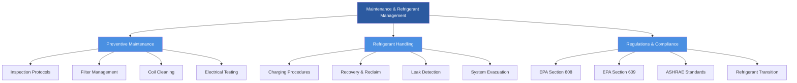

## Overview

Effective maintenance and refrigerant management form the foundation of reliable HVAC system operation. Proper preventive maintenance extends equipment life, maintains energy efficiency, and prevents costly breakdowns. Refrigerant management ensures regulatory compliance, environmental protection, and system performance while addressing the ongoing transition to low-GWP refrigerants.

This section integrates maintenance planning, execution strategies, refrigerant handling protocols, and regulatory requirements into a cohesive operational framework. The principles apply across residential, commercial, and industrial HVAC systems, with specific considerations for different refrigerant types and system configurations.

## Topic Structure

## Section Navigation

| Topic Area | Key Components | Standards |
|-----------|---------------|-----------|
| **Preventive Maintenance** | Inspection schedules, filter protocols, coil maintenance, electrical testing | ASHRAE 180, manufacturer specifications |
| **Refrigerant Procedures** | Charging methods, recovery techniques, evacuation standards, leak detection | EPA 608/609, ASHRAE 15 |
| **Regulatory Compliance** | Certification requirements, reporting, phase-out schedules, refrigerant tracking | EPA regulations, AIM Act |
| **System Optimization** | Performance monitoring, efficiency metrics, troubleshooting, documentation | ASHRAE 90.1, ISO 50001 |

## Maintenance Strategies

### Preventive Maintenance Framework

Preventive maintenance prevents failures through systematic inspection and component servicing. The optimal maintenance frequency depends on system type, operating hours, environmental conditions, and criticality.

**Maintenance intervals:**
- **Critical systems** (data centers, hospitals): Monthly inspections
- **Commercial systems**: Quarterly inspections minimum
- **Residential systems**: Annual inspections before cooling season
- **Light commercial**: Semi-annual inspections

Key maintenance activities include filter replacement or cleaning, condenser and evaporator coil cleaning, refrigerant charge verification, electrical connection inspection, condensate drain clearing, belt and bearing inspection, control calibration, and safety device testing.

### Filter Management

Filter maintenance directly impacts system efficiency, indoor air quality, and equipment longevity. Pressure drop across filters increases with particulate loading, reducing airflow and system capacity.

| Filter Type | MERV Rating | Replacement Interval | Pressure Drop (Clean) |
|------------|-------------|---------------------|----------------------|
| Fiberglass | 1-4 | 30 days | 0.05-0.10 in. w.c. |
| Pleated | 8-13 | 90 days | 0.15-0.30 in. w.c. |
| HEPA | 17-20 | 180 days | 0.50-1.50 in. w.c. |
| Electrostatic | 8-12 | Clean monthly | 0.20-0.40 in. w.c. |

Replace filters when pressure drop exceeds manufacturer recommendations, typically 1.5-2.0 times the clean filter value.

### Coil Maintenance

Heat exchanger fouling reduces heat transfer coefficient and increases pressure drop. Evaporator coil contamination particularly degrades dehumidification performance by reducing surface temperature differential.

Coil cleaning methods include chemical cleaning (acidic or alkaline detergents), steam cleaning for heavy contamination, compressed air for light dust, and ultrasonic cleaning for delicate fins. Always clean in the direction opposite to airflow to avoid forcing contaminants deeper into the coil.

## Refrigerant Management

### Regulatory Framework

EPA Section 608 governs refrigerant handling for stationary air conditioning and refrigeration equipment. Key requirements include technician certification (Type I, II, III, or Universal), mandatory recovery to specified levels, leak repair requirements for systems exceeding threshold leak rates, and refrigerant sales restrictions to certified technicians only.

**Recovery requirements (EPA 608):**

| System Type | Recovery Level (HVAC) | Recovery Level (Appliances) |
|------------|----------------------|----------------------------|
| High-pressure (>0 psig) | 0 psig | 4 in. Hg vacuum |
| Very high-pressure | 0 psig | 4 in. Hg vacuum |
| Low-pressure (<0 psig) | 25 mm Hg absolute | 25 mm Hg absolute |

### Refrigerant Charging

Proper charging ensures optimal efficiency and system capacity. Overcharging increases discharge pressure and power consumption while reducing capacity. Undercharging decreases evaporator temperature and capacity while potentially causing compressor damage from insufficient oil return.

**Charging methods:**
1. **Subcooling method** (TXV/EXV systems): Measure liquid line temperature and pressure, calculate subcooling, adjust to manufacturer specification (typically 8-15°F)
2. **Superheat method** (fixed orifice): Measure suction temperature and pressure, calculate superheat, adjust to specification (typically 10-15°F)
3. **Weigh-in method**: Most accurate for small systems with known charge quantity
4. **Approach method**: Used for air-cooled condensers, typically 10-20°F approach

### Leak Detection

Refrigerant leaks waste refrigerant, reduce system performance, and violate environmental regulations. Detection methods vary in sensitivity and application.

| Method | Sensitivity | Application | Advantages |
|--------|------------|-------------|-----------|
| Electronic detector | 0.1 oz/year | General purpose | Fast, quantitative |
| Ultrasonic detector | Variable | Large leaks | Non-refrigerant specific |
| Bubble solution | 1-2 oz/year | Suspected areas | Visual confirmation |
| UV dye | 0.25 oz/year | Persistent small leaks | Pinpoint location |
| Nitrogen pressure test | N/A | System integrity | Pre-charging verification |

EPA regulations require repair of leaks exceeding annual threshold rates: 30% for commercial refrigeration, 20% for industrial process refrigeration, and 10% for comfort cooling systems over 50 pounds of refrigerant.

### Recovery and Reclamation

Recovery removes refrigerant from a system into an external container. Reclamation purifies recovered refrigerant to ARI 700 standards, making it equivalent to new refrigerant.

**Recovery process:**
1. Connect recovery equipment to system access ports
2. Verify recovery cylinder is rated for refrigerant type
3. Ensure cylinder not more than 80% full by weight
4. Operate recovery machine to required vacuum level
5. Close valves and verify system holds vacuum
6. Document refrigerant type, quantity, and disposition

## Refrigerant Transition

The AIM Act mandates HFC phasedown, reducing production and consumption by 85% by 2036. This drives transition to low-GWP alternatives including HFOs (R-1234yf, R-1234ze), natural refrigerants (R-290, R-744), and HFC/HFO blends (R-454B, R-32).

**Refrigerant GWP comparison:**

| Refrigerant | Application | GWP | Status |
|------------|-------------|-----|--------|
| R-22 | Legacy residential AC | 1,810 | Phased out |
| R-410A | Current residential/light commercial | 2,088 | Phasedown |
| R-32 | Emerging residential | 675 | Transition |
| R-454B | Replacement for R-410A | 466 | Transition |
| R-1234yf | Mobile AC | 4 | Adopted |
| R-290 (propane) | Small systems | 3 | Niche |

System conversion requires evaluation of refrigerant compatibility, lubricant compatibility, pressure rating adequacy, and component material compatibility. Drop-in replacements rarely provide identical performance without system modifications.

## System Optimization

Performance monitoring identifies degradation before failure occurs. Key metrics include energy efficiency ratio (EER), seasonal energy efficiency ratio (SEER), coefficient of performance (COP), and condenser approach temperature.

Establish baseline performance measurements at commissioning, monitor trends over time, investigate deviations exceeding 10% from baseline, and document all maintenance activities and performance data.

Proper maintenance and refrigerant management reduce energy consumption by 15-30%, extend equipment life by 50-100%, decrease emergency repair costs by 40-60%, and ensure regulatory compliance while protecting environmental resources.

*Version: 3.0_comprehensive*

