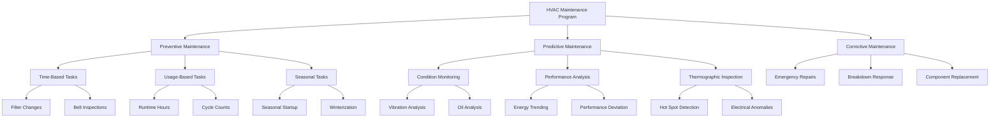

# HVAC Maintenance Management Strategies

Effective maintenance management is fundamental to HVAC system longevity, energy efficiency, and operational reliability. This guide examines the three primary maintenance approaches—preventive (PM), predictive (PdM), and corrective (CM)—with emphasis on cost optimization and implementation strategies aligned with ASHRAE Standards 180 and 100.

## Maintenance Program Hierarchy



## Maintenance Approach Comparison

| Criteria | Preventive Maintenance (PM) | Predictive Maintenance (PdM) | Corrective Maintenance (CM) |
|----------|----------------------------|------------------------------|----------------------------|
| **Timing** | Scheduled intervals | Condition-based triggers | After failure occurs |
| **Cost Structure** | Fixed, predictable | Variable, technology-dependent | Unpredictable, often highest |
| **Equipment Uptime** | 92-96% typical | 96-99% typical | 70-85% typical |
| **Labor Requirements** | Moderate, scheduled | Lower, targeted | High, urgent |
| **Parts Inventory** | Standard stock levels | Minimal, just-in-time | Emergency procurement |
| **Energy Efficiency Impact** | 5-10% improvement | 10-20% improvement | Degrades over time |
| **Implementation Complexity** | Low to moderate | High, requires instrumentation | Low |
| **ASHRAE Standard** | 180 compliant | 180 best practice | Non-compliant |
| **Typical Application** | All critical systems | High-value assets | Non-critical equipment |

## Preventive Maintenance Strategy

Preventive maintenance executes scheduled tasks at predetermined intervals to prevent failures before they occur. ASHRAE Standard 180 establishes minimum requirements for PM programs.

**Key Components:**

- **Filter replacement:** Monthly to quarterly based on pressure drop monitoring
- **Coil cleaning:** Annually or when approach temperature exceeds design by 3°F
- **Belt tension and alignment:** Quarterly inspection, adjustment as needed
- **Refrigerant charge verification:** Annually per ASHRAE Standard 15
- **Control calibration:** Semi-annual verification of sensors and actuators
- **Lubrication:** Per manufacturer specifications, typically quarterly to annually

**PM Frequency Optimization:**

The optimal PM interval balances maintenance costs against failure risk:

```
TC = (Cp × N/T) + (Cf × λ × T)
```

Where:
- TC = Total annual maintenance cost
- Cp = Cost per PM task
- N = Number of PM tasks per year
- T = Time between PM tasks (hours)
- Cf = Cost of failure event
- λ = Failure rate (failures per hour)

Optimal interval: **T_opt = √(2Cp / (Cf × λ))**

## Predictive Maintenance Strategy

Predictive maintenance uses condition monitoring to detect early failure indicators, enabling maintenance only when necessary. This approach maximizes equipment life while minimizing intervention frequency.

**Primary Technologies:**

1. **Vibration Analysis:** Detects bearing wear, imbalance, misalignment in rotating equipment
2. **Thermography:** Identifies electrical connection degradation, refrigerant flow issues
3. **Oil Analysis:** Monitors compressor wear metals, contamination, acid formation
4. **Ultrasonic Testing:** Detects steam trap failures, compressed air leaks, electrical arcing
5. **Performance Trending:** Tracks efficiency degradation through continuous monitoring

**PdM Cost-Benefit Analysis:**

The economic justification for PdM implementation:

```
NPV = Σ[(Savings_year - Cost_year) / (1 + r)^year]
```

Where:
- NPV = Net present value of PdM program
- Savings_year = Annual savings from reduced failures and energy
- Cost_year = Annual PdM technology and labor costs
- r = Discount rate

Typical PdM programs achieve positive NPV within 18-36 months for critical equipment exceeding 100 tons capacity.

**Condition-Based Thresholds:**

Establish action triggers based on measured parameters:

- **Vibration velocity:** >0.3 in/sec indicates bearing issues
- **Approach temperature:** >3°F above design requires coil service
- **Compressor superheat deviation:** ±5°F from design indicates charge or expansion valve issues
- **Motor current imbalance:** >10% between phases signals electrical problems

## Corrective Maintenance Strategy

Corrective maintenance addresses failures after occurrence. While appropriate for non-critical, low-cost equipment, it results in highest total lifecycle costs for mission-critical systems.

**Strategic Application:**

CM should be limited to equipment where failure consequences are minimal:

- **Acceptable for:** Single zones, redundant equipment, low replacement cost
- **Unacceptable for:** Critical process cooling, life safety systems, central plants

**Failure Impact Cost:**

```
FC = Cd + Cl + Ce + Cr
```

Where:
- FC = Total failure cost
- Cd = Direct repair costs (labor, parts, emergency charges)
- Cl = Lost productivity or production
- Ce = Excess energy consumption during degraded operation
- Cr = Reputation/customer satisfaction impact

For critical systems, FC typically exceeds scheduled maintenance costs by 3-8x.

## Maintenance Program Optimization

The optimal maintenance strategy combines all three approaches based on equipment criticality and economics:

**Total Maintenance Cost Model:**

```
TMC = (PM_cost × N_pm) + (PdM_cost × N_pdm) + (CM_cost × N_cm) + E_excess
```

Where:
- TMC = Total annual maintenance cost
- PM_cost, PdM_cost, CM_cost = Per-event costs for each strategy
- N_pm, N_pdm, N_cm = Number of events per year
- E_excess = Excess energy cost due to degraded performance

**Equipment Classification Matrix:**

| Criticality | Annual Operating Cost | Recommended Strategy |
|-------------|----------------------|---------------------|
| High | >$50,000 | PdM primary, PM backup |
| High | $10,000-$50,000 | PM primary, selected PdM |
| Medium | $5,000-$10,000 | PM per ASHRAE 180 |
| Low | <$5,000 | CM acceptable |

## ASHRAE Standards Compliance

**ASHRAE Standard 180-2018** establishes minimum maintenance requirements:

- Inspection and maintenance procedures documented
- Qualified personnel perform all tasks
- Records maintained for equipment life
- Seasonal startups include complete system verification
- Filter maintenance based on pressure drop, not calendar
- Refrigerant leak inspection per Standard 15

**ASHRAE Standard 100-2018** addresses energy-focused maintenance:

- Economizer functionality verification quarterly
- Control system accuracy verification annually
- Heat exchanger performance trending
- Refrigerant charge optimization
- Hydronic system balancing verification

## Implementation Recommendations

1. **Inventory and classify** all HVAC equipment by criticality and operating cost
2. **Establish baseline performance metrics** for trending and anomaly detection
3. **Develop task frequencies** using optimization formulas and manufacturer guidance
4. **Implement CMMS** (Computerized Maintenance Management System) for tracking and analysis
5. **Train personnel** on diagnostic techniques and safety procedures per ASHRAE Standard 180
6. **Review and adjust** program annually based on failure data and cost analysis

An optimized maintenance program reduces total lifecycle costs by 20-35% compared to reactive approaches while improving system reliability and energy efficiency.

