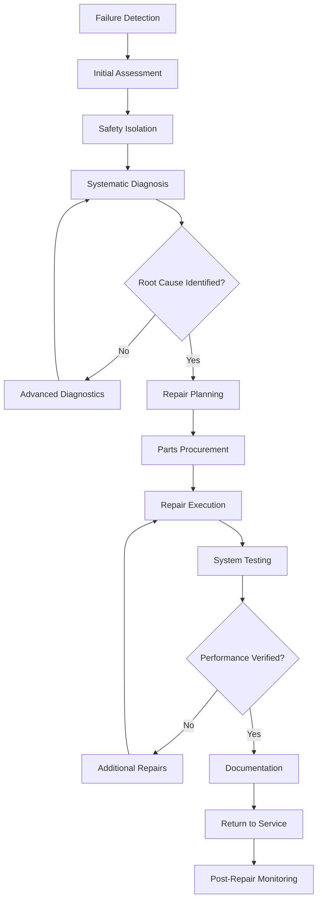

Corrective maintenance addresses equipment failures and performance degradation through systematic diagnosis, repair, and verification. Unlike preventive maintenance that anticipates problems, corrective maintenance responds to actual failures, requiring structured troubleshooting methodologies and comprehensive documentation to prevent recurrence.

## Corrective Maintenance Workflow

## Systematic Troubleshooting Methodology

### Step 1: Information Gathering

Collect operational data before disturbing the system:

- **Symptom documentation**: Record exact conditions when failure occurred
- **Operational parameters**: Measure temperatures, pressures, currents, voltages
- **System history**: Review maintenance records and previous failures
- **Environmental factors**: Note ambient conditions and load variations

### Step 2: Diagnostic Strategy

Apply structured analysis to isolate failure mechanisms:

1. **Verify the complaint**: Confirm the reported symptom is reproducible
2. **Check fundamentals**: Validate power supply, control settings, and refrigerant charge
3. **Apply physics principles**: Use thermodynamic relationships to identify anomalies
4. **Systematic elimination**: Test components from simplest to most complex
5. **Measure, don't assume**: Obtain quantitative data rather than relying on observations

### Step 3: Root Cause Analysis

Determine the underlying failure mechanism, not just the failed component:

- **Immediate cause**: What component failed?
- **Contributing factors**: What conditions accelerated failure?
- **Systemic issues**: Does a design flaw or operational pattern exist?

## Common HVAC Failures and Root Causes

| Failure Mode | Observable Symptoms | Common Root Causes | Diagnostic Tests |
|--------------|---------------------|-------------------|------------------|
| Compressor short cycling | Frequent starts, high discharge temp | Refrigerant overcharge, TXV malfunction, dirty condenser | Superheat/subcooling, head pressure analysis |
| Low airflow | High supply temp, frozen coil | Dirty filter, failed blower motor, duct restrictions | Static pressure measurement, motor amp draw |
| Refrigerant leak | Low suction pressure, reduced capacity | Vibration fatigue, corrosion, improper brazing | Electronic leak detection, pressure decay test |
| Control failure | Erratic operation, no response | Voltage spikes, moisture ingress, age degradation | Voltage testing, continuity checks, signal tracing |
| Compressor mechanical failure | Noise, no compression, high amp draw | Loss of lubrication, liquid slugging, bearing wear | Oil analysis, compression ratio, vibration analysis |
| Heat exchanger fouling | Reduced capacity, high pressure drop | Scale formation, biological growth, particulate | Approach temperature, water analysis, visual inspection |
| Motor failure | No operation, circuit breaker trip | Thermal overload, phase loss, contamination | Winding resistance, insulation testing, amp balance |

## Repair Standards and Procedures

### Refrigerant Circuit Repairs

Follow ASHRAE Standard 15 and EPA Section 608 requirements:

**Brazing procedures:**
- Purge with dry nitrogen at 2-3 psig during brazing
- Use proper filler metal: BCuP-5 (15% silver) for copper-to-copper joints
- Achieve minimum joint temperature of 1150°F for silver-bearing alloys
- Allow natural cooling; never quench with water

**System evacuation:**
- Triple evacuation method or deep vacuum to 500 microns
- Hold vacuum for 30 minutes; pressure rise indicates leaks
- Measure with electronic micron gauge, not compound gauge

**Refrigerant charging:**
- Weigh in liquid refrigerant for accuracy within ±2%
- Verify superheat (10-15°F) and subcooling (10-15°F) targets
- Allow 15-minute stabilization before final measurements

### Electrical Repairs

Comply with NEC Articles 440 (Air-Conditioning Equipment) and 430 (Motors):

- Use wire gauges per ampacity tables with temperature correction factors
- Torque terminal connections to manufacturer specifications (typically 20-30 in-lb)
- Verify proper grounding with resistance <1 ohm to ground
- Test motor winding insulation resistance: minimum 1 megohm at 500V DC

### Mechanical Repairs

Apply appropriate bearing, belt, and coupling standards:

**Belt drive systems:**
- Align sheaves within 0.5° angular and 0.125 in parallel tolerance
- Tension belts to 64th deflection per inch of span (1/64 in per 1 in span)
- Use matched belt sets; replace all belts simultaneously

**Bearing replacement:**
- Heat bearings to 200-250°F for thermal expansion during installation
- Never force bearings; press on inner race only
- Pack bearings to 1/3 to 1/2 capacity with appropriate NLGI Grade 2 lithium grease

## Testing and Verification

### Performance Testing Post-Repair

Verify system operation meets design specifications:

**Capacity verification:**
- Calculate actual capacity using Q = 1.08 × CFM × ΔT (sensible)
- Measure against nameplate capacity ±10% tolerance
- Document ambient conditions during testing

**Efficiency verification:**
- Measure input power and compare to nameplate
- Calculate EER = Capacity (BTU/hr) ÷ Power Input (W)
- Expected performance within 90-95% of rated EER at standard conditions

**Safety checks:**
- High pressure cutout: verify opens at 450-550 psig (R-410A systems)
- Low pressure cutout: verify opens at 50-70 psig
- Control sequence: confirm proper staging and interlocks

### Post-Repair Monitoring

Establish observation period to confirm repair effectiveness:

- **First 24 hours**: Monitor for immediate failure recurrence
- **First week**: Track operating parameters for stability
- **First month**: Analyze energy consumption trends
- **Three months**: Conduct follow-up inspection and performance test

## Documentation Requirements

### Repair Record Content

Maintain comprehensive records per ASHRAE Guideline 36:

**Mandatory information:**
- Date, time, and personnel involved in repair
- Failure symptoms and measured operating conditions
- Diagnostic steps performed and results obtained
- Root cause determination and supporting evidence
- Parts replaced with model numbers and serial numbers
- Refrigerant quantities added or recovered (EPA requirement)
- Test measurements verifying successful repair
- Follow-up actions required

**Failure trend analysis:**
- Track repeat failures by equipment type and component
- Calculate mean time between failures (MTBF)
- Identify systemic problems requiring design modifications

### Warranty and Compliance Documentation

Protect warranty coverage and demonstrate regulatory compliance:

- Photograph failed components before disposal
- Retain failed parts during warranty period
- Document EPA refrigerant handling compliance
- Record technician certifications (EPA 608, manufacturer training)

## Critical Success Factors

**Diagnostic accuracy**: Correct root cause identification prevents repeat failures and reduces total repair cost by 40-60% compared to component replacement without analysis.

**Parts quality**: OEM parts provide specified performance and maintain warranty coverage. Aftermarket components may reduce immediate cost but often result in premature failure.

**Verification testing**: Systems returned to service without performance verification experience 25-30% higher callback rates within the first month.

**Knowledge transfer**: Document lessons learned and update preventive maintenance procedures to address identified failure modes, reducing future corrective maintenance requirements by 15-20%.

Effective corrective maintenance transforms failures into reliability improvements through systematic analysis, proper repair execution, and organizational learning from each incident.

