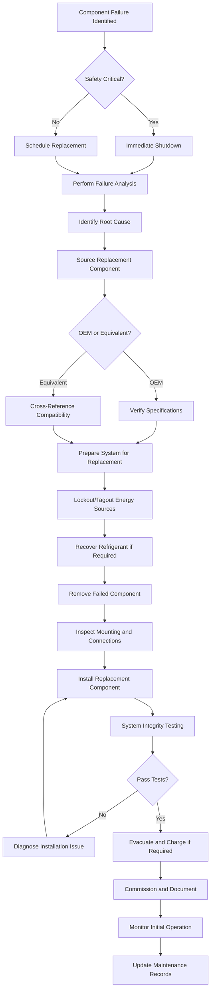

Component replacement constitutes the most critical aspect of corrective maintenance, requiring systematic procedures to ensure proper system functionality, safety, and longevity. Replacement activities range from routine components like filters and belts to major equipment such as compressors and motors.

## Replacement Decision Framework

Before initiating component replacement, evaluate the following criteria:

- **Failure analysis results** - Determine root cause to prevent repeat failures
- **Component age vs. design life** - Compare operational hours to manufacturer specifications
- **Cost-benefit analysis** - Replacement cost vs. continued repair attempts
- **System compatibility** - Verify replacement components match system requirements
- **Lead time availability** - Consider downtime impact and parts availability
- **Warranty implications** - Review manufacturer warranty terms and coverage

## Major Component Replacement Procedures

### Compressor Replacement

Compressor failure represents the highest cost component replacement in refrigeration systems. The procedure requires meticulous attention to contamination control and system cleanliness.

**Pre-Replacement Steps:**

1. Document operating conditions and failure symptoms
2. Perform oil analysis to determine contamination levels
3. Recover all refrigerant following EPA 608 regulations
4. Isolate compressor using service valves
5. Test insulation resistance of motor windings (>1 MΩ required)

**Replacement Procedure:**

1. Remove electrical connections and tag all wiring
2. Disconnect suction and discharge lines using proper brazing techniques
3. Remove mounting bolts and lift compressor using appropriate rigging
4. Install new compressor with vibration isolation
5. Braze connections using nitrogen purge (minimum 1 SCFH flow)
6. Install new filter drier and suction line filter
7. Evacuate system to 500 microns or lower
8. Charge refrigerant per manufacturer nameplate specifications

**Critical Considerations:**

- Replace filter drier and suction filter on all compressor changeouts
- Perform triple evacuation if burnout contamination detected
- Use POE or appropriate oil for system refrigerant type
- Verify voltage within ±10% of nameplate rating before startup

### Motor Replacement

Motor replacement applies to both direct-drive and belt-drive applications including fans, pumps, and blowers.

**Replacement Steps:**

1. Verify replacement motor specifications match original
2. Disconnect and lock out electrical power
3. Remove coupling or belt drive components
4. Unbolt motor from mounting base
5. Install replacement motor maintaining shaft alignment
6. For belt drives, adjust sheave position to achieve proper belt tension
7. Verify rotation direction before connecting to load
8. Check amp draw under load conditions

**Alignment Specifications:**

| Alignment Type | Tolerance | Measurement Method |
|----------------|-----------|-------------------|
| Angular offset | <0.5° | Dial indicator |
| Parallel offset | <0.003 in | Straightedge |
| Shaft end play | Per manufacturer | Feeler gauge |

### Valve Replacement

Valve replacement includes expansion valves, solenoid valves, ball valves, and control valves throughout the refrigeration circuit.

**Thermostatic Expansion Valve (TXV) Replacement:**

1. Recover refrigerant from affected circuit
2. Remove sensing bulb from suction line
3. Disconnect capillary tube (avoid kinking)
4. Unbraze valve body using wet rag cooling method
5. Install new valve with proper orientation
6. Secure sensing bulb at 4 or 8 o'clock position on suction line
7. Insulate bulb location to prevent ambient influence
8. Pressure test and evacuate before charging

**Electronic Expansion Valve (EEV) Replacement:**

1. Disconnect power and control signals
2. Recover refrigerant and remove valve body
3. Install new valve with flow direction arrow correct
4. Connect controller and verify wiring per schematic
5. Perform controller calibration routine
6. Set superheat target per system requirements (typically 8-12°F)

### Control Component Replacement

Control components include sensors, transmitters, actuators, and controllers that regulate system operation.

**Sensor Replacement and Calibration:**

| Sensor Type | Calibration Method | Acceptable Tolerance |
|-------------|-------------------|---------------------|
| Temperature RTD | Ice bath reference | ±0.5°F at 32°F |
| Pressure transducer | Dead weight tester | ±1% full scale |
| Humidity sensor | Saturated salt solution | ±2% RH |
| Flow switch | Manufacturer procedure | Per spec sheet |

**Actuator Replacement:**

1. Verify actuator stroke length matches valve requirement
2. Remove old actuator and mounting bracket
3. Install new actuator in de-energized position
4. Perform stroke test to verify full travel (typically 90° or 2-6 inches)
5. Calibrate minimum and maximum positions
6. Adjust linkage to eliminate dead band

## Common Replaceable Components Reference

| Component | Typical Service Life | Replacement Trigger | Critical Specifications |
|-----------|---------------------|---------------------|------------------------|
| Compressor | 10-15 years | Motor failure, valve damage | Tonnage, refrigerant, voltage |
| Condenser fan motor | 8-12 years | Bearing failure, winding short | HP, RPM, voltage, rotation |
| Filter drier | Annual or per contamination | Pressure drop >2 psi | Tonnage rating, connection size |
| Contactors | 5-7 years | Pitted contacts, coil failure | Voltage, FLA rating, poles |
| Capacitors | 3-5 years | Capacitance drift >±10% | µF rating, voltage rating |
| Belts | 1-3 years | Cracking, glazing, fraying | Belt profile, length |
| Bearings | 5-10 years | Noise, vibration, temperature | Bearing number, grease type |
| TXV | 10-15 years | Hunting, flooding, starving | Tonnage, refrigerant, bulb charge |

## Component Replacement Workflow

## Best Practices for Component Replacement

**Pre-Replacement Planning:**

- Obtain manufacturer installation instructions and torque specifications
- Verify replacement component model number against equipment schedules
- Assemble required tools, refrigerant recovery equipment, and safety gear
- Review electrical and refrigerant circuit diagrams
- Coordinate downtime with facility operations

**Installation Quality:**

- Use calibrated torque wrenches for critical connections
- Apply thread sealant or Teflon tape per manufacturer requirements (avoid refrigerant circuit exposure)
- Maintain nitrogen purge during all brazing operations to prevent oxide formation
- Use new gaskets, O-rings, and seals on all flanged connections
- Verify proper electrical phasing on three-phase motors

**Post-Replacement Verification:**

- Perform leak testing using electronic detector or bubble solution
- Measure voltage and amperage under operating conditions
- Verify control sequences function as designed
- Monitor operating pressures and temperatures for 24 hours minimum
- Document baseline performance data for future reference

**Documentation Requirements:**

- Record component model and serial numbers
- Photograph installation for reference
- Update equipment asset management database
- File warranty registration with manufacturer
- Add replacement to preventive maintenance schedule

## Manufacturer Replacement Guidelines

Always consult manufacturer technical bulletins for specific replacement procedures. Key manufacturer resources include:

- **Installation manuals** - Provide torque values, clearances, and piping requirements
- **Service bulletins** - Address known issues and updated procedures
- **Warranty requirements** - Specify approved replacement parts and installation methods
- **Commissioning checklists** - Ensure all startup steps completed
- **Troubleshooting guides** - Assist with post-replacement diagnostics

Replacement component selection must match original specifications unless engineering evaluation determines an upgrade provides measurable benefit without system incompatibility. Document all substitutions with technical justification.

## Safety Considerations

Component replacement involves multiple hazards requiring proper safety protocols:

- **Electrical hazards** - Verify lockout/tagout procedures followed
- **Refrigerant exposure** - Use recovery equipment and ventilation
- **Pressure hazards** - Relieve pressure before disconnecting lines
- **Hot surfaces** - Allow cooling period before contact
- **Heavy lifting** - Use proper rigging and personnel for loads >50 lbs
- **Confined spaces** - Follow entry procedures for mechanical rooms

Proper component replacement extends equipment life, maintains energy efficiency, and prevents cascading failures throughout the HVAC system.
