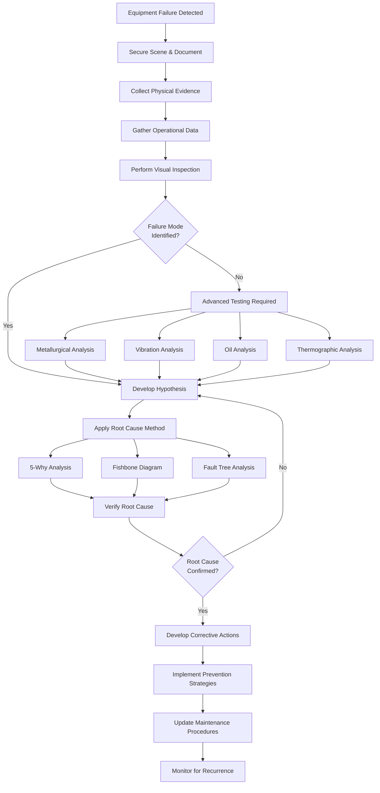

## Failure Analysis Fundamentals

Failure analysis is the systematic process of investigating equipment failures to determine the root cause, understand failure mechanisms, and implement corrective actions that prevent recurrence. This discipline combines physical examination, operational data analysis, and reliability engineering principles to maximize equipment uptime and extend service life.

The primary objectives are identifying failure modes, establishing causation chains, quantifying failure impacts, and developing prevention strategies. Proper failure analysis reduces repeat failures by 60-80% and provides critical data for predictive maintenance programs.

## Root Cause Analysis Methodologies

### 5-Why Analysis

The 5-Why technique traces causation by repeatedly asking "why" until reaching the fundamental root cause. This iterative questioning moves beyond symptomatic issues to underlying systemic problems.

**Example Application:**
1. Why did the compressor fail? Motor overheated and seized
2. Why did the motor overheat? Insufficient cooling airflow
3. Why was airflow insufficient? Condenser coil blocked with debris
4. Why was the coil blocked? No preventive maintenance performed
5. Why no maintenance? Inadequate maintenance scheduling system

### Fishbone (Ishikawa) Diagram

This cause-and-effect analysis organizes potential failure causes into categories: Methods, Machines, Materials, Measurements, Environment, and People. Each branch explores contributing factors systematically.

**Primary Categories:**
- **Equipment**: Design deficiencies, material defects, wear mechanisms
- **Operations**: Improper procedures, incorrect settings, inadequate training
- **Environment**: Temperature extremes, contamination, vibration exposure
- **Maintenance**: Deferred service, incorrect repairs, inadequate inspections

### Failure Mode and Effects Analysis (FMEA)

FMEA is a structured approach that evaluates potential failure modes, their effects, and criticality. The Risk Priority Number (RPN) quantifies risk as:

**RPN = Severity × Occurrence × Detection**

Where each factor is rated 1-10. RPN values above 100 require immediate corrective action.

## Common HVAC Failure Modes

| Component | Failure Mode | Primary Causes | Detection Methods | Prevention Strategy |
|-----------|--------------|----------------|-------------------|---------------------|
| Compressor | Mechanical seizure | Lubrication failure, liquid slugging, bearing wear | Vibration analysis, oil analysis, amperage monitoring | Oil quality testing, liquid line driers, suction accumulators |
| Compressor | Motor burnout | Electrical overload, single phasing, high discharge temp | Winding resistance testing, insulation testing | Voltage monitoring, thermal protection, proper sizing |
| Heat Exchanger | Refrigerant leak | Corrosion, erosion, mechanical stress, vibration | Leak detection, pressure testing, ultrasonic inspection | Water treatment, vibration isolation, stress relief |
| Expansion Valve | Hunting/instability | Improper superheat, contamination, bulb placement | Superheat measurement, pressure analysis | Proper installation, filtration, calibration |
| Fan Motor | Bearing failure | Inadequate lubrication, misalignment, contamination | Vibration analysis, temperature monitoring, noise | Scheduled lubrication, alignment procedures, filtration |
| Refrigerant Circuit | System contamination | Moisture, acid formation, particulate debris | Acid test, moisture measurement, filter-drier inspection | Proper evacuation, nitrogen purging, quality controls |
| Controls | Sensor drift | Calibration loss, environmental exposure, age | Calibration verification, comparative readings | Scheduled calibration, environmental protection |
| Electrical | Contact failure | Overheating, arcing, contamination, mechanical wear | Contact resistance, thermal imaging, visual inspection | Proper sizing, torque specifications, cleaning |

## Reliability Engineering Principles

### Bathtub Curve Analysis

Equipment failure rates follow three distinct phases:

1. **Infant Mortality (0-6 months)**: Manufacturing defects, installation errors, commissioning issues
2. **Useful Life (6 months-15 years)**: Random failures, stable failure rate, predictable maintenance needs
3. **Wear-Out (>15 years)**: Age-related degradation, material fatigue, component obsolescence

### Weibull Analysis

The Weibull distribution characterizes failure patterns using shape parameter β:
- **β < 1**: Decreasing failure rate (infant mortality)
- **β = 1**: Constant failure rate (random failures)
- **β > 1**: Increasing failure rate (wear-out)

This statistical approach predicts remaining useful life and optimizes replacement intervals.

### Mean Time Between Failures (MTBF)

MTBF = Total Operating Time / Number of Failures

For HVAC equipment, typical MTBF values:
- Compressors: 60,000-100,000 hours
- Fan motors: 40,000-80,000 hours
- Control boards: 50,000-100,000 hours

## Physical Evidence Collection

**Critical Documentation:**
- Operating conditions at failure (temperatures, pressures, electrical readings)
- Recent maintenance history and modifications
- Environmental conditions and contaminant exposure
- Witness statements from operators and technicians

**Physical Examination:**
- Component disassembly with photographic documentation
- Wear pattern analysis and dimensional measurements
- Material sampling for laboratory analysis
- Fracture surface examination for failure mechanism identification

## Corrective Action Development

Effective corrective actions address root causes through:

1. **Design modifications**: Component upgrades, specification changes, material substitutions
2. **Procedural improvements**: Enhanced maintenance procedures, operator training, inspection protocols
3. **System optimization**: Operating parameter adjustments, control logic refinement, load balancing
4. **Quality enhancements**: Supplier qualification, installation standards, commissioning verification

The corrective action effectiveness is measured through failure rate reduction and extended service intervals. A properly executed failure analysis with comprehensive corrective actions achieves 5-10 year improvement in component life expectancy.

## Components

- Root Cause Analysis
- Failure Mode Effects Analysis Fmea
- Metallurgical Analysis
- Compressor Failure Analysis
- Motor Failure Analysis
- Bearing Failure Analysis
- Corrosion Analysis
- Erosion Analysis
