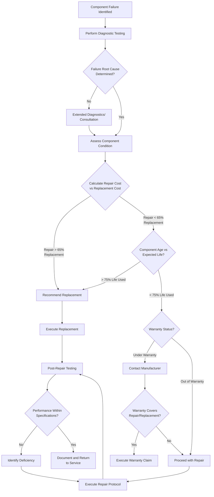

## Overview

System repairs constitute the corrective maintenance actions taken to restore failed or degraded HVAC components to operational status. Effective repair protocols require diagnostic accuracy, adherence to manufacturer specifications, and systematic evaluation of repair viability versus component replacement. This section addresses repair procedures for critical system elements and establishes decision criteria based on cost-effectiveness, remaining service life, and system reliability.

## Repair Decision Workflow

The following decision framework guides technicians through the evaluation process from failure identification to repair completion or component replacement.

## Refrigerant Leak Repair

Refrigerant leak repair requires adherence to EPA Section 608 regulations and manufacturer specifications. All leak repairs must be verified with leak detection methods achieving sensitivity of 0.5 oz/year minimum.

### Leak Location Methods

- **Electronic leak detection**: Heated diode or infrared sensors (0.1 oz/year sensitivity)
- **Fluorescent dye injection**: UV-reactive dye with minimum 24-hour circulation
- **Soap bubble testing**: For accessible fittings and joints
- **Nitrogen pressure testing**: Hold test at 150 psig for brazed joints, 300 psig for high-pressure systems

### Repair Procedures by Location

**Brazed Joint Leaks:**
1. Recover refrigerant to zero gauge pressure
2. Purge line segment with dry nitrogen at 2-5 psig during brazing
3. Clean joint area, remove oxide scale
4. Apply 15% silver alloy (BCuP-5) or manufacturer-specified filler metal
5. Heat joint uniformly to 1200-1400°F, apply filler metal to opposite side of heat source
6. Allow natural cooling, verify joint penetration
7. Pressure test with nitrogen to 1.5× operating pressure, hold 24 hours
8. Evacuate to 500 microns, charge, and leak test

**Mechanical Fitting Leaks:**
1. Isolate component with service valves if possible
2. Recover refrigerant from affected section
3. Disassemble fitting, inspect flare or compression surfaces
4. Replace damaged components (flare nuts, ferrules, O-rings)
5. Reassemble with manufacturer torque specifications
6. Pressure test and evacuate before charging

**Coil Tube Leaks (Minor):**
For pinhole leaks in tube segments not under high stress, epoxy repair compounds rated for refrigerant service may provide temporary repair. Permanent repair requires tube replacement or coil replacement per manufacturer guidelines.

## Duct System Repair and Sealing

Duct leakage directly impacts system efficiency and capacity. ASHRAE Standard 90.1 requires duct leakage testing for systems exceeding 5,000 CFM, with maximum allowable leakage of 6% of system airflow at operating pressure.

### Repair Classification

| Duct Issue | Repair Method | Material Standard | Application |
|-------------|---------------|-------------------|-------------|
| Longitudinal seam separation | Mastic + embedded mesh | UL 181A or 181B rated | All seam types |
| Transverse joint leakage | Mastic over joint, foil tape backup | ASTM C1071 mastic | Low-velocity systems < 2,500 fpm |
| Puncture/tear < 3 inches | Metal patch + mastic seal | 24-gauge minimum, same material as duct | Reinforced areas |
| Puncture/tear > 3 inches | Replace duct section | Per original specification | Structural integrity required |
| Connection boot separation | Drawband + mastic | Stainless steel band | Boot-to-collar connections |

### Sealing Protocol

1. **Surface preparation**: Remove dust, oil, and loose material with wire brush or solvent
2. **Mastic application**: Apply 1/8-inch minimum wet thickness, extend 2 inches beyond repair area
3. **Reinforcement**: Embed fiberglass mesh in mastic for gaps > 1/4 inch
4. **Curing**: Allow manufacturer-specified cure time before pressurization
5. **Verification**: Duct blaster testing or visual inspection under operating pressure

**Critical**: Cloth-backed duct tape is not an acceptable long-term repair material per SMACNA and ASHRAE research showing 80% failure rate within 5 years.

## Control System and Wiring Repair

Control failures account for approximately 35% of HVAC service calls. Systematic troubleshooting and repair of control circuits requires voltage mapping and sequence verification.

### Low-Voltage Control Repair (24V Systems)

**Common Failure Points:**
- Transformer secondary winding open (test with DMM, replace if < 22V output)
- Thermostat anticipator out of calibration (adjust to match control circuit amperage)
- Relay coil burnout (measure coil resistance, typical 200-500Ω for 24V coils)
- Wire termination oxidation (clean terminals, apply dielectric grease)

**Repair Sequence:**
1. De-energize system at disconnect
2. Measure transformer output voltage (22-28VAC acceptable)
3. Measure voltage at each control device with thermostat calling
4. Identify voltage drop location (> 1V drop indicates resistance issue)
5. Repair or replace faulty component
6. Verify control sequence operation through full cycle

### Line-Voltage Repair (120/240V Systems)

All line-voltage repairs must comply with NEC Article 440 for motor circuits. Use appropriately rated conductors per NEC Table 310.16 and overcurrent protection per equipment nameplate specifications.

**Contactor/Relay Repair:**
- Inspect contact surfaces for pitting or carbon buildup
- Replace contacts if pitting depth > 1/32 inch
- Verify coil voltage matches system voltage ±10%
- Test contact resistance when closed (should be < 0.1Ω)

## Repair vs. Replace Decision Criteria

The following table provides guidance for repair viability assessment based on component type, age, and failure mode.

| Component | Age Threshold | Repair Favorable If | Replace Favorable If |
|-----------|---------------|---------------------|----------------------|
| Compressor (residential) | 10 years | Age < 7 years, single failure, sealed system intact | Age > 10 years, burnout, or multiple failures |
| Compressor (commercial) | 15 years | Age < 12 years, mechanical failure, warranty coverage | Burnout, hermetic seal breach, efficiency < 80% rated |
| Air handler blower | 15 years | Motor replacement only, housing intact | Cabinet rust/damage, multiple bearing failures |
| Heat exchanger (furnace) | 20 years | Minor crack, segmented design allowing section replacement | Through-crack with CO risk, age > 15 years |
| Evaporator coil | 15 years | Repairable leak location, age < 10 years, no corrosion | Internal leak, corrosion damage, age > 12 years |
| Condenser coil | 15 years | External tube damage, repairable access | Internal gallery leak, fin deterioration > 30% |
| Expansion valve | 20 years | Repairable/cleanable, calibration drift | Stuck closed, internal debris, sensing bulb breach |
| Ductwork section | 30 years | Isolated damage, accessible location | Asbestos insulation, > 40% surface damage, crushed |

**Economic Analysis Formula:**

Repair Cost Ratio = (Repair Cost + Present Value of Reduced Reliability) / Replacement Cost

- Ratio < 0.50: Repair strongly favored
- Ratio 0.50-0.65: Repair acceptable, consider component age
- Ratio > 0.65: Replacement favored

Present value of reduced reliability estimated as 15% of replacement cost for components exceeding 75% of service life.

## Industry Standards and References

Repair procedures must align with:

- **ASHRAE Standard 180**: Standard Practice for Inspection and Maintenance of Commercial Building HVAC Systems
- **RSES Technical Manual**: Service Application Manual (SAM) for refrigerant systems
- **SMACNA HVAC Systems Duct Design**: Chapter 7, Duct Construction and Repair
- **EPA Section 608**: Refrigerant handling and leak repair requirements
- **NEC Article 440**: Air-conditioning and refrigerating equipment electrical standards
- **Manufacturer Service Bulletins**: Component-specific repair procedures and warranty requirements

## Documentation Requirements

All repairs require documentation including:

- Failure mode description and root cause analysis
- Repair procedure performed with materials specifications
- Pre-repair and post-repair performance measurements
- Warranty information and parts traceability
- Return-to-service authorization with test results

Comprehensive repair records enable trend analysis for reliability improvement and support warranty claims when applicable.
