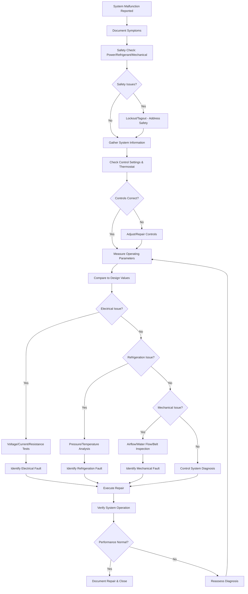

## Systematic Troubleshooting Methodology

Effective HVAC troubleshooting follows a structured approach that minimizes diagnostic time while maximizing accuracy. The methodology progresses from symptom identification through root cause analysis to verified repair.

### Five-Step Diagnostic Process

1. **Symptom Documentation**: Record all observed abnormalities including temperature deviations, pressure readings, unusual sounds, odors, and control responses. Gather operational history from users or building management systems.

2. **System Information Review**: Examine nameplate data, sequence of operations, wiring diagrams, and recent maintenance records. Verify design conditions and compare to actual operating parameters.

3. **Hypothesis Formation**: Develop potential failure theories based on symptoms and system knowledge. Prioritize hypotheses by likelihood, considering common failures and recent changes.

4. **Systematic Testing**: Execute diagnostic tests in logical sequence, starting with simple observations and progressing to instrumented measurements. Eliminate hypotheses methodically.

5. **Root Cause Verification**: Confirm the identified fault explains all symptoms. Verify the repair resolves the issue without creating secondary problems.

## Diagnostic Workflow

## Refrigeration System Troubleshooting

Refrigeration circuit diagnosis relies on pressure-temperature relationships and superheat/subcooling analysis. The refrigeration cycle provides definitive indicators of system health.

### Critical Measurements

- **Suction Pressure/Temperature**: Indicates evaporator performance and refrigerant charge
- **Discharge Pressure/Temperature**: Reflects condenser performance and compression efficiency
- **Superheat**: Suction temperature minus saturation temperature at suction pressure (target: 8-12°F for fixed orifice, 6-10°F for TXV)
- **Subcooling**: Saturation temperature at discharge pressure minus liquid line temperature (target: 10-15°F)

| Symptom | Probable Cause | Diagnostic Test | Remedy |
|---------|---------------|-----------------|--------|
| Low suction pressure, high superheat | Refrigerant undercharge | Check subcooling, inspect for leaks | Repair leak, recharge system |
| High suction pressure, low superheat | Refrigerant overcharge or TXV stuck open | Measure subcooling, check TXV | Recover excess charge, replace TXV |
| High discharge pressure | Condenser fouling, airflow restriction, overcharge | Check condenser airflow, measure subcooling | Clean coil, verify fan operation, adjust charge |
| Low discharge pressure | Compressor inefficiency, undercharge | Compression ratio, amp draw | Replace compressor, recharge |
| Normal pressures, inadequate capacity | Airflow restriction, coil fouling | Measure airflow, temperature split | Clean coils, verify blower operation |

## Electrical System Troubleshooting

Electrical diagnostics follow systematic voltage, current, and resistance measurements through the control circuit and power circuit. Always verify supply voltage before component testing.

### Electrical Diagnostic Sequence

1. Verify supply voltage at disconnect (208V/230V/460V ±10%)
2. Check control transformer output (24VAC ±10%)
3. Trace control circuit voltage through safety devices and thermostat
4. Measure contactor coil voltage during call for operation
5. Verify power circuit voltage at component terminals when energized
6. Measure operating current and compare to nameplate ratings
7. Perform resistance tests on de-energized components

| Symptom | Probable Cause | Diagnostic Test | Remedy |
|---------|---------------|-----------------|--------|
| No power to system | Disconnect open, breaker tripped, fuse blown | Voltage at disconnect, continuity check | Reset breaker, replace fuse, investigate overcurrent cause |
| Contactor not energizing | Control circuit open, thermostat fault, failed safety | Trace 24VAC through circuit | Replace failed component, reset safety |
| Compressor not starting | Failed contactor, motor overload, locked rotor | Voltage at compressor, measure resistance | Replace contactor, check motor windings, verify rotation |
| High amp draw | Voltage imbalance, failing motor, mechanical binding | Voltage between phases, measure all phases | Correct power supply, replace motor, free mechanical |
| Intermittent operation | Loose connection, failing component, thermal issue | Voltage drop test, thermal imaging | Tighten connections, replace intermittent component |

## Mechanical System Troubleshooting

Mechanical failures affect airflow and water flow, directly impacting heat transfer capacity. Mechanical diagnostics focus on fluid movement and component integrity.

| Symptom | Probable Cause | Diagnostic Test | Remedy |
|---------|---------------|-----------------|--------|
| Low airflow | Dirty filter, blower failure, duct restriction | Measure static pressure, verify RPM | Replace filter, check belt/motor, inspect ductwork |
| Excessive noise | Bearing failure, loose component, resonance | Identify source, vibration analysis | Replace bearings, secure components, add damping |
| Water flow issues | Pump failure, valve position, strainer blockage | Measure pressure differential, flow rate | Repair pump, position valves, clean strainer |
| Belt slipping | Incorrect tension, misalignment, worn belt | Check tension gauge, visual alignment | Adjust tension, align sheaves, replace belt |

## Control System Diagnostics

Modern HVAC controls integrate sensors, controllers, and actuators in complex sequences. Control troubleshooting verifies sensor accuracy, controller logic, and actuator response.

### Sensor Verification Protocol

- Compare sensor reading to calibrated instrument measurement (±2°F for temperature, ±3% for RH, ±2% for pressure)
- Verify sensor wiring integrity and proper termination
- Check sensor power supply voltage
- Replace sensors exceeding calibration tolerance

### Actuator Testing

- Verify control signal at actuator terminals (0-10VDC, 2-10VDC, 4-20mA)
- Confirm mechanical travel matches control signal
- Check for binding or obstruction in dampers and valves
- Measure actuator power consumption

## Industry Reference Standards

ASHRAE Guideline 3-2018 provides comprehensive commissioning and testing protocols. Manufacturer troubleshooting guides contain model-specific diagnostic procedures, fault codes, and component specifications. Reference these documents for equipment-specific diagnostics beyond general troubleshooting principles.
