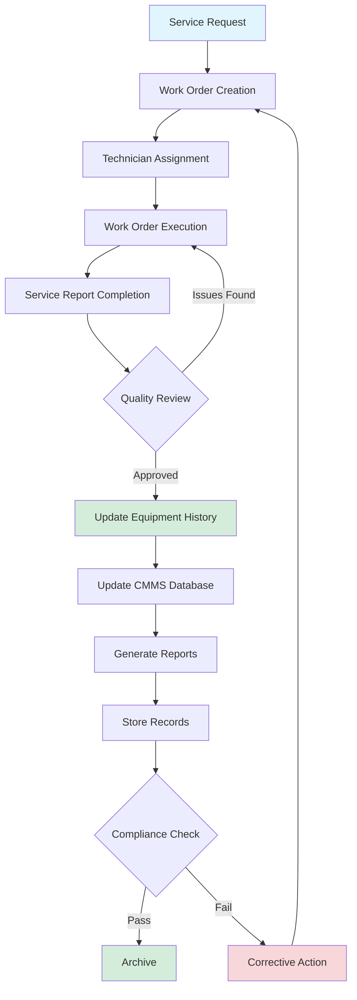

Effective maintenance documentation forms the operational backbone of any professional HVAC system management program. Proper record-keeping ensures regulatory compliance, optimizes equipment performance, supports warranty claims, and provides critical data for lifecycle cost analysis.

## Documentation Workflow

## Required Documentation Types

| Documentation Category | Retention Period | Regulatory Requirement | Update Frequency |
|------------------------|------------------|------------------------|------------------|
| Equipment Installation Records | Life of equipment | IMC, Local codes | At installation |
| Preventive Maintenance Reports | 3-7 years | ASHRAE 180, Building codes | Per PM schedule |
| Refrigerant Records (EPA 608) | 3 years minimum | EPA Section 608 | Each service event |
| Calibration Certificates | 1 year minimum | ASHRAE 180 | Annually |
| Service Work Orders | 3-7 years | Contract requirements | Each service call |
| Equipment Nameplate Data | Life of equipment | Manufacturer warranty | At installation |
| As-Built Drawings | Life of building | Building codes | Major modifications |
| Indoor Air Quality Reports | 3 years minimum | ASHRAE 62.1 | Per testing schedule |
| Emergency Repair Records | 5 years minimum | Insurance requirements | Each emergency event |
| Energy Performance Data | Ongoing | ASHRAE 90.1, Energy codes | Monthly/quarterly |

## Computerized Maintenance Management Systems

CMMS platforms centralize all maintenance activities into a single database, enabling data-driven decision making and automated compliance tracking.

### Core CMMS Functions

**Asset Management**
- Equipment inventory with unique identifiers
- Hierarchical location structure (campus → building → floor → room → equipment)
- Nameplate data storage (model, serial number, refrigerant type, capacity)
- Installation date and warranty expiration tracking
- Equipment criticality classification

**Work Order Management**
- Automated work order generation from PM schedules
- Priority-based dispatch (emergency, urgent, routine, deferred)
- Real-time technician assignment and status tracking
- Mobile access for field completion
- Estimated vs. actual labor hour tracking

**Preventive Maintenance Scheduling**
- Calendar-based triggers (weekly, monthly, quarterly, annually)
- Meter-based triggers (runtime hours, cycle counts)
- Condition-based triggers (vibration thresholds, temperature differentials)
- Automated task list generation with step-by-step procedures
- Parts requirement forecasting

**Inventory Control**
- Parts catalog linked to equipment records
- Automatic reorder point notifications
- Usage tracking by equipment and work order
- Vendor management and pricing history
- Critical spare parts identification

## Work Order Components

Every work order must contain standardized information to ensure traceability and completeness.

### Essential Work Order Fields

| Field | Purpose | Data Type |
|-------|---------|-----------|
| Work Order Number | Unique identifier | Auto-generated sequential |
| Equipment ID | Asset reference | Alphanumeric code |
| Date/Time Created | Request timestamp | Date/time stamp |
| Priority Level | Resource allocation | Emergency/Urgent/Routine |
| Technician Assigned | Accountability | Employee ID |
| Labor Hours | Cost tracking | Decimal hours |
| Parts Used | Inventory control | Part numbers and quantities |
| Problem Description | Issue documentation | Free text (required) |
| Work Performed | Service record | Free text (required) |
| Test Results | Performance verification | Measurements with units |
| Customer Signature | Acceptance | Digital/physical signature |

## Service Report Requirements

Service reports transform raw work order data into actionable documentation for stakeholders.

### Minimum Service Report Elements

1. **Equipment Identification**
   - Manufacturer, model, serial number
   - Location (building, floor, room)
   - Equipment tag or asset number

2. **System Operating Conditions**
   - Refrigerant pressures (suction, discharge)
   - Temperatures (return air, supply air, outdoor air)
   - Electrical measurements (voltage, amperage, phase imbalance)
   - Airflow measurements (CFM or m³/h)
   - Control setpoints and actual values

3. **Maintenance Activities Performed**
   - Filter replacement (size, MERV rating, condition)
   - Coil cleaning (method, chemical used)
   - Belt adjustments (tension measured, condition assessed)
   - Refrigerant added (type, amount, reason for loss)
   - Calibrations performed (sensor type, tolerance verified)

4. **Findings and Recommendations**
   - Deficiencies noted (criticality rating)
   - Safety hazards identified
   - Efficiency improvement opportunities
   - Estimated repair costs and urgency
   - Follow-up action items

5. **Compliance Documentation**
   - Refrigerant recovery amounts (EPA 608 requirement)
   - Leak detection results for systems >50 lbs charge
   - Water treatment test results for cooling towers
   - Filter efficiency ratings (ASHRAE 52.2 or ISO 16890)

## Equipment History Records

Equipment history provides trend analysis capability and supports data-driven replacement decisions.

### Critical Historical Data Points

**Performance Metrics Over Time**
- Energy consumption (kWh or therms)
- Efficiency ratio (EER, SEER, COP)
- Capacity degradation (% of nameplate)
- Runtime hours and start/stop cycles
- Temperature and humidity control accuracy

**Maintenance Cost Tracking**
- Labor costs by work order type
- Parts costs by component
- Emergency vs. planned maintenance ratio
- Cumulative maintenance cost vs. replacement cost
- Mean time between failures (MTBF)

**Reliability Indicators**
- Number of service calls per year
- Unplanned downtime hours
- Repeat failure frequency
- Warranty claim history
- Critical component replacement dates (compressor, heat exchanger)

## Regulatory Compliance Records

Specific HVAC maintenance activities require documentation to satisfy federal, state, and local regulations.

### EPA Section 608 Requirements

Refrigerant management records must include:
- Date of service
- Equipment identification
- Refrigerant type and amount added
- Refrigerant recovered and recycling method
- Technician certification number
- Leak rate calculation for systems >50 lbs charge
- Corrective action for leak rates exceeding thresholds (10% commercial, 35% industrial, 35% comfort cooling)

Facilities must maintain these records for **three years minimum** and make them available for EPA inspection.

### ASHRAE 180 Documentation Standards

ASHRAE Standard 180 (Standard Practice for Inspection and Maintenance of Commercial Building HVAC Systems) mandates specific documentation practices:
- PM task completion records with date and technician signature
- Deficiency reports with corrective action timelines
- System performance trending (temperature, pressure, efficiency)
- Indoor air quality monitoring results
- Calibration records for measurement and control devices

## Digital Documentation Best Practices

**Cloud-Based Storage**
- Automatic backups with geographic redundancy
- Version control for document revisions
- Access control by user role
- Mobile device compatibility for field access

**Data Standardization**
- Controlled vocabulary for problem codes
- Standardized units of measurement
- Dropdown menus to reduce free-text entry errors
- Required fields enforced at data entry

**Integration Capabilities**
- Building automation system (BAS) data import
- Energy management system (EMS) trending data
- Accounting system work order cost export
- Predictive maintenance algorithm data feeds

**Audit Trail**
- Who created/modified each record
- Timestamp for all data entries
- Change history for critical fields
- Electronic signature compliance (21 CFR Part 11 for regulated industries)

## Implementation Strategy

Transitioning to comprehensive maintenance documentation requires systematic planning:

1. **Inventory all existing equipment** with unique asset tags
2. **Digitize historical records** for baseline performance data
3. **Develop standardized procedures** for each equipment type
4. **Train technicians** on documentation requirements and mobile tools
5. **Establish KPIs** (work order completion rate, PM compliance percentage)
6. **Conduct regular audits** to ensure data quality and completeness
