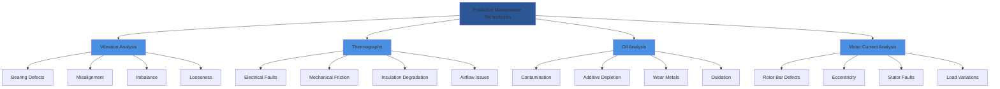

# Predictive Maintenance for HVAC Systems

Predictive maintenance (PdM) leverages condition monitoring technologies to detect incipient failures before they cause equipment downtime. Unlike reactive or preventive strategies, PdM uses physics-based measurements to assess actual equipment condition and predict remaining useful life.

## Vibration Analysis

Vibration monitoring detects mechanical degradation in rotating equipment including compressors, motors, pumps, and fans. Acceleration, velocity, and displacement measurements reveal bearing wear, misalignment, imbalance, and looseness.

### Vibration Severity Standards

ISO 10816 defines vibration severity zones for rotating machinery:

| Zone | RMS Velocity (mm/s) | Condition | Action |
|------|---------------------|-----------|--------|
| A | 0-2.3 | New/excellent | Normal operation |
| B | 2.3-7.1 | Acceptable | Monitor |
| C | 7.1-11.2 | Unsatisfactory | Plan repair |
| D | >11.2 | Unacceptable | Immediate shutdown |

The root-mean-square (RMS) velocity provides an overall severity indicator:

$$v_{RMS} = \sqrt{\frac{1}{T}\int_0^T v(t)^2 \, dt}$$

Where:
- $v_{RMS}$ = RMS velocity (mm/s)
- $v(t)$ = instantaneous velocity
- $T$ = measurement period

### Bearing Life Prediction

Rolling element bearing life follows the ISO 281 model:

$$L_{10} = \left(\frac{C}{P}\right)^p \times 10^6 \text{ revolutions}$$

Converting to operating hours:

$$L_{10h} = \frac{10^6}{60n} \left(\frac{C}{P}\right)^p$$

Where:
- $L_{10h}$ = rated life (hours at 90% reliability)
- $C$ = basic dynamic load rating (N)
- $P$ = equivalent dynamic load (N)
- $n$ = rotational speed (rpm)
- $p$ = 3 for ball bearings, 10/3 for roller bearings

## Infrared Thermography

Thermal imaging detects temperature anomalies indicating electrical faults, mechanical friction, insulation degradation, and airflow restrictions. Temperature differentials between phases or similar components reveal developing problems.

### Critical Temperature Differentials

| Component | ΔT Threshold | Indicated Fault |
|-----------|--------------|-----------------|
| Electrical connections | >10°C | High resistance contact |
| Motor windings (phase-to-phase) | >5°C | Imbalance, insulation failure |
| Compressor discharge | >15°C above design | Valve leakage, overcharge |
| Evaporator coil | >8°C across surface | Airflow restriction, frost |

Heat transfer analysis quantifies thermal anomalies:

$$Q = hA\Delta T$$

Where:
- $Q$ = heat transfer rate (W)
- $h$ = convective heat transfer coefficient (W/m²·K)
- $A$ = surface area (m²)
- $\Delta T$ = temperature difference (K)

## Oil Analysis

Lubricant condition monitoring detects contamination, additive depletion, and wear metal accumulation. Key parameters include viscosity, acid number, particle count, and elemental analysis.

### Oil Analysis Alarm Limits

| Parameter | Normal | Caution | Critical |
|-----------|--------|---------|----------|
| Viscosity change | ±10% | ±15% | ±25% |
| Total acid number (mg KOH/g) | <2.0 | 2.0-4.0 | >4.0 |
| Water content (ppm) | <200 | 200-500 | >500 |
| Iron (ppm) | <50 | 50-100 | >100 |
| Particle count ISO code | <16/14/11 | 16/14/11-18/16/13 | >18/16/13 |

## Motor Current Signature Analysis

Motor current signature analysis (MCSA) detects electrical and mechanical faults by analyzing current waveform harmonics and sidebands. Broken rotor bars, eccentricity, and bearing faults generate characteristic frequency components.

The slip frequency for induction motors:

$$f_{slip} = f_{line} \times \frac{n_{sync} - n_{actual}}{n_{sync}}$$

Where:
- $f_{slip}$ = slip frequency (Hz)
- $f_{line}$ = line frequency (Hz)
- $n_{sync}$ = synchronous speed (rpm)
- $n_{actual}$ = actual rotor speed (rpm)

Broken rotor bars produce sidebands at:

$$f_{sideband} = f_{line}(1 \pm 2sf)$$

Where $s$ = fractional slip.

## Condition Monitoring Technology Comparison

## Technology Selection Matrix

| Technology | Detection Capability | Cost | Complexity | Frequency | Equipment Applicability |
|------------|---------------------|------|------------|-----------|------------------------|
| Vibration analysis | Mechanical faults | High | High | Monthly | Rotating equipment |
| Thermography | Thermal/electrical faults | Medium | Low | Quarterly | All electrical/mechanical |
| Oil analysis | Lubricant/wear condition | Medium | Medium | Quarterly | Compressors, gearboxes |
| Motor current analysis | Motor/drive faults | Low | High | Continuous | Motors, VFDs |

## Implementation Strategy

1. **Baseline establishment**: Measure parameters during commissioning when equipment operates in known-good condition
2. **Trending analysis**: Track measurements over time to identify degradation rates
3. **Alarm threshold setting**: Establish caution and critical limits based on manufacturer data and ISO standards
4. **Action protocols**: Define response procedures for each alarm condition
5. **Remaining useful life estimation**: Use physics-based models to predict failure timing

## Economic Justification

The predictive maintenance cost-benefit relationship:

$$ROI = \frac{(C_{reactive} - C_{predictive})}{C_{predictive}} \times 100\%$$

Where:
- $C_{reactive}$ = annual reactive maintenance costs (downtime + repair)
- $C_{predictive}$ = annual PdM program costs (equipment + labor)

Studies demonstrate PdM reduces maintenance costs by 25-30% and eliminates 70-75% of unexpected equipment failures compared to reactive strategies.

Effective predictive maintenance programs transition maintenance decisions from time-based to condition-based, maximizing equipment availability while minimizing total lifecycle costs.

