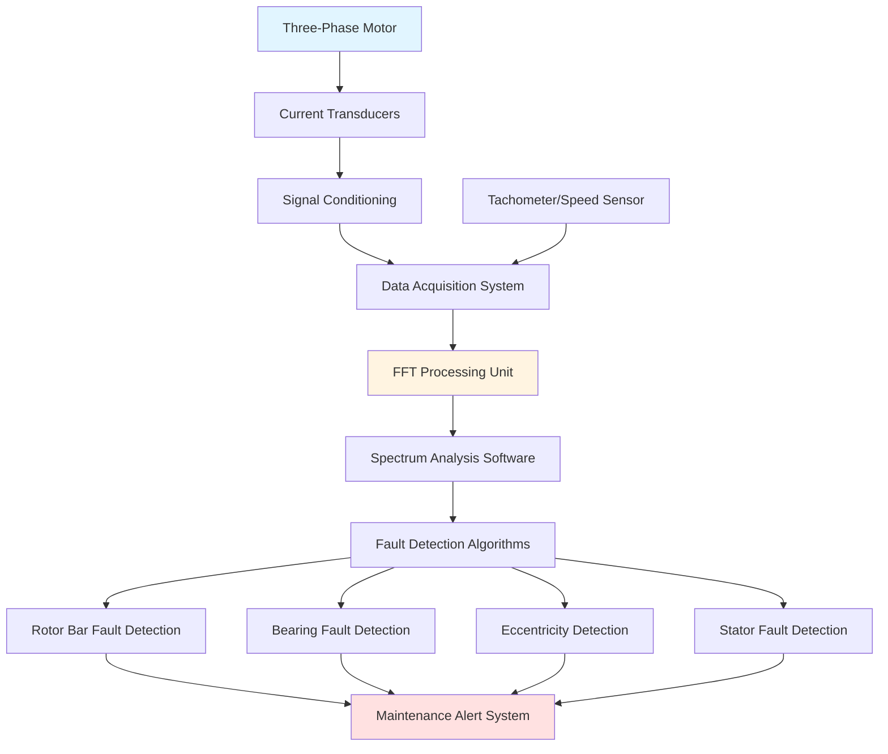

## Motor Current Signature Analysis Overview

Motor Current Signature Analysis (MCSA) is a non-invasive predictive maintenance technique that detects mechanical and electrical faults in HVAC motors by analyzing the spectral content of stator current. This method monitors motors under normal operating conditions without requiring shutdown, making it ideal for critical HVAC equipment including compressors, fans, and pumps.

MCSA works on the fundamental principle that mechanical and electrical faults modulate the stator current, producing characteristic frequency components in the current spectrum. Fast Fourier Transform (FFT) analysis converts the time-domain current signal into frequency-domain data, revealing fault-specific frequency patterns that are invisible in time-domain analysis.

## Physical Principles of Current Signature Analysis

Motor faults create asymmetries in the magnetic field distribution within the air gap. These asymmetries produce torque pulsations that modulate the stator current at specific frequencies related to rotor speed, pole count, and fault type. The relationship between mechanical faults and electrical signatures derives from the interaction between the rotating magnetic field and rotor irregularities.

When rotor bars crack or break, they create local variations in rotor resistance and inductance. These variations rotate with the rotor, inducing sideband frequencies in the stator current spectrum at:

f_rb = f_e × (1 ± 2sk)

Where f_e is electrical supply frequency, s is slip, and k = 1, 2, 3... The primary sidebands (k=1) occur at frequencies slightly above and below the line frequency, with amplitude proportional to fault severity.

## MCSA Measurement System Configuration

## Fault Frequency Patterns

| Fault Type | Characteristic Frequency | Formula | Typical Amplitude Threshold |
|------------|-------------------------|---------|---------------------------|
| Broken Rotor Bars | Line frequency sidebands | f_e(1 ± 2sk) | >-50 dB below fundamental |
| Bearing Outer Race | BPFO | n/2 × f_r × (1 + (d/D)cosθ) | >-40 dB above noise floor |
| Bearing Inner Race | BPFI | n/2 × f_r × (1 - (d/D)cosθ) | >-40 dB above noise floor |
| Bearing Ball/Roller | BSF | (D/2d) × f_r × [1 - (d/D)²cos²θ] | >-45 dB above noise floor |
| Static Eccentricity | Line frequency harmonics | f_e × (nR ± 1) | >-55 dB below fundamental |
| Dynamic Eccentricity | Rotor frequency sidebands | f_e ± k × f_r | >-55 dB below fundamental |
| Mixed Eccentricity | Combined pattern | f_e ± k × f_r and harmonics | >-50 dB below fundamental |

**Legend:** f_e = electrical frequency (Hz), f_r = rotor frequency (Hz), s = slip, n = number of rolling elements, d = rolling element diameter, D = pitch diameter, θ = contact angle, R = rotor slots, k = harmonic order

## Rotor Bar Fault Detection

Broken or cracked rotor bars are common in HVAC compressor motors subjected to frequent starts, thermal cycling, and mechanical stress. The detection methodology focuses on sideband amplitude relative to the fundamental component.

**Detection criteria:**
- Sideband amplitude >-50 dB below fundamental indicates developing fault
- Sideband amplitude >-40 dB indicates advanced fault requiring immediate attention
- Amplitude difference between upper and lower sidebands suggests load variation influence

The sideband amplitude increases with load, making measurements under rated load conditions critical. For variable-speed HVAC applications, analysis must account for slip variation across the operating range. IEEE 1415 recommends measurements at 50%, 75%, and 100% rated load for comprehensive assessment.

## Bearing Fault Detection

Bearing faults in HVAC motors produce current modulation at bearing characteristic frequencies. Each bearing geometry generates unique fault frequencies for outer race, inner race, and rolling element defects.

**Outer race defects** produce stationary fault frequencies since the outer race is fixed to the housing. These appear as distinct peaks in the current spectrum and are often the earliest detectable bearing fault.

**Inner race defects** create modulated signatures because the inner race rotates with the shaft. The resulting spectrum shows sidebands around the characteristic frequency spaced at rotor frequency.

**Rolling element defects** generate the highest frequency signatures and are typically the last failure mode before catastrophic bearing failure.

For HVAC applications, bearing faults often result from refrigerant contamination, inadequate lubrication, or misalignment. Early detection through MCSA enables intervention before compressor failure.

## Air Gap Eccentricity Detection

Air gap eccentricity occurs when the rotor does not maintain concentric position relative to the stator bore. This condition increases magnetic pull forces and can lead to stator-rotor contact.

**Static eccentricity** results from stator bore offset or rotor position error. The rotor maintains a fixed position offset, producing constant unbalanced magnetic pull. Current spectrum shows enhancement of specific line frequency harmonics.

**Dynamic eccentricity** results from bent shafts, bearing wear, or misalignment. The rotor whirls within the stator bore, creating sidebands around line frequency spaced at rotor frequency.

**Mixed eccentricity** combines both types and produces the most complex spectrum. Severity assessment requires analyzing both harmonic enhancement and sideband amplitude.

Eccentricity detection is particularly valuable for large HVAC chillers where shaft deflection from hydraulic forces can create dynamic eccentricity patterns.

## IEEE Standards for Motor Testing

IEEE 1415-2006 provides the standard framework for motor current signature analysis implementation. Key requirements include:

- Minimum sampling rate: 10 times the highest frequency of interest
- Frequency resolution: ≤0.01 Hz for rotor bar fault detection
- Measurement duration: minimum 10 seconds for stationary signals
- Current transducer accuracy: ±1% over measurement bandwidth
- Simultaneous three-phase measurement for comprehensive fault detection

The standard specifies baseline measurements at commissioning to establish normal operating signatures. Subsequent measurements compare against baseline data to identify developing faults. Trending analysis tracks fault progression over time, enabling optimal maintenance scheduling.

## Implementation in HVAC Systems

MCSA implementation on HVAC equipment requires consideration of variable loading conditions, VFD operation, and thermal effects. Variable frequency drives introduce harmonic content that can mask fault signatures, requiring specialized analysis algorithms that differentiate drive-related harmonics from fault frequencies.

For optimal results, measurements should occur during steady-state operation at consistent load levels. Thermal drift affects motor slip, shifting fault frequencies slightly. Modern MCSA systems compensate for these variations through adaptive algorithms that track fundamental frequency and adjust fault frequency bands accordingly.

Integration with building automation systems enables automated continuous monitoring of critical motors. Alert thresholds are established based on baseline data and manufacturer specifications, triggering maintenance notifications when fault signatures exceed acceptable levels.
