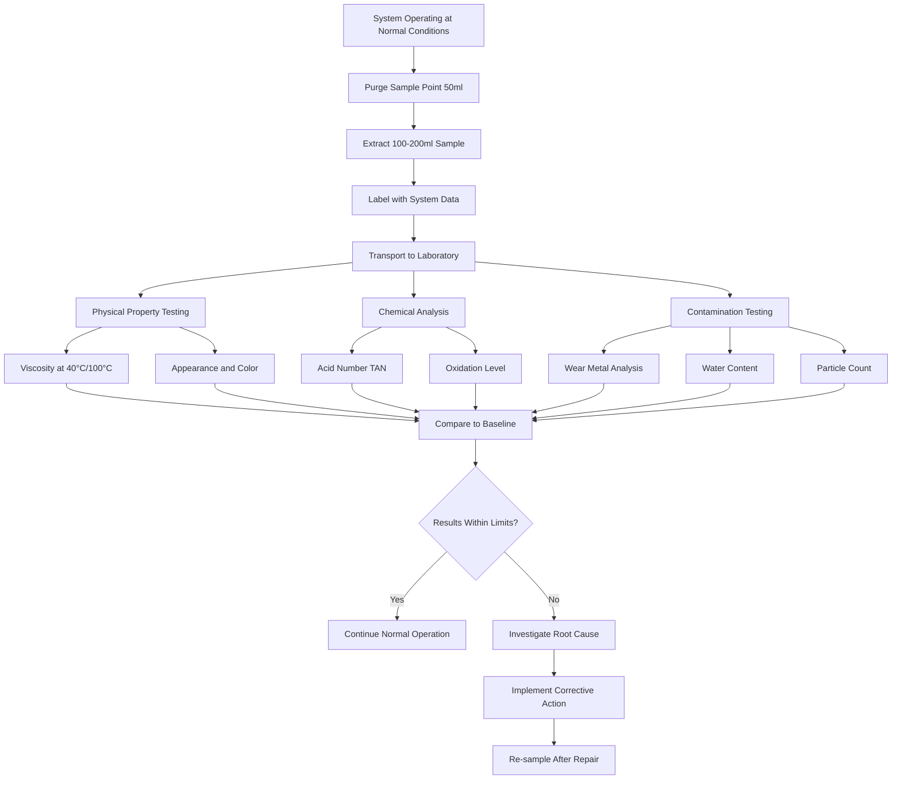

## Oil Analysis Fundamentals

Oil analysis provides early detection of compressor deterioration by monitoring lubricant properties and contaminants. Regular testing identifies bearing wear, refrigerant dilution, acidification, and contamination before catastrophic failure occurs. Modern oil analysis programs use multiple test parameters to establish baselines and trend deviations that indicate developing problems.

The physical and chemical properties of compressor oil change predictably as components wear and operating conditions degrade. Metal particles from bearing surfaces enter the oil stream, acidic compounds form from thermal breakdown and moisture contamination, and viscosity shifts occur from refrigerant mixing or oxidation. Systematic analysis quantifies these changes against established limits.

## Oil Sampling Procedures

Proper sampling technique ensures representative results. Extract samples from the compressor during normal operation at operating temperature to capture actual circulating conditions. Sample points should be located downstream of the oil separator and upstream of the oil filter to represent the bulk lubricant composition.

**Sampling Protocol:**

1. **Preparation:** Use clean, labeled bottles provided by the testing laboratory. ASTM D4057 specifies sampling containers and preservation methods.
2. **System Stabilization:** Operate the system for minimum 30 minutes at normal load before sampling.
3. **Sample Extraction:** Draw 100-200 ml directly from the sampling valve, purging the first 50 ml to clear stagnant oil.
4. **Container Filling:** Fill bottles completely to minimize air space and prevent oxidation during transport.
5. **Documentation:** Record compressor model, oil type, operating hours, refrigerant type, and sampling date.
6. **Transport:** Ship samples within 24 hours to prevent contamination and property changes.

Sample frequency depends on compressor criticality and size. Large industrial chillers warrant quarterly analysis, while smaller commercial units may require only annual or semi-annual testing.

## Viscosity Analysis

Viscosity measurement per ASTM D445 determines the oil's resistance to flow at specified temperatures. Compressor oils must maintain viscosity within narrow ranges to provide adequate lubrication film thickness at bearing surfaces while allowing efficient pumping.

Viscosity changes indicate:
- **Increase:** Oxidation, thermal degradation, or contamination with high-viscosity refrigerant
- **Decrease:** Refrigerant dilution, fuel contamination, or additive depletion

Test viscosity at 40°C and 100°C to calculate the viscosity index. Changes exceeding ±10% from baseline warrant investigation. Refrigerant-miscible polyolester (POE) oils show greater viscosity sensitivity to refrigerant dilution than mineral oils.

## Wear Metal Analysis

Spectrographic analysis per ASTM D6595 detects metallic particles in parts per million (ppm). Elevated metal concentrations indicate specific wear mechanisms at compressor components. Each metal signature corresponds to particular materials used in bearings, valve plates, and cylinder walls.

| Wear Metal | Source Component | Normal Limit (ppm) | Caution Level (ppm) | Critical Level (ppm) |
|------------|------------------|--------------------|--------------------|----------------------|
| Iron (Fe) | Cylinder walls, crankshaft | <50 | 50-100 | >100 |
| Copper (Cu) | Bearings, bushings | <30 | 30-75 | >75 |
| Aluminum (Al) | Pistons, thrust surfaces | <20 | 20-50 | >50 |
| Chromium (Cr) | Piston rings, valve plates | <10 | 10-25 | >25 |
| Lead (Pb) | Bearing overlay | <50 | 50-100 | >100 |
| Tin (Sn) | Bearing material | <30 | 30-75 | >75 |
| Silicon (Si) | Dirt, gasket material | <15 | 15-30 | >30 |

Sudden increases indicate accelerated wear requiring immediate investigation. Trend analysis reveals gradual deterioration patterns before reaching critical thresholds.

## Contamination Testing

### Water Content
Water contamination per ASTM D6304 (Karl Fischer method) causes acid formation, corrosion, and lubricant breakdown. POE oils are hygroscopic and tolerate only 200-300 ppm moisture. Mineral oils accept up to 500 ppm. Elevated water indicates refrigerant leaks, inadequate evacuation, or system moisture intrusion.

### Particle Count
ISO 4406 particle counting quantifies contamination particles at three size ranges: 4μm, 6μm, and 14μm. Results express cleanliness codes such as 18/16/13. Target cleanliness for compressors is ISO 18/16/13 or better. Deteriorating cleanliness indicates filter failure or internal component wear.

## Acid Number Testing

Total Acid Number (TAN) per ASTM D664 measures acidic compounds in mg KOH/g oil. Acids form from oxidation, thermal breakdown, and moisture reaction with refrigerants. POE oils naturally exhibit higher TAN (0.1-0.3 mg KOH/g) than mineral oils.

| Oil Type | New Oil TAN | Action Limit | Critical Limit |
|----------|-------------|--------------|----------------|
| Mineral Oil | <0.05 | 0.30 | >0.50 |
| Polyolester (POE) | 0.05-0.15 | 0.40 | >0.60 |
| Polyalkylene Glycol (PAG) | <0.10 | 0.35 | >0.55 |

Rising TAN indicates oxidation or contamination requiring oil change or system cleanup. Acidic conditions accelerate motor winding insulation breakdown and copper plating on bearing surfaces.

## Oxidation Analysis

FTIR (Fourier Transform Infrared Spectroscopy) per ASTM E2412 detects oxidation products, nitration, and sulfation. Oxidation increases with temperature, moisture, and air exposure. The oxidation number increases as oil degrades, typically reported as absorbance units per centimeter.

Oxidation limits:
- **New oil:** <5 Abs/cm
- **Action limit:** 20-25 Abs/cm
- **Critical:** >30 Abs/cm

High oxidation levels correlate with viscosity increase, acid formation, and varnish deposits that restrict oil passages and stick valves.

## Additive Depletion

Compressor oils contain anti-wear, anti-oxidant, and anti-foam additives. FTIR analysis tracks additive concentrations. Depletion indicates the oil has exhausted its protective chemistry and requires replacement regardless of other parameters. Zinc dialkyldithiophosphate (ZDDP) and other phosphorus compounds provide anti-wear protection in many formulations.

## Interpretation and Action

Establish baseline values from new oil and initial system samples. Track all parameters on control charts to identify trends. Single-parameter excursions require investigation, while multiple simultaneous deviations indicate severe problems demanding immediate action.

**Action Matrix:**
- **All parameters normal:** Continue routine sampling interval
- **Single parameter at caution level:** Increase sampling frequency, monitor trend
- **Multiple parameters at caution level:** Plan maintenance intervention
- **Any critical level:** Immediate shutdown and inspection recommended

Oil analysis effectiveness depends on consistent sampling, accurate baseline establishment, and prompt response to developing issues. Integration with vibration analysis and thermal imaging provides comprehensive predictive maintenance coverage.
