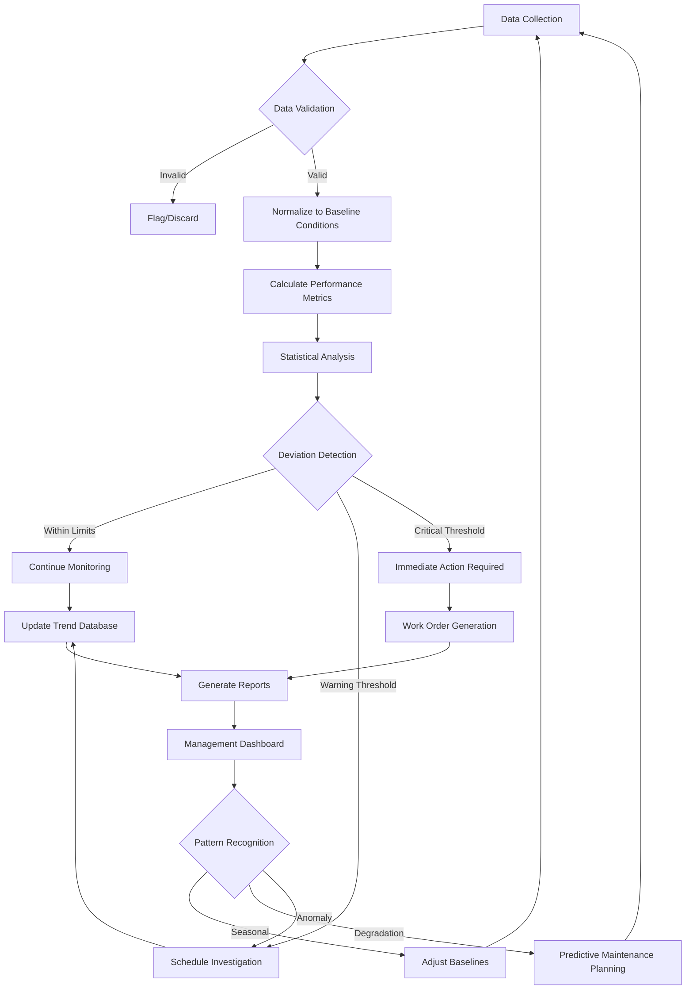

Performance trending transforms raw operational data into actionable intelligence by identifying patterns, deviations, and degradation before system failures occur. This systematic approach to monitoring key performance indicators enables data-driven maintenance decisions and optimizes energy efficiency throughout equipment lifecycles.

## Critical Performance Metrics

ASHRAE Guideline 14 establishes measurement protocols for tracking HVAC system performance against established baselines.

**Primary KPIs for chiller systems:**

- Energy Efficiency Ratio (EER): Cooling output (BTU/hr) ÷ electrical input (W)
- Coefficient of Performance (COP): Useful heating/cooling delivered ÷ energy consumed
- Kilowatts per ton (kW/ton): Power consumption normalized to cooling capacity
- Approach temperature: Difference between leaving chilled water and refrigerant evaporation temperature
- Lift: Difference between condensing and evaporating pressures

**Air handling unit metrics:**

- Static pressure efficiency: Actual airflow delivery versus fan power consumption
- Supply air temperature deviation: Variance from setpoint under load conditions
- Filter pressure drop trend: Rate of increase indicating contamination
- Outside air fraction: Verification of minimum ventilation compliance

## Baseline Establishment Methods

Accurate trending requires well-defined baseline conditions established during proper system operation.

| Method | Application | Data Requirements | Accuracy |
|--------|-------------|-------------------|----------|
| Manufacturer specifications | New equipment commissioning | Nameplate data, design conditions | ±5-10% |
| Historical averaging | Seasonal baseline creation | 12+ months operational data | ±3-5% |
| Regression analysis | Load-dependent performance | Temperature, humidity, load data | ±2-4% |
| Bin method analysis | Energy consumption profiling | Hourly data across weather bins | ±3-6% |
| Short-term monitoring | Rapid baseline generation | 2-4 weeks intensive monitoring | ±5-8% |

**Baseline validation criteria:**

1. Data collected during stable operation (no faults present)
2. Full range of operating conditions represented
3. Measurement uncertainty quantified and documented
4. Seasonal variations captured in multi-season datasets
5. Load conditions normalized to design parameters

## Trending Analysis Workflow

## Energy Consumption Trending

Energy trending reveals efficiency degradation and identifies optimization opportunities through systematic analysis of power consumption patterns.

**Key analysis components:**

- **Load normalization**: Adjust consumption data for varying loads using cooling degree days (CDD) or heating degree days (HDD)
- **Weather correlation**: Regression analysis relating energy use to outdoor temperature and humidity
- **Time-of-day profiling**: Identify operational inefficiencies during occupied versus unoccupied periods
- **Year-over-year comparison**: Account for weather normalization using TMY3 data

**Degradation indicators:**

Energy consumption increasing 10-15% annually indicates fouled heat exchangers, refrigerant charge issues, or mechanical wear. Consumption increasing 20%+ signals major system degradation requiring immediate investigation.

## Efficiency Trending Protocols

Efficiency metrics quantify the thermodynamic performance of refrigeration cycles and heat transfer processes.

**Chiller efficiency trending:**

Monitor kW/ton at multiple load points (25%, 50%, 75%, 100%) to detect compressor wear, fouling, or refrigerant migration. Centrifugal chillers typically operate at 0.50-0.70 kW/ton at design conditions. Performance degrading beyond 0.80 kW/ton indicates maintenance requirements.

**Part-load efficiency:**

Integrated Part Load Value (IPLV) weighted at 1% at 100% load, 42% at 75% load, 45% at 50% load, and 12% at 25% load per AHRI 550/590 provides realistic annual performance expectations.

## Capacity Trending Analysis

Capacity degradation tracking identifies declining heat transfer effectiveness before complete system failure.

**Measurement approach:**

Calculate delivered capacity using: Q = ṁ × cp × ΔT

Where:
- Q = heat transfer rate (BTU/hr)
- ṁ = mass flow rate (lb/hr)
- cp = specific heat (BTU/lb·°F)
- ΔT = temperature difference (°F)

**Capacity loss causes:**

- Fouled condenser/evaporator coils: 5-15% capacity reduction
- Refrigerant undercharge: 10-30% capacity loss
- Non-condensable gases: 5-10% capacity degradation
- Compressor valve leakage: 15-40% capacity decline

Track capacity at constant entering conditions to isolate equipment degradation from load variations.

## Advanced Trending Techniques

**Multivariate analysis:**

Simultaneous monitoring of temperature, pressure, flow, and power consumption reveals complex interactions. Principal component analysis identifies which variables contribute most significantly to performance changes.

**Alarm threshold development:**

- **Warning level**: 2 standard deviations from baseline mean
- **Action level**: 3 standard deviations or sustained warning level exceedance
- **Critical level**: 4+ standard deviations or rapid trend deterioration

**Predictive algorithms:**

Time-series forecasting using exponential smoothing or ARIMA models projects future performance based on historical trends, enabling proactive maintenance scheduling before efficiency falls below acceptable thresholds.

## Implementation Best Practices

**Data collection frequency:**

- Critical parameters: 1-5 minute intervals
- Standard metrics: 15-minute intervals
- Energy data: Hourly intervals minimum
- Manual readings: Weekly for validation

**Quality assurance:**

Validate sensor calibration quarterly. Cross-check trended data against utility bills and manual measurements. Implement automated outlier detection to flag sensor drift or communication failures.

**Documentation requirements:**

Maintain records of all maintenance activities, refrigerant additions, setpoint changes, and control modifications that affect baseline comparisons. Without this context, trending data becomes ambiguous.

Performance trending transforms reactive maintenance into predictive maintenance by quantifying system health through continuous monitoring. The investment in instrumentation and analysis infrastructure returns value through extended equipment life, reduced energy costs, and prevention of catastrophic failures.
