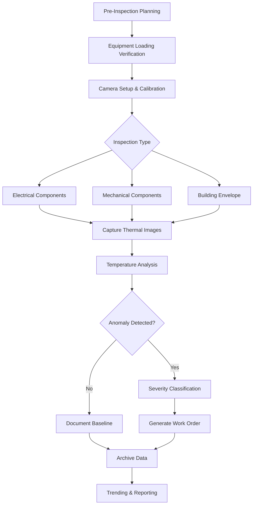

## Fundamentals of Infrared Thermography

Infrared thermography detects electromagnetic radiation in the 0.7-14 μm wavelength range emitted by objects based on their surface temperature. All objects above absolute zero emit infrared energy according to the Stefan-Boltzmann law (W = εσT⁴), where emitted power depends on emissivity (ε), Stefan-Boltzmann constant (σ), and absolute temperature (T).

Modern HVAC predictive maintenance programs rely on thermography to identify thermal anomalies before they escalate into equipment failures. This non-contact inspection method detects temperature variations caused by electrical resistance, mechanical friction, insulation degradation, or airflow restrictions.

## Temperature Measurement Principles

### Emissivity Fundamentals

Emissivity represents the ratio of radiation emitted by a real surface to that emitted by a perfect blackbody at the same temperature. This dimensionless value ranges from 0 to 1 and critically affects measurement accuracy.

**Common HVAC Surface Emissivities:**

| Material | Emissivity Range | Notes |
|----------|-----------------|-------|
| Oxidized copper | 0.60-0.78 | Aged refrigerant lines |
| Galvanized steel duct | 0.23-0.28 | Shiny new surfaces |
| Painted metal (non-metallic) | 0.90-0.95 | Most equipment housings |
| PVC insulation | 0.91-0.94 | Pipe insulation jackets |
| Concrete/masonry | 0.92-0.94 | Building envelope |
| Electrical tape (black) | 0.95 | Reference target |

Incorrect emissivity settings introduce significant measurement errors. A surface at 80°C with ε=0.95 will appear as 65°C if the camera is set to ε=0.60, creating a 15°C error that could mask critical thermal anomalies.

### Reflected Temperature Compensation

Low-emissivity surfaces reflect infrared radiation from surrounding objects. Set the camera's reflected temperature parameter to the ambient temperature of reflective sources. For indoor HVAC inspections, this typically equals room temperature (20-25°C). For outdoor equipment, measure sky temperature or use manufacturer guidelines.

## IR Inspection Workflow

## HVAC Electrical Inspections

Electrical thermal anomalies result from increased resistance at connections, creating localized heating proportional to I²R losses. Infrared inspections detect loose connections, corroded terminals, unbalanced loads, and overloaded circuits before insulation failure or arc flash events.

**Critical Electrical Targets:**
- Motor starter contacts and overload relays
- Variable frequency drive (VFD) connections and bus bars
- Compressor contactor terminals
- Disconnect switches and fuse holders
- Control transformer connections
- Power distribution panels feeding HVAC loads

Inspect electrical components under representative load conditions (minimum 40% of rated load). Temperature rise above ambient exceeding manufacturer specifications indicates developing problems. Phase-to-phase temperature differences exceeding 10°C in three-phase equipment suggest imbalanced loads or connection issues.

## Mechanical Component Thermography

Mechanical thermal anomalies indicate friction from misalignment, inadequate lubrication, bearing wear, or coupling problems. Elevated bearing temperatures relative to baseline measurements provide early warning of impending mechanical failure.

**Common Mechanical Thermal Anomalies:**

| Component | Normal ΔT Above Ambient | Warning ΔT | Critical ΔT | Probable Cause |
|-----------|------------------------|-----------|-------------|----------------|
| Motor bearings | 10-20°C | 30-40°C | >50°C | Wear, lubrication loss |
| Fan bearings | 15-25°C | 35-45°C | >55°C | Misalignment, overload |
| Belt drives | 5-15°C | 20-30°C | >40°C | Misalignment, tension |
| Pump couplings | 10-20°C | 30-40°C | >50°C | Misalignment, wear |
| Compressor bearings | 20-30°C | 40-55°C | >65°C | Refrigerant loss, wear |

Establish baseline thermal signatures during commissioning or after maintenance. Compare subsequent inspections against these baselines rather than relying solely on absolute temperature values. Trending temperature increases over time provides actionable failure prediction.

## Building Envelope Inspections

Thermal imaging reveals insulation defects, air infiltration paths, and moisture intrusion affecting HVAC load calculations and system efficiency. Inspect building envelopes during maximum indoor-outdoor temperature differential (>10°C) for optimal thermal contrast.

**Envelope Inspection Targets:**
- Roof insulation integrity and moisture presence
- Wall cavity insulation gaps and compression
- Window and door frame air leakage
- Penetrations for piping, ductwork, and conduits
- Thermal bridging at structural connections

Temperature patterns indicating missing insulation appear as warm areas (heating season) or cool areas (cooling season) relative to properly insulated sections. Moisture within insulation creates distinct thermal signatures due to water's high specific heat capacity affecting heat transfer rates.

## ASNT Thermography Standards

The American Society for Nondestructive Testing (ASNT) establishes certification standards for infrared thermographers through ASNT SNT-TC-1A guidelines. Three certification levels define competency:

**Level I:** Performs inspections under supervision following written procedures
**Level II:** Interprets results, writes procedures, provides Level I supervision
**Level III:** Establishes procedures, interprets codes/standards, provides Level II oversight

ASNT recommends formal training covering heat transfer fundamentals, IR camera operation, emissivity considerations, measurement errors, and application-specific inspection techniques. Building/infrastructure thermography requires different expertise than electrical or mechanical inspections due to varying emissivity challenges, measurement distances, and analysis criteria.

Follow ASNT CP-189 standard for thermography personnel qualification, ensuring inspectors possess sufficient knowledge of HVAC systems, electrical safety, and thermal analysis to produce reliable inspection results.

## Inspection Best Practices

**Environmental Considerations:**
- Avoid inspections during precipitation or high humidity affecting surface temperatures
- Shield cameras from direct sunlight causing sensor saturation
- Allow 15-20 minutes after rain for surface moisture evaporation
- Account for solar loading on outdoor equipment (inspect pre-dawn or evening)

**Documentation Requirements:**
- Capture visible and thermal images of each inspection point
- Record emissivity settings, distance, and ambient conditions
- Annotate images with equipment identification and temperature measurements
- Maintain inspection interval consistency for trending analysis

**Safety Protocols:**
- Maintain appropriate approach distances per NFPA 70E arc flash boundaries
- Never remove electrical enclosures or guards during energized inspections
- Use appropriate PPE for inspection environment
- Verify equipment grounding before thermal inspection

Schedule thermography inspections quarterly for critical equipment, semi-annually for general HVAC systems, and annually for building envelope assessments. More frequent inspections during warranty periods establish baseline thermal patterns for future comparison.
