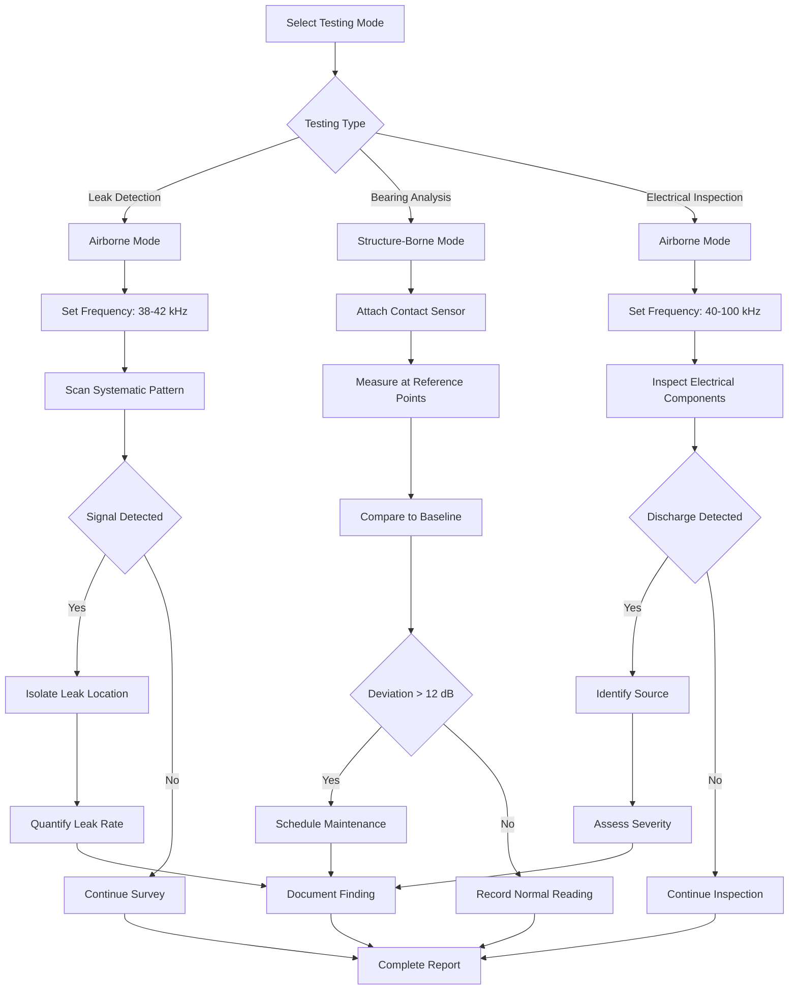

## Ultrasonic Testing Fundamentals

Ultrasonic testing utilizes high-frequency sound waves (20 kHz to 100 kHz) beyond human hearing range to detect mechanical defects, gas leaks, and electrical anomalies in HVAC systems. This non-invasive predictive maintenance technique identifies failures before catastrophic breakdowns occur.

**Physical Principle**: When pressurized gases escape through leaks, rotating components degrade, or electrical discharge occurs, turbulence generates ultrasonic frequencies. Ultrasonic detectors convert these signals to audible frequencies or visual displays for technician interpretation.

### Ultrasonic Testing Categories

**Airborne Ultrasound**: Detects sound waves transmitted through air from leaks, electrical discharge, and mechanical friction. Effective range: 3-15 meters depending on ambient noise.

**Structure-Borne Ultrasound**: Detects vibrations transmitted through solid components via contact sensors. Used for bearing analysis, valve integrity, and steam trap verification.

## Ultrasonic Frequency Ranges and Applications

| Application | Frequency Range | Detection Method | Typical Range |
|-------------|----------------|------------------|---------------|
| Compressed Air Leaks | 25-40 kHz | Airborne | 3-10 m |
| Refrigerant Leaks | 38-42 kHz | Airborne | 2-8 m |
| Steam Leaks | 30-50 kHz | Airborne | 5-15 m |
| Bearing Monitoring | 30-40 kHz | Structure-borne | Contact sensor |
| Electrical Discharge | 40-100 kHz | Airborne | 1-5 m |
| Valve Leak Detection | 35-45 kHz | Structure-borne | Contact sensor |

## Ultrasonic Leak Detection

### Compressed Air and Gas Leaks

Pressurized gas escaping through orifices creates turbulent flow with characteristic ultrasonic signatures. Detection sensitivity increases with pressure differential and leak size.

**Detection Threshold**: Leaks as small as 0.1 CFM at 100 psig are detectable. Background noise filtering essential in mechanical rooms.

**Quantification Method**: Decibel measurements correlate to leak rates using manufacturer algorithms. Typical relationship:
- 70 dB = 1 CFM leak at 100 psig
- 80 dB = 3 CFM leak at 100 psig
- 90 dB = 10 CFM leak at 100 psig

### Refrigerant Leak Detection

Ultrasonic detection complements electronic refrigerant sniffers by pinpointing leak locations in noisy environments where audible hissing masks small leaks.

**Advantages over Electronic Detection**:
- No refrigerant-specific sensors required
- Immediate response time
- Effective with all refrigerant types
- Unaffected by air currents

**Procedure**: Scan suspected areas in systematic grid pattern at 1-2 meters distance. Isolate leak using proximity and directional sensor aiming.

## Bearing Condition Monitoring

### Ultrasonic Signatures of Bearing Degradation

Rolling element bearings generate ultrasonic frequencies from metal-to-metal contact. Degradation progression produces distinct frequency changes detectable before vibration analysis reveals issues.

**Detection Timeline**: Ultrasonic testing detects bearing defects 8-12 weeks before conventional vibration analysis shows problems.

| Bearing Condition | Ultrasonic Level | Characteristics |
|-------------------|------------------|-----------------|
| New/Excellent | Baseline + 0-8 dB | Smooth, consistent signal |
| Good | Baseline + 8-16 dB | Minor fluctuations |
| Fair | Baseline + 16-35 dB | Intermittent spikes |
| Poor | Baseline + 35-50 dB | Continuous elevated signal |
| Failed | Baseline + >50 dB | Erratic, high-amplitude signal |

### Monitoring Procedure

1. **Establish Baseline**: Measure new or known-good bearing ultrasonic levels at consistent contact points
2. **Regular Monitoring**: Monthly measurements at identical locations using contact sensor
3. **Trend Analysis**: Plot decibel readings over time; >12 dB increase indicates developing problem
4. **Lubrication Verification**: Monitor ultrasonic levels during lubrication; proper lubrication reduces levels by 8-12 dB

## Electrical Inspection Applications

### Corona and Arcing Detection

Electrical discharge produces ultrasonic frequencies from ionized air molecules. Detectable phenomena include:

- **Corona Discharge**: 40-70 kHz, continuous signal indicating insulation breakdown
- **Arcing**: 60-100 kHz, intermittent signal indicating loose connections or tracking
- **Tracking**: 50-80 kHz, progressive insulation failure

**Critical Inspection Points**: Motor terminals, contactors, disconnect switches, capacitor connections, and high-voltage wiring.

## Ultrasonic Testing Workflow

## ASNT Standards and Best Practices

The American Society for Nondestructive Testing (ASNT) provides guidelines for ultrasonic testing personnel qualification and procedures:

**SNT-TC-1A Recommended Practice**: Establishes three certification levels based on training and experience requirements for ultrasonic testing technicians.

**Best Practices**:
- Calibrate instruments using manufacturer-specified methods before each use
- Document ambient conditions affecting readings (temperature, humidity, background noise)
- Establish equipment-specific baselines for bearing monitoring programs
- Use consistent measurement points for trending analysis
- Record decibel levels, frequency settings, and environmental conditions
- Implement systematic inspection routes for leak surveys

## Integration with Maintenance Programs

Ultrasonic testing complements other predictive technologies:

- **Vibration Analysis**: Ultrasound detects early bearing degradation; vibration confirms advanced wear
- **Infrared Thermography**: Combined electrical inspections identify heating and discharge simultaneously
- **Oil Analysis**: Correlate ultrasonic bearing readings with wear particle trends

**Recommended Inspection Frequencies**:
- Critical Equipment Bearings: Weekly to monthly
- Compressed Air Systems: Quarterly leak surveys
- Refrigeration Systems: Semi-annual leak detection
- Electrical Systems: Annual corona/arcing inspection

## Measurement Accuracy and Limitations

**Accuracy Factors**:
- Background noise interference in high-noise environments
- Operator experience in signal interpretation
- Distance from source affects intensity measurements
- Ambient temperature extremes impact sensor performance

**Limitations**:
- Cannot detect leaks in vacuum systems
- Requires line-of-sight for airborne detection
- Structure-borne testing requires accessible contact points
- Quantification algorithms are manufacturer-specific estimates

Ultrasonic testing provides cost-effective early warning of HVAC system degradation when implemented systematically within comprehensive predictive maintenance programs.
