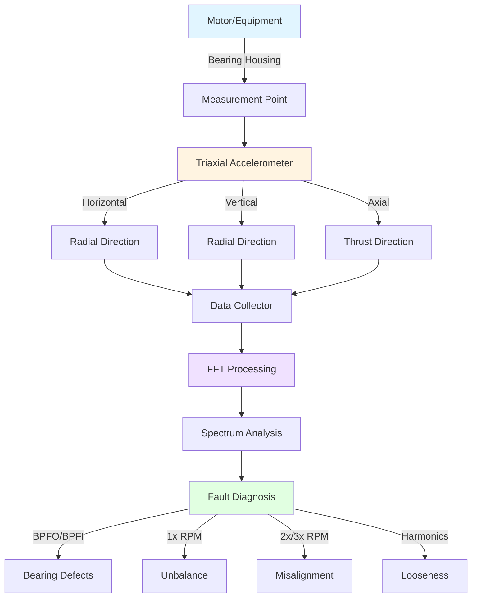

## Fundamentals of Vibration Analysis

Vibration analysis provides early detection of mechanical faults in HVAC rotating equipment before catastrophic failure occurs. The technique measures oscillatory motion of machinery components and analyzes frequency content to identify specific fault conditions.

### Measurement Parameters

Vibration manifests in three interrelated parameters, each suited to different frequency ranges:

**Displacement (mils or μm)** quantifies the actual physical movement of components. This measurement proves most effective for low-frequency vibrations (below 600 CPM) typical of severe unbalance or looseness in large, slow-speed equipment. The relationship between displacement and other parameters follows:

**Velocity (in/s or mm/s)** represents the rate of displacement change and provides the most direct correlation to vibration severity across the broadest frequency range (600-60,000 CPM). RMS velocity serves as the primary parameter in ISO standards because it correlates well with the destructive energy transmitted through machinery.

**Acceleration (g or m/s²)** measures the rate of velocity change, becoming most sensitive at high frequencies (above 60,000 CPM). Acceleration measurements excel at detecting bearing defects, gear mesh problems, and cavitation because these faults generate high-frequency impacts.

The mathematical relationships between these parameters for sinusoidal motion:

- Velocity (V) = 2πfD, where f = frequency (Hz), D = displacement
- Acceleration (A) = 2πfV = (2πf)²D

## FFT Analysis Methodology

Fast Fourier Transform (FFT) analysis converts time-domain vibration signals into frequency-domain spectra, revealing the specific frequencies present in complex vibration signatures.

### FFT Parameters

Critical FFT settings affect measurement quality:

- **Frequency Range (Fmax)**: Set to 2.5-3 times the highest expected fault frequency
- **Lines of Resolution**: Higher values (1600-3200 lines) provide finer frequency discrimination
- **Spectral Resolution (Δf)**: Equals Fmax divided by number of lines; determines ability to separate adjacent peaks
- **Averaging**: Multiple FFT averages reduce random noise; use 4-8 averages for steady-state machinery

### Spectral Analysis Patterns

Distinct spectral patterns indicate specific mechanical faults:

**Unbalance** produces a dominant peak at 1× running speed (RPM/60 Hz) with primarily radial vibration. Severity increases with the square of speed.

**Misalignment** generates strong 2× and 3× running speed harmonics, often with significant axial vibration. Angular misalignment emphasizes axial direction; parallel misalignment shows radial vibration.

**Looseness** creates a broad spectrum with multiple harmonics extending to 10× or higher running speed, accompanied by directional variations.

## Bearing Defect Frequency Calculations

Rolling element bearings generate discrete frequencies when surface defects impact rolling elements. Calculate these characteristic frequencies:

**Ball Pass Frequency Outer Race (BPFO)**:
BPFO = (N × RPM / 60) × (1 - (Bd/Pd) × cos φ) / 2

**Ball Pass Frequency Inner Race (BPFI)**:
BPFI = (N × RPM / 60) × (1 + (Bd/Pd) × cos φ) / 2

**Ball Spin Frequency (BSF)**:
BSF = (Pd × RPM / 60) × (1 - (Bd/Pd)² × cos² φ) / (2 × Bd)

**Fundamental Train Frequency (FTF)**:
FTF = (RPM / 60) × (1 - (Bd/Pd) × cos φ) / 2

Where:
- N = number of rolling elements
- Bd = ball diameter
- Pd = pitch diameter
- φ = contact angle
- RPM = shaft speed

Early bearing defects appear as low-amplitude peaks at these frequencies with high-frequency sidebands spaced at FTF intervals.

## Vibration Severity Standards

ISO 10816 establishes vibration severity zones for different machine types and foundations:

### ISO 10816 Classification (RMS Velocity)

| Zone | Severity | Range (mm/s) | Condition | Action Required |
|------|----------|--------------|-----------|-----------------|
| A | Good | 0-2.8 | Newly commissioned machinery | Continue monitoring |
| B | Acceptable | 2.8-7.1 | Unrestricted long-term operation | Routine monitoring |
| C | Unsatisfactory | 7.1-18 | Limited operation period | Schedule repair |
| D | Unacceptable | >18 | Machinery damage risk | Immediate shutdown |

Note: Values shown for rigid foundation machines, Group 2 (medium machines, 15-75 kW, 300-15,000 RPM). Adjust for specific equipment classification.

### HVAC Equipment-Specific Guidelines

| Equipment Type | Alert Level (mm/s RMS) | Fault Level (mm/s RMS) |
|----------------|------------------------|------------------------|
| Centrifugal Chillers | 4.5 | 11.0 |
| Screw Compressors | 7.0 | 15.0 |
| Cooling Tower Fans | 5.0 | 12.0 |
| Air Handling Units | 3.5 | 8.0 |
| Circulation Pumps | 4.0 | 10.0 |

## Measurement Setup and Technique

Proper sensor placement and data collection ensure reliable vibration analysis:

### Measurement Best Practices

1. **Sensor Mounting**: Use stud mounting for frequencies above 5 kHz; magnetic base acceptable below 2 kHz
2. **Surface Preparation**: Clean, flat, smooth mounting surfaces ensure proper coupling
3. **Location Consistency**: Measure at identical points each session to enable trending
4. **Three-Axis Data**: Collect horizontal, vertical, and axial data at each bearing
5. **Running Conditions**: Measure at normal operating temperature and load
6. **Documentation**: Record RPM, load, temperature, and operational notes

## Trending and Alarm Management

Effective vibration programs establish baseline measurements and track parameter changes over time. Set alarm levels at 50% of ISO zone boundaries to provide early warning. Calculate rate-of-change in addition to absolute levels; rapid increases indicate developing faults requiring immediate attention.

Trending reveals degradation patterns:
- Gradual linear increase suggests wear progression
- Exponential increase indicates imminent failure
- Step changes point to sudden damage events
- Frequency shifts reveal changing fault characteristics

## Standards and References

- **ISO 10816-1**: Mechanical vibration evaluation by measurements on non-rotating parts
- **ISO 10816-3**: Industrial machines with nominal power above 15 kW and nominal speeds 120-15,000 RPM
- **ISO 20816**: Updated standard replacing ISO 10816 series
- **ASHRAE Guideline 33**: Documenting Indoor Airflow and Temperature/Humidity Conditions (includes vibration limits)
