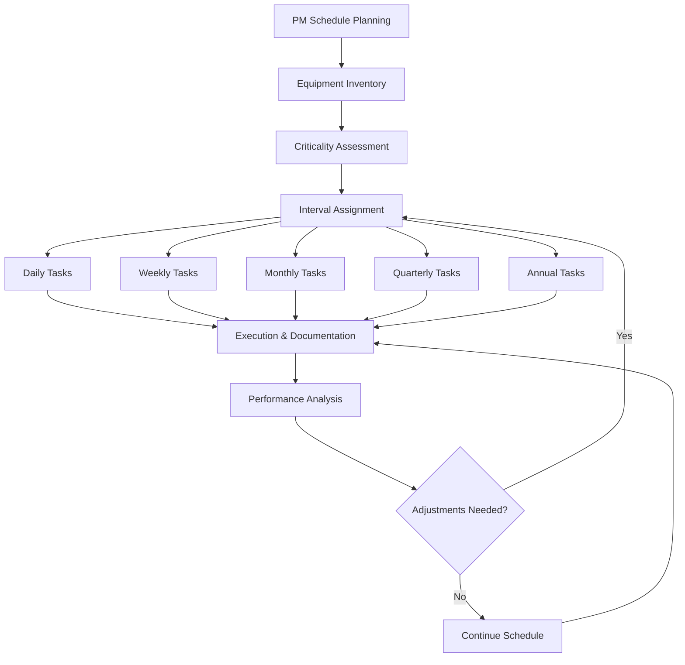

# HVAC Preventive Maintenance Schedules & Checklists

Preventive maintenance (PM) schedules are the foundation of reliable HVAC system operation. Systematic inspection, cleaning, and adjustment of equipment prevents catastrophic failures, maintains energy efficiency, and extends equipment service life. This guide provides comprehensive PM schedules based on ASHRAE guidelines and manufacturer recommendations.

## PM Schedule Framework

Effective preventive maintenance operates on multiple time intervals, from daily operator observations to annual comprehensive inspections. The frequency of each task depends on equipment criticality, operating hours, environmental conditions, and manufacturer specifications.

## Universal PM Task Intervals

The following table establishes standard intervals for common maintenance tasks across all HVAC equipment types.

| Task Category | Daily | Weekly | Monthly | Quarterly | Annual |
|---------------|-------|--------|---------|-----------|--------|
| Visual Inspection | ✓ | ✓ | ✓ | ✓ | ✓ |
| Operational Parameters | ✓ | ✓ | ✓ | ✓ | ✓ |
| Filter Service | — | ✓ | ✓ | — | — |
| Belt Inspection | — | ✓ | ✓ | — | — |
| Lubrication | — | — | ✓ | ✓ | — |
| Electrical Connections | — | — | — | ✓ | ✓ |
| Calibration | — | — | — | ✓ | ✓ |
| Comprehensive Testing | — | — | — | — | ✓ |

## Air Handling Unit (AHU) Maintenance Schedule

### Daily Tasks
- Record supply air temperature and pressure
- Verify fan operation and abnormal noise
- Check filter differential pressure gauges
- Inspect for water leaks or condensation
- Verify damper operation through BMS

### Monthly Tasks
- Inspect and clean/replace air filters
- Check fan belt tension and alignment
- Lubricate motor and fan bearings per manufacturer schedule
- Clean condensate drain pans and verify drainage
- Inspect coil fins for debris and damage
- Verify economizer damper linkage operation
- Test mixed air temperature sensors

### Quarterly Tasks
- Measure motor amperage and compare to nameplate
- Inspect and tighten electrical connections
- Calibrate temperature and humidity sensors
- Check variable frequency drive (VFD) operation and error logs
- Inspect heating and cooling coils for fouling
- Verify control sequence operation
- Test safety interlocks and alarms

### Annual Tasks
- Perform complete system airflow measurement and balancing
- Disassemble and inspect fan assemblies
- Replace or lubricate bearings per manufacturer recommendation
- Clean heating and cooling coils thoroughly
- Megger test motor windings
- Calibrate all sensors and transmitters
- Replace belts regardless of condition
- Verify fire/smoke damper operation
- Test emergency shutdown sequences

## Chiller Maintenance Schedule

### Daily Tasks
- Record entering/leaving water temperatures
- Log refrigerant pressures (suction and discharge)
- Monitor compressor amperage
- Check oil level and condition
- Verify no abnormal vibration or noise
- Record condenser and evaporator approach temperatures

### Monthly Tasks
- Inspect and clean condenser water strainers
- Check refrigerant sight glass for bubbles or discoloration
- Verify water flow rates and pressure drops
- Inspect insulation condition
- Test safety shutdowns (low temperature, high pressure)
- Analyze oil sample for moisture and acid

### Quarterly Tasks
- Perform leak detection on refrigerant circuits
- Inspect starter contacts and connections
- Calibrate temperature and pressure sensors
- Check control panel operation and update software if needed
- Measure compressor vibration levels
- Inspect and test purge unit operation (absorption chillers)
- Verify automatic capacity control operation

### Annual Tasks
- Eddy current test or pressure test tubes (water-cooled)
- Perform refrigerant analysis
- Megger test compressor motor
- Chemical cleaning of evaporator and condenser (if fouling detected)
- Replace drier cores
- Inspect and service expansion devices
- Complete electrical connection torque check
- Verify oil heater operation
- Test all safety devices and interlocks
- Document efficiency metrics (kW/ton)

## Boiler Maintenance Schedule

### Daily Tasks
- Record operating pressure and temperature
- Monitor fuel consumption and flame characteristics
- Check makeup water rate
- Verify no leaks from tubes, gaskets, or fittings
- Inspect stack temperature
- Test low-water cutoff operation (blow down)

### Weekly Tasks
- Test safety relief valve lifting mechanism (manual lift test)
- Blow down bottom of boiler to remove sediment
- Check water treatment chemical levels
- Inspect burner flame pattern
- Verify draft control operation

### Monthly Tasks
- Clean and inspect burner assemblies
- Check fuel nozzle condition and spray pattern
- Test flame safeguard controls
- Inspect refractory condition
- Verify combustion air damper operation
- Perform water treatment analysis
- Inspect flue gas passages for blockage

### Quarterly Tasks
- Perform combustion analysis (O₂, CO, CO₂, efficiency)
- Inspect and clean blower wheel
- Calibrate operating and limit controls
- Check ignition system components
- Inspect gas train components and gaskets
- Test automatic blowdown system
- Verify expansion tank charge pressure

### Annual Tasks
- Complete fireside cleaning (tubes, passes, stack)
- Inspect waterside surfaces and clean if necessary
- Hydrostatic test or ultrasonic thickness testing
- Replace gaskets and seals
- Inspect and service burner motor and linkages
- Calibrate all safety controls
- Test emergency shutdown systems
- Verify proper venting and combustion air supply
- Document seasonal efficiency

## Cooling Tower Maintenance Schedule

### Daily Tasks (During Operation)
- Verify fan operation and rotation direction
- Check for abnormal noise or vibration
- Inspect water distribution uniformity
- Monitor makeup water consumption
- Verify basin water level

### Weekly Tasks
- Test water treatment parameters (pH, conductivity, corrosion inhibitor)
- Inspect belts and adjust tension
- Check for excessive drift or fogging
- Clean strainers and screens
- Verify bleed-off valve operation

### Monthly Tasks
- Inspect fill media for fouling, scale, or algae growth
- Check gearbox oil level and condition
- Lubricate fan bearings
- Inspect drift eliminators for blockage
- Test float valve operation
- Clean basin and remove debris
- Inspect spray nozzles for plugging

### Quarterly Tasks
- Perform vibration analysis on fan assemblies
- Inspect fan blade pitch and condition
- Check structural components for corrosion
- Calibrate conductivity controller
- Inspect tower casing for leaks
- Verify makeup water valve operation
- Test emergency shutdown operation

### Annual Tasks (Pre-Season)
- Disassemble and inspect fan drive components
- Replace gearbox oil
- Clean fill media thoroughly
- Inspect and repair tower casing deterioration
- Balance fan assemblies
- Replace belts
- Test all safety switches and interlocks
- Verify adequate clearances for airflow
- Chemical cleaning if biological growth detected
- Document operating efficiency metrics

## PM Schedule Development Methodology

### Equipment Criticality Classification

Assign equipment to one of three categories:

**Critical (Class A):** Equipment whose failure causes immediate shutdown or safety hazard. Increase inspection frequency by 50% over standard intervals.

**Important (Class B):** Equipment whose failure degrades system performance but allows continued operation. Follow standard intervals.

**Non-Critical (Class C):** Redundant or non-essential equipment. Intervals may be extended by 25% unless manufacturer specifies otherwise.

### Adjusting Intervals Based on Operating Conditions

Manufacturer recommendations assume standard operating conditions (8-12 hours/day, clean environment, proper installation). Adjust intervals based on:

- **High runtime** (>16 hrs/day): Reduce intervals by 25-50%
- **Harsh environments** (corrosive, dusty, high humidity): Reduce intervals by 30-50%
- **Coastal installations:** Increase electrical inspection frequency due to salt corrosion
- **Critical applications:** Follow most conservative manufacturer or code requirement

### Documentation Requirements

Each PM task must include:

1. **Task description:** Specific actions to perform
2. **Acceptance criteria:** Measurable standards for pass/fail
3. **Required tools and materials:** Ensure technician preparedness
4. **Estimated duration:** For scheduling accuracy
5. **Safety precautions:** Lockout/tagout, PPE, confined space protocols
6. **Completion signature and date:** Accountability and traceability

Implement a computerized maintenance management system (CMMS) to track completion, trend equipment condition, and optimize scheduling based on actual equipment performance data.

## Integration with Condition-Based Maintenance

While preventive maintenance follows fixed intervals, supplement PM schedules with condition-based monitoring:

- **Vibration analysis:** Trend bearing and rotating equipment condition
- **Oil analysis:** Monitor lubricant degradation and contamination
- **Infrared thermography:** Detect electrical hotspots and insulation failures
- **Ultrasonic testing:** Early bearing failure detection

Use condition monitoring data to adjust PM intervals and predict component replacement timing, transitioning from time-based to predictive maintenance strategies for critical equipment.

---

**Key Takeaway:** Adherence to structured preventive maintenance schedules reduces emergency repairs by 60-75%, extends equipment life by 30-50%, and maintains system efficiency within 5-10% of design values throughout the equipment lifecycle.
