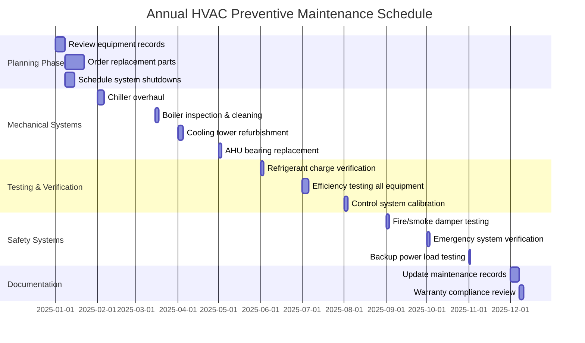

## Overview

Annual maintenance tasks represent the most comprehensive level of preventive maintenance, focusing on major system overhauls, deep cleaning, component replacement, and performance verification. These procedures ensure equipment longevity, maintain manufacturer warranties, and identify potential failures before they occur. Annual tasks typically require specialized tools, extended downtime, and trained technicians.

## Annual Maintenance Planning



## Major Equipment Overhaul Tasks

| Equipment Type | Overhaul Procedure | Critical Components | Frequency | Warranty Impact |
|----------------|-------------------|---------------------|-----------|-----------------|
| **Chillers** | Tube bundle cleaning, refrigerant circuit inspection, oil analysis | Compressor bearings, motor windings, expansion valve | Annual | Required for extended warranty |
| **Boilers** | Fireside/waterside cleaning, combustion analysis, pressure vessel inspection | Burner assembly, flame safeguard, water level controls | Annual | Mandatory per manufacturer |
| **Cooling Towers** | Basin cleaning, fill replacement, gearbox service | Fan bearings, drive belts, basin strainers | Annual | Required for tower warranty |
| **Air Handlers** | Coil deep cleaning, bearing lubrication/replacement, belt system overhaul | Motor bearings, fan shaft, coil fins | Annual | Extends motor warranty |
| **VAV Boxes** | Actuator calibration, damper blade inspection, controller testing | Damper seals, actuator linkage, sensors | Annual | Maintains control warranty |
| **Pumps** | Seal replacement, bearing service, impeller inspection | Mechanical seals, shaft bearings, coupling | Annual | Required for seal warranty |

## Heat Exchanger Cleaning Procedures

### Chiller Evaporator and Condenser Tubes

**Procedure Steps:**

1. **System Isolation**
   - Close isolation valves on water side
   - Recover refrigerant to storage cylinders
   - Lockout/tagout electrical service
   - Release system pressure safely

2. **Tube Bundle Access**
   - Remove end covers and gaskets
   - Photograph tube sheet conditions for records
   - Mark any tubes showing corrosion or damage
   - Document current fouling levels

3. **Mechanical Cleaning**
   - Use rotating brush system (tube diameter minus 1/16")
   - Pass brush through each tube minimum three times
   - Flush with high-pressure water (500-1000 psi)
   - Inspect tubes with borescope for remaining deposits

4. **Chemical Cleaning (If Required)**
   - Circulate citric acid solution (5-10% concentration)
   - Maintain solution temperature at 120-140°F
   - Monitor pH and metal ion concentration hourly
   - Neutralize and flush thoroughly after cleaning

5. **Reassembly and Testing**
   - Install new gaskets (never reuse)
   - Torque end cover bolts per manufacturer sequence
   - Perform hydrostatic test at 150% operating pressure
   - Evacuate system to 500 microns before charging

**Expected Results:** Heat transfer improvement of 15-30%, reduced approach temperatures, lower compressor head pressure.

### Boiler Heat Exchanger Cleaning

**Fireside Cleaning:**
- Remove soot deposits with wire brushes and vacuum
- Clean burner assembly and flame sensor
- Inspect refractory for cracks or deterioration
- Measure combustion chamber dimensions for erosion

**Waterside Cleaning:**
- Drain boiler completely and inspect for sediment
- Remove scale using mechanical scrapers or chemical descaling
- Flush with neutralizing solution
- Inspect tubes for pitting, corrosion, or thinning

## Bearing Replacement Procedures

### Motor Bearing Service

| Motor Size | Bearing Type | Replacement Criteria | Installation Method | Lubrication |
|-----------|--------------|---------------------|---------------------|-------------|
| 1-5 HP | Sealed ball bearings | Hours > 20,000 or vibration > 0.3 in/s | Press fit, 250°F max | Factory sealed |
| 7.5-25 HP | Greaseable ball bearings | Hours > 30,000 or vibration > 0.4 in/s | Heating to 180°F | NLGI Grade 2 EP |
| 30-100 HP | Roller bearings | Hours > 40,000 or vibration > 0.5 in/s | Induction heating | Synthetic NLGI Grade 2 |
| >100 HP | Sleeve bearings | Clearance > 0.008" or vibration > 0.6 in/s | Cold installation with specialized tools | ISO VG 68 oil |

**Critical Installation Steps:**

1. Measure shaft dimensions and bearing bore clearances
2. Inspect shaft for scoring, rust, or wear
3. Heat bearing to 180-200°F (never exceed 250°F)
4. Install quickly using proper driver tools
5. Verify bearing seats completely against shoulder
6. Measure final shaft runout (< 0.002" maximum)
7. Reinstall shields and apply correct lubricant quantity

### Fan Bearing Replacement

- Remove fan wheel using proper puller (never hammer on shaft)
- Inspect fan shaft for straightness (< 0.005" TIR)
- Replace bearings in matched pairs
- Realign motor coupling (< 0.003" offset, < 0.5° angular)
- Balance fan assembly dynamically if weight changed
- Verify bearing temperature after 24 hours operation (< 180°F)

## Efficiency Testing and Performance Verification

### Refrigeration System Performance Test

**Measured Parameters:**
- Evaporator approach temperature (< 2°F at design conditions)
- Condenser approach temperature (< 5°F at design conditions)
- Superheat at compressor suction (8-12°F typical)
- Subcooling at condenser outlet (10-15°F typical)
- Compressor power draw (compare to nameplate)
- Water flow rates through heat exchangers

**Efficiency Calculation:**
```
EER = Cooling Capacity (Btu/h) ÷ Power Input (Watts)
kW/Ton = 12,000 ÷ EER

Target EER: Air-cooled chiller ≥ 10.0
            Water-cooled chiller ≥ 12.0
```

**Acceptance Criteria:**
- Efficiency within 10% of rated performance
- No abnormal operating temperatures or pressures
- Stable operation under varying load conditions
- Oil return to compressor adequate

### Combustion Efficiency Testing

**Boiler Performance Metrics:**
- Flue gas temperature (< 100°F above supply water temp)
- Excess O₂ in flue gas (3-6% for natural gas)
- CO concentration (< 100 ppm air-free)
- Combustion efficiency (> 80% for standard boilers)
- Stack draft pressure (-0.02 to -0.05 in. w.c.)

**Efficiency Calculation:**
```
Combustion Efficiency (%) = 100 - [Flue Gas Loss + Incomplete Combustion Loss]

Flue Gas Loss ≈ (Flue Temp - Room Temp) × K factor
K factor: Natural gas = 0.32, Fuel oil = 0.36
```

## Motor Insulation Resistance Testing

### Megohm Test Procedure

1. **Preparation**
   - Disconnect motor from power source
   - Disconnect motor leads from starter
   - Ground motor frame securely
   - Allow motor to cool to ambient temperature

2. **Testing**
   - Use 500V megohmmeter for motors ≤ 460V
   - Test each phase to ground individually
   - Test phase-to-phase resistance
   - Perform polarization index test (10 min/1 min ratio)

3. **Acceptance Criteria**

| Motor Voltage | Minimum Resistance | Action Required |
|--------------|-------------------|-----------------|
| 460V | > 1.0 MΩ | Pass - return to service |
| 460V | 0.5-1.0 MΩ | Caution - investigate and retest |
| 460V | < 0.5 MΩ | Fail - do not energize |
| Polarization Index | > 2.0 | Good insulation condition |
| Polarization Index | 1.0-2.0 | Acceptable but monitor |
| Polarization Index | < 1.0 | Deteriorating insulation |

## Refrigerant Charge Verification

### Charge Accuracy Methods

**Superheat Method (Fixed Orifice Systems):**
- Measure suction line temperature at compressor
- Measure suction line pressure and convert to saturation temperature
- Calculate superheat = Actual temp - Saturation temp
- Compare to manufacturer chart based on outdoor and indoor conditions
- Adjust charge to achieve target superheat (typically 8-12°F)

**Subcooling Method (TXV Systems):**
- Measure liquid line temperature at condenser outlet
- Measure liquid line pressure and convert to saturation temperature
- Calculate subcooling = Saturation temp - Actual temp
- Target subcooling typically 10-15°F
- Add refrigerant if subcooling too low, recover if too high

**Weigh-In Method (Most Accurate):**
- Recover entire refrigerant charge to certified recovery cylinder
- Weigh recovered charge and compare to nameplate
- Evacuate system to 500 microns
- Charge exact amount per nameplate using calibrated scale
- Document charge weight and system performance

## Control System Calibration

### Sensor Verification and Calibration

| Sensor Type | Calibration Standard | Acceptable Tolerance | Recalibration Frequency |
|-------------|---------------------|---------------------|------------------------|
| Temperature (RTD) | NIST-traceable thermometer | ±0.5°F | Annual |
| Temperature (Thermocouple) | Reference junction | ±2.0°F | Annual |
| Pressure (0-300 psi) | Deadweight tester | ±1% full scale | Annual |
| Differential Pressure | Manometer | ±5% of reading | Annual |
| Humidity | Chilled mirror hygrometer | ±3% RH | Annual |
| CO₂ | Certified calibration gas | ±50 ppm | Annual |
| Flow (Ultrasonic) | Bucket test verification | ±5% of reading | Biennial |

### Actuator Stroke Testing

- Verify full stroke travel (0-100% command)
- Measure stroke time (should match specification)
- Check mechanical stops and linkage tightness
- Test fail-safe position on power loss
- Verify spring return force adequate

## Manufacturer Warranty Compliance

**Documentation Requirements:**
- Maintain detailed service logs for all annual tasks
- Photograph equipment conditions before and after service
- Record all measurements and test results
- Document parts replaced with serial numbers and dates
- Obtain service provider certification signatures

**Critical Warranty Stipulations:**
- Most manufacturers require annual inspections by qualified technicians
- Heat exchanger cleaning mandatory to maintain heat transfer warranties
- Bearing service required to preserve motor warranties
- Refrigerant purity testing may be required for compressor warranties
- Water quality testing mandatory for boiler and chiller warranties
- Combustion efficiency testing required for burner warranties

**Warranty Violation Consequences:**
- Manufacturer may deny claims for premature failures
- Extended warranty coverage automatically voided
- Replacement parts no longer available at warranty pricing
- Service agreements may be cancelled

## Safety System Testing

### Fire and Smoke Damper Inspection

- Visual inspection of damper blades and frame
- Manual operation test to verify free movement
- Fusible link replacement (rated 165°F or 212°F)
- Actuator function test with control system
- Measure closure time (< 5 seconds typical)
- Document damper locations and test results per NFPA 80

### Emergency System Verification

- Test automatic transfer switch operation
- Verify emergency generator starts within 10 seconds
- Load test generator at 80-100% capacity for 2 hours
- Test all emergency HVAC systems under generator power
- Verify smoke evacuation system performance
- Test manual override controls and emergency stops

## Documentation and Record Keeping

Maintain comprehensive records including:
- Equipment nameplate data and installation dates
- Complete maintenance history with dates and technicians
- All test results with pass/fail criteria
- Parts replaced with manufacturer and part numbers
- Photographs of conditions requiring attention
- Recommendations for future corrective actions
- Warranty status and expiration dates

Update building automation system with calibration dates and next service due dates.
