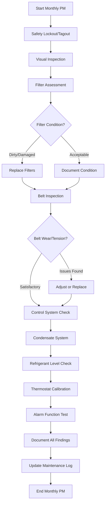

## Overview

Monthly preventive maintenance forms the foundation of effective HVAC system management. These recurring tasks prevent minor issues from escalating into costly failures while maintaining energy efficiency and indoor air quality. A structured monthly schedule reduces unexpected breakdowns by 40-60% according to ASHRAE maintenance guidelines.

## Monthly Maintenance Workflow

## Equipment-Specific Task Frequencies

| Equipment Type | Filter Change | Belt Inspection | Control Check | Condensate Drain | Refrigerant Check |
|---|---|---|---|---|---|
| **Packaged Rooftop Unit** | Monthly | Monthly | Monthly | Monthly | Monthly |
| **Split System** | Monthly | Monthly | Monthly | Monthly | Quarterly* |
| **Air Handler** | Monthly | Monthly | Monthly | Monthly | N/A |
| **Chiller (Air-Cooled)** | Monthly | N/A | Monthly | Monthly | Monthly |
| **VRF System** | Monthly | N/A | Monthly | Monthly | Quarterly* |
| **Computer Room AC** | Bi-weekly | Monthly | Monthly | Weekly | Monthly |

*Upgrade to monthly during peak cooling season (May-September)

## Detailed Monthly Checklist by Component

### Air Filters

**Inspection Criteria:**
- Measure pressure drop across filter bank (replace if >0.5" w.c. for standard filters, >1.0" w.c. for HEPA)
- Visual assessment for loading, damage, or bypass
- Check filter frame seals and gaskets
- Verify proper filter orientation (airflow direction arrows)

**Action Items:**
- Replace disposable filters when loaded or damaged
- Clean permanent/washable filters per manufacturer specifications
- Record filter type, MERV rating, and size
- Document pressure drop readings pre and post-replacement

**Filter Selection Reference:**
- MERV 8-11: Standard commercial applications
- MERV 13-14: Healthcare, laboratories
- MERV 15-16 or HEPA: Critical environments, surgical suites

### Belt-Driven Equipment

**Visual Inspection:**
- Examine belt surfaces for cracks, fraying, glazing, or chunks missing
- Check for proper alignment between sheaves (maximum 0.5° angular misalignment)
- Inspect sheaves for wear, damage, or debris buildup
- Verify belt guards are secure and properly installed

**Tension Verification:**
- Apply perpendicular force at belt midpoint between sheaves
- Proper deflection: 1/64" per inch of span length
- Example: 40" span = 0.625" deflection with firm thumb pressure
- Use belt tension gauge for critical applications (10 Hz minimum frequency)

**Documentation:**
- Record belt type (A, B, 3V, 5V, etc.)
- Note installation date on belt or in log
- Photograph wear patterns if abnormal

### Control Systems

**Thermostat and Sensor Checks:**
- Verify displayed temperature against calibrated thermometer (±1°F tolerance)
- Test setpoint changes register and initiate equipment response
- Check battery status on wireless or programmable thermostats
- Inspect sensor location for heat sources, drafts, or obstructions

**Control Sequence Verification:**
- Manually cycle through all operating modes (heating, cooling, fan, auto)
- Confirm proper staging sequence for multi-stage equipment
- Test economizer damper operation (if applicable)
- Verify interlocks function correctly (smoke detectors, freezestats, flow switches)

**Safety Control Testing:**
- High/low pressure switch operation
- Freezestat or low-temperature cutout
- High-temperature limit controls
- Flow and differential pressure switches

### Condensate Drain System

**Inspection Points:**
- Primary drain pan condition (corrosion, standing water, biological growth)
- Secondary/auxiliary pan water presence (indicates primary blockage)
- Drain line clear and flowing freely
- P-trap water seal intact (prevents air entrainment)
- Condensate pump operation and reservoir level (if equipped)

**Cleaning Procedure:**
1. Clear visible debris from drain pan
2. Flush drain line with water to verify flow
3. Apply biocide tablets or liquid per manufacturer recommendation
4. Test float switch in condensate pump (if present)
5. Verify proper slope on drain piping (minimum 1/8" per foot)

### Refrigerant Level Assessment

**Visual Indicators:**
- Sight glass condition (clear liquid indicates proper charge for systems so equipped)
- Suction line frost or excessive condensation (possible undercharge)
- Liquid line temperature relative to ambient (overcharge indicator)

**Measurement Points:**
- Suction pressure compared to manufacturer specifications
- Liquid line pressure at outdoor ambient condition
- Superheat calculation: Actual suction temp - Saturation temp at suction pressure
- Subcooling calculation: Saturation temp at liquid pressure - Actual liquid temp

**Target Values (R-410A typical residential split):**
- Superheat: 10-15°F (fixed orifice), 8-12°F (TXV)
- Subcooling: 8-12°F
- Consult equipment nameplate and manufacturer charging charts for specific targets

### Oil Level Verification (Applicable Equipment)

**Compressor Oil Check:**
- Locate oil sight glass on compressor crankcase
- Oil level should be at centerline indicator when system is running
- Check oil clarity (clean oil is clear to light amber; dark oil requires analysis)
- For systems without sight glass, follow manufacturer's checking procedure

**Oil Quality Indicators:**
- Acid test results within acceptable range (<0.05 mg KOH/g)
- Moisture content <50 ppm for POE oils
- Schedule oil analysis annually for critical systems

### Alarm and Safety Device Testing

**Monthly Test Requirements:**
- Manually trip each alarm point to verify local and remote indication
- Test visual and audible alarm functions
- Verify automatic shutdown sequences activate properly
- Check alarm reset functionality
- Confirm BMS/BAS alarm communication (if integrated)

**Critical Alarms to Test:**
- High/low temperature
- Equipment failure
- Filter differential pressure (if monitored)
- Smoke detector interface
- Power loss/phase failure

## Documentation Requirements

Each monthly maintenance visit requires thorough documentation:

**Minimum Log Entries:**
- Date, time, and technician identification
- Equipment nameplate data and serial number
- All parameter readings (pressures, temperatures, voltages, amperages)
- Filter conditions and replacement actions
- Belt condition and tension adjustments
- Any abnormal observations or corrective actions taken
- Parts replaced with part numbers
- Follow-up recommendations

**Trending Critical Parameters:**
Track these values monthly to identify degradation trends:
- Supply and return air temperatures
- Entering and leaving water temperatures (hydronic systems)
- Electrical current draw per phase
- Refrigerant pressures
- Filter pressure drop
- Run hours (from hour meter or BMS)

## Manufacturer Schedule Alignment

Always reference the specific equipment manufacturer's maintenance schedule as the primary authority. Generic schedules provide baseline guidance, but manufacturer requirements may include:

- Proprietary maintenance procedures
- Specific torque specifications
- Unique lubrication requirements
- Warranty-mandated service intervals
- Software/firmware update schedules

**Major Manufacturer Resources:**
- Carrier, Trane, Lennox, York, Daikin, Mitsubishi: Provide detailed maintenance manuals with specific monthly task lists
- Reference the IOM (Installation, Operation, Maintenance) manual supplied with equipment
- Access online service portals for equipment-specific maintenance bulletins

## Integration with Comprehensive PM Program

Monthly tasks form one tier of a multi-frequency maintenance strategy:

- **Weekly/Bi-weekly:** High-criticality equipment or extreme operating conditions
- **Monthly:** Standard recurring tasks outlined above (this document)
- **Quarterly:** Extended inspections, refrigerant analysis, detailed electrical testing
- **Semi-annual:** Major component servicing, heat exchanger cleaning, system performance testing
- **Annual:** Comprehensive system evaluation, efficiency analysis, predictive maintenance assessments

Proper execution of monthly tasks directly impacts system longevity, energy efficiency, and occupant comfort. Consistency and thorough documentation transform maintenance from reactive to predictive, reducing lifecycle costs by 25-35% over equipment lifespan.
