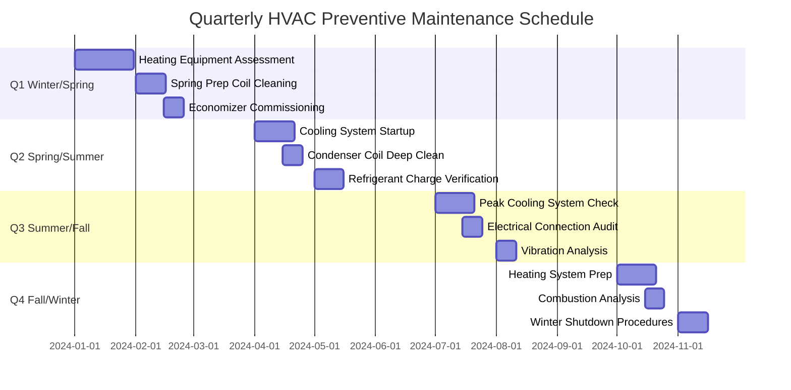

Quarterly maintenance represents the optimal interval for critical HVAC system tasks that prevent seasonal failures and maintain peak efficiency. These procedures align with ASHRAE Standard 180-2018 requirements and manufacturer recommendations for commercial and industrial systems.

## Quarterly Maintenance Schedule Overview

The quarterly maintenance cycle divides the year into strategic seasonal preparation periods, each focusing on equipment readiness for upcoming thermal loads.

## Seasonal Preparation Checklists

### Q1: Winter to Spring Transition (January-March)

- **Heating Equipment Assessment**: Verify boiler efficiency before season end, document combustion readings
- **Evaporator Coil Inspection**: Remove accumulated dust from winter heating operation
- **Economizer Spring Commissioning**: Test damper operation, verify mixed air temperature control
- **Cooling Tower Basin Cleaning**: Remove winter debris, inspect fill media for damage
- **Refrigerant System Pressure Test**: Verify standing pressures before cooling season
- **Control System Calibration**: Recalibrate outdoor air and mixed air sensors

### Q2: Spring to Summer Transition (April-June)

- **Condenser Coil Deep Cleaning**: Remove cottonwood, pollen, and debris accumulation
- **Refrigerant Charge Verification**: Measure subcooling/superheat at design conditions
- **Chiller Startup Procedures**: Perform oil analysis, verify refrigerant levels
- **Cooling Tower Water Treatment**: Establish blowdown rates, verify biocide levels
- **VFD Heat Sink Cleaning**: Remove dust from cooling fins on variable frequency drives
- **Economizer Functional Test**: Verify 100% outdoor air mode operation

### Q3: Mid-Summer Peak Load Period (July-September)

- **Condenser Coil Re-inspection**: Second cleaning if airborne debris is present
- **Electrical Connection Torque Check**: Thermal cycling causes connection loosening
- **Vibration Analysis on Rotating Equipment**: Bearing wear accelerates under peak loads
- **Refrigerant Leak Inspection**: Check all brazed joints, flare fittings, and valve stems
- **Water Treatment Verification**: Cooling tower cycles of concentration, pH levels
- **Chiller Oil Analysis**: Acid number, moisture content, refrigerant contamination

### Q4: Fall to Winter Transition (October-December)

- **Heating System Commissioning**: Combustion analysis on all fuel-burning equipment
- **Heat Exchanger Inspection**: Visual inspection for cracks, corrosion, flame impingement
- **Condensate Drain Verification**: Clear all traps, verify proper drainage before heating season
- **Cooling Equipment Winterization**: Drain cooling towers, add glycol to exposed piping
- **Humidification System Startup**: Clean reservoirs, replace media, verify steam output
- **Air Handler Filter Replacement**: Install high-efficiency filters before heating season

## Equipment-Specific Quarterly Tasks

### Air-Cooled Equipment

| Task | Procedure | Acceptance Criteria |
|------|-----------|---------------------|
| Condenser Coil Cleaning | Reverse-flush with water at 300-500 PSI | ΔT across coil within 10°F of design |
| Refrigerant Charge Check | Measure subcooling at liquid line | 8-12°F subcooling at 95°F ambient |
| Fan Motor Bearing Lubrication | Apply manufacturer-specified grease | Vibration < 0.2 in/sec RMS |
| Electrical Terminal Inspection | Torque to manufacturer specification | No discoloration, < 10°F rise above ambient |
| Defrost Timer Verification | Cycle through complete defrost sequence | Complete defrost in < 20 minutes |

### Water-Cooled Equipment

| Task | Procedure | Acceptance Criteria |
|------|-----------|---------------------|
| Cooling Tower Fill Inspection | Remove debris, check for biological growth | Water distribution uniform across fill |
| Condenser Tube Cleaning | Brush cleaning or chemical descaling | Approach temperature < 2°F design |
| Water Treatment Testing | Measure pH, conductivity, biocide residual | pH 7.5-8.5, cycles < 4.0 |
| Basin Strainer Cleaning | Remove sediment and debris | Flow switches operational |
| Blowdown Valve Verification | Confirm automatic blowdown operation | TDS within target range |

### Economizer Systems

| Task | Procedure | Acceptance Criteria |
|------|-----------|---------------------|
| Damper Actuator Stroke Test | Command 0-100% outdoor air | Full stroke in < 2 minutes |
| Minimum Position Verification | Measure outdoor airflow at minimum | Meets ASHRAE 62.1 requirements |
| Enthalpy Sensor Calibration | Compare to calibrated reference | Within ±2°F DB, ±5% RH |
| Damper Blade Seal Inspection | Visual check for gaps, torn seals | Leakage < 10% at closed position |
| Relief Damper Operation | Verify building pressure control | Pressure within ±0.02 in. w.c. setpoint |

### Boilers and Furnaces

| Task | Procedure | Acceptance Criteria |
|------|-----------|---------------------|
| Combustion Analysis | Measure O₂, CO, CO₂, stack temperature | CO < 50 ppm, efficiency > 80% |
| Heat Exchanger Inspection | Visual inspection with camera if accessible | No cracks, corrosion, or carbon deposits |
| Burner Assembly Cleaning | Remove carbon buildup from burners | Uniform flame pattern, no yellow tipping |
| Gas Pressure Verification | Measure manifold and supply pressure | Within ±10% of nameplate rating |
| Flame Rollout Detection Test | Simulate blocked flue condition | Safety lockout within 5 seconds |

## Coil Cleaning Protocols

Coil cleanliness directly affects system capacity and efficiency. Fouled coils increase pressure drop, reduce airflow, and degrade heat transfer performance.

### Evaporator Coil Cleaning

**Frequency**: Quarterly in high-particulate environments, semi-annually in normal conditions

**Procedure**:
1. De-energize unit, lock out power source
2. Remove filter racks and access panels
3. Apply alkaline-based coil cleaner (pH 11-13) using low-pressure sprayer
4. Allow 10-15 minute dwell time for soil emulsification
5. Rinse with clean water in direction opposite to airflow
6. Verify fin straightness, comb fins if necessary (fins per inch must match original)
7. Inspect drain pan and condensate trap for blockages

**Performance Verification**: Measure static pressure drop across coil. Acceptable range is 0.15-0.35 in. w.c. at design airflow for standard cooling coils.

### Condenser Coil Cleaning

**Frequency**: Quarterly before and during cooling season in contaminated environments

**Procedure**:
1. Shut down unit, verify all electrical power disconnected
2. Photograph coil condition for maintenance records
3. Remove large debris manually with vacuum or compressed air
4. Apply acidic coil cleaner (pH 2-4) for mineral deposits or alkaline cleaner (pH 11-13) for organic matter
5. Flush coils from inside to outside using pressure washer at 300-500 PSI maximum
6. Inspect fan blades for balance and damage
7. Verify proper refrigerant pressures after restart

**Performance Verification**: Condensing temperature should be 15-20°F above ambient at design load. Higher values indicate remaining fouling or insufficient airflow.

## Refrigerant System Quarterly Checks

Refrigerant loss degrades capacity and efficiency while increasing compressor discharge temperatures. Quarterly verification prevents gradual system degradation.

### Leak Detection Methods

1. **Electronic Leak Detection**: Use heated diode or infrared sensors, sensitivity 0.1 oz/year minimum
2. **Bubble Solution Testing**: Apply to all joints, connections, and valve stems under system pressure
3. **Ultraviolet Dye Inspection**: Add fluorescent dye, inspect with UV light after 1-2 weeks operation
4. **Ultrasonic Detection**: Locate high-pressure leaks by detecting ultrasonic frequency noise

### Critical Inspection Points

- Brazed joints at service valves
- Flare connections at liquid line filter-driers
- Schrader valve cores in service ports
- Compressor crankcase gaskets
- Condenser/evaporator coil tube-to-header joints
- Thermal expansion valve sensing bulb connections

### Refrigerant Charge Verification

**Fixed Orifice Systems** (Capillary Tube/Piston Metering):
- Target: 8-12°F subcooling at condensing unit, 10-15°F superheat at evaporator outlet
- Measure liquid line temperature and pressure at outdoor unit
- Subcooling = Saturated Condensing Temperature - Liquid Line Temperature

**Thermostatic Expansion Valve Systems**:
- Target: 8-12°F superheat at evaporator outlet
- Measure suction line temperature and pressure at evaporator
- Superheat = Suction Line Temperature - Saturated Evaporating Temperature

## Economizer Testing and Commissioning

Economizer failures waste substantial energy by mixing outdoor air unnecessarily or failing to provide free cooling when available.

### Quarterly Functional Tests

1. **Minimum Position Test**: Command economizer to minimum position, verify outdoor airflow meets ASHRAE 62.1 ventilation requirements (typically 10-20% outdoor air)

2. **Maximum Position Test**: Command economizer to 100% outdoor air, verify return damper closes and outdoor damper opens fully (< 10% leakage)

3. **Modulation Test**: Slowly increase cooling demand, verify damper modulates smoothly without hunting or oscillation

4. **Changeover Logic Test**: Verify economizer disables at appropriate outdoor conditions (typically 55-70°F depending on system design)

5. **Mixed Air Temperature Control**: Verify mixed air temperature maintains setpoint (typically 55°F) during economizer operation

### Common Failure Modes

- **Seized Damper Linkages**: Corrosion prevents damper movement
- **Failed Actuators**: Loss of control signal or mechanical failure
- **Sensor Drift**: Outdoor air or return air sensors read incorrectly
- **Leaking Dampers**: Torn blade seals allow uncontrolled mixing
- **Control Logic Errors**: Incorrect changeover setpoints or disabled sequences

## Industry Standards Reference

**ASHRAE Standard 180-2018**: Standard Practice for Inspection and Maintenance of Commercial Building HVAC Systems

- Specifies quarterly inspection frequencies for critical components
- Defines acceptance criteria for system performance
- Establishes documentation requirements for maintenance activities

**ASHRAE Guideline 0-2019**: The Commissioning Process

- Outlines functional performance testing procedures
- Establishes seasonal commissioning requirements
- Documents performance verification methods

**NFPA 90A**: Standard for Installation of Air-Conditioning and Ventilating Systems

- Requires quarterly cleaning of coils in contaminated environments
- Specifies clearances and access requirements for maintenance

Quarterly maintenance intervals provide optimal balance between system reliability and maintenance resource allocation. Following these procedures prevents seasonal failures, maintains energy efficiency, and extends equipment service life.
