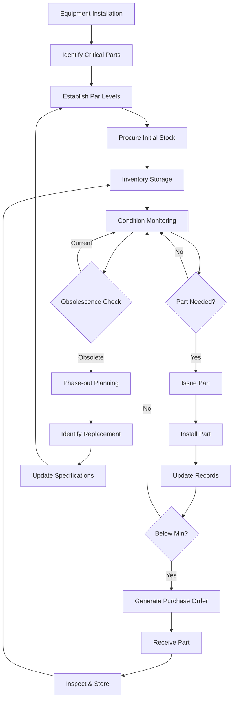

## Overview

Effective spare parts management balances equipment reliability against inventory carrying costs. Strategic parts stocking prevents extended downtime while minimizing capital tied up in inventory. Critical components require immediate availability, while non-critical items can utilize just-in-time procurement strategies.

## Criticality Analysis

Parts criticality determines stocking priorities based on failure impact and procurement lead time.

**Criticality Matrix:**

| Criticality Level | Downtime Impact | Lead Time | Failure Probability | Stocking Strategy |
|-------------------|-----------------|-----------|---------------------|-------------------|
| A - Critical | >24 hours | >7 days | High | Stock 100% |
| B - Important | 8-24 hours | 3-7 days | Medium | Stock 50-75% |
| C - Standard | 2-8 hours | 1-3 days | Low-Medium | Stock 25-50% |
| D - Non-critical | <2 hours | <24 hours | Low | Just-in-time |

**Critical Spares by Equipment Type:**

| Equipment | Critical Spares | Recommended Quantity | Average Lead Time |
|-----------|----------------|----------------------|-------------------|
| Chillers | Compressor starter, oil filter, refrigerant sensor | 1-2 each | 14-30 days |
| Boilers | Flame rod, gas valve, circulator pump seal kit | 2-3 each | 7-14 days |
| Air Handlers | Belt sets, bearing assemblies, actuators | 2-4 each | 5-10 days |
| Cooling Towers | Fill media sections, drift eliminators, float valve | 1-2 each | 10-21 days |
| VRF Systems | Electronic expansion valve, PCB assembly, refrigerant sensor | 1-2 each | 21-45 days |
| Controls | Room sensors, valve actuators, control modules | 3-5 each | 3-7 days |

## Inventory Optimization Strategies

### Economic Order Quantity (EOQ)

The EOQ model minimizes total inventory costs by balancing ordering costs against holding costs:

EOQ = √(2DS/H)

Where:
- D = Annual demand (units)
- S = Ordering cost per order
- H = Holding cost per unit per year

**Example Calculation:**
- Annual demand: 48 filters
- Ordering cost: $75 per order
- Holding cost: $12 per filter per year

EOQ = √(2 × 48 × 75 / 12) = √600 = 24.5 ≈ 25 filters per order

### Min-Max Inventory System

Establishes reorder points and maximum stock levels based on consumption rates and lead times.

**Min-Max Calculation:**
- Minimum = (Average daily usage × Lead time) + Safety stock
- Maximum = Minimum + EOQ

Safety stock typically equals 1-2 weeks of average consumption for critical parts.

### ABC Analysis

Categorizes inventory by value and consumption:

- **A Items (70-80% of value, 10-20% of items):** Tight control, frequent review, accurate records
- **B Items (15-25% of value, 30-40% of items):** Moderate control, periodic review
- **C Items (5-10% of value, 40-50% of items):** Simple controls, bulk ordering

## Spare Parts Lifecycle Management

## Stocking Level Determination

**Factors Influencing Stock Levels:**

- Equipment age and reliability history
- Manufacturer lead times and part availability
- Cost of downtime versus carrying costs
- Space constraints and storage conditions
- Failure mode and effects analysis (FMEA) results
- Service level agreements (SLA) requirements

**Recommended Stocking Multipliers:**

| Equipment Age | Reliability Factor | Stock Multiplier |
|---------------|-------------------|------------------|
| 0-5 years | High | 0.5-1.0x |
| 5-10 years | Medium | 1.0-1.5x |
| 10-15 years | Medium-Low | 1.5-2.0x |
| >15 years | Low | 2.0-3.0x |

## Obsolescence Management

Equipment lifecycle typically spans 15-25 years, while parts availability often ends 7-10 years post-production.

**Obsolescence Mitigation Strategies:**

1. **End-of-Life Buys:** Purchase extended inventory when manufacturers announce discontinuation
2. **Alternative Sourcing:** Identify aftermarket suppliers and compatible replacements
3. **Remanufacturing Programs:** Establish relationships with rebuild specialists
4. **Design-Out Solutions:** Plan equipment retrofits to eliminate obsolete components
5. **Technology Monitoring:** Track manufacturer product roadmaps and industry trends

**Obsolescence Risk Assessment Timeline:**

| Time from Discontinuation | Risk Level | Action Required |
|---------------------------|------------|-----------------|
| >5 years | Low | Monitor availability |
| 3-5 years | Medium | Secure backup sources |
| 1-3 years | High | Execute end-of-life buy |
| <1 year | Critical | Emergency procurement and retrofit planning |

## Inventory Management Best Practices

**Storage Requirements:**
- Climate-controlled environment (60-80°F, <60% RH) for electronic components
- Dry storage for gaskets, seals, and rubber components
- Segregated storage for refrigerants and oils with secondary containment
- First-in-first-out (FIFO) rotation for time-sensitive items
- Clear labeling with part numbers, equipment tags, and installation dates

**Documentation Systems:**
- Computerized Maintenance Management System (CMMS) integration
- Bar code or RFID tracking for high-value items
- Parts cross-reference database linking OEM and aftermarket numbers
- Minimum and maximum quantity alerts
- Usage history and failure trend analysis

**Performance Metrics:**
- Inventory turnover ratio (target: 2-4 for HVAC spares)
- Stockout rate (target: <2% for critical items)
- Inventory carrying cost as percentage of total value (target: 15-25%)
- Average days to replenish
- Dead stock percentage (target: <5%)

**Vendor Management:**
- Establish preferred supplier agreements with pricing commitments
- Maintain minimum of two sources for critical parts
- Negotiate consignment inventory for high-value, low-turnover items
- Implement vendor-managed inventory (VMI) for commodity parts
- Regular supplier performance reviews (delivery time, quality, pricing)

## Emergency Procurement Protocols

When critical parts fail without stock availability:

1. **Immediate Actions:** Contact primary supplier for expedited shipping, check internal inventory at other facilities
2. **Alternative Sourcing:** Engage secondary suppliers, aftermarket vendors, equipment rental companies
3. **Temporary Solutions:** Implement bypass strategies, deploy portable equipment, transfer parts from redundant systems
4. **Documentation:** Record root cause, update criticality assessment, adjust stocking levels

Effective spare parts management requires continuous refinement based on equipment performance data, changing operational requirements, and evolving parts availability landscapes.
