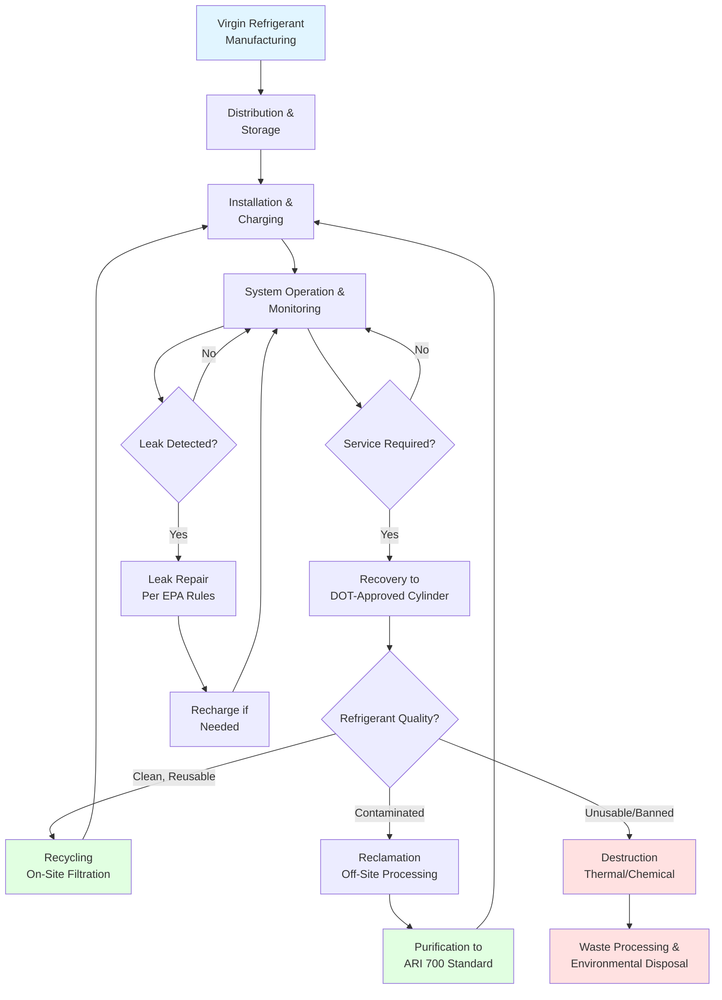

# Refrigerant Management Safety

Proper refrigerant management protects technicians, building occupants, and the environment while ensuring regulatory compliance. This guide addresses handling protocols, storage requirements, recovery procedures, and disposal practices mandated by EPA regulations and ASHRAE standards.

## EPA 608 Certification Requirements

The EPA mandates certification under Section 608 of the Clean Air Act for all technicians who maintain, service, repair, or dispose of equipment containing regulated refrigerants. Certification demonstrates competency in refrigerant handling and recovery practices.

### Certification Types

| Type | Equipment Covered | Charge Limit |
|------|------------------|--------------|
| Type I | Small appliances | < 5 lbs refrigerant |
| Type II | High-pressure systems | AC, heat pumps, commercial refrigeration |
| Type III | Low-pressure systems | Centrifugal chillers |
| Universal | All equipment types | All charge sizes |

**Core Competencies Required:**
- Refrigerant properties and environmental impact
- Proper use of recovery and recycling equipment
- Leak detection and repair procedures
- Safe handling and storage practices
- Required evacuation levels per equipment type
- Recordkeeping and reporting obligations

## Refrigerant Safety Classifications

ASHRAE Standard 34 classifies refrigerants by toxicity and flammability characteristics, determining safe concentration limits and handling requirements.

### ASHRAE 34 Classification System

| Class | Toxicity | Flammability | Examples | Concentration Limit (ppm) |
|-------|----------|--------------|----------|---------------------------|
| A1 | Lower | No flame propagation | R-134a, R-410A, R-744 (CO₂) | 1,000+ |
| A2L | Lower | Lower flammability | R-32, R-454B, R-1234yf | 210-590 |
| A2 | Lower | Flammable | R-152a, R-290 (propane) | 65-150 |
| A3 | Lower | Higher flammability | R-600a (isobutane), R-1270 | 40-60 |
| B1 | Higher | No flame propagation | R-123 | 10-50 |
| B2L | Higher | Lower flammability | (Limited use) | 5-25 |

**Key Parameters:**
- **Toxicity Class A:** Refrigerant Concentration Limit (RCL) ≥ 400 ppm
- **Toxicity Class B:** RCL < 400 ppm
- **Flammability:** Based on burning velocity and heat of combustion

## Refrigerant Lifecycle Management

## Handling and Storage Protocols

### Safe Handling Practices

**Personal Protective Equipment (PPE):**
- Safety glasses with side shields (ANSI Z87.1)
- Neoprene or nitrile gloves resistant to refrigerant exposure
- Respiratory protection for enclosed spaces or high concentrations
- Protective footwear and clothing to prevent frostbite from liquid refrigerant

**Handling Procedures:**
- Never expose cylinders to temperatures exceeding 125°F (52°C)
- Use pressure regulators appropriate for refrigerant type
- Connect and disconnect hoses slowly to prevent pressure surges
- Purge hoses with refrigerant vapor before making connections
- Never mix refrigerants in recovery cylinders
- Label all cylinders clearly with refrigerant type and condition

### Storage Requirements (ASHRAE 15)

**Cylinder Storage:**
- Store upright in well-ventilated areas away from heat sources
- Secure cylinders to prevent tipping or rolling
- Separate full and empty cylinders with clear labeling
- Maintain storage area temperature below 125°F (52°C)
- Keep cylinders away from incompatible materials (oils, oxidizers)
- Install refrigerant detection systems in enclosed storage areas

**Mechanical Room Ventilation:**
- Minimum ventilation rate: 0.5 cfm/ft² of machinery room floor area
- Emergency mechanical ventilation automatically activated by detectors
- Refrigerant detection threshold: 25% of RCL per ASHRAE 34
- Alarm system audible inside and outside machinery room

## Recovery and Evacuation Standards

EPA regulations establish mandatory recovery efficiency levels based on equipment type and service procedures.

### Required Recovery Levels

| Equipment Type | System Size | Recovery Required |
|----------------|-------------|-------------------|
| Small appliances | < 5 lbs | 90% of charge (80% if compressor inoperative) |
| High-pressure systems | < 200 lbs | 10 inches Hg vacuum |
| High-pressure systems | ≥ 200 lbs | 15 inches Hg vacuum |
| Low-pressure chillers | All sizes | 25 mm Hg absolute (29 inches Hg vacuum) |

**Recovery Equipment Requirements:**
- Certified to ARI Standard 740 for recovery/recycling equipment
- Equipped with low-loss fittings to minimize venting
- Properly maintained with replaced filters and oil changes
- Calibrated pressure gauges and vacuum instruments

### Recycling vs. Reclamation

**Recycling (On-Site):**
- Oil separation and filtration through 48-micron filter-drier
- Single or multiple passes to reduce moisture and acidity
- Can be returned to same system or other systems owned by same customer
- Does not restore refrigerant to ARI 700 purity standard

**Reclamation (Off-Site):**
- Reprocessing to virgin refrigerant specifications (ARI 700)
- Chemical analysis verifying purity levels
- Can be sold or used by any end user
- Required for contaminated or mixed refrigerants

## Leak Repair Requirements

EPA regulations mandate leak repair when systems exceed specified annual leak rates.

### Trigger Rates by Equipment Type

| Equipment Category | Trigger Rate (Annual) |
|-------------------|----------------------|
| Comfort cooling (< 50 lbs) | 20% |
| Commercial refrigeration | 20% |
| Industrial process refrigeration | 20% |
| Comfort cooling (≥ 50 lbs) | 10% |
| Federal facilities | 10% |

**Compliance Timeline:**
- Initial leak inspection within 14 days of trigger rate discovery
- Repairs completed within 30 days (or system retrofit/retirement plan submitted)
- Follow-up verification test within 30 days of repair completion
- Recordkeeping for all repairs and leak rates maintained for 3 years

## Disposal and Destruction

Refrigerants cannot be vented to atmosphere under any circumstances. Unusable refrigerants require proper destruction.

**Approved Destruction Methods:**
- Thermal destruction at temperatures exceeding 2,000°F (1,093°C)
- Plasma arc processing
- Chemical reaction methods producing stable compounds
- Destruction facilities must be certified and report quantities destroyed

**Documentation Required:**
- Chain of custody from recovery through destruction
- Destruction certificates from approved facilities
- EPA reporting for ozone-depleting substance destruction
- Retention of records for minimum 3 years

## Emergency Response Procedures

**Refrigerant Release:**
1. Evacuate affected area immediately
2. Activate emergency ventilation systems
3. Isolate refrigerant source if safe to do so
4. Monitor oxygen levels (refrigerants displace oxygen)
5. Do not enter confined spaces without proper respiratory protection
6. Contact emergency responders for large releases

**Medical Exposure:**
- Frostbite from liquid refrigerant: Warm affected area gradually with lukewarm water
- Inhalation: Move to fresh air immediately; administer oxygen if needed
- Cardiac sensitization risk: Avoid physical exertion and stimulants after exposure
- Seek medical attention for significant exposures

## Regulatory References

- **EPA 40 CFR Part 82, Subpart F:** Section 608 technician certification and refrigerant management
- **ASHRAE Standard 15:** Safety Standard for Refrigeration Systems
- **ASHRAE Standard 34:** Designation and Safety Classification of Refrigerants
- **ARI Standard 700:** Specifications for refrigerant reclamation purity
- **ARI Standard 740:** Performance of refrigerant recovery/recycling equipment
- **DOT 49 CFR:** Transportation regulations for compressed gas cylinders

Compliance with these standards protects personnel, equipment, and the environment while avoiding substantial civil penalties for refrigerant mismanagement.

