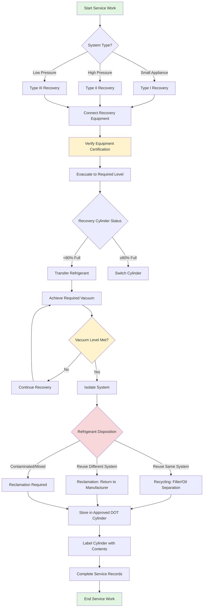

## Overview

Proper refrigerant handling is mandated by federal law under EPA Section 608 and governed by ASHRAE Standard 15. All technicians who maintain, service, repair, or dispose of equipment containing refrigerants must be EPA 608 certified. Improper handling results in atmospheric emissions, safety hazards, equipment damage, and significant regulatory penalties up to $44,539 per day per violation.

## EPA 608 Certification Requirements

The EPA requires technicians to demonstrate competency in refrigerant handling through certification in one or more equipment categories:

| Certification Type | Equipment Covered | Refrigerant Charge Limit |
|-------------------|-------------------|-------------------------|
| Type I | Small appliances | < 5 lbs refrigerant |
| Type II | High-pressure systems | Air conditioners, heat pumps |
| Type III | Low-pressure systems | Centrifugal chillers |
| Universal | All equipment types | Complete coverage |

**Core competencies tested:**
- Ozone depletion and Clean Air Act regulations
- Required practices for refrigerant recovery and recycling
- Approved refrigerant substitutes and retrofitting procedures
- Leak detection, repair requirements, and recordkeeping
- Safety procedures and proper equipment operation

Certification is permanent and does not require renewal, though technicians must maintain current knowledge of regulatory changes.

## Refrigerant Safety Classifications

ASHRAE Standard 34 classifies refrigerants by toxicity and flammability using a two-character designation:

| Classification | Toxicity | Flammability | Examples | Primary Hazards |
|----------------|----------|--------------|----------|-----------------|
| A1 | Lower | No flame propagation | R-134a, R-410A, R-407C | Asphyxiation, high pressure |
| A2L | Lower | Lower flammability | R-32, R-454B, R-1234yf | Mild flammability, asphyxiation |
| A2 | Lower | Flammable | R-152a | Ignition risk, asphyxiation |
| A3 | Lower | Higher flammability | R-290 (propane), R-600a | High ignition risk, explosion |
| B1 | Higher | No flame propagation | R-123 | Toxic exposure, cardiac sensitization |
| B2L | Higher | Lower flammability | None common | Combined toxicity and flammability |
| B2 | Higher | Flammable | Ammonia (R-717) | Severe toxicity, flammability |
| B3 | Higher | Higher flammability | None common | Extreme combined hazards |

**Exposure limits:**
- Class A refrigerants: Occupational Exposure Limit (OEL) ≥ 400 ppm
- Class B refrigerants: OEL < 400 ppm
- Always verify manufacturer Safety Data Sheets (SDS) for specific exposure guidelines

## Recovery, Recycling, and Reclamation

### Recovery Procedures

**Required evacuation levels per EPA regulations:**

| Equipment Type | Refrigerant | Before November 15, 1993 | After November 15, 1993 |
|----------------|-------------|-------------------------|------------------------|
| HCFC-22 appliances | < 200 lbs | 0 psig | 0 psig |
| HCFC-22 appliances | ≥ 200 lbs | 4" Hg vacuum | 10" Hg vacuum |
| Other high-pressure | Any amount | 4" Hg vacuum | 10" Hg vacuum |
| Low-pressure (centrifugal) | Any amount | 25" Hg vacuum | 25 mm Hg absolute |

**Critical recovery practices:**
1. **Identify refrigerant type** using gauge readings, system labels, or refrigerant identifier before recovery
2. **Inspect recovery cylinders** for DOT certification, retest dates (every 5 years), and contamination
3. **Verify recovery equipment certification** to EPA standards and proper maintenance
4. **Use dedicated cylinders** for each refrigerant type to prevent cross-contamination
5. **Monitor cylinder pressure** continuously; never exceed 80% liquid capacity or cylinder pressure limits
6. **Achieve required vacuum levels** and wait for pressure stabilization to confirm complete recovery
7. **Document refrigerant amounts** recovered, recycled, and recharged for regulatory compliance

### Recycling vs. Reclamation

**Recycling** occurs on-site using portable equipment to:
- Remove oil, moisture, and particulates through filtration
- Restore refrigerant to reusable condition for the same system or owner's equipment
- Reduce non-condensables through vacuum separation
- Does not restore refrigerant to AHRI 700 virgin specifications

**Reclamation** requires processing at a certified facility to:
- Restore refrigerant to AHRI Standard 700 specifications (virgin quality)
- Perform chemical analysis verifying purity
- Enable refrigerant resale and use in different systems
- Properly dispose of contaminants and degraded refrigerant

## Cylinder Handling and Storage

**DOT cylinder requirements:**
- Use only DOT-approved cylinders (specification 4BA or 4BW for refrigerants)
- Verify current hydrostatic test date (required every 5 years)
- Never fill beyond 80% liquid capacity to allow for thermal expansion
- Store cylinders upright in cool, well-ventilated areas away from heat sources
- Secure cylinders to prevent tipping or rolling
- Separate full and empty cylinders with clear labeling

**Color coding:**
Refrigerant cylinders follow ARI Guideline K color coding:
- Recovery cylinders: Gray with yellow shoulder
- Virgin refrigerant: Manufacturer-specific colors per AHRI 700
- Never rely solely on color; always verify contents through labeling and testing

## Safety Procedures

**Personal protective equipment (PPE):**
- Safety glasses with side shields (minimum)
- Chemical-resistant gloves when connecting/disconnecting hoses
- Respirator when working in confined spaces or with B-class refrigerants
- Hearing protection when operating recovery equipment

**Emergency response:**
- Maintain oxygen monitors in confined spaces (19.5% minimum O₂)
- Ensure adequate ventilation; refrigerants are heavier than air and displace oxygen
- For skin contact with liquid refrigerant: treat as frostbite, warm gradually with lukewarm water
- For inhalation exposure: move to fresh air immediately, seek medical attention if symptoms persist
- Keep spill containment equipment accessible when handling large quantities

## Regulatory Compliance and Recordkeeping

**EPA reporting requirements:**
- Systems with ≥ 50 lbs refrigerant: maintain service records for 3 years
- Leak rate thresholds triggering repair requirements:
  - Commercial comfort cooling: 35% annual leak rate
  - Industrial process refrigeration: 35% annual leak rate
  - Ice rinks: 20% annual leak rate
- Document all refrigerant additions, recoveries, and dispositions
- Report catastrophic releases (complete loss) within 30 days

**ASHRAE 15 requirements:**
- Machinery room classification and ventilation rates
- Refrigerant detection and alarm systems for specific occupancies
- Pressure relief device discharge locations and requirements
- Equipment access and service clearance specifications

Compliance with these regulations protects the environment, ensures technician safety, and avoids substantial financial penalties while maintaining system reliability and performance.

