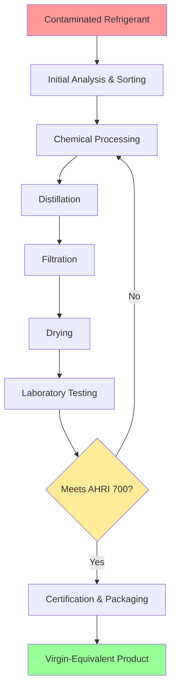

Refrigerant reclamation restores used refrigerant to virgin-level purity through chemical processing, distillation, and filtration. This process differs fundamentally from recovery (removing refrigerant) and recycling (single-pass cleaning). Reclamation achieves AHRI 700 purity specifications, making reclaimed refrigerant equivalent to new product and suitable for any application.

## Reclamation Process Overview

The reclamation process involves multiple purification stages that remove contaminants, moisture, acids, and non-condensables to restore refrigerant to specified purity levels.

## AHRI 700 Purity Standards

AHRI Standard 700 (formerly ARI 700) establishes specifications for reclaimed refrigerants. These standards ensure reclaimed product performs identically to virgin refrigerant across all system types and operating conditions.

### Critical Purity Parameters

| Parameter | Specification | Purpose |
|-----------|--------------|---------|
| Purity (min) | 99.5% by weight | Ensures proper thermodynamic properties |
| Moisture | ≤10 ppm by weight | Prevents ice formation and acid production |
| Chloride | Pass test | Detects contamination from other refrigerants |
| Acidity | ≤1 ppm by weight | Prevents oil degradation and corrosion |
| High Boiling Residue | ≤0.01% by volume | Removes oil and other contaminants |
| Particulates/Solids | Visually clean | Prevents valve and control damage |
| Non-condensables | ≤1.5% by volume | Maintains heat transfer efficiency |

### Purity Specifications by Refrigerant Type

| Refrigerant | Purity (min %) | Moisture (max ppm) | Acidity (max ppm) | Non-condensables (max %) |
|-------------|----------------|--------------------|--------------------|--------------------------|
| R-22 | 99.5 | 10 | 1 | 1.5 |
| R-134a | 99.5 | 10 | 1 | 1.5 |
| R-410A | 99.5 | 10 | 1 | 1.5 |
| R-404A | 99.5 | 10 | 1 | 1.5 |
| R-407C | 99.5 | 10 | 1 | 1.5 |
| R-123 | 99.5 | 15 | 1 | 1.5 |
| R-717 (NH3) | 99.95 | 33 | N/A | 1.5 |

## EPA Reclamation Requirements

EPA regulations under Section 608 of the Clean Air Act mandate reclamation standards for refrigerant management. Only EPA-certified reclaimers can process refrigerant for resale or redistribution.

### Certification Requirements

**Facility Certification:**
- AHRI 700 compliance demonstrated through third-party testing
- Laboratory capability for all required analyses
- Quality management system documentation
- Annual certification renewal with EPA

**Testing Protocol:**
- Gas chromatography for purity analysis
- Karl Fischer method for moisture content
- Acid number testing per AHRI 700 Appendix C
- Chloride test for cross-contamination
- High boiling residue analysis

**Documentation Requirements:**
- Chain of custody for all incoming refrigerant
- Batch testing records maintained 3 years minimum
- Certificate of Analysis (CoA) for each reclaimed batch
- Non-conformance reporting and reprocessing records

## Certified Reclaimer Selection

Selecting an EPA-certified reclaimer ensures legal compliance and product quality. Certified facilities maintain current listings with EPA and AHRI.

### Verification Process

1. **Confirm EPA Certification Status** - Verify current certification through EPA's online database
2. **Review AHRI Certification** - Check AHRI Directory of Certified Refrigerant Reclaimers
3. **Evaluate Testing Capabilities** - Ensure laboratory can perform all AHRI 700 tests
4. **Assess Turnaround Time** - Consider logistics for refrigerant return or credit
5. **Compare Financial Terms** - Evaluate reclamation cost versus replacement credit value

### Reclaimer Responsibilities

| Responsibility | Requirement |
|----------------|-------------|
| Acceptance criteria | Published specifications for acceptable incoming refrigerant |
| Testing frequency | Every batch tested per AHRI 700 protocol |
| Certification documentation | CoA provided with batch and lot numbers |
| Traceability | Full documentation from receipt through distribution |
| Non-conforming product | Reprocessing or proper disposal of failed batches |
| Labeling compliance | Containers marked as "reclaimed" per DOT/EPA requirements |

## Economic and Environmental Benefits

Reclamation provides both cost savings and environmental stewardship through refrigerant reuse rather than production of new chemical stock.

**Cost Analysis:**
- Reclaimed refrigerant typically costs 30-50% less than virgin product
- Disposal fees avoided through reclamation credit programs
- Phased-out refrigerants remain available through reclaimed supply

**Environmental Impact:**
- Reduces greenhouse gas emissions from new refrigerant production
- Prevents refrigerant release during improper disposal
- Extends useful life of existing refrigerant molecules
- Supports circular economy principles in HVAC industry

## Quality Assurance Verification

Upon receiving reclaimed refrigerant, verify documentation confirms AHRI 700 compliance and proper handling.

**Certificate of Analysis Review:**
- Batch number matches container labeling
- All AHRI 700 parameters meet specifications
- Testing date within acceptable timeframe
- Reclaimer certification current at time of processing
- Proper refrigerant designation and composition

Reclamation represents the highest standard of refrigerant processing, transforming contaminated material into virgin-equivalent product through rigorous chemical processing and quality verification. Only EPA-certified facilities operating under AHRI 700 protocols can legally reclaim refrigerant for resale, ensuring product quality and environmental protection.
