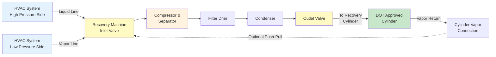

## Overview

Refrigerant recovery is the mandatory process of removing refrigerant from HVAC systems and storing it in approved containers for reuse, recycling, or reclamation. EPA 608 regulations require certified technicians to recover refrigerant to specified vacuum levels before opening or disposing of equipment containing regulated refrigerants.

## EPA 608 Recovery Requirements

**Required Vacuum Levels:**

| Equipment Type | Recovery Method | Required Vacuum (inches Hg) |
|----------------|-----------------|----------------------------|
| Small appliances (<5 lbs) | Any | 0 psig (no vacuum required) |
| High-pressure systems | System-dependent | 4 inches |
| High-pressure systems | Self-contained | 10 inches |
| Very high-pressure systems | System-dependent | 4 inches |
| Very high-pressure systems | Self-contained | 15 inches |
| Low-pressure systems | System-dependent | 25 mm Hg absolute |
| Low-pressure systems | Self-contained | 25 mm Hg absolute |

**Critical Compliance Points:**

- Recovery must occur before opening sealed systems for maintenance or disposal
- Use only EPA-certified recovery equipment meeting ARI 740 standards
- Store recovered refrigerant in DOT-approved cylinders
- Maintain recovery equipment certification documentation
- Never intentionally vent refrigerants to atmosphere

## Recovery Methods

### System-Dependent Recovery

System-dependent recovery uses the system's own compressor to push refrigerant into the recovery cylinder. This method is slower but requires minimal additional equipment.

**Applications:**
- Field service where minimal equipment transport is needed
- Systems with operational compressors
- When recovery machine is unavailable

**Limitations:**
- Achieves lower vacuum levels than self-contained equipment
- Cannot be used if system compressor is inoperative
- Slower recovery times

### Self-Contained Recovery

Self-contained recovery machines use their own compressor and operate independently of the system being serviced. These machines achieve deeper vacuum levels and faster recovery.

**Key Features:**
- Oil-less compressors to prevent contamination
- Built-in filtration and separation
- High-efficiency recovery achieving required vacuum levels
- Portable design for field service

## Recovery Equipment Setup

## Recovery Procedures

### Vapor Recovery

Vapor recovery removes refrigerant in gaseous form from the low-pressure side of the system.

**Procedure:**
1. Connect recovery machine to system low-pressure service port
2. Connect recovery cylinder to machine outlet
3. Ensure cylinder has adequate capacity (80% max fill)
4. Open system and cylinder valves
5. Start recovery machine
6. Monitor manifold gauges until required vacuum is achieved
7. Close all valves and allow system to stand for 5 minutes
8. Check for pressure rise indicating trapped refrigerant

**Recovery Rate:** 1-3 lbs/min depending on equipment and system conditions

### Liquid Recovery

Liquid recovery is significantly faster than vapor recovery and should be performed first when possible.

**Procedure:**
1. Connect recovery machine to system high-pressure liquid line
2. Position recovery cylinder below system level if possible
3. Open liquid service valve slowly to prevent flash gas
4. Recover liquid phase until flow stops or pressure equalizes
5. Switch to vapor recovery to complete the process
6. Continue to required vacuum level

**Recovery Rate:** 5-15 lbs/min for liquid phase

### Push-Pull Recovery Method

Push-pull recovery uses system vapor pressure to push liquid into the recovery cylinder while the recovery machine pulls vapor from the cylinder top, significantly increasing recovery speed.

**Setup:**
1. Connect liquid line from system to recovery cylinder liquid valve
2. Connect recovery machine inlet to cylinder vapor valve
3. Connect recovery machine outlet back to system low side
4. Create continuous circulation loop

**Advantages:**
- Recovery rates up to 20 lbs/min
- Reduced recovery time on large systems
- More complete refrigerant removal

## Recovery Equipment Types

| Equipment Class | Capacity | Application | ARI 740 Rating |
|----------------|----------|-------------|----------------|
| Small appliance | <15 lbs | Window units, dehumidifiers | 4 oz/min minimum |
| Light commercial | 15-50 lbs | Split systems, RTUs | 1-3 lbs/min |
| Commercial | 50-200 lbs | Large RTUs, chillers | 3-8 lbs/min |
| Industrial | >200 lbs | Central plants, large chillers | 8-20 lbs/min |

## Recovery Cylinder Requirements

**DOT Certification:**
- Use only DOT-approved cylinders (DOT 4BA or 4BW specification)
- Verify current hydrostatic test certification (5-year intervals)
- Never use disposable cylinders for recovery

**Fill Limits:**
- Maximum 80% liquid fill by weight
- Calculate using cylinder tare weight and refrigerant density
- Account for temperature effects on liquid expansion

**Cylinder Identification:**
- Gray body with yellow top for recovered refrigerant
- Label with refrigerant type
- Record date of recovery
- Never mix different refrigerants

## Safety Considerations

**Pressure Management:**
- Never expose cylinders to temperatures above 125°F
- Use pressure relief valves on all connections
- Monitor cylinder pressure during recovery

**Contamination Prevention:**
- Use dedicated cylinders for each refrigerant type
- Install filter driers in recovery lines
- Inspect and change recovery machine oil regularly

**Personal Protection:**
- Wear safety glasses and gloves
- Work in ventilated areas
- Have emergency procedures for refrigerant exposure

## Recovery Rate Optimization

| Factor | Impact on Recovery Rate | Optimization Strategy |
|--------|------------------------|----------------------|
| Refrigerant temperature | Higher temp = faster recovery | Operate system briefly to warm refrigerant |
| Line diameter | Larger = less restriction | Use 3/8" or 1/2" hoses minimum |
| Hose length | Shorter = less pressure drop | Minimize hose lengths |
| Cylinder temperature | Cooler = better condensing | Keep cylinder cool, never below 32°F |
| Filter condition | Clean = better flow | Replace filters regularly |
| Recovery machine oil | Clean oil = efficiency | Change oil per manufacturer specs |

## Verification and Documentation

After completing recovery:

1. Allow system to stand for 5 minutes minimum
2. Verify vacuum holds without pressure rise
3. If pressure rises above required level, repeat recovery
4. Document refrigerant type, amount recovered, and final vacuum level
5. Label system as refrigerant-free if applicable
6. Record recovery cylinder identification and fill weight

**Incomplete Recovery Indicators:**
- Pressure rise during standing period
- System components still cold after recovery
- Recovery amount significantly less than system nameplate charge

Recovery procedures form the foundation of responsible refrigerant management and environmental compliance. Proper technique ensures regulatory compliance, maximizes refrigerant reuse, and protects both technicians and the environment from harmful emissions.
