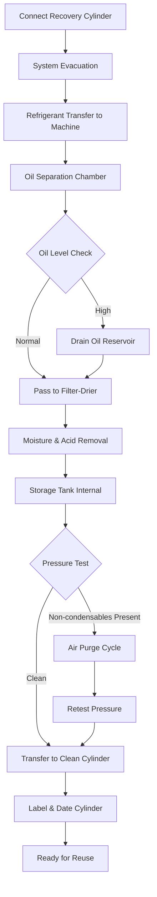

Refrigerant recycling is the process of extracting contaminated refrigerant from HVAC systems and restoring it to acceptable purity levels through filtration and separation processes. On-site recycling reduces material costs, minimizes environmental impact, and enables immediate system recharging with cleaned refrigerant.

## ARI 740 Recycling Standards

The Air-Conditioning, Heating, and Refrigeration Institute (ARI) Standard 740 defines the minimum performance requirements for refrigerant recycling equipment. This standard ensures recycled refrigerant meets specific purity criteria for safe reuse.

### Purity Requirements

| Parameter | Maximum Allowable Level | Test Method |
|-----------|------------------------|-------------|
| Moisture Content | 50 ppm by weight | ARI 740-1998 |
| Acid Content | 1 ppm by weight (as HCl) | ARI 740-1998 |
| Particulate Matter | Visually clean (no residue) | ARI 740-1998 |
| Non-Condensable Gases | 2% by volume | ARI 740-1998 |
| High Boiling Residue | Not specified for recycling | - |
| Chloride Ion | 3 ppm maximum | Ion chromatography |

ARI 740 equipment must demonstrate the ability to consistently achieve these purity levels across multiple test cycles using contaminated refrigerant samples.

## On-Site Recycling Equipment

Modern recycling machines integrate three primary contamination removal systems into portable units weighing 40-80 lbs for field service applications.

### Core Components

**Oil Separator**
- Centrifugal or coalescing filter design
- Removes 80-95% of entrained compressor oil
- Operating pressure: 150-300 psig
- Separator efficiency depends on refrigerant velocity and temperature

**Filter-Drier Assembly**
- Replaceable core containing molecular sieve desiccant
- Removes moisture, acids, and solid particulates
- Typical capacity: 16-32 oz desiccant per cartridge
- Replace when moisture breakthrough occurs (indicator change)

**Air Purge System**
- Automated or manual non-condensable gas venting
- Operates when machine reaches thermal equilibrium
- Purges from high side while refrigerant is in liquid phase
- Pressure differential indicates presence of air (>10 psi above saturation)

## Recycling Process Workflow

## Oil Separation Process

Lubricating oil circulates through HVAC systems and mixes with refrigerant, creating a contamination that reduces heat transfer efficiency and clogs expansion devices.

### Separation Methods

**Gravity Separation**
- Relies on density difference between oil and refrigerant
- Requires 10-30 minutes residence time in separator vessel
- Effective for oil concentrations above 5% by weight
- Temperature maintained at 70-90°F for optimal separation

**Centrifugal Separation**
- Uses rotating impeller to generate 500-2000 G forces
- Separates oil droplets as small as 1 micron
- Processing rate: 1-3 lbs refrigerant per minute
- More effective for POE and PVE synthetic oils

Oil drained from separators contains 10-30% dissolved refrigerant. Allow drained oil to de-gas in open container for 24 hours before disposal or reclamation.

## Moisture Removal Process

Water contamination causes acid formation, copper plating, and ice blockages in expansion devices. Recycling machines use molecular sieve desiccants to achieve moisture levels below 50 ppm.

### Desiccant Performance

| Desiccant Type | Water Capacity | Acid Removal | Regeneration Temp |
|----------------|---------------|--------------|-------------------|
| Type 3A Molecular Sieve | 20-22% by weight | Minimal | 350-550°F |
| Type 4A Molecular Sieve | 22-24% by weight | Moderate | 350-550°F |
| Activated Alumina | 18-20% by weight | Good | 350-450°F |
| Silica Gel | 6-8% by weight | Poor | 250-350°F |

Replace filter-drier cores when:
- Moisture indicator shows saturation (color change)
- Processing time doubles from baseline
- Outlet moisture levels exceed 50 ppm
- After recycling 200-400 lbs refrigerant (manufacturer specification)

## Acid Removal Process

Acids form when moisture reacts with refrigerant breakdown products or POE lubricants. Hydrochloric acid (HCl) and hydrofluoric acid (HF) corrode copper and aluminum components.

### Removal Mechanisms

**Activated Alumina Adsorption**
- Surface area: 200-300 m²/g
- Removes organic and inorganic acids
- Capacity: 0.5-2% by weight acid
- Indicated by pH test strips (target pH 6-8)

**Molecular Sieve Interaction**
- Secondary acid removal through ion exchange
- Effective for low concentration polishing (<10 ppm)
- Regeneration releases captured acids

Test recycled refrigerant acid content using pH indicator test strips. Draw 10 ml sample, add pH indicator solution, observe color change. Yellow-green indicates acceptable acid levels (pH 6-8), while red indicates excessive acidity requiring additional filtration.

## Equipment Operation Standards

### Pre-Operation Checks

1. Verify filter-drier moisture indicator shows dry condition (blue or green)
2. Check oil separator reservoir level (drain if above 50% capacity)
3. Inspect hoses for cracks, verify connections are clean
4. Confirm storage cylinder is evacuated below 500 microns
5. Ensure machine sits level for accurate oil separation

### Operating Parameters

| Parameter | Typical Range | Critical Limit |
|-----------|--------------|----------------|
| Operating Pressure | 100-250 psig | 400 psig max |
| Process Temperature | 60-100°F | 130°F max |
| Flow Rate | 0.5-3 lbs/min | Per manufacturer |
| Filter Pressure Drop | <5 psi clean | Replace >20 psi |
| Oil Drain Interval | Every 50 lbs | Per saturation |

### Quality Verification

After recycling, verify refrigerant purity:
- Standing pressure test: Compare cylinder pressure to saturation pressure at ambient temperature (within ±10 psi indicates <2% non-condensables)
- Moisture test: Use electronic moisture sensor or indicator (target <50 ppm)
- Visual inspection: Liquid refrigerant should be clear, colorless, free of particles
- Acid test: pH test strips should indicate neutral to slightly alkaline

Label recycled refrigerant cylinders with refrigerant type, recycling date, quantity, and technician identification. Storage time limit is typically 6-12 months before retesting is required.
