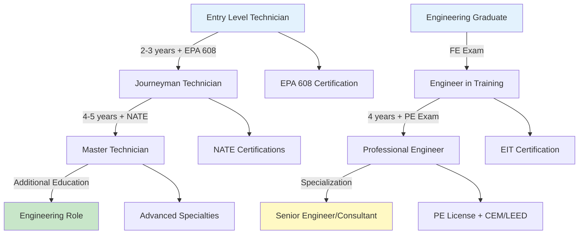
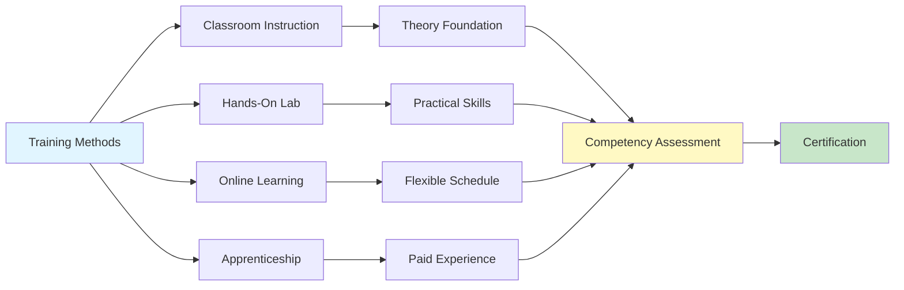

## Overview of HVAC Professional Development

Professional development in HVAC encompasses a structured progression of technical knowledge, practical skills, regulatory compliance, and specialized expertise. The field demands continuous learning due to evolving technologies, changing refrigerant regulations, updated energy codes, and advancing control systems. A comprehensive training program integrates thermodynamic principles, hands-on equipment operation, safety protocols, and business practices.

The HVAC profession stratifies into distinct career paths requiring specific educational foundations and certifications. Entry-level technicians focus on equipment installation and maintenance, while engineers design systems based on load calculations and energy analysis. Both paths require foundational understanding of heat transfer, fluid mechanics, and psychrometrics, supplemented by specialized training in particular systems or applications.

## Career Progression Framework

HVAC career advancement follows a competency-based progression model where practitioners acquire increasingly sophisticated technical and analytical skills. The progression typically spans three distinct phases: foundational technical skills, advanced system integration, and expert-level design or diagnostics.

## Essential Certification Categories

HVAC professional certifications divide into regulatory requirements and voluntary credentials that demonstrate specialized competency. Regulatory certifications ensure compliance with environmental and safety regulations, while voluntary certifications validate technical proficiency and industry best practices.

### Certification Comparison Matrix

| Certification | Issuing Body | Requirement Type | Renewal Period | Primary Focus | Experience Required |
|--------------|--------------|------------------|----------------|---------------|---------------------|
| EPA 608 | US EPA | Mandatory (refrigerant) | Lifetime | Refrigerant handling | None |
| EPA 609 | US EPA | Mandatory (automotive) | Lifetime | Mobile A/C refrigerant | None |
| NATE | NATE Inc. | Voluntary | 2 years | Technical competency | 2 years recommended |
| PE License | State Boards | Professional | Annual | Engineering practice | 4 years minimum |
| CEM | AEE | Voluntary | 3 years | Energy management | 3 years minimum |
| LEED AP | USGBC | Voluntary | 2 years | Green building design | None (exam only) |
| HVAC Excellence | HVAC Excellence | Voluntary | 2 years | Technical skills | Varies by level |

## Technical Training Fundamentals

Technical training in HVAC begins with thermodynamic principles that govern all climate control systems. The first law of thermodynamics establishes energy conservation in HVAC processes:

$$Q = \dot{m} \cdot c_p \cdot \Delta T$$

where heat transfer rate $Q$ (Btu/hr or kW) depends on mass flow rate $\dot{m}$ (lb/hr or kg/s), specific heat $c_p$ (Btu/lb·°F or kJ/kg·K), and temperature change $\Delta T$ (°F or K).

The vapor compression refrigeration cycle forms the foundation of most HVAC cooling systems. Training must cover the four fundamental processes:

1. **Compression**: Refrigerant vapor compression increases pressure and temperature, requiring compressor work input $W_{comp}$
2. **Condensation**: High-pressure vapor rejects heat to ambient environment at the condenser
3. **Expansion**: Throttling device reduces pressure, causing temperature drop through isenthalpic process
4. **Evaporation**: Low-pressure refrigerant absorbs heat from conditioned space

The coefficient of performance (COP) quantifies refrigeration cycle efficiency:

$$COP_{cooling} = \frac{Q_{evap}}{W_{comp}} = \frac{h_1 - h_4}{h_2 - h_1}$$

where $h$ represents specific enthalpy at cycle state points. Typical air-conditioning systems achieve COP values of 2.5 to 4.0, depending on operating conditions and equipment efficiency.

## Psychrometric Analysis Training

Psychrometric principles govern air conditioning processes and require thorough training for system design and troubleshooting. The psychrometric chart graphically represents air properties including dry-bulb temperature, wet-bulb temperature, relative humidity, humidity ratio, and enthalpy.

Sensible heat ratio (SHR) determines the proportion of total cooling capacity dedicated to temperature reduction versus moisture removal:

$$SHR = \frac{Q_{sensible}}{Q_{total}} = \frac{Q_{sensible}}{Q_{sensible} + Q_{latent}}$$

ASHRAE Standard 62.1 specifies minimum ventilation rates for acceptable indoor air quality, requiring practitioners to calculate outdoor air requirements based on occupancy and space function. Training must include ventilation effectiveness calculations using the air change effectiveness equation:

$$\varepsilon = \frac{C_{exhaust} - C_{supply}}{C_{zone} - C_{supply}}$$

where $C$ represents contaminant concentration at specified locations. Values of $\varepsilon$ greater than 1.0 indicate superior ventilation effectiveness compared to perfect mixing conditions.

## Safety Training Requirements

HVAC work involves multiple safety hazards requiring comprehensive training programs. OSHA regulations mandate specific training for electrical work, confined space entry, fall protection, and hazardous material handling. High-voltage electrical systems present electrocution risks, while refrigerants pose chemical exposure hazards.

### Safety Training Compliance Matrix

| Hazard Category | OSHA Standard | Training Frequency | Certification Required | Competent Person |
|----------------|---------------|-------------------|----------------------|------------------|
| Electrical Safety | 1910.332-335 | Annual | Qualified Person | Yes |
| Confined Space | 1910.146 | Annual | Entry Supervisor | Yes |
| Fall Protection | 1926.503 | Annual | Competent Person | Yes |
| Lockout/Tagout | 1910.147 | Annual | Authorized Employee | Yes |
| Respiratory Protection | 1910.134 | Annual | Fit Test Required | Medical Clearance |
| Refrigerant Handling | EPA 608 | Initial Only | EPA Certification | No |

Refrigerant safety training covers proper cylinder handling, leak detection procedures, and emergency response protocols. A-class refrigerants (non-flammable, low toxicity) like R-410A require standard handling procedures, while A2L refrigerants (mildly flammable) like R-32 demand enhanced safety protocols including leak detection systems and ventilation requirements per ASHRAE Standard 15.

## Continuing Education and Professional Development

Continuing education maintains technical currency as HVAC technology evolves. Professional engineering licenses require continuing professional development (CPD) credits, typically 15-30 hours annually depending on state requirements. ASHRAE offers continuing education units (CEUs) through conferences, webinars, and technical publications.

### Professional Development Hours by Credential

| Credential | Annual PDH/CEU | Acceptable Activities | Carryover Allowed | Documentation Required |
|-----------|----------------|----------------------|------------------|------------------------|
| PE License | 15-30 (varies) | Courses, seminars, teaching | Yes (varies) | Certificates of completion |
| LEED AP | 15 per year | GBCI-approved courses | No | GBCI tracking system |
| CEM | 10 per year | AEE programs, conferences | Yes (limited) | AEE records |
| ASHRAE Certifications | 10 per year | Technical programs | Yes | ASHRAE database |
| NATE | N/A | Re-examination required | N/A | Test scores |

Advanced training topics include building automation systems, energy modeling software, computational fluid dynamics (CFD) analysis, and renewable energy integration. Control systems training progresses from basic thermostats to complex building management systems with integrated sensors, actuators, and optimization algorithms.

Energy analysis training incorporates utility rate structures, demand response strategies, and life-cycle cost analysis. The net present value (NPV) calculation evaluates long-term investment decisions:

$$NPV = \sum_{t=0}^{n} \frac{CF_t}{(1+r)^t}$$

where $CF_t$ represents cash flow at time $t$, $r$ is discount rate (typically 3-8% for HVAC projects), and $n$ is analysis period in years (typically 15-25 years for equipment life).

## Specialized Technical Training Paths

HVAC specialization training focuses on specific applications or technologies requiring advanced expertise. Commissioning training follows ASHRAE Guideline 0 and Guideline 1.1 protocols for verifying system performance. Energy auditing training aligns with ASHRAE Standard 211 procedures for commercial building energy assessments across three levels:

- **Level I**: Walk-through assessment identifying low-cost improvements
- **Level II**: Detailed energy survey with engineering analysis
- **Level III**: Investment-grade audit with comprehensive data monitoring

Digital control systems training covers programming languages (ladder logic, structured text), communication protocols (BACnet, Modbus, LonWorks), and cybersecurity fundamentals. Variable refrigerant flow (VRF) systems require manufacturer-specific training on control algorithms, refrigerant piping design constraints, and commissioning procedures.

Cleanroom and critical environment training addresses stringent temperature, humidity, and particulate control requirements per ISO 14644 standards. Data center cooling training focuses on high-density heat loads exceeding 15 kW per rack, precision cooling equipment, and redundancy strategies for mission-critical facilities.

## Training Delivery Methods

Training delivery methods range from traditional classroom instruction to virtual reality simulations and hands-on laboratory exercises. Blended learning approaches combine theoretical knowledge with practical application for optimal skill development.

Manufacturer training programs provide equipment-specific knowledge essential for proper installation, operation, and maintenance. Major manufacturers offer training at dedicated facilities with operational equipment for hands-on practice.

Apprenticeship programs integrate structured classroom education with supervised on-the-job training over 3-5 year periods. Technical colleges and trade schools offer associate degree programs combining HVAC theory with general education requirements. University engineering programs provide comprehensive thermodynamic analysis, system design methodology, and research capabilities.

## Professional Organizations and Resources

ASHRAE serves as the primary technical resource organization for HVAC professionals, publishing standards, handbooks, and research findings. The ASHRAE Handbook series provides authoritative reference material across four volumes: Fundamentals, HVAC Systems and Equipment, HVAC Applications, and Refrigeration.

Professional organizations offer networking opportunities, technical conferences, and certification programs:

- **ASHRAE**: Technical society emphasizing research, standards development, and education
- **RSES**: Technician-focused organization with hands-on training emphasis
- **ACCA**: Contractor association providing business management and technical resources
- **AEE**: Energy management professionals specializing in efficiency and sustainability
- **SMACNA**: Sheet metal and air distribution system installation standards

Trade publications provide current industry information on new technologies, code updates, and best practices. Online learning platforms deliver flexible training options for working professionals. Webinars, podcasts, and video tutorials supplement formal education programs.

## Strategic Career Planning

Career advancement requires strategic certification timing and selection aligned with professional goals. Entry-level professionals should prioritize EPA 608 Universal and OSHA 10 as immediate requirements enabling legal practice. Technicians benefit from pursuing NATE specialties aligned with daily work scope, establishing credibility with customers and employers.

Engineers should target PE licensure within 4-6 years of graduation, documenting qualifying experience under licensed PE supervision. Adding sustainability credentials (LEED AP, CEM) positions professionals for green building and energy management roles. Controls specialists gain value through manufacturer-specific training in building automation platforms.

The HVAC profession rewards continuous learning and credential development. Strategic professional development accelerates career advancement while maintaining technical competency in this rapidly evolving field. Investment in education and certification yields career mobility, earning potential, and professional recognition throughout a multi-decade career trajectory.

---

**Related Topics:**
- Professional Certifications
- Safety Training Programs
- Specialized Technical Training
- ASHRAE Standards and Publications
- Energy Management Training
