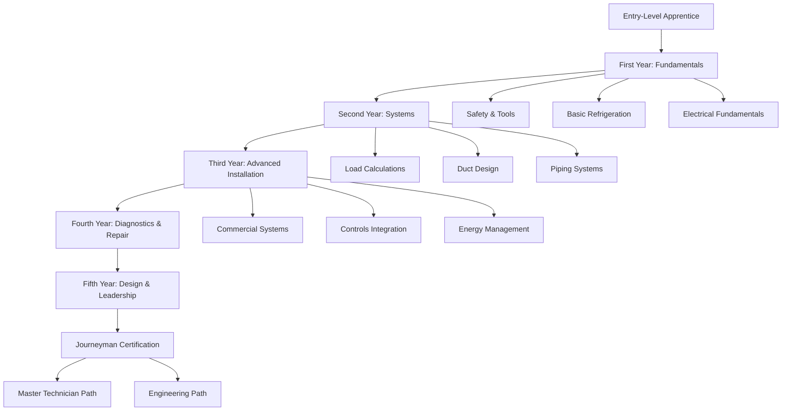

# HVAC Apprenticeship Programs

HVAC apprenticeship programs combine classroom instruction with supervised on-the-job training to develop skilled technicians capable of designing, installing, maintaining, and troubleshooting climate control systems. These structured programs typically span 3-5 years and provide comprehensive training in thermodynamics, refrigeration cycles, electrical systems, and mechanical installation techniques.

## Program Structure and Duration

### Standard Apprenticeship Models

Apprenticeship programs follow established frameworks that balance theoretical knowledge with practical skill development:

| Program Type | Duration | Classroom Hours | OJT Hours | Certification Outcome |
|--------------|----------|-----------------|-----------|----------------------|
| Union (UA/SMACNA) | 5 years | 900-1000 | 10,000 | Journeyman |
| Non-Union | 3-4 years | 576-800 | 6,000-8,000 | Journeyman |
| Military (Navy/Air Force) | 18-24 months | 400-600 | 3,000-4,000 | Trade Specialist |
| Community College | 2 years + 2 years OJT | 720 | 4,000 | AAS + Journeyman |

### Competency Progression Framework

## Technical Curriculum Components

### Year 1: Fundamental Principles

**Thermodynamics and Heat Transfer**

Apprentices learn core energy relationships governing HVAC systems. The fundamental heat transfer equation defines conduction through building envelopes:

$$Q = \frac{k \cdot A \cdot \Delta T}{d}$$

Where:
- $Q$ = heat transfer rate (BTU/hr or W)
- $k$ = thermal conductivity (BTU·in/hr·ft²·°F or W/m·K)
- $A$ = surface area (ft² or m²)
- $\Delta T$ = temperature difference (°F or K)
- $d$ = material thickness (in or m)

**Refrigeration Cycle Mastery**

Understanding the vapor-compression cycle requires analyzing four key processes:

$$\text{COP}_{\text{cooling}} = \frac{Q_{\text{evap}}}{W_{\text{comp}}} = \frac{h_1 - h_4}{h_2 - h_1}$$

Where enthalpy values ($h$) correspond to refrigerant states at compressor inlet (1), discharge (2), condenser outlet (4), and evaporator inlet (4).

**Electrical Systems Foundation**

Power calculations for three-phase equipment form the basis for electrical troubleshooting:

$$P = \sqrt{3} \cdot V_L \cdot I_L \cdot \text{PF}$$

Where $P$ is power (W), $V_L$ is line voltage (V), $I_L$ is line current (A), and PF is power factor (0.85-0.95 typical).

### Year 2: System Design and Sizing

**Load Calculation Methods**

Training in ASHRAE Fundamentals methodology for residential and light commercial applications. Manual J procedures require calculating heat gain from multiple sources:

$$Q_{\text{total}} = Q_{\text{transmission}} + Q_{\text{infiltration}} + Q_{\text{internal}} + Q_{\text{solar}}$$

**Airflow and Duct Sizing**

Pressure drop calculations using the Darcy-Weisbach equation adapted for duct systems:

$$\Delta P = f \cdot \frac{L}{D_h} \cdot \frac{\rho V^2}{2}$$

Where $f$ is friction factor (from Moody chart), $L$ is duct length, $D_h$ is hydraulic diameter, $\rho$ is air density, and $V$ is velocity.

### Year 3-4: Advanced Applications

**Commercial Refrigeration**

Multi-circuit systems, parallel rack configurations, and heat reclaim strategies. Apprentices learn compressor staging algorithms and capacity modulation techniques.

**Building Automation Systems**

Integration with DDC controllers, sensor calibration, and PID loop tuning. Understanding control sequences per ASHRAE Guideline 36 for high-performance buildings.

**Energy Analysis**

Calculating seasonal energy efficiency using bin method analysis:

$$\text{SEER} = \frac{\sum(\text{Cooling Load}_i \times \text{Hours}_i)}{\sum(\text{Power Input}_i \times \text{Hours}_i)}$$

## On-the-Job Training Requirements

### Competency Verification Matrix

| Skill Category | Required Tasks | Proficiency Level | Evaluation Method |
|----------------|----------------|-------------------|-------------------|
| Brazing/Soldering | 50+ joints | Pass pressure test 500 psig | Visual + leak test |
| Electrical Wiring | 25+ units | Code compliant | Inspector approval |
| Refrigerant Handling | EPA certification | Type II minimum | Written + practical |
| Duct Installation | 500+ linear feet | Within 10% design CFM | TAB verification |
| Startup/Commissioning | 20+ systems | Achieve design parameters | Performance data |
| Troubleshooting | 100+ service calls | 85% correct diagnosis | Supervisor review |

### Safety Training Integration

All apprenticeship programs must incorporate OSHA 30-hour construction safety training, confined space entry procedures, electrical safety (NFPA 70E), and refrigerant handling protocols per EPA Section 608 regulations.

## Wage Progression and Economic Benefits

Apprentice compensation typically follows a percentage-of-journeyman scale:

| Year | Percentage of Journeyman Wage | Average Hourly Rate (2025) |
|------|------------------------------|---------------------------|
| 1st Year | 40-50% | $18-22 |
| 2nd Year | 50-60% | $22-26 |
| 3rd Year | 60-75% | $26-33 |
| 4th Year | 75-85% | $33-37 |
| 5th Year | 85-95% | $37-42 |
| Journeyman | 100% | $44-52 |

Total program earnings exceed $150,000 while avoiding student loan debt, representing a superior return on investment compared to many four-year degree programs.

## Certification Pathways

### Required Credentials

- **EPA Section 608 Certification**: Universal certification required for refrigerant handling
- **OSHA Safety Training**: 10-hour minimum, 30-hour preferred
- **State/Local Licensing**: Varies by jurisdiction (mechanical contractor license, journey card)
- **Manufacturer Certifications**: Brand-specific training for warranty and technical support

### Advanced Specializations

Post-apprenticeship specialization options include:
- NATE (North American Technician Excellence) specialty certifications
- Building Analyst certification (BPI)
- LEED AP with specialty in building operations
- Certified Energy Manager (CEM)
- Professional Engineer (PE) licensure path

## Program Selection Criteria

### Evaluating Quality Indicators

1. **Accreditation Status**: HVAC Excellence, PAHRA, or state apprenticeship council approval
2. **Instructor Credentials**: Minimum 10 years field experience plus teaching certification
3. **Equipment Access**: Modern training labs with current technology (variable-speed systems, smart controls)
4. **Employer Network**: Established partnerships with contractors for job placement
5. **Completion Rates**: Programs should demonstrate >70% graduation rates
6. **Post-Graduation Employment**: >90% placement within 6 months

### Union vs. Non-Union Considerations

| Factor | Union Programs (UA/SMACNA) | Non-Union Programs |
|--------|---------------------------|-------------------|
| Structure | Highly standardized, 5-year duration | Variable, 3-4 years typical |
| Cost to Apprentice | Free (union-funded) | $0-5,000 tuition |
| Benefits During Training | Health insurance, pension contributions | Varies by employer |
| Job Placement | Through union hiring hall | Independent job search |
| Geographic Flexibility | Limited to union jurisdiction | Nationwide portability |
| Wage Standards | Collectively bargained scale | Market-driven rates |

## Integration with Academic Credentials

Many programs articulate with community college Associate of Applied Science (AAS) degrees in HVAC Technology. This dual-credential approach provides:

- Technical college credits that transfer to bachelor's programs in mechanical engineering technology
- Broader education in physics, mathematics, and technical communication
- Enhanced career mobility into design, sales engineering, and management roles
- Eligibility for federal financial aid during classroom phases

## Emerging Technology Training

Modern apprenticeship curricula incorporate training on:

- **Variable Refrigerant Flow (VRF)** systems with heat recovery
- **Geothermal heat pump** installation and commissioning
- **Building automation protocols** (BACnet, LonWorks, Modbus)
- **Low-GWP refrigerants** (R-32, R-454B, R-1234yf)
- **Integrated renewable energy** systems (solar thermal, photovoltaic integration)
- **Advanced diagnostics** using dataloggers, psychrometers, and thermal imaging

These competencies ensure apprentices enter the workforce prepared for high-efficiency building systems and evolving environmental regulations.

## Conclusion

HVAC apprenticeship programs represent the most effective pathway for developing highly skilled technicians capable of meeting industry demands. The combination of rigorous classroom instruction in thermodynamic principles, extensive supervised field experience, and progressive competency development creates professionals who understand both the theoretical foundations and practical applications of climate control technology. With strong employment prospects, competitive wages, and clear advancement pathways, apprenticeships offer exceptional value for individuals seeking technical careers in the built environment.
