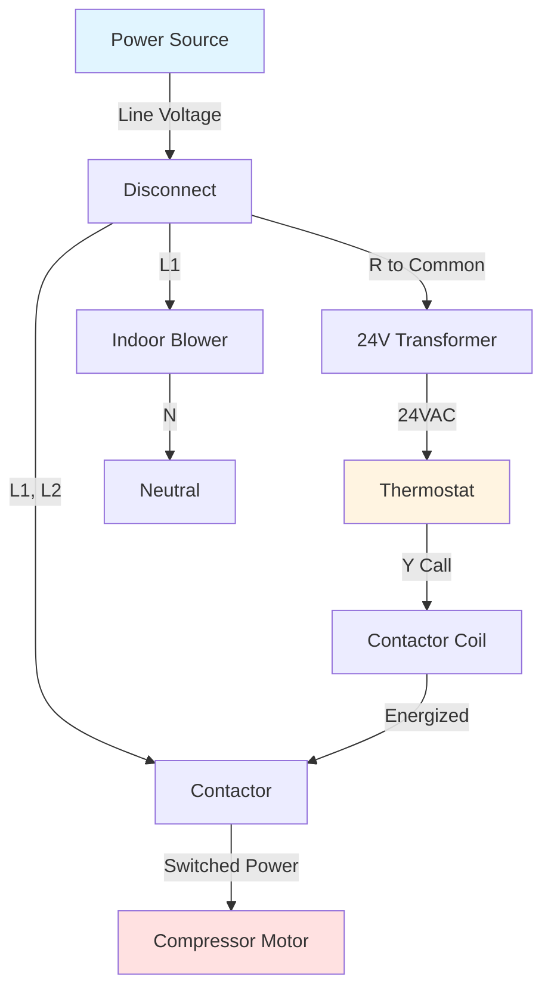
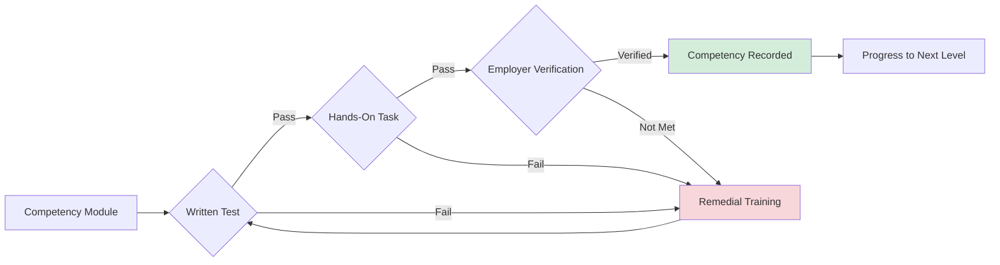

## Overview

Non-union HVAC apprenticeships provide structured, competency-based training pathways that combine classroom instruction with supervised on-the-job training. These programs, administered primarily through Associated Builders and Contractors (ABC), National Center for Construction Education and Research (NCCER), and HVAC Excellence, offer flexible, portable credentials recognized across the industry. The competency-based model allows apprentices to progress based on demonstrated mastery of technical skills rather than fixed time periods.

Non-union programs emphasize performance verification through standardized assessments, modular curriculum design, and stackable credentials that facilitate career mobility. The training integrates fundamental physics principles with practical application, ensuring apprentices understand both theoretical foundations and hands-on techniques required for professional HVAC work.

## Program Structure and Duration

### Time-Based vs. Competency-Based Models

Non-union apprenticeships typically employ hybrid models combining minimum time requirements with performance verification:

**Standard Duration Framework**
- Total program length: 3-4 years (6,000-8,000 hours)
- On-the-job training: 85-90% of total hours
- Classroom instruction: 10-15% of total hours (typically 576-720 hours)
- Competency checkpoints at regular intervals
- Accelerated completion possible with demonstrated proficiency

**Competency Milestones**

| Level | Hours Required | Wage Percentage | Key Competencies |
|-------|----------------|-----------------|------------------|
| First Year | 0-2,000 | 50-60% | Basic hand tools, safety, refrigeration fundamentals |
| Second Year | 2,000-4,000 | 60-70% | System diagnostics, electrical circuits, airflow measurement |
| Third Year | 4,000-6,000 | 70-85% | Load calculations, duct design, complex troubleshooting |
| Fourth Year | 6,000-8,000 | 85-95% | System optimization, energy analysis, advanced controls |

## Major Program Administrators

### Associated Builders and Contractors (ABC)

ABC operates the largest network of non-union apprenticeship programs across North America. The ABC apprenticeship model integrates construction industry best practices with HVAC-specific technical training.

**Curriculum Structure**
- Craft training modules aligned with industry certifications
- Progression through 4 levels with defined competencies
- National training standards with local customization
- Integration with NCCER credentials
- Emphasis on safety, productivity, and quality workmanship

**Assessment Methods**
- Written examinations on technical knowledge
- Hands-on performance tasks evaluated by certified instructors
- Project-based assessments simulating real-world scenarios
- Employer feedback on workplace competencies
- Third-party certification testing (EPA, NATE, etc.)

### National Center for Construction Education and Research (NCCER)

NCCER provides standardized, modular curriculum used by ABC and independent training centers. The NCCER HVAC curriculum covers residential, light commercial, and commercial systems through progressive levels.

**Level 1 - Fundamentals** (625 hours classroom + OJT)
- Introduction to HVAC systems and careers
- Trade mathematics and applied physics
- Basic electricity for HVAC technicians
- Introduction to cooling and heating systems
- Basic copper and plastic piping practices
- Soldering and brazing techniques
- Ferrous metal piping practices

**Level 2 - Intermediate Skills** (625 hours classroom + OJT)
- Alternating current circuits and analysis
- Electric motors and motor controls
- Air quality and distribution systems
- Leak detection, evacuation, recovery, and charging
- Compressors operation and maintenance
- Condensers and evaporators heat transfer analysis
- Metering devices and refrigerant flow control

**Level 3 - Advanced Applications** (625 hours classroom + OJT)
- Heat pumps including reversing cycle thermodynamics
- Gas heating furnaces and combustion analysis
- Hydronic heating systems and fluid mechanics
- Zone control systems and building automation
- System air balancing and measurement
- Troubleshooting complex equipment failures
- Commercial HVAC equipment fundamentals

**Level 4 - Commercial Systems** (625 hours classroom + OJT)
- Commercial air conditioning systems
- Commercial heating equipment
- Air distribution systems and duct design
- Energy management systems and controls
- Preventive maintenance programs
- System commissioning procedures
- Building management system integration

### HVAC Excellence Apprenticeship

HVAC Excellence offers employment-based apprenticeship programs registered with the U.S. Department of Labor. These programs integrate technical training with progressive certifications.

**Program Components**
- Related technical instruction (RTI) delivered through accredited schools
- Structured on-the-job learning with documented competencies
- Integration with HVAC Excellence certification exams
- Employment-focused skill development
- Employer-directed training customization

## Thermodynamic Foundations in Apprentice Training

### Refrigeration Cycle Analysis

Apprentices must demonstrate understanding of vapor-compression cycle physics through calculation and measurement skills.

**Basic Refrigeration Cycle Energy Balance**

The coefficient of performance (COP) for cooling systems represents the ratio of heat removed to work input:

$$COP_{cooling} = \frac{Q_c}{W_{comp}} = \frac{h_1 - h_4}{h_2 - h_1}$$

Where:
- $Q_c$ = cooling capacity (Btu/h or kW)
- $W_{comp}$ = compressor work input (Btu/h or kW)
- $h_1$ = enthalpy at compressor inlet (Btu/lb or kJ/kg)
- $h_2$ = enthalpy at compressor discharge (Btu/lb or kJ/kg)
- $h_4$ = enthalpy at evaporator inlet (Btu/lb or kJ/kg)

**Carnot Efficiency Comparison**

The theoretical maximum COP based on operating temperatures:

$$COP_{Carnot} = \frac{T_c}{T_h - T_c}$$

Where:
- $T_c$ = evaporator absolute temperature (°R or K)
- $T_h$ = condenser absolute temperature (°R or K)

Apprentices learn that actual system COP typically ranges from 40-60% of Carnot efficiency due to real-world irreversibilities including:
- Compressor inefficiency (mechanical and volumetric losses)
- Pressure drops in piping and heat exchangers
- Heat transfer across finite temperature differences
- Refrigerant superheating and subcooling requirements

### Heat Transfer Calculations

**Sensible Cooling Load**

The fundamental equation for sensible heat removal:

$$Q_s = 1.08 \times CFM \times \Delta T$$

Where:
- $Q_s$ = sensible cooling capacity (Btu/h)
- $CFM$ = volumetric airflow rate (ft³/min)
- $\Delta T$ = temperature difference across coil (°F)
- 1.08 = constant incorporating air density and specific heat (0.075 lb/ft³ × 0.24 Btu/lb·°F × 60 min/h)

**Latent Cooling Load**

Moisture removal capacity calculation:

$$Q_l = 0.68 \times CFM \times \Delta W$$

Where:
- $Q_l$ = latent cooling capacity (Btu/h)
- $\Delta W$ = humidity ratio difference (grains H₂O/lb dry air)
- 0.68 = constant incorporating air density and latent heat (0.075 lb/ft³ × 1,061 Btu/lb × 60 min/h ÷ 7,000 grains/lb)

**Total Cooling**

$$Q_t = Q_s + Q_l$$

The sensible heat ratio (SHR) determines equipment selection:

$$SHR = \frac{Q_s}{Q_t}$$

Typical residential applications require SHR = 0.70-0.80, while data centers require SHR approaching 1.0.

## Electrical Fundamentals for HVAC

### Circuit Analysis Training

**Ohm's Law Applications**

$$V = I \times R$$

$$P = V \times I = I^2 \times R = \frac{V^2}{R}$$

Apprentices apply these relationships for:
- Component resistance verification
- Circuit current calculation
- Power consumption analysis
- Voltage drop determination in wire sizing

**Three-Phase Power Calculations**

For commercial equipment:

$$P_{3\phi} = \sqrt{3} \times V_{L-L} \times I_L \times PF$$

Where:
- $P_{3\phi}$ = three-phase power (watts)
- $V_{L-L}$ = line-to-line voltage (volts)
- $I_L$ = line current (amperes)
- $PF$ = power factor (typically 0.85-0.95 for motors)

## Airflow and Duct System Design

### Static Pressure Relationships

Apprentices learn to measure and interpret static pressure, velocity pressure, and total pressure:

$$P_t = P_s + P_v$$

Where:
- $P_t$ = total pressure (in. w.g.)
- $P_s$ = static pressure (in. w.g.)
- $P_v$ = velocity pressure (in. w.g.)

**Velocity Pressure to Airflow Conversion**

$$V = 4005 \times \sqrt{P_v}$$

Where:
- $V$ = air velocity (ft/min)
- $P_v$ = velocity pressure (in. w.g.)
- 4005 = constant for standard air (0.075 lb/ft³ at 70°F)

### Fan Laws Application

Understanding how fan performance changes with speed or system modifications:

**First Fan Law (Airflow proportional to speed)**

$$\frac{CFM_2}{CFM_1} = \frac{RPM_2}{RPM_1}$$

**Second Fan Law (Pressure proportional to speed squared)**

$$\frac{SP_2}{SP_1} = \left(\frac{RPM_2}{RPM_1}\right)^2$$

**Third Fan Law (Power proportional to speed cubed)**

$$\frac{HP_2}{HP_1} = \left(\frac{RPM_2}{RPM_1}\right)^3$$

These relationships demonstrate why variable-frequency drives (VFDs) provide substantial energy savings: reducing fan speed by 20% decreases power consumption by approximately 49%.

## Competency Verification Process

### Performance Assessment Framework

**Assessment Categories**

| Assessment Type | Method | Weight | Frequency |
|----------------|---------|--------|-----------|
| Technical Knowledge | Written examination | 30% | End of each module |
| Practical Skills | Hands-on performance | 50% | Ongoing with formal checkpoints |
| Workplace Competency | Employer evaluation | 20% | Quarterly reviews |
| Safety Compliance | Observation and testing | Pass/Fail | Continuous |

### Documentation Requirements

Apprentices maintain portfolios documenting:
- Completed training modules with timestamps
- Performance task completion certificates
- Third-party certification credentials
- Equipment familiarity logs (manufacturer-specific training)
- Safety training records
- Work hour verification by supervisors

## Stackable Credentials and Portable Certifications

Non-union apprenticeships emphasize nationally recognized credentials that transfer between employers and geographic locations:

**Entry Level Credentials**
- EPA Section 608 certification (refrigerant handling)
- OSHA 10-Hour Construction Safety
- First Aid/CPR certification
- Basic electrical safety

**Intermediate Credentials**
- NATE Core and specialty certifications
- NCCER Level 1 and Level 2 certifications
- Manufacturer-specific technical certifications
- Building Automation Systems fundamentals

**Advanced Credentials**
- NATE multiple specialty certifications
- NCCER Level 3 and Level 4 certifications
- ASHRAE certified technician programs
- Energy management certifications

**Journey-Level Achievement**

Upon completion, apprentices earn:
- Department of Labor Certificate of Completion (registered programs)
- NCCER journey-level certification
- Craft certification from sponsoring organization
- Industry-recognized technical certifications

## Comparison: Union vs. Non-Union Apprenticeships

| Feature | Non-Union Programs | Union Programs |
|---------|-------------------|----------------|
| Duration | 3-4 years, competency-based | Typically 5 years, time-based |
| Classroom Hours | 576-720 hours | 900-1,000 hours |
| Flexibility | High - modular, accelerated options | Structured - fixed progression |
| Portability | National credentials, transferable | May require re-entry in new local |
| Cost to Apprentice | Low to none - employer sponsored | None - union funded |
| Wage Progression | Employer determined, merit-based | Collectively bargained, standardized |
| Geographic Availability | Widespread - urban and rural | Concentrated in urban areas |
| Specialization Options | Broad - residential through commercial | Often specialized by trade division |

## Training Center Requirements

Effective non-union apprenticeship programs require dedicated training facilities:

**Equipment Inventory**
- Operating HVAC systems (split systems, package units, heat pumps)
- Cutaway components for internal inspection
- Electrical training panels with control circuits
- Refrigerant recovery and charging equipment
- Combustion analysis instruments
- Airflow measurement devices (manometers, anemometers, hoods)
- Duct fabrication tools and materials
- Diagnostic equipment (multimeters, meggers, clamp meters)

**Safety Infrastructure**
- Proper ventilation for refrigerant handling
- Electrical lockout/tagout training systems
- Personal protective equipment for all students
- Emergency eyewash and shower stations
- Fire suppression systems
- Confined space entry simulation

## Employer Participation and Benefits

Employers sponsoring apprentices gain structured workforce development:

**Employer Responsibilities**
- Provide supervised on-the-job training across required competencies
- Release apprentices for required classroom instruction
- Document training hours and competency achievement
- Pay progressive wages based on skill development
- Ensure safe working conditions and proper supervision
- Support certification testing and continuing education

**Business Advantages**
- Develop skilled workforce aligned with company standards
- Reduce recruitment costs through internal talent pipeline
- Improve employee retention through career development
- Qualify for tax credits and incentive programs
- Enhance competitive positioning with certified workforce
- Meet contract requirements for certified technicians

## Continuing Education and Career Advancement

Non-union apprenticeship completion serves as foundation for ongoing professional development:

**Post-Apprenticeship Pathways**
- Specialized technical certifications (building automation, energy management)
- Business management and estimating courses
- Engineering technology degree programs (HVAC emphasis)
- Instructor certification for training programs
- Code official and inspector credentials
- Professional engineering licensure preparation

**Advanced Technical Specializations**
- Critical facilities and data center systems
- Industrial process HVAC and clean rooms
- Energy auditing and commissioning
- Renewable energy integration (geothermal, solar thermal)
- Advanced building automation and IoT systems

## Regulatory Compliance and Standards

Non-union programs align with federal and state requirements:

**Department of Labor Registration**
- Programs may register as Registered Apprenticeships
- Compliance with Title 29 CFR Part 29 and Part 30
- Equal employment opportunity requirements
- Veteran and diversity recruitment provisions
- Quality standards for related technical instruction

**Industry Standards Integration**
- ASHRAE Standard 62.1 (Ventilation for Acceptable Indoor Air Quality)
- ASHRAE Standard 90.1 (Energy Standard for Buildings)
- National Electrical Code (NFPA 70)
- International Mechanical Code (IMC)
- Uniform Mechanical Code (UMC)
- Local code amendments and requirements

## Financial Considerations

**Apprentice Investment**
- Typically minimal to zero tuition costs
- Tool purchases (basic hand tools required)
- Safety equipment and appropriate work clothing
- Certification examination fees
- Transportation to training center

**Funding Sources**
- Employer-sponsored programs (most common model)
- Workforce development grants
- State apprenticeship tax credits
- Industry association scholarships
- Equipment manufacturer sponsorships

## Conclusion

Non-union HVAC apprenticeships provide flexible, competency-based pathways to skilled tradesperson status. Through modular curriculum, performance verification, and stackable credentials, these programs prepare apprentices for diverse career opportunities across residential, commercial, and industrial HVAC sectors. The combination of fundamental physics education, hands-on skill development, and portable certifications positions graduates for immediate productivity and long-term career advancement in the dynamic HVAC industry.

## Components

- [ABC Associated Builders Contractors](./abc-associated-builders-contractors/)
- [NCCER National Center Construction Education](./nccer-national-center-construction-education/)
- [Craft Training Curriculum](./craft-training-curriculum/)
- [Performance Verification Competencies](./performance-verification-competencies/)
- [Stackable Credentials](./stackable-credentials/)
- [Portable Certifications](./portable-certifications/)
