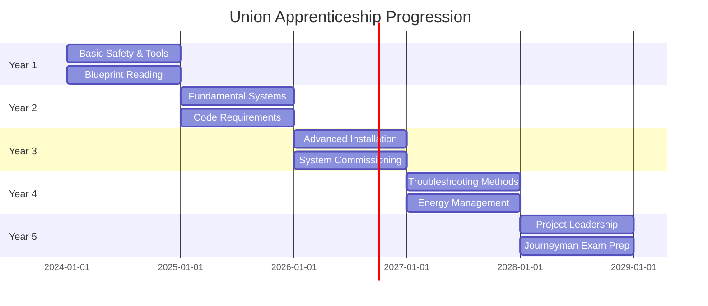
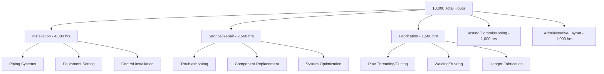

## Overview

Union apprenticeship programs provide the most structured and comprehensive training pathway for HVAC professionals. These registered programs combine extensive classroom instruction with supervised on-the-job training, following curricula approved by the U.S. Department of Labor. Union apprenticeships typically span 4-5 years and prepare workers for journeyman-level competency in specialized trades including pipefitting, sheet metal work, and control systems installation.

Union apprenticeships offer standardized training, predictable wage progression, and portable credentials recognized across jurisdictions. Graduates earn journeyman certification while developing expertise in thermodynamics, fluid mechanics, electrical systems, and fabrication techniques essential for high-quality HVAC installation and service.

## Major Union Apprenticeship Programs

### United Association (UA) Pipefitters

The United Association of Journeymen and Apprentices of the Plumbing and Pipe Fitting Industry represents pipefitters, steamfitters, and HVAC technicians. UA apprenticeships focus on piping systems for heating, cooling, and refrigeration applications.

**Program Duration**: 5 years (10,000 hours on-the-job training + 1,020 hours classroom instruction)

**Core Competencies**
- Hydronic system design and installation
- Refrigeration piping and brazing techniques
- Steam and condensate systems
- Pressure vessel operation
- Welding and joining methods
- Blueprint reading and system layout

**Thermodynamic Principles**

Pipefitters must understand heat transfer in piping systems. The heat loss from insulated pipe follows:

$$Q = \frac{2\pi L(T_i - T_\infty)}{\frac{1}{h_i r_i} + \frac{\ln(r_o/r_i)}{k_{pipe}} + \frac{\ln(r_{ins}/r_o)}{k_{ins}} + \frac{1}{h_o r_{ins}}}$$

Where:
- $Q$ = heat transfer rate (W)
- $L$ = pipe length (m)
- $T_i$ = internal fluid temperature (K)
- $T_\infty$ = ambient temperature (K)
- $h_i$, $h_o$ = inside/outside convection coefficients (W/m²·K)
- $r_i$, $r_o$, $r_{ins}$ = pipe inner, outer, and insulation radii (m)
- $k_{pipe}$, $k_{ins}$ = thermal conductivity of pipe and insulation (W/m·K)

This calculation determines insulation thickness requirements per ASHRAE Standard 90.1 energy efficiency mandates.

### Sheet Metal Workers' International Association (SMWIA)

Sheet metal workers fabricate, install, and maintain ductwork and air distribution systems. SMWIA apprenticeships emphasize precision fabrication, system balancing, and airflow optimization.

**Program Duration**: 4-5 years (8,000-10,000 hours on-the-job training + 800-1,020 hours classroom instruction)

**Core Competencies**
- Duct fabrication and layout techniques
- Air distribution system design
- Sheet metal geometry and pattern development
- Welding and soldering
- Computer-aided design (CAD) for ductwork
- Testing, adjusting, and balancing (TAB)

**Airflow Calculations**

Proper duct sizing requires understanding friction loss relationships. The Darcy-Weisbach equation for pressure drop:

$$\Delta P = f \frac{L}{D} \frac{\rho V^2}{2}$$

Where:
- $\Delta P$ = pressure drop (Pa)
- $f$ = Darcy friction factor (dimensionless)
- $L$ = duct length (m)
- $D$ = duct diameter or hydraulic diameter (m)
- $\rho$ = air density (kg/m³)
- $V$ = air velocity (m/s)

For rectangular ducts, the hydraulic diameter:

$$D_h = \frac{2ab}{a+b}$$

Where $a$ and $b$ represent duct dimensions (m).

Sheet metal apprentices learn to design systems meeting ASHRAE Standard 90.1 maximum friction rates while maintaining acceptable velocity limits.

### International Brotherhood of Electrical Workers (IBEW) - HVAC Controls

IBEW electricians specializing in HVAC controls install, program, and maintain building automation systems, control wiring, and energy management systems.

**Program Duration**: 5 years (8,000-10,000 hours on-the-job training + 900-1,000 hours classroom instruction)

**Core Competencies**
- Control system programming and troubleshooting
- Building automation systems (BACnet, LonWorks, Modbus)
- Variable frequency drive (VFD) installation
- Sensor calibration and placement
- Energy management strategies
- Electrical code compliance (NEC Article 725)

**Control Logic and Response**

Proportional-integral-derivative (PID) control maintains precise temperature regulation. The control output:

$$u(t) = K_p e(t) + K_i \int_0^t e(\tau)d\tau + K_d \frac{de(t)}{dt}$$

Where:
- $u(t)$ = controller output
- $e(t)$ = error signal (setpoint - measured value)
- $K_p$ = proportional gain
- $K_i$ = integral gain
- $K_d$ = derivative gain

Understanding PID tuning prevents instability and optimizes system response per ASHRAE Guideline 36 for high-performance sequences.

## Program Structure and Timeline

## Wage Progression Schedule

Union apprenticeships feature predictable wage increases based on hours worked and competency milestones. Wages are calculated as a percentage of journeyman scale.

| Period | Hours Completed | Wage Percentage | Example Wage ($50/hr journeyman) |
|--------|-----------------|-----------------|----------------------------------|
| 1st Period | 0-1,000 | 40% | $20.00/hr |
| 2nd Period | 1,001-2,000 | 45% | $22.50/hr |
| 3rd Period | 2,001-3,000 | 50% | $25.00/hr |
| 4th Period | 3,001-4,000 | 55% | $27.50/hr |
| 5th Period | 4,001-5,000 | 60% | $30.00/hr |
| 6th Period | 5,001-6,000 | 65% | $32.50/hr |
| 7th Period | 6,001-7,000 | 70% | $35.00/hr |
| 8th Period | 7,001-8,000 | 75% | $37.50/hr |
| 9th Period | 8,001-9,000 | 80% | $40.00/hr |
| 10th Period | 9,001-10,000 | 85% | $42.50/hr |
| Journeyman | 10,000+ | 100% | $50.00/hr |

Wages include fringe benefits covering health insurance, pension contributions, and training fund assessments, typically adding 30-50% to base hourly rates.

## Classroom Instruction Requirements

Union apprenticeships mandate specific minimum classroom hours distributed across technical subjects:

**Typical Curriculum Distribution** (1,000-hour program)

| Subject Area | Hours | Percentage |
|-------------|-------|-----------|
| Trade Mathematics | 120 | 12% |
| Blueprint Reading | 100 | 10% |
| HVAC Fundamentals | 180 | 18% |
| Electrical Systems | 140 | 14% |
| Safety and Code Compliance | 100 | 10% |
| Piping/Ductwork Installation | 160 | 16% |
| Controls and Automation | 100 | 10% |
| System Design | 80 | 8% |
| Troubleshooting Methods | 80 | 8% |
| Green Building Practices | 40 | 4% |

Classes typically meet two evenings per week during the academic year, allowing apprentices to work full-time while completing education requirements.

## On-the-Job Training Standards

On-the-job training follows documented work processes ensuring exposure to required competencies. Apprentices maintain logbooks recording hours by task category.

**Required Experience Categories** (UA Pipefitters example)

Journeymen supervise apprentices maintaining maximum ratios (typically 1:1 to 1:3 depending on task complexity and jurisdiction).

## Journeyman Certification Process

Completing apprenticeship requirements qualifies workers for journeyman certification through written and practical examinations.

**Certification Requirements**
1. Complete minimum on-the-job training hours (8,000-10,000 hours)
2. Complete minimum classroom instruction hours (800-1,020 hours)
3. Pass written examination covering trade theory and code knowledge
4. Pass practical examination demonstrating hands-on competency
5. Meet jurisdiction-specific licensing requirements

**Exam Topics Alignment with ASHRAE Standards**
- Load calculation procedures (ASHRAE Handbook - Fundamentals)
- Ventilation requirements (ASHRAE Standard 62.1/62.2)
- Energy efficiency mandates (ASHRAE Standard 90.1)
- Refrigerant handling (ASHRAE Standard 15)
- Control sequences (ASHRAE Guideline 36)

## Benefits of Union Apprenticeships

**Standardized Training**
- Nationally recognized curricula approved by Department of Labor
- Consistent quality across training facilities
- Portable credentials accepted in multiple jurisdictions
- Regular curriculum updates reflecting technology advances

**Economic Advantages**
- Earn while learning with predictable wage increases
- Health insurance and pension benefits during training
- No tuition costs (funded through collective bargaining agreements)
- Higher lifetime earnings compared to non-union counterparts

**Career Support**
- Union hiring halls connect workers with employment opportunities
- Continuing education programs for skill upgrades
- Safety training and equipment provision
- Advocacy for working conditions and wages

**Quality Standards**
- Rigorous oversight ensures training quality
- Emphasis on code compliance and best practices
- Access to modern training facilities and equipment
- Strong employer partnerships provide diverse experience

## Admission Requirements and Process

**Minimum Qualifications**
- High school diploma or GED equivalent
- Minimum age 18 years (some programs accept 16-17 with restrictions)
- Valid driver's license
- Physical ability to perform trade tasks
- Pass drug screening and background check

**Application Process**
1. Submit application to local union training center
2. Pass aptitude test measuring mechanical reasoning and mathematics
3. Complete interview with apprenticeship committee
4. Provide transcripts and documentation
5. Await selection from qualified applicant pool

**Selection Criteria**
- Aptitude test scores (typically 40% of evaluation)
- Interview performance (30%)
- Education and work history (20%)
- Military service or other relevant experience (10%)

Competition for positions remains strong, with some locals maintaining multi-year waiting lists.

## Comparison with Non-Union Alternatives

| Feature | Union Apprenticeship | Non-Union Apprenticeship | Trade School |
|---------|---------------------|-------------------------|--------------|
| Duration | 4-5 years | 2-4 years | 6-24 months |
| Total Training Hours | 8,000-10,000 OJT + 800-1,020 classroom | Variable, typically 4,000-6,000 OJT | 1,200-2,400 classroom only |
| Cost to Apprentice | $0 (union-funded) | $0-$5,000 | $5,000-$30,000 tuition |
| Wage During Training | 40-85% of journeyman scale | 30-70% of journeyman scale | No wages (student status) |
| Benefits | Full health/pension from start | Variable, often delayed | None |
| Credential | DOL-registered certificate | Varies by program | Diploma/certificate |
| Job Placement | Union hiring hall | Independent search | Career services assistance |

## Continuing Education and Advancement

Journeyman certification marks the beginning of ongoing professional development rather than career endpoint.

**Advanced Training Opportunities**
- Foreman and superintendent certification courses
- Welding certifications (ASME Section IX, AWS D1.1)
- OSHA 30-hour construction safety certification
- Building automation specialist credentials
- Instructor certification for teaching apprentices
- Project management training

**Specialization Paths**
- Medical gas systems (ASSE 6010 certification)
- Clean room HVAC installation (ISO 14644 standards)
- Industrial refrigeration systems (RETA certifications)
- Geothermal heat pump installation
- Solar thermal system integration
- Building commissioning authority (CxA credentials)

## Conclusion

Union apprenticeships represent the gold standard for HVAC trade training, combining rigorous technical education with extensive practical experience. The structured approach ensures graduates possess both theoretical understanding of thermodynamic principles and hands-on competency required for complex system installation and service. For individuals seeking comprehensive training, economic security during education, and recognized credentials, union apprenticeships provide an optimal pathway into the HVAC profession.

## Union Apprenticeship Categories

- [UA United Association Pipefitters](./ua-united-association-pipefitters/)
- [Sheet Metal Workers Apprenticeship](./sheet-metal-workers-apprenticeship/)
- [Electricians Apprenticeship HVAC Controls](./electricians-apprenticeship-hvac-controls/)
- [Five Year Apprenticeship Program](./five-year-apprenticeship-program/)
- [Classroom Instruction Hours](./classroom-instruction-hours/)
- [On The Job Training Hours](./on-the-job-training-hours/)
- [Journeyman Certification](./journeyman-certification/)
- [Apprenticeship Wage Progression](./apprenticeship-wage-progression/)
