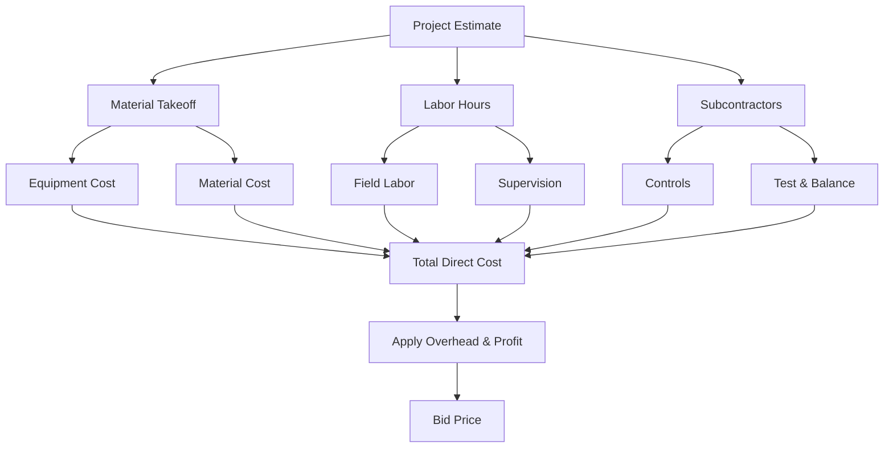
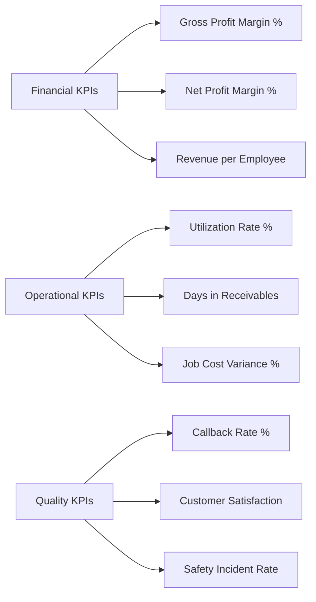
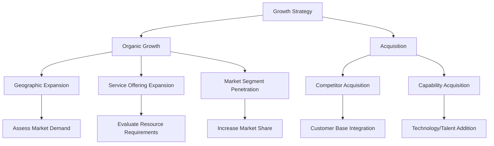

Business management training equips HVAC contractors with essential skills to operate profitable, sustainable enterprises while maintaining technical excellence. Effective business management integrates financial analysis, strategic planning, estimating accuracy, customer relationship management, and operational efficiency to create competitive advantage in the mechanical contracting market.

## Financial Fundamentals for HVAC Contractors

Sound financial management forms the foundation of successful contracting operations. Understanding cost structures, pricing strategies, and profitability metrics enables data-driven business decisions.

**Cost Classification Framework:**

HVAC contracting costs separate into direct project costs, indirect costs, and overhead burden. Accurate classification determines pricing accuracy and profitability analysis.

| Cost Category | Components | Typical % of Revenue |
|--------------|------------|---------------------|
| Direct Labor | Field technician wages, payroll taxes, benefits | 20-30% |
| Direct Materials | Equipment, parts, supplies, consumables | 25-35% |
| Indirect Costs | Project management, supervision, tools, vehicles | 10-15% |
| Overhead | Office staff, facility, insurance, utilities, marketing | 15-25% |
| Profit | Net operating income before taxes | 8-15% |

**Labor Burden Calculation:**

Labor burden represents total employment cost beyond base wages, including payroll taxes, insurance, benefits, and non-billable time.

$$\text{Labor Burden Rate} = \frac{\text{Total Labor Cost} - \text{Base Wages}}{\text{Base Wages}} \times 100\%$$

$$\text{Loaded Labor Rate} = \text{Base Wage} \times (1 + \text{Burden Rate})$$

Example calculation:

- Base technician wage: $28.00/hr
- Payroll taxes (FICA, FUTA, SUTA): 10.5% = $2.94/hr
- Workers compensation insurance: 8.0% = $2.24/hr
- Health insurance: $6.50/hr
- Paid time off (vacation, sick, holidays): 12% = $3.36/hr
- Non-billable time (training, meetings, travel): 8% = $2.24/hr
- Total burden: $17.28/hr (61.7% of base wage)
- Loaded labor rate: $28.00 + $17.28 = $45.28/hr

**Overhead Recovery Analysis:**

Overhead allocation distributes fixed costs across revenue-generating activities. Contractors typically use labor hour or revenue percentage methods.

$$\text{Overhead Rate (Labor Hour Method)} = \frac{\text{Annual Overhead Cost}}{\text{Annual Billable Hours}}$$

$$\text{Overhead Rate (Revenue Method)} = \frac{\text{Annual Overhead Cost}}{\text{Annual Revenue}} \times 100\%$$

For a contracting firm with $850,000 annual overhead and 12,000 billable hours across six technicians:

$$\text{Overhead Rate} = \frac{\$850,000}{12,000 \text{ hr}} = \$70.83/\text{hr}$$

This overhead burden adds to loaded labor when calculating billing rates.

**Markup vs. Margin Analysis:**

Understanding the mathematical relationship between markup and margin prevents pricing errors that erode profitability.

$$\text{Markup} = \frac{\text{Selling Price} - \text{Cost}}{\text{Cost}} \times 100\%$$

$$\text{Margin} = \frac{\text{Selling Price} - \text{Cost}}{\text{Selling Price}} \times 100\%$$

$$\text{Markup} = \frac{\text{Margin}}{1 - \text{Margin}}$$

$$\text{Margin} = \frac{\text{Markup}}{1 + \text{Markup}}$$

| Target Margin | Required Markup | Selling Price Multiplier |
|--------------|----------------|------------------------|
| 20% | 25% | 1.25 |
| 25% | 33% | 1.33 |
| 30% | 43% | 1.43 |
| 35% | 54% | 1.54 |
| 40% | 67% | 1.67 |

Applying 25% markup to $10,000 cost yields $12,500 selling price with 20% margin, not 25% margin—a common error that reduces profitability by 20%.

## Project Estimation and Bidding Strategies

Accurate estimating determines project profitability and competitive positioning. Systematic estimation processes reduce risk while maintaining consistency.

**Labor Productivity Factors:**

HVAC installation labor requirements vary based on system complexity, site conditions, and crew experience. Standard labor units provide estimating consistency.

**Standard Labor Units (Hours per Unit):**

| Installation Task | Labor Hours | Unit | Conditions |
|------------------|------------|------|------------|
| Ductwork (rectangular) | 0.10-0.15 | lb | New construction |
| Ductwork (flex) | 0.08-0.12 | linear ft | Residential |
| Copper piping (brazed) | 0.15-0.25 | linear ft | Varies by diameter |
| Chiller installation | 40-80 | ton | Rigging, electrical separate |
| Rooftop unit installation | 8-16 | ton | Crane included |
| VAV box installation | 3-5 | unit | Controls separate |
| Grilles/diffusers | 0.25-0.40 | unit | Standard ceiling grid |
| Hydronic piping (welded) | 0.30-0.50 | linear ft | Schedule 40 steel |

**Complexity Adjustment Factors:**

Base labor hours require adjustment for site-specific conditions that affect productivity.

- Renovation work: 1.15-1.35× (coordination, protection, access constraints)
- Occupied space: 1.10-1.25× (restricted hours, noise limitations)
- High elevations (>12 ft): 1.08-1.15× (scaffolding, material handling)
- Tight mechanical rooms: 1.15-1.30× (limited workspace, rigging difficulty)
- Fast-track schedules: 1.10-1.20× (overtime, compressed milestones)
- Winter conditions: 1.05-1.15× (heating, weather delays)

**Bid Risk Assessment Matrix:**

Systematic risk evaluation determines appropriate contingency levels and bid/no-bid decisions.

| Risk Factor | Low Risk (2-3%) | Medium Risk (4-6%) | High Risk (7-10%) |
|------------|----------------|-------------------|------------------|
| Design completeness | 100% CDs, no RFIs | Minor gaps, <10 RFIs | Incomplete, design-build |
| Schedule | Normal duration | Accelerated 15-25% | Crash schedule |
| Site access | Unoccupied, staging area | Limited staging | Phased, occupied |
| Owner history | Repeat client, prompt pay | New client, verified | Payment concerns |
| Subcontractor availability | Qualified subs available | Limited options | Scarce resources |
| Material pricing | Stable, quoted prices | Moderate volatility | Rapid escalation |

Total project contingency equals sum of individual risk factors. Projects exceeding 15% total contingency warrant additional analysis or no-bid consideration.

## Break-Even Analysis and Pricing Strategies

Understanding break-even relationships enables strategic pricing decisions that balance market competitiveness with profitability requirements.

**Break-Even Revenue Calculation:**

Fixed costs must be recovered through contribution margin before generating profit.

$$\text{Break-Even Revenue} = \frac{\text{Fixed Costs}}{\text{Contribution Margin Ratio}}$$

$$\text{Contribution Margin Ratio} = \frac{\text{Revenue} - \text{Variable Costs}}{\text{Revenue}}$$

For an HVAC contractor with $720,000 annual fixed costs (overhead) and 45% contribution margin ratio:

$$\text{Break-Even Revenue} = \frac{\$720,000}{0.45} = \$1,600,000$$

Revenue below this threshold generates operating losses; revenue above creates profit at 45% of incremental sales.

**Profit Planning:**

Target profit goals determine required revenue levels and operational efficiency.

$$\text{Required Revenue} = \frac{\text{Fixed Costs} + \text{Target Profit}}{\text{Contribution Margin Ratio}}$$

To achieve $300,000 annual profit with the previous parameters:

$$\text{Required Revenue} = \frac{\$720,000 + \$300,000}{0.45} = \$2,266,667$$

This represents 41.7% revenue increase above break-even, requiring strategic planning for market development, productivity improvement, or pricing optimization.

**Capacity Utilization Analysis:**

Labor capacity represents the constraint in most HVAC contracting operations. Maximizing billable utilization improves profitability without proportional overhead increase.

$$\text{Utilization Rate} = \frac{\text{Billable Hours}}{\text{Available Hours}} \times 100\%$$

$$\text{Revenue per Technician} = \text{Billable Hours} \times \text{Billing Rate}$$

For six technicians working 2,080 hours annually:
- Total available hours: 6 × 2,080 = 12,480 hours
- Non-billable time (15%): 1,872 hours
- Available billable hours: 10,608 hours
- Actual billable hours (target 80%): 8,486 hours
- Utilization rate: 8,486 / 10,608 = 80.0%

Improving utilization from 75% to 85% increases billable hours by 1,061 hours annually. At $125/hr billing rate, this generates $132,625 additional revenue with minimal overhead increase—equivalent to 5.9% revenue growth.

## Cash Flow Management

HVAC contracting requires careful cash flow management due to project payment cycles, material procurement requirements, and labor funding needs.

**Working Capital Requirements:**

Working capital funds the gap between project expenditures and customer payments.

$$\text{Working Capital Need} = \text{Days in A/R} + \text{Days in Inventory} - \text{Days in A/P}$$

Expressed as cash requirement:

$$\text{Cash Need} = \frac{\text{Annual Revenue} \times \text{Working Capital Days}}{365}$$

Example working capital calculation:
- Average days in receivables: 45 days
- Average days in inventory: 20 days
- Average days in payables: 30 days
- Working capital cycle: 45 + 20 - 30 = 35 days
- Annual revenue: $2,000,000
- Cash need: ($2,000,000 × 35) / 365 = $191,781

Contractors must maintain sufficient credit lines or cash reserves to fund this working capital requirement during growth periods or seasonal fluctuations.

**Progress Billing Optimization:**

Project payment structures directly impact cash flow and project profitability.

| Billing Structure | Cash Flow Impact | Risk Level | Typical Application |
|------------------|-----------------|-----------|-------------------|
| Payment in advance | Positive cash flow | Low | Service contracts |
| 50% deposit, 50% completion | Neutral to positive | Low | Residential replacement |
| Progress billing (monthly) | Neutral | Medium | Commercial construction |
| Retention (10%) | Negative | Medium | Large projects |
| Net 30-60 terms | Negative | High | Government, commercial |

**Application, Materials & Mobilization (AMM):**

Construction projects often include upfront payment for mobilization and material procurement, improving contractor cash flow.

Standard AMM structure:
- 10% application/mobilization upon award
- Materials payment upon delivery to site
- Progress payments based on installation completion
- Final payment less retention upon substantial completion
- Retention release after warranty period

## Project Management Performance Metrics

Quantitative metrics enable objective performance evaluation and continuous improvement initiatives.

**Key Performance Indicators (KPIs):**

**Financial Performance Benchmarks:**

| Metric | Industry Average | Top Quartile | Calculation |
|--------|-----------------|--------------|-------------|
| Gross profit margin | 28-35% | >38% | (Revenue - Direct Costs) / Revenue |
| Net profit margin | 5-8% | >10% | Net Income / Revenue |
| Revenue per employee | $180k-$220k | >$250k | Annual Revenue / Total Employees |
| Current ratio | 1.2-1.5 | >1.8 | Current Assets / Current Liabilities |
| Debt to equity | 0.8-1.5 | <0.6 | Total Debt / Owner Equity |
| Return on assets | 8-12% | >15% | Net Income / Total Assets |

**Job Cost Control:**

Real-time job costing identifies variance before project completion, enabling corrective action.

$$\text{Job Cost Variance} = \frac{\text{Actual Cost} - \text{Estimated Cost}}{\text{Estimated Cost}} \times 100\%$$

$$\text{Cost Performance Index} = \frac{\text{Budgeted Cost of Work Performed}}{\text{Actual Cost of Work Performed}}$$

CPI values indicate project financial health:
- CPI > 1.0: Under budget
- CPI = 1.0: On budget
- CPI < 1.0: Over budget

Project managers should review job costs weekly, identifying variances exceeding ±5% for immediate investigation and corrective measures.

## Customer Relationship Management

Customer acquisition costs significantly exceed retention costs, making relationship management economically critical for sustained profitability.

**Customer Lifetime Value (CLV):**

CLV quantifies the total revenue potential of customer relationships, informing marketing investment decisions.

$$\text{CLV} = \text{Average Transaction} \times \text{Transactions per Year} \times \text{Retention Period} \times \text{Profit Margin}$$

For a commercial customer:
- Average project value: $35,000
- Projects per year: 2.5
- Average retention: 8 years
- Profit margin: 22%
- CLV = $35,000 × 2.5 × 8 × 0.22 = $154,000

This analysis justifies marketing expenditures up to $30,000-$40,000 for customer acquisition when retention strategies maintain long-term relationships.

**Service Agreement Economics:**

Preventive maintenance agreements provide recurring revenue, cash flow stability, and equipment replacement opportunities.

Service contract pricing model:

$$\text{Annual Contract Price} = \frac{\text{Direct Cost} + \text{Overhead Allocation}}{1 - \text{Target Margin}}$$

For quarterly commercial HVAC maintenance:
- Labor: 8 hr/visit × 4 visits × $65/hr = $2,080
- Materials (filters, belts): $320
- Overhead allocation (35%): $840
- Total cost: $3,240
- Target margin: 30%
- Annual price: $3,240 / 0.70 = $4,629

Service agreements increase equipment lifespan 40-60% through preventive maintenance while providing contractors with predictable revenue streams and customer retention mechanisms.

## Operational Efficiency Optimization

Process improvement and technology adoption reduce costs, improve quality, and enhance competitive positioning.

**Fleet Management Economics:**

Vehicle costs represent 8-12% of contractor revenue. Optimal replacement cycles balance reliability against depreciation.

$$\text{Total Cost of Ownership} = \text{Depreciation} + \text{Fuel} + \text{Maintenance} + \text{Insurance} + \text{Financing}$$

$$\text{Annual Cost per Mile} = \frac{\text{Total Annual Cost}}{\text{Annual Miles Driven}}$$

Replacement decision criteria:
- Cumulative maintenance exceeds 50% of replacement cost
- Annual downtime exceeds 5% of available time
- Fuel efficiency degradation >15% from baseline
- Age/mileage: 7-10 years or 150,000-200,000 miles

GPS fleet tracking reduces costs 12-18% through route optimization, unauthorized use elimination, and productivity monitoring.

**Technology ROI Analysis:**

Business management software, estimating tools, and field service automation require investment justification through productivity gains.

Example field service management software ROI:
- Annual software cost: $12,000 (6 licenses)
- Implementation time: 40 hours
- Productivity improvements:
  - Scheduling efficiency: 5% utilization gain = 424 billable hours
  - Reduced administrative time: 300 hours annually
  - Faster invoicing: 8-day reduction in receivables
- Revenue impact: 424 hr × $125/hr = $53,000
- Cash flow impact: ($2,000,000 × 8) / 365 = $43,836
- ROI: ($53,000 + $43,836 - $12,000) / $12,000 = 709%

Technology investments demonstrating >200% ROI within 12 months warrant immediate implementation.

## Strategic Business Planning

Long-term business success requires strategic planning that aligns resources, market opportunities, and growth objectives.

**Market Segmentation Analysis:**

HVAC contractors must define target markets based on profitability, competitive advantage, and resource requirements.

| Market Segment | Typical Margin | Competition | Capital Need | Skill Level |
|---------------|---------------|-------------|-------------|------------|
| Residential service | 35-45% | High | Low | Moderate |
| Residential replacement | 25-35% | High | Medium | Moderate |
| Light commercial | 18-25% | Moderate | Medium | High |
| Commercial construction | 12-18% | High | High | High |
| Industrial process | 15-22% | Low | High | Very high |
| Energy services | 20-30% | Moderate | Low | Very high |

Market selection should prioritize segments where contractor capabilities create competitive advantage and margins support growth investment.

**Growth Strategy Models:**

Organic growth through service expansion requires lower capital but longer timeframes (3-5 years). Acquisition accelerates growth but demands significant capital and integration expertise. Most successful contractors pursue hybrid strategies combining organic development with selective acquisitions.

The business management competencies developed through comprehensive training programs enable HVAC contractors to build profitable, sustainable enterprises that deliver consistent value to customers while providing financial returns supporting long-term business viability and growth objectives.

## Components

- Business Planning Hvac Contractors
- Financial Management Contractors
- Estimating Bidding Strategies
- Project Management Fundamentals
- Customer Service Excellence
- Sales Training Hvac
- Marketing Digital Presence
- Employee Management Hr
- Legal Compliance Contractors
- Insurance Bonding Requirements
- Technology Adoption Software Tools
