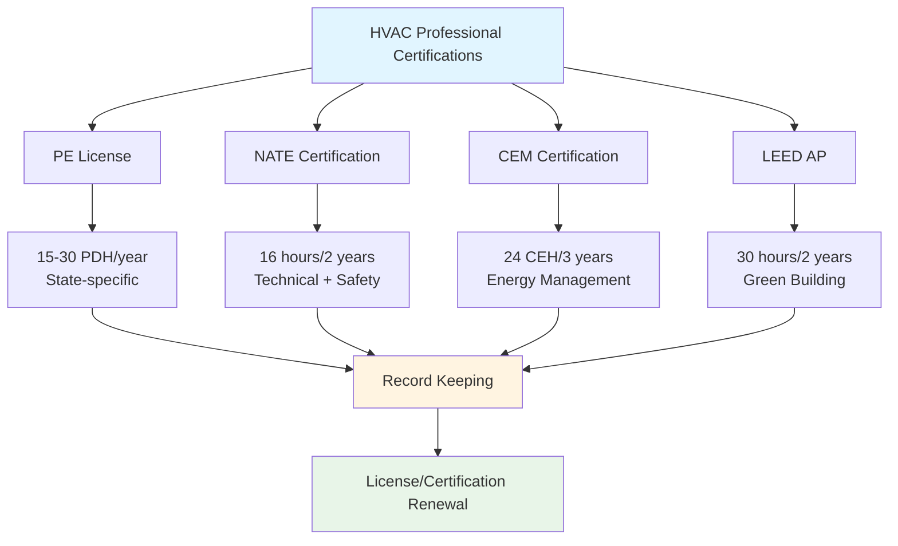
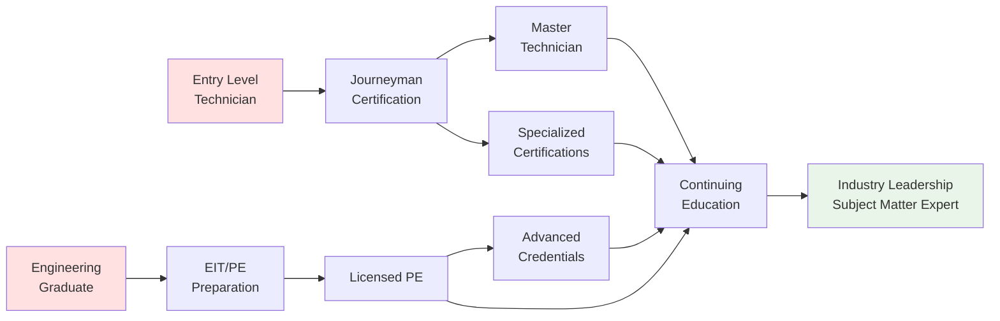

# HVAC Continuing Education

Continuing education maintains professional competency, satisfies licensure requirements, and advances career trajectories in the HVAC industry. Professional engineers, certified technicians, and building operators must accumulate specified education credits to maintain credentials while staying current with evolving technologies, codes, and design methodologies.

## Education Credit Systems

### Professional Development Hours (PDHs)

PDHs quantify continuing education for licensed Professional Engineers, with requirements varying by state licensing board:

**State Requirements:**
- Most states require 15-30 PDHs annually
- 1 PDH = 1 contact hour of instruction
- Carryover provisions typically allow 50% excess credits
- Some states mandate specific topics (ethics, code updates)

**Acceptable Activities:**
- Technical courses and seminars
- Webinars and online training
- Conference attendance
- Published technical papers (author credits)
- Teaching technical courses (instructor credits)
- Professional society committee participation

### Continuing Education Units (CEUs)

CEUs provide standardized measurement for non-credit educational programs:

**Calculation:**
- 1 CEU = 10 contact hours of participation
- Must meet IACET standards for quality
- Requires documented learning outcomes
- Assessment or competency verification

**HVAC Applications:**
- NATE technician certification renewal (16 hours/2 years)
- Building operator certifications
- Manufacturer product training
- Safety training programs

## Certification Maintenance Requirements

### Professional Engineer Requirements

**Typical State Board Requirements:**
- 15-30 PDHs per renewal period (1-2 years)
- Ethics course: 1-2 PDHs per period
- Health, safety, welfare topics encouraged
- Documentation retention: 4-6 years
- Audit compliance verification

### Technician Certification Renewal

**NATE Requirements:**
- Recertification every 2 years
- 16 continuing education hours minimum
- Must include refrigerant safety training
- Can combine online and in-person formats

**EPA Section 608:**
- No continuing education required
- Certification does not expire
- Voluntary refresher training recommended
- Regulation updates require awareness

## Education Delivery Formats

### Format Comparison

| Format | Cost | Flexibility | Interaction | PDH/CEU Approval | Best For |
|--------|------|-------------|-------------|------------------|----------|
| **Live Classroom** | $$$ | Low | High | Yes | Hands-on skills, complex topics |
| **Webinars** | $ | High | Medium | Yes | Convenience, broad topics |
| **Self-Paced Online** | $$ | Very High | Low | Varies | Independent learners |
| **Conferences** | $$$$ | Low | Very High | Yes | Networking, multiple topics |
| **Manufacturer Training** | Free-$$ | Medium | High | Sometimes | Product-specific knowledge |
| **Professional Society** | $$-$$$ | Medium | High | Yes | Standards, best practices |

### Learning Pathway Development

## Professional Organization Offerings

### ASHRAE Learning Institute

**Program Structure:**
- Technical seminars at chapter meetings
- Annual conference education tracks
- Online learning portal with 100+ courses
- PDH certificates provided automatically
- Member discounts on all offerings

**Topic Coverage:**
- Building energy modeling
- Advanced psychrometrics
- System design optimization
- Code compliance updates
- Emerging technologies

### SMACNA Educational Programs

**Focus Areas:**
- Sheet metal fabrication techniques
- Duct system design and installation
- Safety management
- Labor productivity
- Quality assurance standards

**Delivery Methods:**
- Regional training centers
- Contractor member workshops
- Online technical libraries
- Installation standards courses

### Manufacturer Training Programs

**Advantages:**
- Product-specific expertise
- Hands-on equipment training
- Technical support relationships
- Often free or low-cost
- May include installation certification

**Considerations:**
- May not qualify for PDH/CEU credit
- Product-focused rather than theory
- Supplemental to broader education
- Valuable for troubleshooting skills

## Career Development Benefits

### Competency Advancement

**Technical Knowledge:**
- Stay current with refrigerant transitions (A2L safety)
- Understand advanced control strategies
- Learn building automation integration
- Master energy analysis tools

**Professional Skills:**
- Project management methodologies
- Client communication techniques
- Team leadership development
- Business acumen enhancement

### Economic Impact

**Salary Differential:**
- PE license commands 10-20% premium
- Specialized certifications add 5-15%
- Advanced training increases billable rates
- Leadership positions require ongoing education

**Career Progression:**
- Enables supervisory role transitions
- Qualifies for specialized positions
- Demonstrates commitment to employers
- Opens consulting opportunities

### Professional Network Expansion

Education events provide critical networking opportunities:
- Connect with industry peers
- Establish mentor relationships
- Discover employment opportunities
- Build business development contacts
- Stay informed on industry trends

## Compliance Documentation

### Record Keeping Requirements

**Essential Elements:**
- Course/seminar title and provider
- Date and duration of participation
- PDH/CEU credits earned
- Certificate of completion
- Instructor qualifications (if required)

**Retention Period:**
- State PE boards: typically 4-6 years
- Certification bodies: varies by organization
- Digital copies recommended
- Organize by renewal period

### Audit Preparedness

**Common Audit Triggers:**
- Random selection (1-5% of renewals)
- First-time renewal
- Complaint investigation
- Lapsed license reinstatement

**Documentation Verification:**
- Course attendance rosters
- Provider PDH approval status
- Credit calculation accuracy
- Compliance with topic requirements

## Recommended Annual Investment

**Minimum Compliance Strategy:**
- 20 PDH/year for PE license maintenance
- 2-3 webinars or online courses
- 1 professional conference or seminar
- Annual budget: $500-$1,000

**Career Advancement Strategy:**
- 40-60 PDH/year exceeding requirements
- Multiple specialized certifications
- Conference attendance with networking
- Technical publication contributions
- Annual budget: $2,000-$5,000

**Employer-Supported Programs:**
- Many firms provide education allowances
- Professional society memberships covered
- Conference attendance approved
- Negotiate continuing education benefits

## Emerging Education Trends

**Technology Integration:**
- Virtual reality equipment training
- AI-powered adaptive learning platforms
- Microlearning modules (10-15 minutes)
- Mobile app-based training delivery

**Content Evolution:**
- Decarbonization strategies
- Electrification of heating systems
- Grid-interactive efficient buildings
- Resilience and climate adaptation
- Indoor air quality post-pandemic

**Accessibility Improvements:**
- Increased online course availability
- Multilingual training materials
- Evening and weekend options
- Self-paced credential programs

Continuous professional development transforms mandatory compliance into strategic career investment, positioning HVAC professionals at the forefront of industry innovation while maintaining the highest standards of technical competence and ethical practice.
