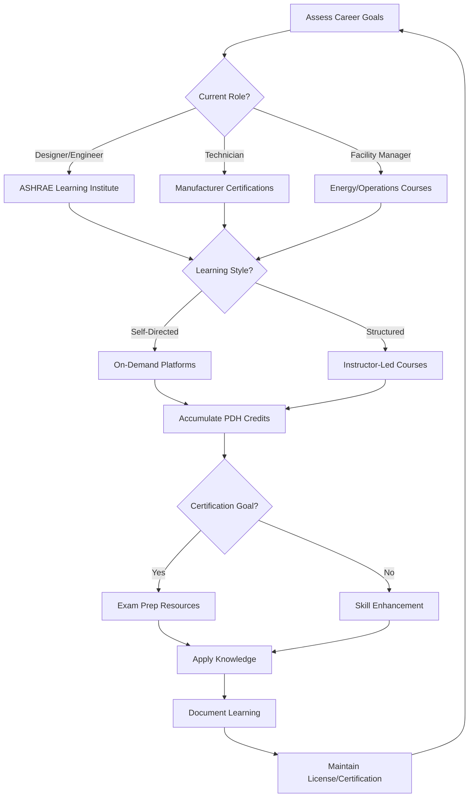

Online learning platforms have transformed professional development in the HVAC industry, providing flexible access to technical training, certification preparation, and continuing education. These platforms serve engineers, designers, technicians, and facility managers seeking to maintain competency and advance their careers.

## Major HVAC Learning Platforms

### ASHRAE Learning Institute

The ASHRAE Learning Institute delivers the industry's most authoritative technical training, developed by subject matter experts using ASHRAE standards and research. The platform offers:

- **Live Online Courses**: Instructor-led sessions with real-time interaction and Q&A
- **On-Demand Training**: Self-paced courses available 24/7
- **Certificate Programs**: Structured curriculum in building energy modeling, healthcare HVAC, and data center design
- **PDH Credits**: Professional Development Hours accepted by most licensing boards
- **Exam Preparation**: Targeted courses for PE, CEM, and BEMP examinations

Content spans psychrometrics, load calculations, system design, energy analysis, commissioning, and operation/maintenance. Course materials include calculation tools, reference spreadsheets, and case studies from real projects.

### Manufacturer Training Portals

Equipment manufacturers provide specialized training on their products, installation requirements, and troubleshooting procedures:

- **Trane Engineers Newsletter**: Technical articles and calculation tools
- **Carrier University**: Product certification and system design courses
- **Daikin Learning**: VRF systems, controls, and applied equipment training
- **Johnson Controls Institute**: Building automation and controls education
- **Danfoss Learning**: Refrigeration controls, drives, and heat exchangers

These platforms often offer certification programs that validate proficiency with specific product lines, enhancing technician credentials and supporting warranty requirements.

### Technical Training Providers

Specialized HVAC training companies deliver comprehensive curricula:

**HVAC Learning Solutions**: Focuses on commercial systems, DDC controls, and building automation. Courses emphasize hands-on troubleshooting and system optimization.

**Skillsoft Technical Training**: Enterprise learning platform with HVAC modules integrated into broader facilities management and engineering curricula.

**TPC Training**: Covers fundamentals through advanced topics with interactive simulations and assessment tools.

### General Education Platforms

Mainstream online learning platforms now offer HVAC content:

**Udemy**: Individual courses from independent instructors covering residential systems, load calculations, and specific software applications (Revit MEP, HAP, TRACE).

**Coursera**: University partnerships deliver building science and energy efficiency courses from institutions like Stanford and MIT.

**LinkedIn Learning**: Professional development content including AutoCAD MEP, project management for MEP engineers, and fundamentals courses.

## Platform Comparison

| Platform | Content Type | Delivery Method | PDH Credits | Cost Structure | Best For |
|----------|--------------|-----------------|-------------|----------------|----------|
| ASHRAE Learning Institute | Standards-based technical | Live & on-demand | Yes | $200-$800/course | PE exam prep, advanced design |
| Manufacturer portals | Product-specific | Self-paced | Varies | Free to $300 | Equipment certification |
| HVAC Learning Solutions | Commercial systems focus | Self-paced | Yes | $300-$600/course | Controls specialists |
| Skillsoft | Broad facilities topics | Self-paced | Limited | Subscription | Enterprise training |
| Udemy | Variable quality | Self-paced | No | $15-$200/course | Specific skills, software |
| Coursera | Academic level | Instructor-led cohorts | No | $49-$79/month | Theoretical foundations |

## Self-Paced vs Instructor-Led Training

### Self-Paced Advantages

- Complete courses on your schedule without travel
- Pause and review complex material multiple times
- Lower cost per course compared to live instruction
- Immediate access to enrolled content
- Suitable for independent learners with strong self-discipline

Self-paced courses work best for reviewing familiar topics, learning software applications through demonstrations, and accumulating PDH credits efficiently.

### Instructor-Led Benefits

- Real-time interaction allows clarifying questions
- Networking opportunities with peers facing similar challenges
- Structured schedule maintains momentum through complex topics
- Instructor adapts content based on participant questions
- Group discussions reveal practical insights from multiple perspectives

Live instruction proves valuable for advanced theoretical topics, exam preparation requiring problem-solving practice, and new subject areas where guidance prevents misconceptions.

Many learners combine both approaches: self-paced courses for breadth and specific skills, instructor-led training for critical certifications and advanced competencies.

## Certification Exam Preparation

### PE Mechanical Exam Resources

- **ASHRAE PE Exam Prep Course**: Covers all exam topics with practice problems
- **PPI Learning Hub**: Comprehensive review with 600+ practice problems
- **School of PE**: Live instruction with evening/weekend schedule options
- **Testmasters**: Problem-solving workshops focusing on exam strategy

Preparation requires 100-200 hours over 3-6 months. Online platforms provide problem databases, timed practice exams, and reference material organization strategies.

### CEM (Certified Energy Manager)

AEE offers online review courses covering energy auditing procedures, economic analysis, HVAC system efficiency, lighting, building envelope, and renewable energy. The self-paced format includes calculation practice and case studies.

### NATE Certification

Technician preparation resources include:

- **ESCO Group**: Study guides and practice tests for all NATE specialties
- **HVAC Excellence**: Online exams simulate actual test format
- **TruTech Tools**: Video-based instruction for refrigeration, electrical, and airflow topics

Online resources supplement hands-on experience with equipment, which remains essential for technician certifications.

## Continuing Education Strategy

## Selecting Appropriate Platforms

Match platform characteristics to your objectives:

**For PE licensure maintenance**: ASHRAE Learning Institute provides accepted PDH credits with content directly relevant to engineering practice.

**For equipment expertise**: Manufacturer portals deliver product-specific knowledge required for installation, startup, and service work.

**For career transition**: Comprehensive platforms like Skillsoft or university programs through Coursera provide foundational knowledge in new specialties.

**For software proficiency**: Udemy and LinkedIn Learning offer targeted instruction for specific applications at lower cost than software vendor training.

**For exam preparation**: Specialized test prep companies provide problem-solving practice and exam strategy coaching that general education platforms cannot match.

Verify PDH credit acceptance with your licensing board before enrolling. Most states accept ASHRAE courses without question, but some restrict credits from non-university sources or require prior approval for self-paced content.

## Quality Indicators

Evaluate platforms based on:

- **Instructor credentials**: Look for PE licenses, advanced degrees, or recognized industry expertise
- **Content currency**: Material should reference current codes and standards
- **Production quality**: Clear audio, readable graphics, and functional interactive elements
- **Student reviews**: Consistent positive feedback from professionals in your specialty
- **Support resources**: Access to instructors, discussion forums, or technical support
- **Completion certificates**: Documentation suitable for PDH audits

The proliferation of online platforms expands access to professional development but requires discernment. Prioritize platforms with established reputations in the HVAC industry over general education sites with limited technical review processes.
