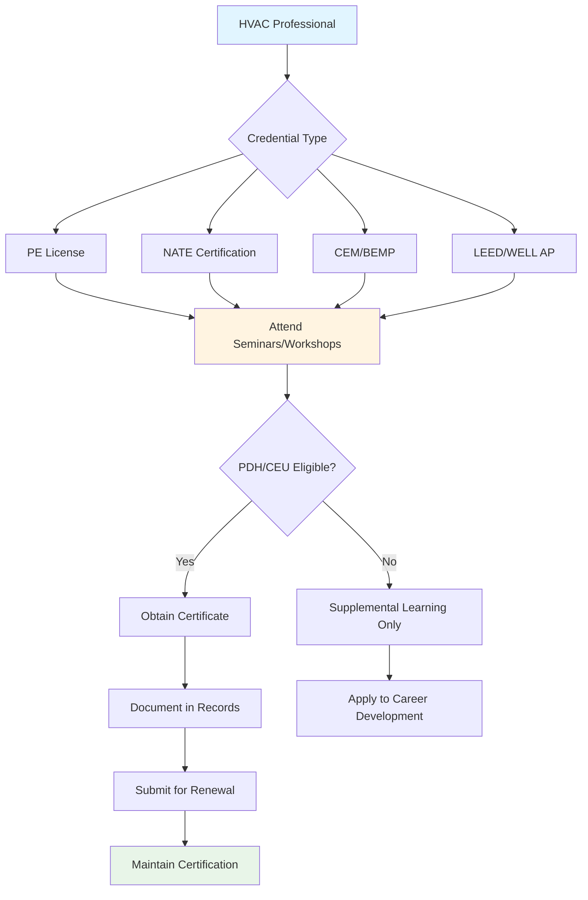
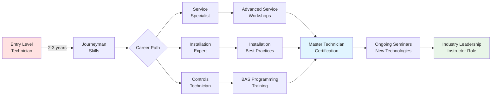

# HVAC Seminars and Workshops

Seminars and workshops provide targeted technical training through structured classroom instruction and hands-on equipment interaction. These educational formats deliver professional development hours (PDHs) and continuing education units (CEUs) required for certification maintenance while building practical competencies in system design, installation, troubleshooting, and emerging technologies.

## Seminar vs. Workshop Format Comparison

| Format Characteristic | Technical Seminar | Hands-On Workshop |
|----------------------|-------------------|-------------------|
| **Duration** | 2-8 hours | 1-5 days |
| **Primary Focus** | Theory and concepts | Practical application |
| **Interaction Level** | Lecture with Q&A | Equipment manipulation |
| **Class Size** | 20-100 participants | 8-20 participants |
| **Equipment Access** | Demonstration only | Individual/team stations |
| **PDH/CEU Value** | 0.1 per contact hour | 0.1 per contact hour |
| **Cost Range** | $50-$300 | $200-$2,000 |
| **Best For** | Code updates, theory | Installation, diagnostics |

Both formats provide equivalent continuing education credit based on contact hours, but workshops deliver superior skill development through tactile experience with actual equipment and systems.

## Technical Seminar Categories

### Code and Standards Updates

**Content Coverage:**
- ASHRAE Standard 62.1 ventilation requirement revisions
- ASHRAE 90.1 energy code minimum efficiency updates
- International Mechanical Code (IMC) cycle changes
- Local jurisdiction amendments and interpretations
- Compliance documentation requirements

**Learning Outcomes:**
- Identify code changes affecting current projects
- Calculate minimum ventilation rates per updated standards
- Select equipment meeting new efficiency thresholds
- Prepare compliance submittals for permit review

These seminars typically occur following triennial code publication cycles and provide critical updates for design professionals and contractors navigating regulatory compliance.

### System Design Fundamentals

**Core Topics:**
- Load calculation methodology per ASHRAE Handbook
- Psychrometric process analysis and application
- Duct and pipe sizing using friction loss methods
- Equipment selection and performance curves
- Control system integration strategies

**Physics Foundation:**

Load calculations quantify heat transfer through building envelopes:

$$Q = U \cdot A \cdot \Delta T + Q_{solar} + Q_{internal}$$

Where:
- $Q$ = total cooling/heating load (Btu/h or kW)
- $U$ = overall heat transfer coefficient (Btu/h·ft²·°F or W/m²·K)
- $A$ = envelope area (ft² or m²)
- $\Delta T$ = indoor-outdoor temperature difference (°F or K)
- $Q_{solar}$ = solar heat gain (Btu/h or kW)
- $Q_{internal}$ = internal loads from occupants, lighting, equipment (Btu/h or kW)

### Advanced Systems Design

**Specialized Applications:**
- Variable refrigerant flow (VRF) system design
- Chilled beam and radiant system implementation
- Dedicated outdoor air systems (DOAS) configuration
- Thermal energy storage optimization
- Geothermal heat pump system sizing

**Technical Depth:**
- Heat exchanger effectiveness calculations
- Pump and fan affinity law applications
- Refrigerant piping pressure drop analysis
- Control sequence development for complex systems

### Energy Modeling and Analysis

**Software Training:**
- EnergyPlus and eQuest modeling platforms
- Carrier HAP and Trane TRACE 3D Plus
- Building energy simulation workflow
- Calibration to utility billing data
- ASHRAE 90.1 Appendix G baseline modeling

**Deliverables:**
- Annual energy consumption predictions
- Life-cycle cost analysis comparisons
- Energy code compliance documentation
- Incentive program application support

## Hands-On Workshop Types

### Equipment Installation Workshops

**Practical Exercises:**
- Split system refrigerant line brazing and pressure testing
- Leak detection using electronic sensors and bubble solutions
- Evacuation procedures with micron gauge verification
- Refrigerant charging by subcooling and superheat methods
- Condensate drain trap sizing and installation

**Refrigerant Charging Methodology:**

Proper superheat for fixed orifice systems:

$$SH_{target} = f(T_{outdoor}, T_{indoor}, RH)$$

Subcooling for thermostatic expansion valve (TXV) systems typically maintains 10-15°F at design conditions, indicating proper refrigerant charge and system performance.

### Troubleshooting Clinics

**Diagnostic Scenarios:**
- Low airflow conditions: filter restriction, duct leakage, fan speed
- Inadequate cooling: refrigerant charge, airflow, heat exchanger fouling
- Heating failures: ignition system, gas valve, limit switches
- Control malfunctions: sensor calibration, wiring, sequence logic
- Compressor problems: electrical testing, oil analysis, mechanical wear

**Measurement Techniques:**
- Temperature differential across coils
- Pressure-temperature relationship verification
- Electrical current and voltage testing
- Combustion analysis for gas-fired equipment
- Airflow measurement using hot wire anemometers

### Controls and Automation Training

**Hands-On Skills:**
- Building automation system (BAS) programming
- Direct digital control (DDC) sensor calibration
- Variable frequency drive (VFD) parameter configuration
- Economizer control sequence verification
- Demand-controlled ventilation setup

**Control Strategies:**
- Proportional-integral-derivative (PID) loop tuning
- Reset schedules for supply air and water temperatures
- Occupancy-based scheduling and setback strategies
- Trending and data analysis for optimization

### Commissioning Process Workshops

**Field Testing Procedures:**
- Airflow measurement using Pitot tube traverses
- Hydronic flow measurement and balancing
- Terminal device (VAV box) calibration
- Control sequence functional performance testing
- Documentation and reporting requirements

**Airflow Calculation from Pitot Traverse:**

$$V = 1096.7 \cdot \sqrt{\frac{\Delta P}{d}}$$

Where:
- $V$ = air velocity (ft/min)
- $\Delta P$ = velocity pressure (in. w.g.)
- $d$ = air density correction factor (dimensionless)

Total airflow equals average velocity multiplied by duct cross-sectional area, verified against design specifications per ASHRAE Standard 111.

## Manufacturer Training Centers

### Factory-Based Programs

**Major Manufacturer Facilities:**
- Carrier University (multiple locations, United States)
- Trane Commercial Systems Training (La Crosse, WI)
- Lennox Corporate Training Center (Richardson, TX)
- Johnson Controls Training Institute (Milwaukee, WI)
- Daikin University (Houston, TX)

**Training Offerings:**
- Product-specific installation procedures
- Service and maintenance protocols
- Warranty claim requirements and documentation
- Application engineering and system selection
- New technology introductions (A2L refrigerants, variable-speed technology)

### Distributor and Representative Training

**Local Training Options:**
- Regional distributor technical centers
- Manufacturer representative lunch-and-learn sessions
- Mobile training units with demonstration equipment
- Virtual training with remote equipment monitoring

**Advantages:**
- Convenient local access reducing travel costs
- Relationship building with supply chain partners
- Hands-on exposure to stocked equipment lines
- Technical support connection establishment

### Equipment-Specific Certifications

**Manufacturer Credentials:**
- Factory-authorized installer certifications
- Warranty extension qualifications
- Advanced troubleshooting specialist credentials
- Application engineer designations

**Value Proposition:**
- Enhanced warranty coverage for customers
- Preferred contractor status with manufacturers
- Technical support priority access
- Co-marketing and referral opportunities

## Professional Development Credit Earning

### PDH/CEU Approval Criteria

**Qualifying Requirements:**
- Presented by qualified technical instructor
- Educational content rather than sales promotion
- Minimum contact hour thresholds (typically 1 hour)
- Certificate of completion issued with PDH/CEU value
- Pre-approved by state board or certification body (varies by jurisdiction)

**Documentation Elements:**
- Program title and description
- Date, duration, and location
- Provider organization and instructor credentials
- PDH/CEU credits awarded
- Signature or electronic verification

### Certification Maintenance Application

**Common Renewal Requirements:**

| Credential | Renewal Period | Required Credits | Seminar/Workshop Eligibility |
|-----------|----------------|------------------|------------------------------|
| PE License (most states) | 1-2 years | 15-30 PDH | All technical topics qualify |
| NATE Certification | 2 years | 16 hours | Technical and safety topics |
| CEM (Certified Energy Manager) | 3 years | 24 CEH | Energy-related content |
| BCxP (Building Commissioning) | 3 years | 24 CEH | Commissioning and testing |
| LEED AP BD+C | 2 years | 30 hours | Green building and sustainability |

Seminars and workshops provide efficient credit accumulation, particularly when multiple-day events offer 8-16 PDH/CEU credits in concentrated time periods.

## Industry Event Training Tracks

### ASHRAE Winter and Annual Conferences

**Educational Programming:**
- 30-50 technical sessions per conference
- Full-day and half-day seminars
- Hands-on workshops (limited capacity)
- Certification exam review courses
- Standards committee participation

**Topic Coverage Breadth:**
- Residential and commercial system design
- Industrial refrigeration applications
- Energy analysis and modeling
- Indoor air quality and ventilation
- Refrigerants and sustainability
- Controls and building automation
- Commissioning and testing

**PDH Credit Potential:**
- Full conference attendance: 12-20 PDH credits
- Strategic session selection maximizes learning outcomes
- Networking opportunities with industry experts

### ACCA (Air Conditioning Contractors of America) Events

**Contractor-Focused Training:**
- Residential load calculation (Manual J)
- Duct design procedures (Manual D)
- Equipment selection methodology (Manual S)
- Business management and profitability
- Quality installation standards (QI certification)

**Regional Training Sessions:**
- Local chapter monthly meetings
- Annual conference and indoor air quality expo
- Online learning platform access

### AHR Expo Education Sessions

**Industry's Largest Trade Show:**
- Manufacturer-sponsored technical sessions
- Industry association educational tracks
- Live equipment demonstrations
- Product comparison opportunities

**Strategic Attendance:**
- Research emerging technologies before attending
- Schedule sessions aligned with certification needs
- Network with manufacturers for future training access

### RSES (Refrigeration Service Engineers Society) Training

**Service Technician Development:**
- Advanced refrigeration circuit troubleshooting
- Commercial refrigeration applications
- Electrical system diagnostics
- Heat pump service procedures

**Certification Preparation:**
- RSES certification exam review courses
- EPA Section 608 exam preparation
- Hands-on skill validation

## Specialized Workshop Topics

### Refrigerant Transition Training

**A2L Safety Requirements:**
- ASHRAE Standard 15 classification and safety group designation
- Flammability characteristics and ignition sources
- Ventilation requirements for equipment rooms
- Detection and alarm system integration
- Service procedures for A2L refrigerants (R-32, R-454B, R-1234yf)

**Practical Exercises:**
- Recovery equipment setup and operation
- Leak detection sensor placement
- Personal protective equipment (PPE) utilization
- Emergency response procedures

### Building Automation System Integration

**Protocol and Communication:**
- BACnet protocol fundamentals
- LonWorks network configuration
- Modbus RTU and TCP/IP implementation
- Internet of Things (IoT) device integration
- Cybersecurity considerations for connected systems

**Hands-On Configuration:**
- Controller programming using vendor software
- Graphics development for operator interface
- Alarm configuration and notification setup
- Trend log creation for diagnostics

### Energy Auditing and Retro-Commissioning

**Workflow and Methodology:**
- ASHRAE Level I, II, III audit procedures
- Utility data analysis and benchmarking
- Infrared thermography applications
- Blower door testing for infiltration quantification
- Measurement and verification (M&V) protocols

**Economic Analysis:**
- Simple payback calculation
- Life-cycle cost analysis (LCCA)
- Internal rate of return (IRR) determination
- Utility incentive program navigation

## Learning Pathway Development

Strategic seminar and workshop selection accelerates competency development along chosen career trajectories, whether service-focused, installation-specialized, or controls-oriented.

## Workshop Selection Criteria

### Evaluating Quality and Relevance

**Key Assessment Factors:**
- Instructor credentials and industry experience
- Hands-on equipment availability and quality
- Student-to-instructor ratio (optimal: 4-6:1 for workshops)
- Facility capabilities and training resources
- Post-training technical support access

**Red Flags:**
- Primarily sales-focused content disguised as education
- Lack of PDH/CEU approval documentation
- Outdated equipment or demonstration units
- Unqualified or inexperienced instructors
- No hands-on component in "workshop" format

### Alignment with Career Goals

**Strategic Questions:**
- Does content advance current job responsibilities?
- Will skills learned create new service offerings?
- Does training support certification maintenance or pursuit?
- Is equipment or technology relevant to market demands?
- Will training provide competitive differentiation?

### Return on Investment Calculation

**Cost-Benefit Analysis:**

Total investment includes:
- Registration fees
- Travel and lodging expenses
- Lost billable time or opportunity cost
- Materials and reference resources

Expected returns:
- Increased billing rates from enhanced expertise
- Reduced service callbacks from improved diagnostics
- New service capabilities expanding revenue streams
- Certification maintenance avoiding re-testing costs
- Professional network expansion leading to business development

## Best Practices for Maximum Learning

**Pre-Workshop Preparation:**
- Review prerequisite materials and refresher content
- Prepare questions about specific challenges encountered
- Bring technical documentation from current projects
- Connect with instructors to identify learning objectives

**During Workshop Engagement:**
- Take comprehensive notes including equipment model numbers
- Photograph wiring diagrams and system configurations
- Ask clarifying questions during demonstrations
- Network with fellow participants for peer learning
- Request instructor contact information for follow-up

**Post-Workshop Application:**
- Apply learned techniques on next relevant project
- Share knowledge with team members through training
- Create reference guides from workshop materials
- Maintain contact with instructor for technical support
- Document PDH/CEU credits in renewal tracking system

## Emerging Training Delivery Methods

**Hybrid Learning Models:**
- Online theory modules with in-person hands-on labs
- Virtual instructor-led training with equipment simulation software
- Augmented reality (AR) overlays for guided procedures
- Remote diagnostics training using connected equipment

**Microlearning Formats:**
- 15-30 minute focused topic modules
- Mobile app delivery for just-in-time learning
- Video-based demonstrations with interactive quizzes
- Stackable credentials building toward certifications

**Adaptive Learning Platforms:**
- AI-powered content customization based on knowledge gaps
- Competency-based progression rather than time-based
- Integrated assessment validating skill acquisition
- Personalized learning pathways for individual career goals

Seminars and workshops remain essential components of HVAC professional development, translating theoretical knowledge into practical competencies while fulfilling certification maintenance requirements. Strategic participation in quality educational programs accelerates career advancement and maintains technical currency in this rapidly evolving industry.
