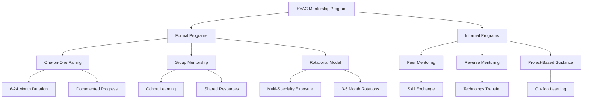
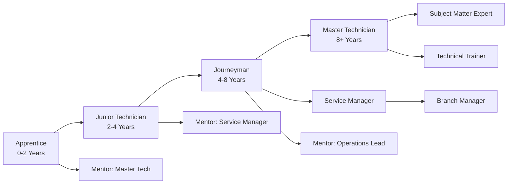

## Overview

Mentorship programs in the HVAC industry serve as critical mechanisms for knowledge transfer, skill development, and professional advancement. These structured relationships connect experienced professionals with emerging technicians and engineers, addressing the industry's growing skills gap while preserving institutional knowledge as senior practitioners retire.

Effective mentorship accelerates competency development, reduces error rates during the learning phase, and increases retention of technical staff. Organizations implementing formal mentorship programs report 20-30% faster achievement of performance milestones and significantly higher employee satisfaction scores.

## Mentorship Program Structures

### Formal Mentorship Models

Formal mentorship programs establish defined structures, expectations, and timelines for knowledge transfer:

**One-on-One Mentorship**
- Pairs single mentor with single mentee for focused development
- Duration typically 6-24 months with defined objectives
- Structured meetings (weekly or biweekly) with documented progress
- Clear competency goals aligned with certification pathways
- Mentor selection based on technical expertise and teaching capability

**Group Mentorship**
- Single experienced professional guides cohort of 3-6 mentees
- Efficient knowledge transfer for common foundational topics
- Peer learning opportunities among mentees
- Reduced mentor time commitment per mentee
- Applicable to apprentice programs and new hire onboarding

**Rotational Mentorship**
- Mentee works with multiple mentors across specializations
- Exposure to commercial, industrial, and residential applications
- Typical rotation periods: 3-6 months per specialty area
- Develops broad technical competency base
- Common in engineering development programs

### Informal Mentorship Approaches

Informal mentorship complements structured programs through organic knowledge sharing:

**Peer Mentoring**
- Technicians at similar experience levels share specialized knowledge
- Particularly effective for controls, building automation, and software tools
- Self-directed learning without hierarchical structure
- Facilitates lateral knowledge transfer across departments

**Reverse Mentoring**
- Junior staff mentor senior professionals on emerging technologies
- Critical for digital tools, IoT integration, and advanced diagnostics
- Breaks down generational technology gaps
- Encourages bidirectional learning culture

**Shadowing and On-the-Job Guidance**
- Unstructured observation during service calls and installations
- Real-time problem-solving demonstrations
- Contextual learning tied to actual field conditions
- No formal documentation or timeline requirements

## ASHRAE Mentorship Programs

ASHRAE provides structured mentorship frameworks through multiple channels:

**Student-Professional Connection (SPC)**
- Links students with practicing engineers in local chapters
- Focus on transitioning from academic to professional practice
- Career guidance and industry exposure
- Participation in chapter technical meetings and committees

**Young Engineers in ASHRAE (YEA)**
- Peer mentorship for professionals under 35 years old
- Leadership development and society involvement
- Technical presentation opportunities
- Networking with mid-career and senior members

**Chapter-Level Mentorship Initiatives**
- Local programs tailored to regional industry needs
- Face-to-face interaction opportunities
- Job shadowing and facility tours
- Integration with apprenticeship programs

## Career Development Pathways

Mentorship programs align with defined career progression tracks:

### Technician Career Track

**Apprentice to Junior Technician (0-4 Years)**
- Fundamental refrigeration cycle understanding
- Basic electrical and controls troubleshooting
- Residential and light commercial system familiarity
- EPA Section 608 certification achievement
- Mentor focus: safety protocols, diagnostic methodology

**Junior to Journeyman Technician (4-8 Years)**
- Complex commercial system diagnosis
- Building automation system navigation
- Energy efficiency optimization
- NATE specialty certifications
- Mentor focus: advanced troubleshooting, customer interaction

**Journeyman to Master Technician (8+ Years)**
- System design review and modification
- Specialized equipment expertise (chillers, VRF, industrial)
- Mentoring junior staff
- Technical training delivery
- Mentor transition: becomes mentor to others

### Engineering Career Track

**Graduate Engineer to Project Engineer (0-3 Years)**
- Load calculation proficiency (ASHRAE Handbook methods)
- Equipment selection and specification
- Construction document preparation
- Code compliance verification (ASHRAE 90.1, IMC)
- Mentor focus: design fundamentals, project coordination

**Project Engineer to Senior Engineer (3-7 Years)**
- System design leadership for complex projects
- Energy modeling (DOE-2, EnergyPlus, Trace 700)
- Sustainable design implementation (LEED, Passive House)
- Professional Engineering licensure
- Mentor focus: design optimization, client interaction

**Senior Engineer to Principal/Department Lead (7-15 Years)**
- Multi-project technical oversight
- Staff development and mentoring responsibility
- Proposal development and client acquisition
- Technical publication and industry involvement
- Mentor role: develop next generation of technical leaders

## Knowledge Transfer Methodologies

Effective mentorship employs structured knowledge transfer techniques:

**Competency-Based Assessment**
- Initial skills evaluation identifies knowledge gaps
- Customized learning plans address specific deficiencies
- Regular progress assessments against defined standards
- Documentation of achieved competencies

**Demonstration and Supervised Practice**
- Mentor demonstrates procedure while explaining decision rationale
- Mentee performs task under observation with real-time feedback
- Graduated autonomy as proficiency increases
- Error analysis and corrective instruction

**Case Study Review**
- Analysis of past projects or service scenarios
- Discussion of alternative approaches and outcomes
- Root cause analysis of failures
- Best practice identification

**Technical Documentation Development**
- Mentee creates procedure documents or design narratives
- Mentor reviews for technical accuracy and completeness
- Develops communication and documentation skills
- Creates knowledge base for organization

## Program Implementation Best Practices

Successful mentorship programs incorporate these elements:

**Structured Onboarding**
- Clear expectations for mentor and mentee roles
- Defined meeting schedules and communication protocols
- Goal-setting session within first two weeks
- Resource allocation (time, materials, access)

**Progress Tracking**
- Monthly check-ins with program coordinator
- Competency checklists aligned with certification requirements
- 360-degree feedback from mentee, mentor, and supervisors
- Adjustment of learning plans based on progress

**Mentor Training and Support**
- Teaching methodology instruction for technical mentors
- Time management strategies for balancing mentoring with job duties
- Recognition programs for effective mentors
- Peer mentor communities of practice

**Outcome Measurement**
- Certification achievement rates
- Time to competency milestones
- Retention rates of mentored vs. non-mentored employees
- Quality metrics (callback rates, customer satisfaction)
- Career advancement tracking

## Industry Partnership Models

Collaborative mentorship extends beyond single organizations:

**Trade School Partnerships**
- Practicing technicians guest lecture and provide lab demonstrations
- Student internships with mentored field experience
- Equipment donations for hands-on training
- Curriculum review to align with industry needs

**Manufacturer Training Programs**
- Factory-certified technician development
- Product-specific mentorship on advanced systems
- Technical support resource access
- Co-branded certification programs

**Union Apprenticeship Integration**
- Structured on-the-job training hours with assigned mentors
- Coordination with classroom instruction
- Journeyman examination preparation
- Compliance with Department of Labor apprenticeship standards

Mentorship programs represent strategic investments in workforce development, ensuring continuous availability of skilled HVAC professionals capable of designing, installing, and maintaining increasingly complex building systems. Organizations prioritizing structured knowledge transfer position themselves competitively while contributing to overall industry advancement.
