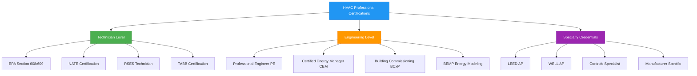
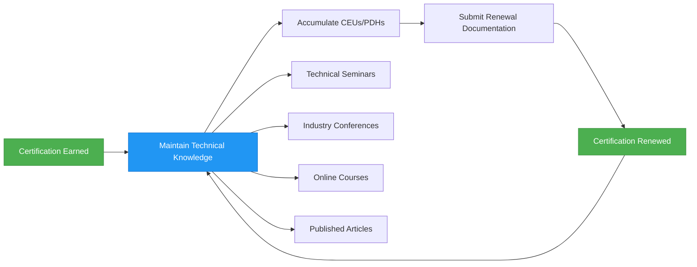

# Professional HVAC Certifications and Credentials

Professional certification in HVAC establishes technical competency, validates specialized knowledge, and demonstrates commitment to industry standards. Certification requirements reflect the physical principles governing climate control systems, from thermodynamic cycle analysis to psychrometric process design.

## Certification Structure and Framework

HVAC certifications span multiple technical levels, each addressing distinct competencies within the built environment ecosystem.

## Thermodynamic Knowledge Requirements

Certification examinations assess understanding of fundamental energy transfer principles:

**Sensible heat transfer:**

$$Q_s = \dot{m} \cdot c_p \cdot \Delta T$$

Where:
- $Q_s$ = sensible heat transfer rate (Btu/h or kW)
- $\dot{m}$ = mass flow rate (lb/h or kg/s)
- $c_p$ = specific heat capacity (Btu/lb·°F or kJ/kg·K)
- $\Delta T$ = temperature difference (°F or K)

**Latent heat transfer:**

$$Q_l = \dot{m} \cdot h_{fg} = \dot{m} \cdot \Delta W \cdot h_{fg}$$

Where:
- $Q_l$ = latent heat transfer rate (Btu/h or kW)
- $h_{fg}$ = latent heat of vaporization (Btu/lb or kJ/kg)
- $\Delta W$ = humidity ratio change (lb_water/lb_air or kg_water/kg_air)

**Refrigeration cycle coefficient of performance:**

$$COP_{cooling} = \frac{Q_{evap}}{W_{comp}} = \frac{h_1 - h_4}{h_2 - h_1}$$

Where enthalpy values correspond to refrigerant state points in the vapor-compression cycle.

## Certification Comparison Matrix

| Certification | Level | Duration | Prerequisites | Focus Area | Renewal Period |
|--------------|-------|----------|---------------|------------|----------------|
| EPA 608 Universal | Entry | 3 hours | None | Refrigerant handling | Lifetime |
| NATE Installation | Technician | 2-4 hours | 2 years experience | System installation | 5 years |
| NATE Service | Technician | 2-4 hours | 2 years experience | Troubleshooting | 5 years |
| PE Mechanical | Professional | 8 hours | 4 years experience | Engineering design | Annual CEUs |
| CEM | Professional | 4 hours | 3 years experience | Energy management | 3 years |
| BCxP | Specialist | 4 hours | 3 years experience | Commissioning | 3 years |
| LEED AP BD+C | Specialist | 2 hours | None | Green building design | 3 years |
| BEMP | Advanced | 3 hours | 3 years experience | Energy modeling | 3 years |

## Psychrometric Process Knowledge

Engineering certifications require proficiency in analyzing air conditioning processes on the psychrometric chart, including:

- **Sensible cooling/heating:** Horizontal process at constant humidity ratio
- **Cooling and dehumidification:** Process follows apparatus dew point line toward saturation curve
- **Humidification:** Vertical or near-vertical process increasing humidity ratio
- **Evaporative cooling:** Constant wet-bulb temperature process approaching saturation

**Bypass factor calculation:**

$$BF = \frac{t_{leaving} - t_{ADP}}{t_{entering} - t_{ADP}}$$

Where:
- $BF$ = coil bypass factor (dimensionless)
- $t_{ADP}$ = apparatus dew point temperature (°F or °C)
- Temperatures represent dry-bulb conditions

## ASHRAE Standard Alignment

Professional certifications align with ASHRAE standards governing design and operation:

- **ASHRAE 62.1:** Ventilation for Acceptable Indoor Air Quality—minimum outdoor air requirements
- **ASHRAE 90.1:** Energy Standard for Buildings—equipment efficiency requirements
- **ASHRAE 55:** Thermal Environmental Conditions for Human Occupancy—comfort criteria
- **ASHRAE 15:** Safety Standard for Refrigeration Systems—refrigerant classification
- **ASHRAE 180:** Standard Practice for Inspection and Maintenance of Commercial Building HVAC Systems

Engineering certifications test application of these standards to system design, including ventilation effectiveness calculations:

$$E_v = \frac{C_{exhaust} - C_{supply}}{C_{breathing\,zone} - C_{supply}}$$

Where ventilation effectiveness quantifies contaminant removal efficiency.

## Continuing Education Requirements

Continuing education maintains currency with evolving technologies, refrigerants, controls, and energy codes. Professional engineers require 15-30 professional development hours annually depending on jurisdiction.

## Heat Transfer Calculations in Certification Exams

Certification examinations assess ability to calculate heat transfer through building envelopes:

$$Q = U \cdot A \cdot \Delta T$$

Where:
- $Q$ = heat transfer rate (Btu/h or W)
- $U$ = overall heat transfer coefficient (Btu/h·ft²·°F or W/m²·K)
- $A$ = surface area (ft² or m²)
- $\Delta T$ = temperature difference between indoor and outdoor air (°F or K)

**Overall heat transfer coefficient:**

$$U = \frac{1}{R_{total}} = \frac{1}{\frac{1}{h_i} + R_{wall} + \frac{1}{h_o}}$$

Where $h_i$ and $h_o$ represent indoor and outdoor surface film coefficients respectively.

## Career Progression Pathways

Certifications establish progressive technical competency:

1. **Entry Level:** EPA refrigerant certification enables legal refrigerant handling
2. **Skilled Technician:** NATE certification demonstrates installation and service proficiency
3. **Engineering Professional:** PE license authorizes design and stamping of construction documents
4. **Energy Specialist:** CEM and BEMP credentials validate energy analysis capabilities
5. **Commissioning Authority:** BCxP certification qualifies professionals to verify system performance

Each level requires mastery of physical principles governing energy transfer, fluid mechanics, and thermodynamic processes in climate control applications.

## Airflow and Duct Design Competencies

TABB and commissioning certifications require proficiency in measuring and adjusting airflow using Pitot tube traverses:

$$V = 1096.7 \cdot \sqrt{\frac{\Delta P}{d}}$$

Where:
- $V$ = air velocity (ft/min)
- $\Delta P$ = velocity pressure (in. w.g.)
- $d$ = air density relative to standard conditions (dimensionless)

Testing professionals calculate volumetric flow rates, verify design CFM delivery, and document system performance against design specifications per ASHRAE Standard 111.

## Certification Return on Investment

Professional credentials increase earning potential by 15-30% compared to non-certified counterparts while establishing technical credibility with clients, employers, and regulatory authorities. Certifications reduce liability exposure by demonstrating adherence to industry best practices and safety protocols.
