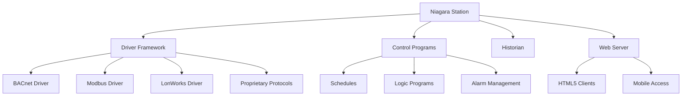
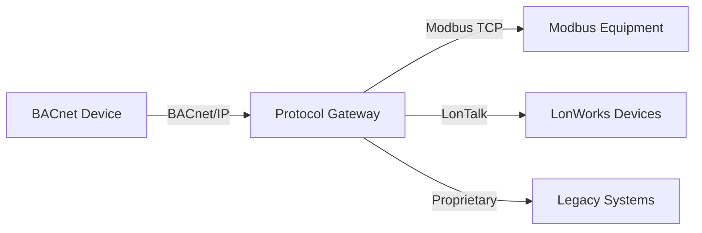

## Overview

Building automation and control systems certifications validate technical competence in designing, programming, commissioning, and troubleshooting modern HVAC control networks. These credentials demonstrate proficiency in digital control protocols, system integration, energy management strategies, and advanced control sequences that optimize building performance.

The evolution from pneumatic controls to direct digital control (DDC) systems has created demand for specialized knowledge in network protocols, control algorithms, and interoperability standards. Professionals with controls certifications command premium compensation due to the technical complexity and critical role these systems play in energy efficiency and occupant comfort.

## BACnet Certification (BTL)

### BACnet Testing Laboratory Program

The BACnet Testing Laboratory (BTL) certification verifies that products and systems comply with ASHRAE Standard 135, the BACnet protocol for building automation and control networks. While BTL primarily certifies products, the associated training programs prepare professionals to work with BACnet systems.

**Protocol Fundamentals**

BACnet operates on a client-server model using object-oriented data representation. Each device exposes properties through standardized objects:

- Analog Input/Output/Value objects for continuous measurements
- Binary Input/Output/Value objects for discrete states
- Multi-state objects for enumerated conditions
- Device objects containing network identification parameters

**Network Architecture**

BACnet supports multiple physical and data link layers organized by ASHRAE 135:

| Network Type | Physical Layer | Typical Application |
|--------------|----------------|---------------------|
| BACnet/IP | Ethernet (TCP/IP) | Building-wide backbone, enterprise integration |
| BACnet MS/TP | EIA-485 (RS-485) | Field-level controllers, zone equipment |
| BACnet/SC | Ethernet with TLS | Secure cloud connectivity, remote access |
| BACnet ARCNET | ARCNET token passing | Legacy installations |

**Interoperability Requirements**

BACnet Interoperability Building Blocks (BIBBs) define standardized service capabilities:

- Data Sharing: Read Property, Write Property services
- Alarm and Event Management: Event notification subscription
- Scheduling: Calendar-based time schedules
- Trending: Automatic data logging and retrieval

The change of value (COV) service optimizes network traffic by transmitting data only when values exceed defined thresholds:

$$
\Delta_{COV} = |V_{current} - V_{last}| \geq \epsilon_{threshold}
$$

Where $\epsilon_{threshold}$ represents the minimum reportable change configured for each point.

## Niagara Framework Certification

### Tridium Niagara Platform

The Niagara Framework provides a universal integration platform supporting multiple protocols and device types. Tridium offers progressive certification levels demonstrating competency in framework operation and customization.

**Certification Levels**

1. **Niagara 4 Essentials**: Basic navigation, database building, graphics creation
2. **Niagara 4 Advanced**: Programming logic, custom applications, alarm configuration
3. **Niagara 4 Professional**: Framework administration, security implementation, driver integration
4. **Niagara 4 Master**: Advanced customization, module development, enterprise architecture

**Framework Architecture**

**Programming Constructs**

Control logic in Niagara employs graphical programming with wire sheets connecting functional blocks:

**PID Control Implementation**

The proportional-integral-derivative algorithm calculates actuator position based on error signal:

$$
u(t) = K_p e(t) + K_i \int_0^t e(\tau) d\tau + K_d \frac{de(t)}{dt}
$$

Where:
- $u(t)$ = controller output (0-100%)
- $e(t)$ = setpoint - measured value
- $K_p$ = proportional gain
- $K_i$ = integral gain (reset action)
- $K_d$ = derivative gain (rate action)

Tuning parameters follow Ziegler-Nichols or auto-tuning methods to achieve critically damped response without overshoot.

**Energy Management Algorithms**

Optimal start/stop calculations minimize runtime while achieving occupied setpoints:

$$
t_{start} = t_{occupied} - \frac{T_{unoccupied} - T_{occupied}}{R_{heating}}
$$

Where $R_{heating}$ represents the measured heating rate (°F/hour) from previous cycles.

## Manufacturer-Specific Certifications

### Johnson Controls Metasys Certification

**Certification Tracks**
- Field Technician: Device commissioning, troubleshooting, basic graphics
- System Technician: Advanced programming, integration, network diagnostics
- System Specialist: Enterprise architecture, complex applications, performance optimization

**Core Competencies**
- Extended Application Specific Controller Toolset (SCT) programming
- N2 and BACnet network integration
- Application-specific controller (ASC) configuration for VAV, AHU, chiller control
- FEC (Field Equipment Controller) setup and calibration

### Siemens Building Technologies Certification

**Desigo Platform Training**
- Desigo CC Building Management: Operator interface, alarm management, trending
- Desigo PX Automation: PX controller programming, function block logic, integration
- Desigo Insight: Energy monitoring, reporting, analytics

**Programming Standards**

Function block diagrams follow IEC 61131-3 structured text and ladder logic conventions. Controller scan time determines maximum loop execution frequency:

$$
f_{max} = \frac{1}{t_{scan}}
$$

For typical scan times of 100ms, control loops execute at 10 Hz maximum frequency.

### Honeywell Enterprise Buildings Integrator (EBI)

**Certification Components**
- EBI System Administration: User management, database backup, system configuration
- Integration Specialist: Protocol gateways, third-party device integration
- Advanced Programming: Custom logic, energy optimization sequences

**Spyder Tool Programming**

Honeywell's graphical programming environment uses functional blocks for:
- Economizer control with enthalpy comparison
- Demand-controlled ventilation using CO2 sensors
- Chiller plant optimization with sequencing logic

### Schneider Electric EcoStruxure Certification

**Platform Competencies**
- StruxureWare Building Operation: BACnet system engineering, graphics development
- SmartX Controller Programming: Application code development, logic validation
- Enterprise Server Architecture: Multi-site management, data aggregation

## Control System Programming Fundamentals

### Sequence of Operations Development

Effective control sequences translate design intent into executable logic. Standard ASHRAE sequences provide templates:

**VAV Terminal Unit Control**

1. **Heating Mode** ($T_{zone} < T_{setpoint} - 1°F$):
   - Damper modulates to minimum position
   - Reheat valve opens proportionally based on error

2. **Cooling Mode** ($T_{zone} > T_{setpoint}$):
   - Damper modulates from minimum to maximum
   - Reheat valve remains closed

3. **Dead Band** ($T_{setpoint} - 1°F \leq T_{zone} \leq T_{setpoint}$):
   - Damper at minimum position
   - Reheat valve closed

**Air Handling Unit Economizer Logic**

Enthalpy-based economizer comparison:

$$
h = 0.24T + W(1061 + 0.444T)
$$

Where:
- $h$ = enthalpy (Btu/lb dry air)
- $T$ = temperature (°F)
- $W$ = humidity ratio (lb moisture/lb dry air)

Economizer enables when $h_{outdoor} < h_{return} - \Delta h_{differential}$

### Network Integration Standards

**Protocol Translation**

Gateway devices enable communication between dissimilar protocols through object mapping:

**Data Point Mapping**

Each integrated point requires address translation:

| Source Protocol | Source Address | Destination Protocol | Destination Address |
|----------------|----------------|---------------------|---------------------|
| BACnet | Device 100, AI-1 | Modbus | Register 40001 |
| Modbus | Slave 5, Coil 0 | BACnet | Device 200, BO-1 |
| LonWorks | Node 12, nviTemp | BACnet | Device 300, AV-5 |

### Graphics Development Standards

**Screen Hierarchy**

1. **Enterprise Overview**: Multi-building portfolio view, alarm summaries
2. **Building Dashboard**: System status, energy metrics, major alarms
3. **System Graphics**: Equipment-specific details, control parameters
4. **Point Detail**: Trending, historical data, override capabilities

**Performance Optimization**

Minimize screen refresh rates to reduce network traffic:

$$
\text{Bandwidth} = N_{points} \times S_{bytes} \times f_{refresh}
$$

Standard practice limits refresh rates to 5-second intervals for operator screens, 1-minute intervals for historical data.

## Career Progression and Compensation

**Skill Development Path**

1. **Controls Technician** (0-2 years): Point commissioning, basic troubleshooting, graphics modification
2. **Controls Programmer** (2-5 years): Sequence development, integration projects, network design
3. **Controls Engineer** (5-10 years): System architecture, complex applications, project management
4. **Senior Controls Specialist** (10+ years): Enterprise solutions, custom development, technical leadership

**Market Demand**

Controls professionals command premium compensation due to specialized knowledge requirements:

- Entry technicians: 10-15% premium over HVAC field technicians
- Experienced programmers: 25-35% premium over mechanical technicians
- Senior specialists: 40-50% premium reflecting cross-disciplinary expertise

**Continuing Education**

Technology evolution necessitates ongoing training:
- Annual protocol updates (BACnet revisions, security enhancements)
- Cybersecurity certifications (network hardening, secure remote access)
- Energy analytics platforms (fault detection diagnostics, machine learning applications)
- Cloud-based systems (SaaS platforms, API integration)

## Examination Preparation Resources

**Technical References**
- ASHRAE Standard 135: BACnet protocol specification
- ASHRAE Guideline 13: Specifying Building Automation Systems
- ASHRAE Guideline 36: High-Performance Sequences of Operation for HVAC Systems
- Manufacturer programming manuals and application guides

**Hands-On Training Requirements**

Certifications require practical experience with:
- Controller programming environments
- Network diagnostic tools (protocol analyzers, packet sniffers)
- Integration platforms and gateways
- Commissioning and functional testing procedures

**Study Timeline**

Typical preparation requires 6-12 months combining:
- Formal training courses (manufacturer-sponsored or third-party)
- Laboratory exercises with actual hardware
- Mentored project work under experienced programmers
- Independent study of protocol specifications and standards

## Industry Standards Compliance

**ASHRAE Guideline 36**

Modern control sequences must align with high-performance operational strategies:
- Demand-controlled ventilation using CO2 sensors
- Trim and respond chiller plant optimization
- Integrated economizer fault detection and diagnostics
- Pressure-independent VAV terminal unit control

**Cybersecurity Requirements**

ASHRAE Standard 231P establishes security practices:
- Network segmentation separating control and enterprise networks
- Encrypted communications for remote access
- Multi-factor authentication for administrative privileges
- Regular security patches and firmware updates

## Conclusion

Controls and automation certifications validate expertise in the increasingly complex field of building automation systems. As buildings adopt advanced control strategies for energy efficiency, grid responsiveness, and predictive maintenance, professionals with certified competencies in protocols, programming, and integration remain in high demand. These credentials provide measurable validation of technical skills that directly impact building performance and operational costs.

## Certification Categories

- [Niagara Framework Certification](./niagara-framework-certification/)
- [BACnet Certification BTL](./bacnet-certification-btl/)
- [Johnson Controls Certified Technician](./johnson-controls-certified-technician/)
- [Siemens Building Technologies Certification](./siemens-building-technologies-certification/)
- [Honeywell Authorized Dealer](./honeywell-authorized-dealer/)
- [Schneider Electric Certification](./schneider-electric-certification/)
- [Control System Programming](./control-system-programming/)
- [Graphics Development Training](./graphics-development-training/)
- [Network Integration Certification](./network-integration-certification/)
