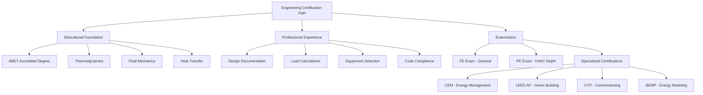

## Professional Credentials Framework

Engineering certifications establish competency thresholds for HVAC system design, analysis, and optimization. These credentials differ fundamentally from technician certifications through their focus on thermodynamic principles, load calculation methodologies, and code compliance rather than equipment service and repair.

The certification hierarchy progresses from entry-level engineering fundamentals through specialized applications in energy management, sustainable design, and building commissioning. Each credential requires demonstrated mastery of calculation methods, standard interpretations, and professional ethics.

## Licensure vs. Certification Distinction

Professional Engineer (PE) licensure represents legal authorization to approve engineering documents and accept public responsibility for technical work. State licensing boards grant PE status after verifying education (ABET-accredited degree), experience (typically four years under PE supervision), and examination performance (NCEES Fundamentals of Engineering and Principles and Practice exams).

Voluntary certifications demonstrate specialized knowledge without conferring legal authority. Organizations such as the Association of Energy Engineers (AEE), U.S. Green Building Council (USGBC), and Building Commissioning Association (BCA) administer competency assessments in focused domains like energy auditing, sustainable design, or commissioning protocols.

## Core Engineering Competencies

HVAC engineering certifications assess capabilities across multiple technical domains:

**Thermodynamic Analysis**

Heat transfer calculations form the foundation of load estimation and equipment selection. The fundamental heat balance equation governs all HVAC design:

$$Q_{total} = Q_{sensible} + Q_{latent} = \dot{m}c_p\Delta T + \dot{m}h_{fg}\Delta\omega$$

Where sensible load depends on mass flow rate, specific heat capacity, and temperature differential, while latent load incorporates enthalpy of vaporization and humidity ratio change. Engineers must quantify conduction through building envelopes using:

$$Q_{cond} = UA\Delta T = \frac{A}{R_{total}}(T_{inside} - T_{outside})$$

This requires assembly of thermal resistance networks accounting for material layers, air films, and thermal bridging effects per ASHRAE Standard 90.1 requirements.

**Psychrometric Processes**

State point manipulation on psychrometric charts represents graphical solution methods for air conditioning processes. The mixing of airstreams follows mass and energy conservation:

$$\dot{m}_3 = \dot{m}_1 + \dot{m}_2$$

$$\dot{m}_3h_3 = \dot{m}_1h_1 + \dot{m}_2h_2$$

Engineers determine supply air conditions through sequential processes: outdoor air mixing, cooling coil dehumidification, reheat, and fan heat addition. Each transformation follows specific physics governing moisture removal rates, coil bypass factors, and apparatus dew point temperatures.

## Certification Pathway Comparison

| Credential | Administering Body | Prerequisites | Exam Duration | Renewal Period | Primary Focus |
|------------|-------------------|---------------|---------------|----------------|---------------|
| Professional Engineer (PE) | State Boards via NCEES | ABET degree + FE exam + 4 years experience | 8 hours | Varies by state | Legal design authority |
| Certified Energy Manager (CEM) | Association of Energy Engineers | 3-10 years experience (varies) | 4 hours | 3 years | Energy auditing and economics |
| LEED AP BD+C | U.S. Green Building Council | LEED Green Associate | 2 hours | 3 years | Sustainable building design |
| Certified Commissioning Professional (CCP) | Building Commissioning Association | 5 years commissioning experience | 4 hours | 5 years | Systems verification |
| Building Energy Modeling Professional (BEMP) | ASHRAE | BEM experience | 4 hours | 3 years | Simulation and modeling |

## Technical Knowledge Domains

**System Design Calculations**

Equipment sizing requires integration of psychrometric analysis with duct and piping hydraulics. Total system pressure drop follows Darcy-Weisbach principles:

$$\Delta P = f\frac{L}{D}\frac{\rho v^2}{2} + \sum K\frac{\rho v^2}{2}$$

Where friction factors depend on Reynolds number and relative roughness, while fitting loss coefficients derive from geometry-specific testing. Engineers balance first-cost equipment investments against operating energy consumption through lifecycle cost analysis incorporating time value of money.

**Energy Code Compliance**

ASHRAE Standard 90.1 establishes minimum efficiency requirements through prescriptive component performance or whole-building energy modeling. The performance rating method compares proposed design energy consumption against baseline building calculations using identical geometry, occupancy, and schedules but code-minimum HVAC efficiency.

## Examination Content Structure

The PE Mechanical HVAC depth exam emphasizes practical application of engineering principles across six domains: HVAC systems and equipment (30%), building mechanical systems integration (15%), codes and standards (15%), supportive knowledge (15%), load calculations and psychrometrics (15%), and engineering economics (10%).

Questions require multi-step solutions combining heat transfer, fluid mechanics, and economic analysis. A typical problem presents building geometry, climate data, and occupancy parameters, then requests cooling load, equipment capacity, duct sizing, and energy consumption estimates.

Energy management certification (CEM) content focuses on measurement and verification protocols per ASHRAE Guideline 14, utility rate structures, economic analysis methods (simple payback, net present value, internal rate of return), and energy conservation measure identification across building envelopes, lighting, and HVAC systems.

## Continuing Education Requirements

Credential maintenance requires ongoing professional development through structured continuing education units (CEUs) or professional development hours (PDHs). PE licensure renewal demands 15-30 PDHs annually depending on state regulations, while voluntary certifications typically specify 24-30 hours per three-year renewal cycle.

Acceptable activities include conference attendance, technical paper authorship, standards committee participation, university coursework, and webinar completion. Content must relate directly to certification scope, emphasizing emerging technologies, updated standards, and advanced analysis methodologies.

## Career Impact and ROI

Engineering certifications correlate with expanded practice opportunities and compensation increases. PE licensure enables independent practice, plan stamping authority, and expert witness testimony. Salary surveys indicate 10-15% premiums for PE holders versus non-licensed engineers with equivalent experience.

Specialized credentials demonstrate commitment to focused technical domains. LEED AP designation provides competitive advantages in sustainable design markets, while CEM certification positions professionals for energy management and utility program roles. The investment of examination fees ($200-$800) and preparation time (100-300 hours) yields returns through enhanced marketability and project leadership opportunities.

## Standards and Reference Integration

Engineering practice requires fluency with industry standards governing design calculations and performance verification:

- ASHRAE Standard 62.1: Ventilation for Acceptable Indoor Air Quality
- ASHRAE Standard 90.1: Energy Standard for Buildings Except Low-Rise Residential
- ASHRAE Standard 55: Thermal Environmental Conditions for Human Occupancy
- ASHRAE Fundamentals Handbook: Property data and calculation methods
- International Mechanical Code (IMC): Installation and safety requirements

Certification examinations reference these documents extensively, requiring candidates to navigate indices, interpret tables, and apply calculation procedures under timed conditions. Open-book exam formats test practical reference utilization rather than memorization.

## Strategic Credential Selection

Career trajectory determines optimal certification pathways. Design engineers prioritize PE licensure for legal practice authority and calculation approval responsibilities. Energy consultants pursue CEM or BPI credentials emphasizing auditing protocols and retrofit analysis. Commissioning agents target CCP or ACG certifications validating functional testing expertise.

Multiple credentials provide synergistic benefits. The PE foundation establishes thermodynamic competency, while LEED AP demonstrates sustainable design integration, and CEM adds economic optimization capabilities. This combination positions professionals for comprehensive building system optimization roles spanning design, construction, and operational phases.
