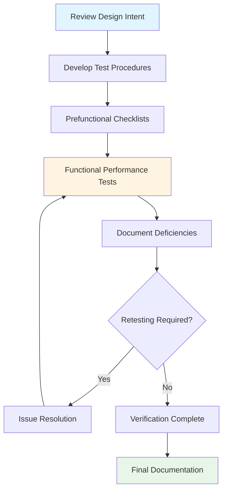

# Building Commissioning Certification Programs

Building commissioning certification validates expertise in systematic verification of HVAC systems, controls, and building envelope performance. These credentials demonstrate proficiency in functional testing, performance verification, and documentation of complex mechanical systems.

## Certification Types and Requirements

### Commissioning Authority (CxA)

The Commissioning Authority credential from AABC Commissioning Group or ACG represents the industry standard for commissioning professionals. This certification requires:

**Prerequisites:**
- Five years of documented commissioning experience
- Bachelor's degree in engineering or equivalent technical education
- Completion of 80 hours of commissioning-specific training
- Documented project portfolio demonstrating commissioning leadership

**Examination Focus:**
- Commissioning process management per ASHRAE Guideline 0 and 1.1
- Functional performance testing methodology
- Systems integration verification
- Documentation and issue resolution protocols

### Building Commissioning Professional (BCP)

University of Wisconsin offers the BCP credential through their Building Commissioning Certificate Program:

**Program Structure:**
- 120 hours of coursework covering commissioning fundamentals
- Emphasis on existing building commissioning (EBCx)
- Energy efficiency verification methods
- Control system validation techniques

## Commissioning Process Physics

### Airflow Verification

Commissioning requires validation of design airflow rates through measurement and system curve analysis. The fan system curve relationship governs performance:

$$
\Delta P_{total} = \Delta P_{static} + \Delta P_{velocity} = K_{system} \cdot Q^2
$$

Where:
- $\Delta P_{total}$ = total pressure rise across fan (Pa)
- $K_{system}$ = system resistance coefficient
- $Q$ = volumetric flow rate (m³/s)

Verification involves plotting the actual fan curve against the system curve to confirm operating point alignment with design specifications.

### Hydronic System Testing

Hydronic commissioning validates flow rates, temperatures, and differential pressures. The fundamental heat transfer equation governs system performance:

$$
\dot{Q} = \dot{m} \cdot c_p \cdot \Delta T = \rho \cdot \dot{V} \cdot c_p \cdot (T_{return} - T_{supply})
$$

Where:
- $\dot{Q}$ = heat transfer rate (W)
- $\dot{m}$ = mass flow rate (kg/s)
- $c_p$ = specific heat capacity (J/kg·K)
- $\dot{V}$ = volumetric flow rate (m³/s)
- $\rho$ = fluid density (kg/m³)

Commissioning agents verify measured flow and temperature differential produce design capacity within ±10% tolerance per ASHRAE Standard 202.

## Functional Performance Testing

### Control System Verification

Control sequence validation represents the most critical commissioning deliverable. Testing confirms:

**Analog Control Loops:**
- Proportional-integral-derivative (PID) response characteristics
- Setpoint tracking accuracy (±0.5°C for temperature loops)
- Loop stability under varying loads
- Sensor calibration verification (±0.2°C for temperature, ±25 Pa for pressure)

**Digital Control Sequences:**
- Mode transition logic (occupied/unoccupied/warmup/setback)
- Economizer staging per ASHRAE Standard 90.1
- Demand control ventilation response to CO₂ levels
- Optimal start/stop algorithms

### Performance Testing Methodology

## Certification Comparison

| Credential | Issuing Body | Experience Required | Exam Duration | Renewal Period | Cost Range |
|------------|--------------|---------------------|---------------|----------------|------------|
| CxA | AABC/ACG | 5 years | 4 hours | 3 years | $1,500-2,000 |
| BCP | UW-Madison | 2 years | Certificate program | 5 years | $3,500-4,500 |
| LEED AP BD+C | USGBC/GBCI | None (recommended) | 2 hours | 3 years | $450-550 |
| CEM | AEE | 3 years | 4 hours | 3 years | $800-1,200 |
| BEMP | ASHRAE | 5 years | 4 hours | 3 years | $600-800 |

## ASHRAE Standards Framework

### Guideline 0-2019: The Commissioning Process

Establishes systematic approach for verifying building systems meet Owner's Project Requirements (OPR):

**Key Requirements:**
- Development of Basis of Design (BOD) document
- Commissioning plan creation during design phase
- Systems manual compilation
- Training delivery to operating staff

### Guideline 1.1-2007: HVAC&R Technical Requirements

Provides technical depth for mechanical system commissioning:

**Testing Parameters:**
- Air terminal device flow verification (±10% of design)
- Chilled water flow measurement (±5% at design conditions)
- Cooling tower approach temperature (within 1°C of design)
- Boiler combustion efficiency (>80% for natural gas systems)

### Standard 202-2018: Commissioning Process

Defines commissioning deliverables and responsibilities for new construction:

**Documentation Requirements:**
- Commissioning plan updated through project phases
- Issues log tracking deficiencies and resolutions
- Functional performance test procedures and results
- Systems manual including as-built documentation

## Energy Performance Verification

Commissioning validates energy efficiency through measurement and verification (M&V) protocols:

### IPMVP Framework

International Performance Measurement and Verification Protocol provides methodology:

**Option B: Retrofit Isolation**
$$
\text{Energy Savings} = (E_{baseline} - E_{post}) \pm \text{Adjustments}
$$

Where adjustments account for:
- Weather normalization using heating/cooling degree days
- Occupancy variations from design assumptions
- Production or operational changes

**Uncertainty Analysis:**

Total measurement uncertainty combines instrumentation and modeling errors:

$$
U_{total} = \sqrt{U_{instrumentation}^2 + U_{model}^2 + U_{sampling}^2}
$$

Acceptable uncertainty: ±10% for whole-building energy savings verification.

## Career Advancement

Building commissioning certification opens pathways to:

**Commissioning Authority Roles:**
- Independent commissioning agent for new construction projects
- Retro-commissioning (RCx) consultant for existing facilities
- Monitoring-based commissioning (MBCx) specialist
- Envelope commissioning professional

**Typical Compensation:**
- Entry-level CxA: $65,000-85,000 annually
- Mid-career (5-10 years): $90,000-120,000
- Senior commissioning manager: $120,000-160,000

**Market Demand:**
Growing energy code requirements (ASHRAE 90.1, IECC) mandate commissioning for buildings exceeding 50,000 ft² (4,645 m²), creating sustained credential demand.

## Continuing Education

Certification maintenance requires ongoing professional development:

**Acceptable Activities:**
- ASHRAE Learning Institute commissioning courses (8-16 CEUs)
- Functional performance testing workshops
- Building automation system training
- Energy modeling certification programs

**Recommended Technical Topics:**
- Advanced control strategies (demand response, predictive optimization)
- Fault detection and diagnostics (FDD) system implementation
- Refrigerant regulations and low-GWP system commissioning
- Decarbonization and electrification technologies

Building commissioning certification demonstrates mastery of systematic verification processes ensuring HVAC systems achieve design performance, energy efficiency targets, and occupant comfort objectives throughout building lifecycle.
