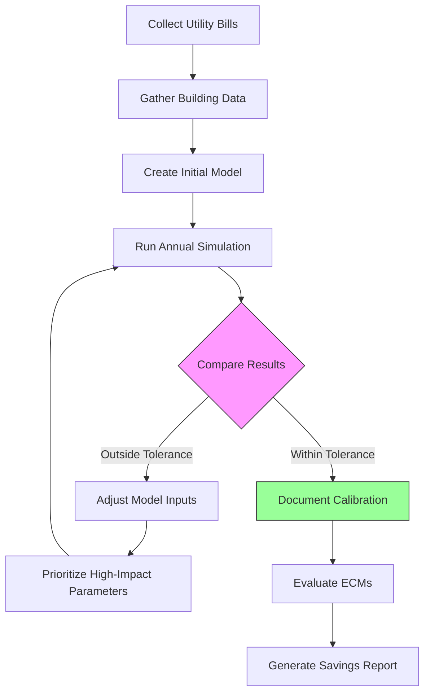

Building energy modeling certifications validate expertise in simulating building thermal and energy performance using computational tools. These credentials demonstrate proficiency in baseline and proposed building modeling per ASHRAE 90.1 Appendix G, calibrated simulation techniques for existing buildings, and application of energy models for code compliance, incentive programs, and design optimization. Certified energy modelers play a critical role in documenting energy performance for LEED certification, utility incentive programs, and building code compliance.

## Certification Landscape

Two primary certifications address building energy modeling competency: the Building Energy Modeling Professional (BEMP) from ASHRAE and Certified Energy Modeler (CEM) specialization from AEE. Both credentials require demonstrated proficiency in simulation software, thermodynamic principles, and application of modeling standards.

**ASHRAE Building Energy Assessment Professional (BEAP):**
- Administered by ASHRAE
- Focuses on existing building assessment and calibrated simulation
- Prerequisites: 5 years experience or Professional Engineer license
- Exam: 3 hours, 100 questions
- Recertification: 30 PDH every 3 years

**Building Energy Modeling Professional (BEMP) Concept:**
While a formal standalone BEMP certification has been discussed by industry organizations, current recognition of modeling expertise typically occurs through:
- ASHRAE BEAP credential with modeling focus
- AEE CEM credential with energy simulation specialization
- USGBC demonstration of modeling competency for LEED projects
- Software vendor certification (DOE-2, EnergyPlus, eQUEST, TRACE, IES-VE)
- State-specific energy modeler registration (California Title 24, New York)

## Fundamental Modeling Principles

Building energy models solve simultaneous heat and mass balance equations at each simulation timestep to calculate HVAC loads and energy consumption.

### Energy Balance Equations

The fundamental zone energy balance drives all building simulation calculations:

$$Q_{cooling} + Q_{heating} + Q_{internal} + Q_{solar} + Q_{infiltration} + Q_{ventilation} + Q_{conduction} = 0$$

**Component Heat Transfer:**

Conduction through envelope assemblies:

$$Q_{cond} = U \cdot A \cdot (T_{outdoor} - T_{zone})$$

Where:
- $U$ = Overall heat transfer coefficient (Btu/h·ft²·°F)
- $A$ = Surface area (ft²)
- $T$ = Temperature (°F)

Solar heat gain through fenestration:

$$Q_{solar} = A_{window} \cdot SHGC \cdot I_{incident} \cdot FF$$

Where:
- $SHGC$ = Solar heat gain coefficient
- $I_{incident}$ = Incident solar radiation (Btu/h·ft²)
- $FF$ = Frame fraction correction factor

Infiltration load:

$$Q_{infiltration} = 1.08 \cdot CFM \cdot \Delta T + 4840 \cdot CFM \cdot \Delta W$$

Where:
- $1.08$ = Sensible heat constant (Btu/CFM·°F·h)
- $4840$ = Latent heat constant (Btu/lb moisture)
- $\Delta W$ = Humidity ratio difference (lb moisture/lb dry air)

### HVAC System Modeling

Energy models calculate equipment energy consumption based on part-load performance curves:

$$Power = Power_{rated} \cdot PLR \cdot f_{PLR} \cdot f_{temp}$$

Where:
- $PLR$ = Part load ratio (actual load / rated capacity)
- $f_{PLR}$ = Part load degradation curve
- $f_{temp}$ = Temperature correction factor

**Chiller Performance Curves:**

Chiller power as function of load and temperatures:

$$\frac{kW}{kW_{rated}} = a + b \cdot PLR + c \cdot PLR^2 + d \cdot T_{chw} + e \cdot T_{cond}$$

Typical centrifugal chiller coefficient values:
- $a$ = 0.09 (intercept)
- $b$ = -0.30 (linear PLR term)
- $c$ = 1.21 (quadratic PLR term)
- $d$ = -0.015 (chilled water temperature effect)
- $e$ = 0.02 (condenser temperature effect)

**Fan Energy Modeling:**

Variable speed fan power follows affinity laws:

$$\frac{Power_2}{Power_1} = \left(\frac{Speed_2}{Speed_1}\right)^3 = \left(\frac{CFM_2}{CFM_1}\right)^3$$

VAV system fan energy at 60% airflow:

$$Power_{60\%} = Power_{design} \cdot (0.60)^3 = 0.216 \cdot Power_{design}$$

This represents 78.4% energy savings compared to constant volume operation at full power.

## ASHRAE Standard 90.1 Appendix G Methodology

Appendix G provides the Performance Rating Method for demonstrating energy cost savings compared to a code-compliant baseline building.

### Baseline Building Requirements

The baseline model must reflect minimum code requirements with specific system types assigned by building characteristics:

**HVAC System Selection:**

| Building Type | Floor Area | Heating Type | Baseline System |
|---------------|------------|--------------|-----------------|
| Residential | Any | Any | System 1: PTAC with electric resistance heat |
| Residential | Any | Fossil fuel/district | System 2: PTAC with hot water fossil fuel boiler |
| Non-residential | <25,000 ft² | Electric | System 3: PSZ-AC with electric resistance |
| Non-residential | <25,000 ft² | Fossil fuel | System 4: PSZ-AC with gas furnace |
| Non-residential | 25,000-150,000 ft² | Electric | System 5: Packaged VAV with electric reheat |
| Non-residential | 25,000-150,000 ft² | Fossil fuel | System 6: Packaged VAV with gas HW reheat |
| Non-residential | >150,000 ft² | Electric | System 7: VAV with electric reheat |
| Non-residential | >150,000 ft² | Fossil fuel | System 8: VAV with gas HW reheat |

**Baseline Performance Requirements:**

Envelope assembly U-factors from ASHRAE 90.1 Table A3.1-A3.8 based on climate zone:

| Assembly | Climate Zone 3A | Climate Zone 4A | Climate Zone 5A |
|----------|----------------|-----------------|-----------------|
| Roof U-factor | 0.063 | 0.048 | 0.048 |
| Above-grade wall U-factor | 0.124 | 0.084 | 0.064 |
| Window U-factor | 0.57 | 0.46 | 0.38 |
| Window SHGC | 0.25 | 0.40 | 0.40 |

HVAC equipment efficiency from ASHRAE 90.1 Tables 6.8.1A-G:
- Packaged air conditioners: 11.2 EER (<65 kBtu/h), 11.0 EER (≥65 kBtu/h)
- Chillers: 6.1 COP electric centrifugal (≥300 tons)
- Boilers: 80% combustion efficiency
- Pumps: Variable speed with pressure differential control
- Fans: Maximum 0.3 hp per 1000 CFM supply, 0.2 hp per 1000 CFM return

### Proposed Building Modeling

The proposed building model reflects actual design with geometric and operational characteristics matching the baseline model.

**Modeling Requirements:**
- Identical floor area, orientation, and internal loads as baseline
- Actual envelope assemblies, fenestration properties, and shading devices
- Designed HVAC systems including equipment efficiencies and controls
- Renewable energy systems counted toward savings
- Calculation must use same weather file as baseline model

**Percent Energy Cost Savings:**

$$\%\ Savings = 100 \times \frac{Cost_{baseline} - Cost_{proposed}}{Cost_{baseline}}$$

LEED v4 energy performance points based on percent improvement:
- 6% savings: 1 point (prerequisite + minimum)
- 8-10% savings: 2-3 points
- 12-14% savings: 4-5 points
- 16-20% savings: 6-8 points
- Each additional 2%: +1 point (up to 50% savings, 18 points maximum)

### Simulation Timestep and Weather Data

Hourly simulation represents the minimum acceptable timestep. Subhourly timesteps (15-minute) improve accuracy for:
- Systems with thermal storage
- Natural ventilation strategies
- Complex control sequences
- Peak demand calculation

**Weather File Requirements:**
- TMY3 (Typical Meteorological Year) data for location
- 8,760 hourly values for temperature, humidity, solar radiation, wind
- Climate zone determines baseline building requirements
- Nearest weather station within 50 miles acceptable
- Custom weather files for microclimate conditions (urban heat island, coastal)

## Calibrated Simulation for Existing Buildings

Calibrated energy models match measured utility data to validate model accuracy before evaluating energy conservation measures.

### Calibration Tolerance Standards

ASHRAE Guideline 14 and FEMP establish acceptance criteria:

**Mean Bias Error (MBE):**

$$MBE = \frac{\sum_{i=1}^{n} (y_i - \hat{y}_i)}{(n-1) \cdot \bar{y}} \times 100\%$$

**Coefficient of Variation of Root Mean Squared Error (CV-RMSE):**

$$CV(RMSE) = \frac{\sqrt{\frac{\sum_{i=1}^{n} (y_i - \hat{y}_i)^2}{n-1}}}{\bar{y}} \times 100\%$$

Where:
- $y_i$ = Measured consumption for period $i$
- $\hat{y}_i$ = Simulated consumption for period $i$
- $\bar{y}$ = Mean measured consumption
- $n$ = Number of data points

**Acceptance Criteria:**

| Calibration Level | MBE Limit | CV-RMSE Limit |
|-------------------|-----------|---------------|
| Monthly calibration | ±5% | ≤15% |
| Hourly calibration | ±10% | ≤30% |

### Calibration Workflow

**Parameter Adjustment Priority:**

1. **Operating schedules:** Occupancy, equipment, lighting hours
2. **Internal loads:** Actual power density from measured data
3. **HVAC setpoints:** Actual temperature and humidity control
4. **Equipment efficiency:** Degraded performance from design values
5. **Infiltration rates:** Measured from blower door or tracer gas
6. **Envelope properties:** Thermographic survey validation
7. **Weather normalization:** Adjust for atypical year

### Data Collection Requirements

Comprehensive building characterization ensures model fidelity:

**Utility Data (Minimum 12 Months):**
- Electric demand (kW) and consumption (kWh)
- Natural gas consumption (therms or CCF)
- Steam or chilled water (if applicable)
- Normalize for weather and occupancy variations

**Building Operating Data:**
- Temperature and humidity setpoints by zone
- Operating hours and scheduling
- Occupancy counts and patterns
- Plug load inventory and usage
- Lighting power density survey
- Domestic hot water usage

**HVAC Equipment Information:**
- Nameplate data for all central plant equipment
- Trending data from BAS (supply temperature, flow rates, power)
- Chiller plant logs showing load and efficiency
- Boiler combustion efficiency test results
- Air handler airflow measurements

**Envelope Survey:**
- Wall, roof, and floor assembly construction
- Window type, area, and frame characteristics
- Blower door test results (CFM50 or ACH50)
- Infrared thermography for thermal bridges
- Shading from adjacent buildings and vegetation

## Energy Modeling Software Platforms

Multiple simulation engines provide building energy modeling capabilities with varying complexity and applications.

### DOE-2 Based Programs

DOE-2 represents the most widely used hourly simulation engine for compliance modeling.

**eQUEST:**
- Free graphical interface for DOE-2.2 engine
- Wizard-driven input for rapid model creation
- Schematic design mode for early-phase analysis
- Detailed mode for Appendix G compliance
- LEED submittal reports built-in
- Limited custom system modeling capability

**TRACE 3D Plus:**
- Commercial software by Trane ($3,000-$5,000)
- Integrated with equipment selection and pricing
- 3D geometry input with SketchUp plugin
- Equipment performance from Trane catalog
- Suitable for design optimization
- Compliance reporting for ASHRAE 90.1

### EnergyPlus

EnergyPlus provides comprehensive simulation capabilities for complex systems and research applications.

**Capabilities:**
- Modular system simulation architecture
- Integrated airflow network for natural ventilation
- Radiant heating/cooling systems
- Custom equipment modeling via Energy Management System
- Subhourly timesteps for thermal storage
- Daylighting with illuminance calculation
- Ground heat transfer (slab, basement)

**Graphical Interfaces:**
- OpenStudio: Free platform by NREL with SketchUp plugin
- DesignBuilder: Commercial interface with advanced features ($1,500-$8,000)
- Integrated Environmental Solutions (IES-VE): Full building performance suite

**Learning Curve:**
EnergyPlus requires significant training investment due to:
- Text-based IDF file structure (>10,000 lines for complex buildings)
- Detailed HVAC node connections and sizing
- Extensive debugging for convergence errors
- Limited documentation for advanced features
- Typical proficiency: 6-12 months for experienced modelers

### Comparison of Modeling Platforms

| Platform | Engine | Cost | Learning Time | Best Application |
|----------|--------|------|---------------|------------------|
| eQUEST | DOE-2.2 | Free | 1-2 months | LEED, Title 24, Appendix G |
| TRACE 3D Plus | DOE-2.2 | $3,000-$5,000 | 2-3 months | Design optimization, equipment selection |
| OpenStudio | EnergyPlus | Free | 3-6 months | Complex systems, parametric analysis |
| DesignBuilder | EnergyPlus | $1,500-$8,000 | 2-4 months | Integrated design, daylighting |
| IES-VE | EnergyPlus | $8,000-$15,000 | 4-6 months | Full building performance, CFD |
| Carrier HAP | Proprietary | $1,000-$2,000 | 1-2 months | Load calculation, equipment sizing |

## Model Quality Assurance

Systematic quality control prevents errors that compromise simulation accuracy.

### Input Verification Checklist

**Geometry and Envelope:**
- Total floor area matches architectural drawings (±2%)
- Window-to-wall ratio by orientation within 5% of design
- Roof and wall assembly U-values from manufacturer data
- Fenestration properties (U-factor, SHGC, VT) from NFRC ratings
- Shading devices modeled with correct geometry and transmittance

**Internal Loads:**
- Lighting power density from fixture schedule (W/ft²)
- Plug load density from equipment inventory (W/ft²)
- Occupant density from program requirements (ft²/person)
- Process loads separately metered and documented
- Domestic hot water based on fixture count and occupancy

**HVAC Systems:**
- Equipment capacities within 10% of design cooling/heating loads
- Efficiency values from manufacturer cut sheets or AHRI directory
- Airflow rates match TAB report or design CFM
- Pump head and flow consistent with hydronic design
- Outdoor air rates per ASHRAE 62.1 ventilation calculation
- Economizer limits match climate zone requirements

**Schedules:**
- Operating hours reflect actual building use patterns
- Seasonal variations captured (summer vs. academic year)
- Holiday and weekend operation properly defined
- Diversity factors applied for coincident loads
- Night setback and optimal start sequences modeled

### Output Validation

**Energy Balance Checks:**

Verify energy balance closure:

$$\Delta Energy_{storage} = Q_{HVAC} + Q_{internal} + Q_{solar} + Q_{infiltration} + Q_{ventilation} + Q_{envelope}$$

Monthly energy balance error should remain <1% of total loads.

**Load Indicators:**

Compare simulation results to benchmark values:

| Building Type | Heating Load (kBtu/ft²·yr) | Cooling Load (kBtu/ft²·yr) | EUI (kBtu/ft²·yr) |
|---------------|----------------------------|----------------------------|-------------------|
| Office | 15-30 | 20-40 | 60-100 |
| Retail | 10-25 | 30-60 | 80-150 |
| School | 20-40 | 15-35 | 70-120 |
| Hospital | 40-80 | 50-100 | 200-350 |
| Multifamily | 25-50 | 10-25 | 80-130 |

Significant deviation (>30%) from benchmarks indicates potential input errors requiring investigation.

**Peak Demand Validation:**

Calculated design loads should align with ASHRAE load calculation fundamentals:

$$\frac{Q_{peak,simulation}}{Q_{peak,manual}} = 0.90\ to\ 1.10$$

Unitary equipment sizes must be commercially available tonnages (1.5, 2, 3, 4, 5, 7.5, 10, 12.5, 15, 20, 25, 30 tons).

## Career Pathways and Compensation

Building energy modeling expertise commands premium compensation due to specialized technical skills and regulatory requirements.

**Entry Requirements:**
- Bachelor's degree in mechanical engineering, architectural engineering, or building science
- Proficiency in at least one major simulation platform (eQUEST, EnergyPlus, TRACE)
- Understanding of thermodynamics, heat transfer, and psychrometrics
- Familiarity with ASHRAE 90.1 requirements and Appendix G methodology
- CAD or BIM skills for geometry development

**Experience Progression:**

| Experience Level | Responsibilities | Compensation Range |
|------------------|-----------------|-------------------|
| Junior Modeler (0-2 years) | Geometry input, baseline models, QA checks | $55,000-$70,000 |
| Energy Modeler (2-5 years) | Complete Appendix G models, calibration, ECM analysis | $70,000-$95,000 |
| Senior Modeler (5-10 years) | Complex systems, peer review, client coordination | $95,000-$125,000 |
| Principal Modeler (10+ years) | Technical leadership, standards development, training | $125,000-$160,000 |

**Employment Sectors:**
- MEP engineering firms (40%): Design phase energy modeling for new construction
- Energy consulting firms (30%): Existing building assessment and retrocommissioning
- Architecture firms (15%): Integrated design and sustainability consulting
- Utilities and program administrators (10%): Incentive program modeling review
- Software vendors (5%): Application engineering and technical support

**Market Demand:**
Building energy modeling requirements continue expanding due to:
- Increasingly stringent energy codes (ASHRAE 90.1, IECC continuous updates)
- Growing adoption of performance-based compliance paths
- LEED and green building certification requirements
- Utility incentive programs requiring detailed savings calculations
- Building performance standards in major cities (NYC LL97, Washington Clean Buildings Act)

Experienced energy modelers with ASHRAE BEAP or equivalent credentials command 15-25% salary premiums over non-certified peers. Specialized expertise in complex systems (central plants, thermal storage, radiant systems) or advanced calibration techniques further differentiates compensation.

The building energy modeling profession sits at the intersection of engineering fundamentals, computational simulation, and regulatory compliance. Mastery requires deep understanding of thermodynamic principles, proficiency with simulation tools, and thorough knowledge of building codes and standards. Certified energy modelers provide essential documentation for demonstrating compliance, quantifying energy savings, and optimizing building performance throughout the design and operational lifecycle.

## Components

- Certified Energy Modeler Cem Ashrae
- Building Energy Modeling Professional Bemp
- Energy Simulation Software Expertise
- Ashrae Standard 90 1 Appendix G
- Performance Rating Method
- Baseline Building Modeling
- Proposed Building Modeling
- Calibrated Simulation Techniques
